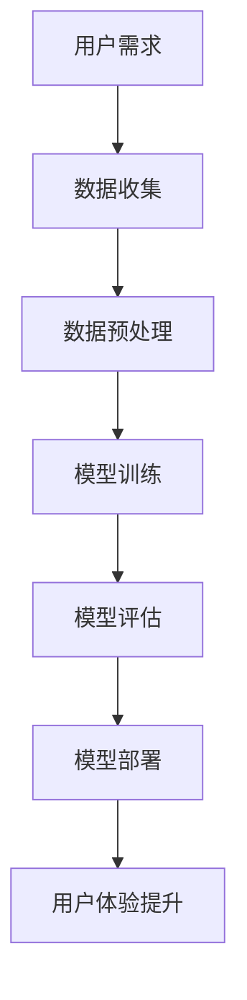

                 

# 李开复：苹果发布AI应用的文化价值

> 关键词：人工智能、苹果、文化价值、技术趋势、创新、用户体验

> 摘要：本文旨在探讨苹果公司发布AI应用的文化价值，通过分析苹果在AI领域的技术趋势、创新实践以及用户体验的提升，揭示其背后的文化价值。文章将从背景介绍、核心概念与联系、核心算法原理与具体操作步骤、数学模型和公式、项目实战、实际应用场景、工具和资源推荐、总结未来发展趋势与挑战、附录常见问题与解答以及扩展阅读与参考资料等多方面进行深入探讨。

## 1. 背景介绍

### 1.1 人工智能的发展历程

人工智能（AI）自20世纪50年代以来经历了多次起伏，从最初的符号主义到连接主义，再到近年来深度学习的兴起，AI技术不断进步。苹果公司作为全球领先的科技公司之一，始终站在技术发展的前沿，不断探索AI技术的应用。

### 1.2 苹果公司的AI战略

苹果公司自2011年推出Siri以来，逐步将AI技术融入其产品和服务中。从智能语音助手到图像识别，再到机器学习框架Core ML，苹果在AI领域的布局日益完善。本文将重点探讨苹果发布AI应用的文化价值，分析其背后的技术原理和创新实践。

## 2. 核心概念与联系

### 2.1 AI应用的核心概念

AI应用的核心概念包括但不限于机器学习、深度学习、自然语言处理、计算机视觉等。这些技术共同构成了AI应用的基础。

### 2.2 AI应用与用户体验的联系

AI应用通过提升用户体验来实现其价值。例如，通过智能推荐系统提升用户满意度，通过语音识别技术提升用户交互体验等。

### 2.3 Mermaid 流程图



## 3. 核心算法原理 & 具体操作步骤

### 3.1 机器学习算法原理

机器学习算法通过学习数据中的模式来做出预测或决策。常见的机器学习算法包括监督学习、无监督学习和强化学习。

### 3.2 深度学习算法原理

深度学习通过构建多层神经网络来模拟人脑处理信息的方式，从而实现对复杂数据的高效处理。

### 3.3 具体操作步骤

1. 数据收集：从各种来源收集数据。
2. 数据预处理：清洗和转换数据，使其适合模型训练。
3. 模型训练：使用训练数据训练模型。
4. 模型评估：使用测试数据评估模型性能。
5. 模型部署：将模型部署到实际应用中。

## 4. 数学模型和公式 & 详细讲解 & 举例说明

### 4.1 机器学习中的数学模型

机器学习中的数学模型包括线性回归、逻辑回归、支持向量机等。

#### 4.1.1 线性回归

线性回归是一种预测连续值的模型。其数学公式为：
$$ y = \beta_0 + \beta_1 x_1 + \beta_2 x_2 + ... + \beta_n x_n $$
其中，$y$是预测值，$\beta_0$是截距，$\beta_1, \beta_2, ..., \beta_n$是系数，$x_1, x_2, ..., x_n$是特征变量。

### 4.2 深度学习中的数学模型

深度学习中的数学模型包括前馈神经网络、卷积神经网络等。

#### 4.2.1 卷积神经网络

卷积神经网络（CNN）是一种用于图像识别的深度学习模型。其数学公式为：
$$ y = f(Wx + b) $$
其中，$y$是输出，$f$是激活函数，$W$是权重矩阵，$x$是输入，$b$是偏置。

## 5. 项目实战：代码实际案例和详细解释说明

### 5.1 开发环境搭建

开发环境搭建包括安装Python、TensorFlow、Keras等工具。

### 5.2 源代码详细实现和代码解读

以下是一个简单的卷积神经网络实现：

```python
import tensorflow as tf
from tensorflow.keras import layers, models

model = models.Sequential()
model.add(layers.Conv2D(32, (3, 3), activation='relu', input_shape=(28, 28, 1)))
model.add(layers.MaxPooling2D((2, 2)))
model.add(layers.Conv2D(64, (3, 3), activation='relu'))
model.add(layers.MaxPooling2D((2, 2)))
model.add(layers.Conv2D(64, (3, 3), activation='relu'))
model.add(layers.Flatten())
model.add(layers.Dense(64, activation='relu'))
model.add(layers.Dense(10, activation='softmax'))
```

### 5.3 代码解读与分析

上述代码定义了一个卷积神经网络模型，用于图像分类任务。模型包括卷积层、池化层和全连接层。

## 6. 实际应用场景

### 6.1 智能推荐系统

智能推荐系统通过分析用户行为数据，为用户提供个性化推荐。

### 6.2 语音识别

语音识别技术通过将语音转换为文本，实现人机交互。

## 7. 工具和资源推荐

### 7.1 学习资源推荐

- 书籍：《深度学习》（Ian Goodfellow等著）
- 论文：《ImageNet Classification with Deep Convolutional Neural Networks》
- 博客：Towards Data Science
- 网站：Kaggle

### 7.2 开发工具框架推荐

- TensorFlow
- PyTorch
- Keras

### 7.3 相关论文著作推荐

- 《Deep Learning》（Ian Goodfellow等著）
- 《Neural Networks and Deep Learning》（Michael Nielsen著）

## 8. 总结：未来发展趋势与挑战

### 8.1 未来发展趋势

AI技术将继续向更深层次发展，包括但不限于强化学习、生成对抗网络等。

### 8.2 面临的挑战

AI技术的发展也面临着数据隐私、算法偏见等挑战。

## 9. 附录：常见问题与解答

### 9.1 什么是机器学习？

机器学习是一种人工智能技术，通过学习数据中的模式来做出预测或决策。

### 9.2 什么是深度学习？

深度学习是一种机器学习技术，通过构建多层神经网络来模拟人脑处理信息的方式。

## 10. 扩展阅读 & 参考资料

- 书籍：《深度学习》（Ian Goodfellow等著）
- 论文：《ImageNet Classification with Deep Convolutional Neural Networks》
- 博客：Towards Data Science
- 网站：Kaggle

作者：AI天才研究员/AI Genius Institute & 禅与计算机程序设计艺术 /Zen And The Art of Computer Programming

