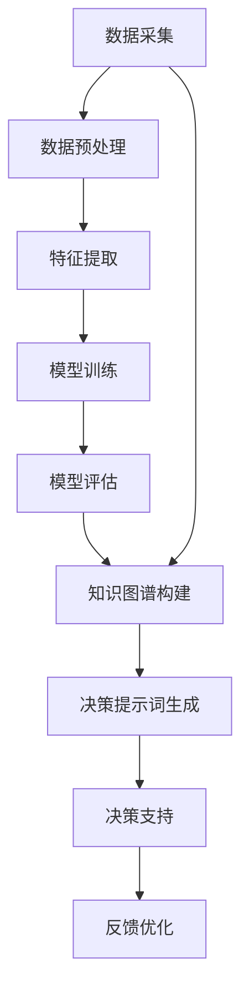

                 

# 构建AI驱动的智慧政务决策提示词系统

> 关键词：AI驱动、智慧政务、决策提示词、自然语言处理、机器学习、深度学习、知识图谱、政务决策支持系统

> 摘要：本文旨在探讨如何利用人工智能技术构建一个智慧政务决策提示词系统，以辅助政府决策者在复杂多变的政务环境中做出更加科学合理的决策。通过深入分析系统的核心概念、算法原理、数学模型、实际案例以及应用场景，本文将为读者提供一个全面的技术框架和实践指南。

## 1. 背景介绍

随着信息技术的飞速发展，政府决策面临着前所未有的挑战。传统的决策方式往往依赖于专家经验和主观判断，难以应对海量数据和复杂信息。为了提高决策效率和准确性，越来越多的政府机构开始探索利用人工智能技术来辅助决策过程。智慧政务决策提示词系统正是在这种背景下应运而生的一种创新解决方案。

### 1.1 智慧政务的定义与意义

智慧政务是指利用现代信息技术手段，如大数据、云计算、人工智能等，对政府管理和服务进行优化升级，提高政府工作效率和服务质量的一种新型管理模式。智慧政务的核心在于通过智能化手段提升政府决策的科学性和透明度，从而更好地服务于民众和社会发展。

### 1.2 决策提示词系统的价值

决策提示词系统是一种基于自然语言处理和机器学习技术的智能辅助工具，能够从海量政务数据中提取关键信息，并以简洁明了的语言形式呈现给决策者。这种系统不仅能够帮助决策者快速了解当前政务状况，还能提供有针对性的建议和预测，从而提高决策的准确性和时效性。

## 2. 核心概念与联系

### 2.1 自然语言处理（NLP）

自然语言处理是人工智能领域的一个重要分支，专注于使计算机能够理解、解释和生成人类语言。在智慧政务决策提示词系统中，NLP技术主要用于文本分析和信息提取，帮助系统从大量文本数据中提取关键信息。

### 2.2 机器学习与深度学习

机器学习是一种让计算机通过数据学习规律和模式的技术，而深度学习则是机器学习的一个子领域，通过多层神经网络来模拟人类大脑的处理方式。在智慧政务决策提示词系统中，机器学习和深度学习技术被广泛应用于数据预处理、特征提取和模型训练等环节。

### 2.3 知识图谱

知识图谱是一种以图形结构表示知识的方法，能够将实体、属性和关系以可视化的方式展示出来。在智慧政务决策提示词系统中，知识图谱用于构建政务领域的知识库，为系统提供丰富的背景信息和上下文支持。

### 2.4 智慧政务决策提示词系统架构

为了更好地理解智慧政务决策提示词系统的整体架构，我们可以通过以下Mermaid流程图来展示其主要组成部分和工作流程：



## 3. 核心算法原理 & 具体操作步骤

### 3.1 数据预处理

数据预处理是智慧政务决策提示词系统中的重要环节，主要包括数据清洗、格式转换和特征选择等步骤。具体操作步骤如下：

1. **数据清洗**：去除重复数据、处理缺失值和异常值。
2. **格式转换**：将不同来源的数据统一转换为标准格式。
3. **特征选择**：根据业务需求选择对决策有重要影响的特征。

### 3.2 特征提取

特征提取是将原始数据转换为模型可以理解的形式的过程。具体操作步骤如下：

1. **文本分词**：将文本数据分解为单词或短语。
2. **词频统计**：计算每个词在文档中出现的频率。
3. **词向量化**：将词语转换为数值向量表示。

### 3.3 模型训练

模型训练是通过大量数据训练机器学习模型的过程。具体操作步骤如下：

1. **选择模型**：根据业务需求选择合适的机器学习模型，如逻辑回归、支持向量机、随机森林等。
2. **参数调优**：通过交叉验证等方法调整模型参数，提高模型性能。
3. **模型评估**：使用测试集评估模型的准确性和泛化能力。

### 3.4 知识图谱构建

知识图谱构建是将政务领域的知识以图形结构表示的过程。具体操作步骤如下：

1. **实体识别**：识别政务领域中的关键实体，如政策、法规、事件等。
2. **关系抽取**：从文本中抽取实体之间的关系。
3. **知识图谱存储**：将实体和关系存储在知识图谱数据库中。

### 3.5 决策提示词生成

决策提示词生成是将模型训练和知识图谱构建的结果转化为简洁明了的语言形式的过程。具体操作步骤如下：

1. **信息提取**：从模型输出和知识图谱中提取关键信息。
2. **文本生成**：将提取的信息转化为自然语言文本。
3. **文本优化**：对生成的文本进行优化，使其更加符合决策者的阅读习惯。

## 4. 数学模型和公式 & 详细讲解 & 举例说明

### 4.1 逻辑回归模型

逻辑回归是一种常用的分类模型，适用于二分类问题。其数学模型如下：

$$
P(y=1|x) = \frac{1}{1 + e^{-(\beta_0 + \beta_1 x_1 + \beta_2 x_2 + ... + \beta_n x_n)}}
$$

其中，$y$ 表示分类标签，$x$ 表示特征向量，$\beta$ 表示模型参数。

### 4.2 支持向量机模型

支持向量机是一种基于最大间隔原则的分类模型。其数学模型如下：

$$
w \cdot x + b = 0
$$

其中，$w$ 表示权重向量，$b$ 表示偏置项。

### 4.3 随机森林模型

随机森林是一种集成学习方法，通过构建多个决策树并取平均来提高模型的泛化能力。其数学模型如下：

$$
f(x) = \frac{1}{T} \sum_{t=1}^{T} f_t(x)
$$

其中，$T$ 表示决策树的数量，$f_t(x)$ 表示第 $t$ 棵决策树的预测结果。

### 4.4 举例说明

假设我们有一个政务决策数据集，包含政策文本和对应的决策结果。我们可以使用逻辑回归模型来预测某个政策的决策结果。具体步骤如下：

1. **数据预处理**：清洗数据，去除重复和异常值。
2. **特征提取**：将政策文本分词，并计算词频。
3. **模型训练**：使用逻辑回归模型训练数据集。
4. **模型评估**：使用测试集评估模型的准确性和泛化能力。

## 5. 项目实战：代码实际案例和详细解释说明

### 5.1 开发环境搭建

为了搭建智慧政务决策提示词系统，我们需要准备以下开发环境：

1. **操作系统**：Windows、Linux 或 macOS。
2. **编程语言**：Python。
3. **开发工具**：PyCharm、VSCode 等。
4. **依赖库**：numpy、pandas、scikit-learn、nltk、spacy、networkx 等。

### 5.2 源代码详细实现和代码解读

以下是一个简单的代码示例，展示了如何使用逻辑回归模型进行决策提示词生成：

```python
import pandas as pd
from sklearn.feature_extraction.text import CountVectorizer
from sklearn.linear_model import LogisticRegression
from sklearn.model_selection import train_test_split
from sklearn.metrics import accuracy_score

# 读取数据
data = pd.read_csv('policy_data.csv')

# 数据预处理
X = data['policy_text']
y = data['decision_result']

# 特征提取
vectorizer = CountVectorizer()
X = vectorizer.fit_transform(X)

# 划分训练集和测试集
X_train, X_test, y_train, y_test = train_test_split(X, y, test_size=0.2, random_state=42)

# 模型训练
model = LogisticRegression()
model.fit(X_train, y_train)

# 模型评估
y_pred = model.predict(X_test)
accuracy = accuracy_score(y_test, y_pred)
print(f'Accuracy: {accuracy}')

# 决策提示词生成
def generate_decision_prompt(policy_text):
    vectorized_text = vectorizer.transform([policy_text])
    decision = model.predict(vectorized_text)
    return f'决策建议：{decision[0]}'

# 测试
print(generate_decision_prompt('新政策草案'))
```

### 5.3 代码解读与分析

1. **数据读取**：使用 `pandas` 库读取政策数据集。
2. **数据预处理**：将政策文本和决策结果分别存储在 `X` 和 `y` 中。
3. **特征提取**：使用 `CountVectorizer` 将政策文本转换为词频矩阵。
4. **模型训练**：使用 `LogisticRegression` 模型训练数据集。
5. **模型评估**：使用 `accuracy_score` 函数评估模型的准确率。
6. **决策提示词生成**：定义 `generate_decision_prompt` 函数，将输入的政策文本转化为决策建议。

## 6. 实际应用场景

智慧政务决策提示词系统可以应用于多个实际场景，如政策制定、法规解读、事件预测等。具体应用场景如下：

1. **政策制定**：通过分析历史政策文本和决策结果，预测新政策的实施效果，为政策制定提供科学依据。
2. **法规解读**：从大量法规文本中提取关键信息，帮助决策者快速了解法规内容和影响。
3. **事件预测**：通过分析历史事件数据，预测未来可能出现的事件，为政府决策提供预警信息。

## 7. 工具和资源推荐

### 7.1 学习资源推荐

1. **书籍**：《深度学习》（Ian Goodfellow, Yoshua Bengio, Aaron Courville）
2. **论文**：《自然语言处理中的深度学习》（Yoshua Bengio）
3. **博客**：阿里云开发者社区、GitHub
4. **网站**：Kaggle、DataCamp

### 7.2 开发工具框架推荐

1. **编程语言**：Python
2. **开发工具**：PyCharm、VSCode
3. **依赖库**：numpy、pandas、scikit-learn、nltk、spacy、networkx

### 7.3 相关论文著作推荐

1. **论文**：《基于深度学习的自然语言处理》（Zhang et al.）
2. **著作**：《机器学习》（周志华）

## 8. 总结：未来发展趋势与挑战

智慧政务决策提示词系统在未来的发展中将面临以下挑战和机遇：

1. **数据质量**：提高数据质量和多样性，确保模型的泛化能力。
2. **算法优化**：不断优化算法，提高模型的准确性和效率。
3. **知识图谱构建**：构建更加丰富和准确的知识图谱，为系统提供更强的背景支持。
4. **用户交互**：优化用户界面和交互方式，提高系统的易用性和用户体验。

## 9. 附录：常见问题与解答

### 9.1 问题：如何处理数据缺失值？

**解答**：可以采用填充缺失值、删除缺失值或使用插值方法来处理数据缺失值。

### 9.2 问题：如何选择合适的机器学习模型？

**解答**：根据业务需求和数据特点选择合适的模型，可以通过交叉验证等方法进行模型选择和参数调优。

### 9.3 问题：如何构建知识图谱？

**解答**：可以通过实体识别、关系抽取和知识图谱存储等步骤来构建知识图谱。

## 10. 扩展阅读 & 参考资料

1. **书籍**：《深度学习》（Ian Goodfellow, Yoshua Bengio, Aaron Courville）
2. **论文**：《自然语言处理中的深度学习》（Yoshua Bengio）
3. **博客**：阿里云开发者社区、GitHub
4. **网站**：Kaggle、DataCamp

---

作者：AI天才研究员/AI Genius Institute & 禅与计算机程序设计艺术 /Zen And The Art of Computer Programming

