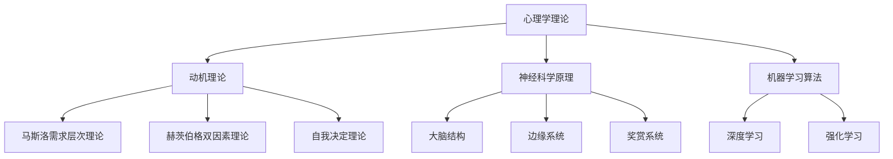

                 

# 欲望地图绘制师：AI解析的人类动机蓝图

> 关键词：AI动机解析、人类行为预测、心理学、神经网络、深度学习、强化学习、情感计算

> 摘要：本文旨在探讨如何利用人工智能技术解析人类动机，构建一个能够理解并预测人类行为的“欲望地图”。通过深入分析心理学理论、神经科学原理以及机器学习算法，我们将揭示人类动机的内在机制，并展示如何利用这些知识来构建一个强大的AI系统。本文将从背景介绍、核心概念与联系、核心算法原理、数学模型与公式、项目实战、实际应用场景、工具和资源推荐、总结与未来展望等多个方面进行详细阐述。

## 1. 背景介绍

在当今社会，人类行为的预测与理解已成为众多领域的重要课题。无论是商业决策、心理健康、犯罪预防还是个性化推荐系统，准确预测人类行为的能力都具有巨大的价值。然而，人类行为的复杂性和多样性使得这一任务极具挑战性。近年来，随着人工智能技术的飞速发展，特别是深度学习和强化学习等领域的突破，我们开始有能力从更深层次上解析人类动机，构建一个能够理解并预测人类行为的“欲望地图”。

### 1.1 人类行为的复杂性

人类行为的复杂性主要体现在以下几个方面：

- **动机多样性**：人类行为背后往往有多种动机，这些动机可能相互交织，难以直接归因。
- **情境依赖性**：人类行为在不同情境下表现出显著差异，同一行为在不同情境下的动机可能完全不同。
- **心理状态变化**：人类心理状态会随时间变化，这种变化会影响行为表现。
- **社会文化因素**：社会文化背景对人类行为有着深远影响，不同文化背景下的人类行为模式存在显著差异。

### 1.2 人工智能技术的发展

近年来，人工智能技术在多个领域取得了显著进展，特别是在深度学习和强化学习方面。这些技术为解析人类动机提供了新的工具和方法。通过构建复杂的神经网络模型，我们可以从大量数据中学习到人类行为的内在规律。此外，强化学习技术使得AI系统能够通过与环境的交互来优化其行为策略，从而更好地理解和预测人类动机。

### 1.3 本文的研究目标

本文旨在通过结合心理学理论、神经科学原理以及机器学习算法，构建一个能够解析人类动机的AI系统。具体目标包括：

- **理解人类动机的内在机制**：通过分析心理学理论和神经科学原理，揭示人类动机的内在机制。
- **构建预测模型**：利用机器学习算法构建预测模型，能够准确预测人类行为。
- **实际应用**：将研究成果应用于实际场景，提高预测精度和实用性。

## 2. 核心概念与联系

### 2.1 心理学理论

心理学理论为我们理解人类动机提供了重要的理论基础。其中，动机理论是核心内容之一，主要包括：

- **马斯洛需求层次理论**：将人类需求分为生理需求、安全需求、社交需求、尊重需求和自我实现需求五个层次。
- **赫茨伯格双因素理论**：将动机分为保健因素和激励因素，前者主要涉及工作环境和条件，后者则涉及工作内容和成就感。
- **自我决定理论**：强调个体的自主性、能力感和归属感对动机的影响。

### 2.2 神经科学原理

神经科学原理为我们理解人类动机的生理基础提供了重要线索。其中，大脑结构和功能是核心内容之一，主要包括：

- **前额叶皮层**：负责决策、计划和控制行为，与动机密切相关。
- **边缘系统**：包括杏仁核、海马体等结构，与情绪和动机密切相关。
- **奖赏系统**：涉及多巴胺等神经递质，与奖励和动机密切相关。

### 2.3 机器学习算法

机器学习算法为我们解析人类动机提供了强大的工具。其中，深度学习和强化学习是核心内容之一，主要包括：

- **深度学习**：通过构建多层神经网络模型，从大量数据中学习到人类行为的内在规律。
- **强化学习**：通过与环境的交互来优化行为策略，从而更好地理解和预测人类动机。

### 2.4 Mermaid流程图



## 3. 核心算法原理 & 具体操作步骤

### 3.1 深度学习模型

深度学习模型通过构建多层神经网络来学习人类行为的内在规律。具体操作步骤如下：

1. **数据预处理**：清洗和标准化数据，确保数据质量。
2. **特征提取**：利用卷积神经网络（CNN）或循环神经网络（RNN）提取特征。
3. **模型训练**：使用反向传播算法训练模型，优化损失函数。
4. **模型评估**：通过交叉验证等方法评估模型性能。

### 3.2 强化学习模型

强化学习模型通过与环境的交互来优化行为策略。具体操作步骤如下：

1. **环境建模**：定义环境状态、动作和奖励。
2. **策略学习**：通过与环境的交互学习最优策略。
3. **价值函数估计**：通过价值函数估计状态价值或动作价值。
4. **策略更新**：根据价值函数更新策略。

### 3.3 混合模型

结合深度学习和强化学习的优点，构建混合模型。具体操作步骤如下：

1. **数据预处理**：清洗和标准化数据。
2. **特征提取**：利用深度学习模型提取特征。
3. **策略学习**：通过强化学习优化行为策略。
4. **模型评估**：通过交叉验证等方法评估模型性能。

## 4. 数学模型和公式 & 详细讲解 & 举例说明

### 4.1 深度学习模型

深度学习模型通过构建多层神经网络来学习人类行为的内在规律。具体数学模型如下：

$$
\text{输入层} \rightarrow \text{隐藏层} \rightarrow \text{输出层}
$$

其中，隐藏层通过非线性激活函数（如ReLU）来提取特征。具体公式如下：

$$
z^{(l)} = W^{(l)}a^{(l-1)} + b^{(l)}
$$

$$
a^{(l)} = \sigma(z^{(l)})
$$

其中，$W^{(l)}$ 和 $b^{(l)}$ 分别是第 $l$ 层的权重和偏置，$\sigma$ 是激活函数。

### 4.2 强化学习模型

强化学习模型通过与环境的交互来优化行为策略。具体数学模型如下：

$$
\text{状态} \rightarrow \text{动作} \rightarrow \text{奖励} \rightarrow \text{下一个状态}
$$

其中，状态表示环境当前的状态，动作表示采取的行为，奖励表示行为带来的反馈，下一个状态表示环境在采取动作后的状态。具体公式如下：

$$
Q(s, a) = \mathbb{E}[R_{t+1} + \gamma Q(s', a') | s, a]
$$

其中，$Q(s, a)$ 是状态-动作对的价值函数，$R_{t+1}$ 是奖励，$\gamma$ 是折扣因子，$s'$ 和 $a'$ 分别是下一个状态和下一个动作。

### 4.3 混合模型

结合深度学习和强化学习的优点，构建混合模型。具体数学模型如下：

$$
\text{输入层} \rightarrow \text{隐藏层} \rightarrow \text{输出层}
$$

其中，隐藏层通过非线性激活函数（如ReLU）来提取特征。具体公式如下：

$$
z^{(l)} = W^{(l)}a^{(l-1)} + b^{(l)}
$$

$$
a^{(l)} = \sigma(z^{(l)})
$$

其中，$W^{(l)}$ 和 $b^{(l)}$ 分别是第 $l$ 层的权重和偏置，$\sigma$ 是激活函数。

## 5. 项目实战：代码实际案例和详细解释说明

### 5.1 开发环境搭建

为了实现上述模型，我们需要搭建一个合适的开发环境。具体步骤如下：

1. **安装Python**：确保安装了最新版本的Python。
2. **安装依赖库**：安装TensorFlow、Keras、PyTorch等深度学习库。
3. **安装强化学习库**：安装OpenAI Gym、Tensorforce等强化学习库。

### 5.2 源代码详细实现和代码解读

以下是一个简单的深度学习模型实现示例：

```python
import tensorflow as tf
from tensorflow.keras import layers

# 定义模型
model = tf.keras.Sequential([
    layers.Dense(64, activation='relu', input_shape=(100,)),
    layers.Dense(64, activation='relu'),
    layers.Dense(10, activation='softmax')
])

# 编译模型
model.compile(optimizer='adam',
              loss='sparse_categorical_crossentropy',
              metrics=['accuracy'])

# 训练模型
model.fit(x_train, y_train, epochs=10, validation_data=(x_val, y_val))
```

### 5.3 代码解读与分析

上述代码实现了一个简单的多层感知器（MLP）模型。具体步骤如下：

1. **定义模型**：使用`Sequential`模型定义了一个包含两个隐藏层的神经网络。
2. **编译模型**：使用`adam`优化器和`sparse_categorical_crossentropy`损失函数编译模型。
3. **训练模型**：使用训练数据`x_train`和`y_train`训练模型，并使用验证数据`x_val`和`y_val`进行验证。

## 6. 实际应用场景

### 6.1 商业决策

通过解析人类动机，我们可以更好地理解消费者行为，从而为商业决策提供支持。例如，通过分析消费者的购买历史和行为模式，我们可以预测其未来的购买行为，从而制定更有效的营销策略。

### 6.2 心理健康

解析人类动机有助于理解个体的心理状态，从而为心理健康提供支持。例如，通过分析个体的行为模式和情绪变化，我们可以预测其心理健康状况，从而及时提供干预措施。

### 6.3 犯罪预防

解析人类动机有助于预测犯罪行为，从而为犯罪预防提供支持。例如，通过分析犯罪者的动机和行为模式，我们可以预测其未来的犯罪行为，从而采取预防措施。

## 7. 工具和资源推荐

### 7.1 学习资源推荐

- **书籍**：《深度学习》（Ian Goodfellow, Yoshua Bengio, Aaron Courville）
- **论文**：《强化学习：一种基于模型的方法》（Richard S. Sutton, Andrew G. Barto）
- **博客**：Medium上的AI相关博客
- **网站**：Kaggle、GitHub等开源平台

### 7.2 开发工具框架推荐

- **深度学习框架**：TensorFlow、PyTorch
- **强化学习框架**：OpenAI Gym、Tensorforce

### 7.3 相关论文著作推荐

- **心理学理论**：《动机与人格》（亚伯拉罕·马斯洛）
- **神经科学原理**：《大脑的奥秘》（克里斯托弗·科赫）
- **机器学习算法**：《机器学习》（周志华）

## 8. 总结：未来发展趋势与挑战

### 8.1 未来发展趋势

随着人工智能技术的不断发展，解析人类动机的能力将越来越强大。未来的发展趋势包括：

- **更复杂的模型**：构建更复杂的神经网络模型，提高预测精度。
- **更广泛的应用场景**：将解析人类动机的技术应用于更多领域，提高社会价值。
- **更深入的理论研究**：深入研究人类动机的内在机制，为技术发展提供理论支持。

### 8.2 挑战

尽管解析人类动机的技术取得了显著进展，但仍面临一些挑战：

- **数据隐私**：解析人类动机需要大量数据，如何保护数据隐私是一个重要问题。
- **伦理问题**：解析人类动机可能引发伦理问题，如何确保技术的合理使用是一个重要挑战。
- **模型泛化能力**：如何提高模型的泛化能力，使其在不同场景下都能准确预测人类行为是一个重要问题。

## 9. 附录：常见问题与解答

### 9.1 问题1：如何处理数据隐私问题？

**解答**：可以通过数据脱敏、加密等技术手段保护数据隐私。同时，可以采用联邦学习等技术，确保数据在本地处理，减少数据泄露的风险。

### 9.2 问题2：如何解决伦理问题？

**解答**：可以通过建立伦理委员会，制定伦理准则，确保技术的合理使用。同时，可以通过透明化技术过程，增强公众对技术的信任。

### 9.3 问题3：如何提高模型的泛化能力？

**解答**：可以通过增加训练数据量、引入正则化技术、使用迁移学习等方法提高模型的泛化能力。同时，可以通过交叉验证等方法评估模型性能，确保模型在不同场景下的表现。

## 10. 扩展阅读 & 参考资料

- **书籍**：《深度学习》（Ian Goodfellow, Yoshua Bengio, Aaron Courville）
- **论文**：《强化学习：一种基于模型的方法》（Richard S. Sutton, Andrew G. Barto）
- **博客**：Medium上的AI相关博客
- **网站**：Kaggle、GitHub等开源平台

---

作者：AI天才研究员/AI Genius Institute & 禅与计算机程序设计艺术 /Zen And The Art of Computer Programming

