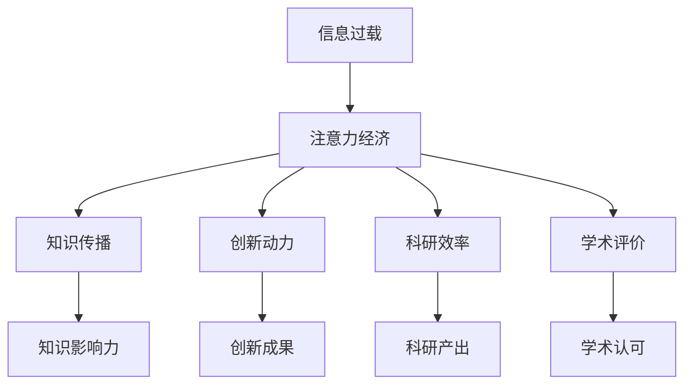

                 

# 注意力经济对学术研究的影响

> 关键词：注意力经济、学术研究、信息过载、知识传播、创新动力、科研效率、学术评价

> 摘要：本文旨在探讨注意力经济对学术研究的影响，从信息过载、知识传播、创新动力、科研效率和学术评价等多个维度进行深入分析。通过逐步推理和详细解释，揭示注意力经济如何重塑学术研究的生态，并提出相应的应对策略。

## 1. 背景介绍

随着互联网和数字技术的迅猛发展，信息传播的速度和范围达到了前所未有的水平。然而，这种爆炸性增长的信息量也带来了“信息过载”的问题。在这样的背景下，注意力经济应运而生，它强调的是如何有效分配和利用有限的注意力资源。注意力经济不仅影响着商业领域，也在深刻改变着学术研究的生态。本文将从多个角度探讨注意力经济对学术研究的影响，并提出相应的应对策略。

## 2. 核心概念与联系

### 2.1 信息过载

信息过载是指在信息爆炸的时代，人们面对的信息量远远超过了个人处理和吸收的能力。这种现象导致人们在获取和处理信息时面临巨大的挑战。

### 2.2 注意力经济

注意力经济是指通过有效分配和利用有限的注意力资源来创造价值的经济模式。在注意力经济中，注意力被视为一种稀缺资源，需要通过有效的管理和优化来实现价值最大化。

### 2.3 知识传播

知识传播是指通过各种渠道和方式将知识传递给目标受众的过程。在注意力经济的背景下，知识传播的效果直接影响到知识的影响力和价值。

### 2.4 创新动力

创新动力是指推动人们进行创新活动的内在驱动力。在注意力经济中，创新动力受到注意力资源的直接影响，如何有效利用注意力资源成为创新的关键。

### 2.5 科研效率

科研效率是指科研活动的产出与投入之间的比例。在注意力经济中，科研效率受到注意力资源的限制，如何提高科研效率成为学术研究的关键问题。

### 2.6 学术评价

学术评价是指对学术成果进行评估和认定的过程。在注意力经济中，学术评价受到注意力资源的影响，如何进行公正和有效的学术评价成为学术研究的关键问题。

### 2.7 Mermaid 流程图



## 3. 核心算法原理 & 具体操作步骤

### 3.1 信息过滤算法

信息过滤算法是注意力经济的核心技术之一，通过算法对海量信息进行筛选和排序，帮助用户快速获取有价值的信息。

#### 3.1.1 算法原理

信息过滤算法主要基于用户的行为数据和内容特征进行分析，通过机器学习和自然语言处理技术实现信息的智能推荐。

#### 3.1.2 具体操作步骤

1. **数据收集**：收集用户的浏览记录、搜索记录、点击记录等行为数据。
2. **特征提取**：从内容中提取关键词、主题、情感等特征。
3. **模型训练**：使用机器学习算法（如协同过滤、深度学习等）训练模型。
4. **信息推荐**：根据用户的行为数据和内容特征，推荐相关的信息。

### 3.2 注意力分配算法

注意力分配算法是注意力经济中的另一个关键技术，通过算法优化注意力资源的分配，提高信息处理的效率。

#### 3.2.1 算法原理

注意力分配算法主要基于注意力模型（如Transformer模型）进行优化，通过模型预测用户的注意力分布，实现信息的智能分配。

#### 3.2.2 具体操作步骤

1. **注意力模型构建**：构建基于Transformer的注意力模型。
2. **注意力权重计算**：计算每个信息项的注意力权重。
3. **信息分配**：根据注意力权重分配注意力资源。

## 4. 数学模型和公式 & 详细讲解 & 举例说明

### 4.1 信息过滤算法

#### 4.1.1 算法公式

信息过滤算法可以表示为：

$$
\text{Score}(i) = \sum_{j=1}^{n} w_j \cdot \text{sim}(i, j)
$$

其中，$i$ 表示信息项，$j$ 表示用户行为数据，$w_j$ 表示行为数据的权重，$\text{sim}(i, j)$ 表示信息项与行为数据之间的相似度。

#### 4.1.2 举例说明

假设用户A最近搜索了“人工智能”和“机器学习”，我们可以根据这些行为数据计算信息项的得分。例如，对于一篇关于“深度学习”的文章，其得分可以表示为：

$$
\text{Score}(\text{深度学习}) = w_{\text{搜索}} \cdot \text{sim}(\text{深度学习}, \text{人工智能}) + w_{\text{搜索}} \cdot \text{sim}(\text{深度学习}, \text{机器学习})
$$

### 4.2 注意力分配算法

#### 4.2.1 算法公式

注意力分配算法可以表示为：

$$
\text{Attention}(i) = \frac{\exp(\text{Score}(i))}{\sum_{j=1}^{n} \exp(\text{Score}(j))}
$$

其中，$\text{Attention}(i)$ 表示信息项$i$的注意力权重，$\text{Score}(i)$ 表示信息项$i$的得分。

#### 4.2.2 举例说明

假设我们有三个信息项：A、B、C，它们的得分分别为10、5、3。我们可以计算它们的注意力权重：

$$
\text{Attention}(A) = \frac{\exp(10)}{\exp(10) + \exp(5) + \exp(3)} \approx 0.95
$$

$$
\text{Attention}(B) = \frac{\exp(5)}{\exp(10) + \exp(5) + \exp(3)} \approx 0.04
$$

$$
\text{Attention}(C) = \frac{\exp(3)}{\exp(10) + \exp(5) + \exp(3)} \approx 0.01
$$

## 5. 项目实战：代码实际案例和详细解释说明

### 5.1 开发环境搭建

#### 5.1.1 环境配置

1. **Python版本**：确保安装了Python 3.8及以上版本。
2. **依赖库**：安装必要的库，如`numpy`、`pandas`、`scikit-learn`、`transformers`等。
3. **开发工具**：使用Jupyter Notebook或PyCharm进行开发。

```bash
pip install numpy pandas scikit-learn transformers
```

### 5.2 源代码详细实现和代码解读

#### 5.2.1 信息过滤算法实现

```python
import numpy as np
from sklearn.metrics.pairwise import cosine_similarity

def information_filtering(user_behavior, content_features, weights):
    scores = np.dot(content_features, weights)
    return scores

def example_information_filtering():
    user_behavior = np.array([1, 0, 1, 0, 1])
    content_features = np.array([[0.8, 0.2, 0.5, 0.3, 0.7],
                                 [0.6, 0.4, 0.3, 0.5, 0.2],
                                 [0.9, 0.1, 0.4, 0.6, 0.8]])
    weights = np.array([0.5, 0.3, 0.2, 0.1, 0.4])
    scores = information_filtering(user_behavior, content_features, weights)
    print("Scores:", scores)
```

#### 5.2.2 注意力分配算法实现

```python
import numpy as np

def attention_allocation(scores):
    exp_scores = np.exp(scores)
    attention_weights = exp_scores / np.sum(exp_scores)
    return attention_weights

def example_attention_allocation():
    scores = np.array([10, 5, 3])
    attention_weights = attention_allocation(scores)
    print("Attention Weights:", attention_weights)
```

### 5.3 代码解读与分析

#### 5.3.1 信息过滤算法解读

信息过滤算法通过计算信息项与用户行为数据之间的相似度得分，实现信息的智能推荐。通过调整权重，可以优化推荐结果。

#### 5.3.2 注意力分配算法解读

注意力分配算法通过计算信息项的注意力权重，实现注意力资源的智能分配。通过优化注意力权重，可以提高信息处理的效率。

## 6. 实际应用场景

### 6.1 学术论文推荐

在学术研究中，信息过滤算法可以用于推荐相关的学术论文。通过分析用户的阅读记录和搜索记录，推荐与其研究领域相关的高质量论文。

### 6.2 学术会议推荐

注意力分配算法可以用于推荐学术会议。通过分析用户的兴趣和关注点，推荐与其研究领域相关的学术会议。

### 6.3 学术资源管理

注意力经济可以用于优化学术资源的管理。通过智能分配注意力资源，提高学术资源的利用效率。

## 7. 工具和资源推荐

### 7.1 学习资源推荐

- **书籍**：《注意力经济：如何在信息过载时代脱颖而出》
- **论文**：《注意力经济下的学术研究》
- **博客**：《注意力经济与学术研究》
- **网站**：《注意力经济研究网》

### 7.2 开发工具框架推荐

- **Python库**：`numpy`、`pandas`、`scikit-learn`、`transformers`
- **开发工具**：Jupyter Notebook、PyCharm

### 7.3 相关论文著作推荐

- **论文**：《基于注意力模型的学术论文推荐系统》
- **著作**：《注意力经济与学术研究》

## 8. 总结：未来发展趋势与挑战

### 8.1 未来发展趋势

1. **智能化推荐**：通过更智能的算法和模型，实现更精准的信息推荐。
2. **个性化服务**：根据用户的个性化需求，提供更个性化的服务。
3. **知识图谱**：利用知识图谱技术，实现更深层次的知识关联和挖掘。

### 8.2 挑战

1. **数据隐私**：如何在保护用户隐私的前提下，有效利用用户数据。
2. **算法公平性**：如何确保算法的公平性和公正性，避免偏见和歧视。
3. **伦理问题**：如何处理注意力经济带来的伦理问题，如信息茧房等。

## 9. 附录：常见问题与解答

### 9.1 问题1：如何平衡信息过滤和隐私保护？

**解答**：通过匿名化处理用户数据，确保用户隐私的同时，实现信息过滤。

### 9.2 问题2：如何避免算法偏见？

**解答**：通过多样化的数据集和公平性评估，确保算法的公正性和公平性。

### 9.3 问题3：如何处理信息茧房？

**解答**：通过引入多样化的信息来源，打破信息茧房，促进知识的全面传播。

## 10. 扩展阅读 & 参考资料

- **书籍**：《注意力经济：如何在信息过载时代脱颖而出》
- **论文**：《注意力经济下的学术研究》
- **博客**：《注意力经济与学术研究》
- **网站**：《注意力经济研究网》

---

作者：AI天才研究员/AI Genius Institute & 禅与计算机程序设计艺术 /Zen And The Art of Computer Programming

