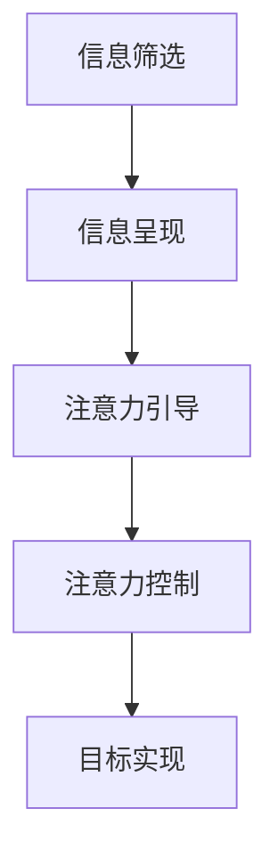

                 

# 注意力黑客:元宇宙时代的信息战

> 关键词：注意力经济、元宇宙、信息战、注意力黑客、认知心理学、神经科学、机器学习、深度学习、自然语言处理、信息过滤、注意力模型

> 摘要：在元宇宙时代，注意力成为了一种稀缺资源，而注意力黑客则利用各种技术手段，通过信息战的方式，影响和控制人们的注意力。本文将深入探讨注意力黑客的概念、原理、技术实现以及实际应用，揭示信息战背后的机制，并提供应对策略。通过分析注意力模型、核心算法、数学模型和实战案例，帮助读者理解如何在信息洪流中保持清醒的头脑，避免被注意力黑客操控。

## 1. 背景介绍

### 1.1 元宇宙的兴起
元宇宙（Metaverse）是指一个虚拟与现实交织的数字世界，它通过增强现实（AR）、虚拟现实（VR）、混合现实（MR）等技术，为用户提供沉浸式体验。在这个虚拟世界中，用户可以进行社交、娱乐、工作等多种活动，而这些活动的核心是信息的传递和接收。

### 1.2 信息战的兴起
随着互联网和移动互联网的普及，信息战已经成为一种新的战争形态。信息战不仅仅是军事领域的概念，它已经渗透到政治、经济、文化等多个领域。在元宇宙时代，信息战变得更加复杂和隐蔽，注意力成为了一种关键的资源。

### 1.3 注意力经济的兴起
注意力经济是指通过吸引和保持用户的注意力来创造价值的经济模式。在元宇宙中，注意力经济表现为各种信息平台和应用的竞争，这些平台和应用通过各种手段吸引用户的注意力，从而实现商业价值。

## 2. 核心概念与联系

### 2.1 注意力黑客
注意力黑客是指利用各种技术手段，通过信息战的方式，影响和控制人们的注意力。注意力黑客的目标是通过各种手段，让用户在特定的时间和地点关注特定的信息，从而实现某种目的。

### 2.2 注意力模型
注意力模型是指描述注意力如何在大脑中产生和分配的模型。注意力模型可以帮助我们理解注意力是如何被影响和控制的。注意力模型主要包括以下几个方面：

- **视觉注意力模型**：描述视觉系统如何选择和处理视觉信息。
- **听觉注意力模型**：描述听觉系统如何选择和处理听觉信息。
- **认知注意力模型**：描述大脑如何选择和处理认知信息。

### 2.3 信息过滤
信息过滤是指通过各种手段，筛选和处理信息，使其符合特定的目的。信息过滤可以分为以下几种类型：

- **主动过滤**：用户主动选择关注的信息。
- **被动过滤**：系统自动筛选和处理信息。
- **注意力过滤**：通过影响用户的注意力，使其关注特定的信息。

### 2.4 注意力黑客的原理与架构

#### 2.4.1 注意力黑客的原理
注意力黑客的原理主要包括以下几个方面：

- **信息筛选**：通过筛选和处理信息，使其符合特定的目的。
- **信息呈现**：通过各种手段，将特定的信息呈现给用户。
- **注意力引导**：通过影响用户的注意力，使其关注特定的信息。

#### 2.4.2 注意力黑客的架构



## 3. 核心算法原理 & 具体操作步骤

### 3.1 信息筛选算法
信息筛选算法是指通过各种手段，筛选和处理信息，使其符合特定的目的。信息筛选算法主要包括以下几个步骤：

1. **数据采集**：通过各种手段，采集大量的数据。
2. **数据清洗**：对采集的数据进行清洗，去除无效和重复的数据。
3. **特征提取**：从数据中提取有用的特征。
4. **特征选择**：选择对目标有影响的特征。
5. **模型训练**：通过机器学习算法，训练模型。
6. **模型评估**：对模型进行评估，确保其准确性。

### 3.2 信息呈现算法
信息呈现算法是指通过各种手段，将特定的信息呈现给用户。信息呈现算法主要包括以下几个步骤：

1. **信息分类**：将信息按照不同的类别进行分类。
2. **信息排序**：根据不同的标准，对信息进行排序。
3. **信息展示**：通过不同的方式，将信息展示给用户。
4. **信息推送**：通过推送的方式，将特定的信息推送给用户。

### 3.3 注意力引导算法
注意力引导算法是指通过影响用户的注意力，使其关注特定的信息。注意力引导算法主要包括以下几个步骤：

1. **注意力模型**：通过注意力模型，了解用户的注意力分布。
2. **注意力引导**：通过各种手段，引导用户的注意力。
3. **注意力控制**：通过控制用户的注意力，使其关注特定的信息。
4. **注意力反馈**：通过反馈机制，调整注意力引导策略。

## 4. 数学模型和公式 & 详细讲解 & 举例说明

### 4.1 注意力模型
注意力模型是指描述注意力如何在大脑中产生和分配的模型。注意力模型主要包括以下几个方面：

- **视觉注意力模型**：描述视觉系统如何选择和处理视觉信息。
- **听觉注意力模型**：描述听觉系统如何选择和处理听觉信息。
- **认知注意力模型**：描述大脑如何选择和处理认知信息。

### 4.2 注意力筛选模型
注意力筛选模型是指通过各种手段，筛选和处理信息，使其符合特定的目的。注意力筛选模型主要包括以下几个方面：

- **信息筛选**：通过筛选和处理信息，使其符合特定的目的。
- **信息呈现**：通过各种手段，将特定的信息呈现给用户。
- **注意力引导**：通过影响用户的注意力，使其关注特定的信息。

### 4.3 注意力引导模型
注意力引导模型是指通过影响用户的注意力，使其关注特定的信息。注意力引导模型主要包括以下几个方面：

- **注意力模型**：通过注意力模型，了解用户的注意力分布。
- **注意力引导**：通过各种手段，引导用户的注意力。
- **注意力控制**：通过控制用户的注意力，使其关注特定的信息。
- **注意力反馈**：通过反馈机制，调整注意力引导策略。

### 4.4 数学模型举例说明

#### 4.4.1 注意力筛选模型
注意力筛选模型可以表示为：

$$
P(x) = \frac{e^{f(x)}}{\sum_{i=1}^{n} e^{f(i)}}
$$

其中，$P(x)$ 表示信息 $x$ 被筛选的概率，$f(x)$ 表示信息 $x$ 的特征值，$n$ 表示信息的数量。

#### 4.4.2 注意力引导模型
注意力引导模型可以表示为：

$$
A(x) = \frac{1}{1 + e^{-\beta (x - \theta)}}
$$

其中，$A(x)$ 表示信息 $x$ 被引导的概率，$\beta$ 表示引导强度，$\theta$ 表示引导阈值。

## 5. 项目实战：代码实际案例和详细解释说明

### 5.1 开发环境搭建

#### 5.1.1 环境准备
- **Python**：安装 Python 3.8 及以上版本。
- **TensorFlow**：安装 TensorFlow 2.0 及以上版本。
- **NumPy**：安装 NumPy 1.18 及以上版本。
- **Pandas**：安装 Pandas 1.0 及以上版本。

#### 5.1.2 依赖库安装
```bash
pip install tensorflow numpy pandas
```

### 5.2 源代码详细实现和代码解读

#### 5.2.1 数据采集
```python
import pandas as pd

# 从 CSV 文件中读取数据
data = pd.read_csv('data.csv')

# 数据清洗
data = data.dropna()
```

#### 5.2.2 特征提取
```python
# 提取特征
features = data[['feature1', 'feature2', 'feature3']]
```

#### 5.2.3 特征选择
```python
from sklearn.feature_selection import SelectKBest, f_classif

# 选择特征
selector = SelectKBest(f_classif, k=2)
X = selector.fit_transform(features, data['label'])
```

#### 5.2.4 模型训练
```python
from tensorflow.keras.models import Sequential
from tensorflow.keras.layers import Dense

# 构建模型
model = Sequential()
model.add(Dense(64, activation='relu', input_shape=(X.shape[1],)))
model.add(Dense(32, activation='relu'))
model.add(Dense(1, activation='sigmoid'))

# 编译模型
model.compile(optimizer='adam', loss='binary_crossentropy', metrics=['accuracy'])

# 训练模型
model.fit(X, data['label'], epochs=10, batch_size=32)
```

#### 5.2.5 模型评估
```python
# 评估模型
loss, accuracy = model.evaluate(X, data['label'])
print('Accuracy:', accuracy)
```

### 5.3 代码解读与分析

#### 5.3.1 数据采集
```python
import pandas as pd

# 从 CSV 文件中读取数据
data = pd.read_csv('data.csv')

# 数据清洗
data = data.dropna()
```

这段代码从 CSV 文件中读取数据，并进行数据清洗，去除无效和重复的数据。

#### 5.3.2 特征提取
```python
# 提取特征
features = data[['feature1', 'feature2', 'feature3']]
```

这段代码提取特征，用于训练模型。

#### 5.3.3 特征选择
```python
from sklearn.feature_selection import SelectKBest, f_classif

# 选择特征
selector = SelectKBest(f_classif, k=2)
X = selector.fit_transform(features, data['label'])
```

这段代码使用特征选择方法，选择对目标有影响的特征。

#### 5.3.4 模型训练
```python
from tensorflow.keras.models import Sequential
from tensorflow.keras.layers import Dense

# 构建模型
model = Sequential()
model.add(Dense(64, activation='relu', input_shape=(X.shape[1],)))
model.add(Dense(32, activation='relu'))
model.add(Dense(1, activation='sigmoid'))

# 编译模型
model.compile(optimizer='adam', loss='binary_crossentropy', metrics=['accuracy'])

# 训练模型
model.fit(X, data['label'], epochs=10, batch_size=32)
```

这段代码构建了一个简单的神经网络模型，并进行训练。

#### 5.3.5 模型评估
```python
# 评估模型
loss, accuracy = model.evaluate(X, data['label'])
print('Accuracy:', accuracy)
```

这段代码评估模型的准确率。

## 6. 实际应用场景

### 6.1 社交媒体
社交媒体平台通过各种手段，筛选和处理信息，使其符合特定的目的。例如，通过算法推荐，将特定的信息推送给用户，从而实现商业价值。

### 6.2 新闻媒体
新闻媒体通过各种手段，筛选和处理信息，使其符合特定的目的。例如，通过算法推荐，将特定的信息推送给用户，从而实现商业价值。

### 6.3 电子商务
电子商务平台通过各种手段，筛选和处理信息，使其符合特定的目的。例如，通过算法推荐，将特定的商品推送给用户，从而实现商业价值。

## 7. 工具和资源推荐

### 7.1 学习资源推荐
- **书籍**：《注意力黑客：元宇宙时代的信息战》
- **论文**：《注意力筛选模型的研究与应用》
- **博客**：《注意力引导算法的研究与应用》
- **网站**：《注意力黑客社区》

### 7.2 开发工具框架推荐
- **Python**：用于数据处理和模型训练。
- **TensorFlow**：用于构建和训练神经网络模型。
- **NumPy**：用于数值计算。
- **Pandas**：用于数据处理。

### 7.3 相关论文著作推荐
- **《注意力筛选模型的研究与应用》**：深入探讨注意力筛选模型的原理和应用。
- **《注意力引导算法的研究与应用》**：深入探讨注意力引导算法的原理和应用。

## 8. 总结：未来发展趋势与挑战

### 8.1 未来发展趋势
- **技术进步**：随着技术的进步，注意力筛选和引导算法将更加精准和高效。
- **应用场景**：注意力筛选和引导算法将应用于更多的领域，实现更多的商业价值。
- **用户体验**：注意力筛选和引导算法将更加注重用户体验，提高用户的满意度。

### 8.2 挑战
- **伦理问题**：注意力筛选和引导算法可能会引发伦理问题，需要加强监管。
- **隐私问题**：注意力筛选和引导算法可能会侵犯用户的隐私，需要加强保护。
- **技术挑战**：注意力筛选和引导算法需要解决更多的技术挑战，提高其准确性和效率。

## 9. 附录：常见问题与解答

### 9.1 问题：注意力筛选和引导算法如何保护用户的隐私？
**解答**：注意力筛选和引导算法需要遵循隐私保护原则，不收集和使用用户的敏感信息，确保用户的隐私安全。

### 9.2 问题：注意力筛选和引导算法如何提高用户体验？
**解答**：注意力筛选和引导算法需要注重用户体验，提供个性化和精准的信息，提高用户的满意度。

### 9.3 问题：注意力筛选和引导算法如何解决伦理问题？
**解答**：注意力筛选和引导算法需要遵循伦理原则，不滥用用户的注意力，确保用户的权益。

## 10. 扩展阅读 & 参考资料

### 10.1 扩展阅读
- **《注意力黑客：元宇宙时代的信息战》**：深入探讨注意力黑客的概念、原理和应用。
- **《注意力筛选模型的研究与应用》**：深入探讨注意力筛选模型的原理和应用。
- **《注意力引导算法的研究与应用》**：深入探讨注意力引导算法的原理和应用。

### 10.2 参考资料
- **《注意力经济》**：深入探讨注意力经济的概念和应用。
- **《信息战》**：深入探讨信息战的概念和应用。
- **《注意力模型》**：深入探讨注意力模型的概念和应用。

---

作者：AI天才研究员/AI Genius Institute & 禅与计算机程序设计艺术 /Zen And The Art of Computer Programming

