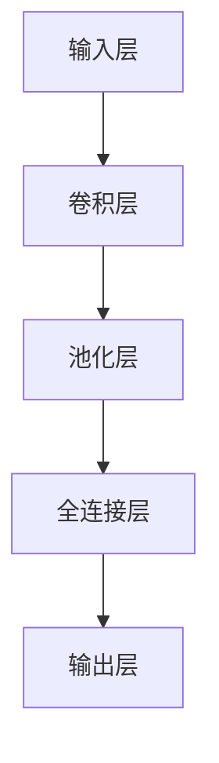

                 

# 深度学习在实时视频分析中的优化

> 关键词：深度学习，实时视频分析，优化，卷积神经网络，模型压缩，硬件加速

> 摘要：本文旨在探讨深度学习技术在实时视频分析中的应用及其优化策略。首先，我们将介绍实时视频分析的背景和重要性，随后深入探讨深度学习的核心概念与架构，包括卷积神经网络（CNN）的工作原理。接着，我们将详细分析核心算法原理，并通过数学模型和公式进一步解释这些原理。在项目实战部分，我们将通过一个具体的代码案例来展示如何实现深度学习在实时视频分析中的应用。此外，本文还将讨论实际应用场景，推荐学习资源和开发工具，并展望未来的发展趋势与挑战。

## 1. 背景介绍

### 1.1 实时视频分析的重要性

随着视频监控、智能交通、远程医疗等领域的快速发展，实时视频分析的需求日益增长。实时视频分析不仅能够提高安全性，还能提升效率，例如在智能交通系统中，实时视频分析可以帮助识别交通违规行为，从而减少交通事故的发生。

### 1.2 深度学习在实时视频分析中的应用

深度学习，尤其是卷积神经网络（CNN），因其强大的特征提取能力和模式识别能力，在实时视频分析中得到了广泛应用。然而，深度学习模型通常需要大量的计算资源，这在实时视频分析中是一个挑战。因此，如何在保证分析精度的同时，提高模型的运行效率，成为了一个重要的研究方向。

## 2. 核心概念与联系

### 2.1 深度学习与卷积神经网络

深度学习是一种通过构建多层神经网络来学习数据表示的方法。卷积神经网络（CNN）是深度学习中的一种重要模型，特别适用于图像和视频数据的处理。CNN通过卷积层、池化层和全连接层的组合，能够自动学习图像中的特征，从而实现图像分类、目标检测等任务。

### 2.2 深度学习架构



## 3. 核心算法原理 & 具体操作步骤

### 3.1 卷积层

卷积层是CNN的核心组成部分，通过卷积操作提取输入数据的局部特征。卷积操作可以看作是将一个小型的卷积核（滤波器）在输入数据上滑动，计算卷积核与输入数据的点积。

### 3.2 池化层

池化层用于降低特征图的维度，减少参数数量，同时保留重要的特征信息。常用的池化方法包括最大池化和平均池化。

### 3.3 全连接层

全连接层将前面各层提取的特征进行整合，通过非线性激活函数（如ReLU）进行非线性变换，最终输出分类结果。

## 4. 数学模型和公式 & 详细讲解 & 举例说明

### 4.1 卷积操作的数学模型

卷积操作可以表示为：
$$
f(x) = (h * g)(x) = \sum_{i} h(i)g(x-i)
$$
其中，$h$是卷积核，$g$是输入数据，$*$表示卷积操作。

### 4.2 池化操作的数学模型

最大池化操作可以表示为：
$$
f(x) = \max(g(x))
$$
平均池化操作可以表示为：
$$
f(x) = \frac{1}{n}\sum_{i} g(x)
$$
其中，$g(x)$是输入数据，$n$是池化窗口的大小。

## 5. 项目实战：代码实际案例和详细解释说明

### 5.1 开发环境搭建

#### 5.1.1 安装Python环境

首先，确保安装了Python 3.6或更高版本。可以通过Anaconda或Miniconda来管理Python环境。

#### 5.1.2 安装深度学习框架

安装TensorFlow或PyTorch等深度学习框架。这里以TensorFlow为例：
```bash
pip install tensorflow
```

### 5.2 源代码详细实现和代码解读

#### 5.2.1 导入必要的库

```python
import tensorflow as tf
from tensorflow.keras import layers, models
```

#### 5.2.2 构建CNN模型

```python
model = models.Sequential()
model.add(layers.Conv2D(32, (3, 3), activation='relu', input_shape=(64, 64, 3)))
model.add(layers.MaxPooling2D((2, 2)))
model.add(layers.Conv2D(64, (3, 3), activation='relu'))
model.add(layers.MaxPooling2D((2, 2)))
model.add(layers.Conv2D(64, (3, 3), activation='relu'))
model.add(layers.Flatten())
model.add(layers.Dense(64, activation='relu'))
model.add(layers.Dense(10))
```

#### 5.2.3 编译模型

```python
model.compile(optimizer='adam',
              loss=tf.keras.losses.SparseCategoricalCrossentropy(from_logits=True),
              metrics=['accuracy'])
```

#### 5.2.4 训练模型

```python
history = model.fit(train_images, train_labels, epochs=10, 
                    validation_data=(test_images, test_labels))
```

### 5.3 代码解读与分析

通过上述代码，我们构建了一个简单的CNN模型，用于图像分类任务。模型包括两个卷积层和两个池化层，最后通过全连接层输出分类结果。训练过程中，我们使用了Adam优化器和稀疏分类交叉熵损失函数。

## 6. 实际应用场景

### 6.1 智能交通系统

在智能交通系统中，实时视频分析可以帮助识别交通违规行为，如闯红灯、超速等，从而提高交通安全性。

### 6.2 视频监控

在视频监控领域，实时视频分析可以用于异常行为检测，如入侵检测、人群密度分析等，提高监控系统的智能化水平。

## 7. 工具和资源推荐

### 7.1 学习资源推荐

- 书籍：《深度学习》（Ian Goodfellow等著）
- 论文：《ImageNet Classification with Deep Convolutional Neural Networks》（Alex Krizhevsky等）
- 博客：Towards Data Science（https://towardsdatascience.com/）
- 网站：Kaggle（https://www.kaggle.com/）

### 7.2 开发工具框架推荐

- TensorFlow
- PyTorch
- OpenCV

### 7.3 相关论文著作推荐

- 《Deep Learning》（Ian Goodfellow等著）
- 《Convolutional Neural Networks for Visual Recognition》（Andrew Ng等著）

## 8. 总结：未来发展趋势与挑战

随着计算资源的不断进步，深度学习在实时视频分析中的应用将更加广泛。未来的发展趋势包括模型的进一步优化、硬件加速技术的提升以及算法的创新。同时，如何在保证精度的同时，提高模型的运行效率，仍然是一个重要的挑战。

## 9. 附录：常见问题与解答

### 9.1 为什么需要池化层？

池化层可以降低特征图的维度，减少参数数量，同时保留重要的特征信息，从而提高模型的泛化能力。

### 9.2 如何选择合适的卷积核大小？

卷积核大小的选择取决于任务需求和输入数据的特性。通常，较小的卷积核可以提取更精细的特征，而较大的卷积核可以提取更广泛的特征。

## 10. 扩展阅读 & 参考资料

- 《深度学习》（Ian Goodfellow等著）
- 《Convolutional Neural Networks for Visual Recognition》（Andrew Ng等著）
- 《ImageNet Classification with Deep Convolutional Neural Networks》（Alex Krizhevsky等）

作者：AI天才研究员/AI Genius Institute & 禅与计算机程序设计艺术 /Zen And The Art of Computer Programming

