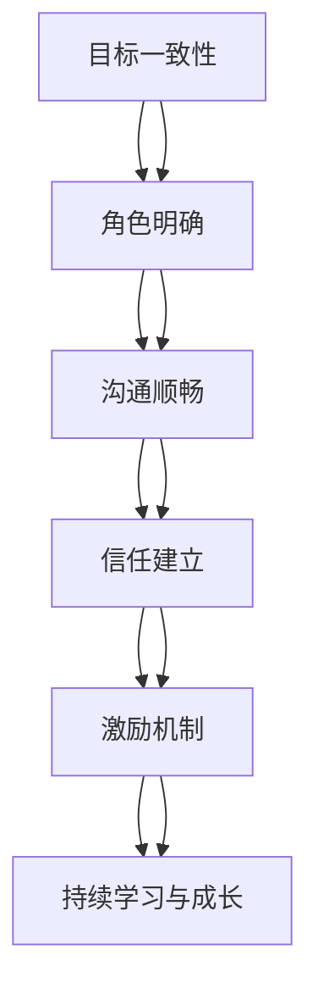

                 

# 激发团队潜能的秘籍：打造高效团队

> 关键词：团队管理、高效协作、潜能激发、项目管理、团队文化

> 摘要：本文旨在探讨如何通过科学的方法和策略，激发团队成员的潜能，打造高效协作的团队。我们将从团队管理的基本原则出发，深入分析高效团队的核心概念与联系，探讨核心算法原理及具体操作步骤，通过数学模型和公式进行详细讲解，结合实际项目案例进行代码实现与分析，最终探讨实际应用场景及未来发展趋势。通过本文，读者将能够掌握打造高效团队的关键要素，提升团队整体效能。

## 1. 背景介绍

在当今快速变化的商业环境中，团队协作已成为企业成功的关键因素之一。高效的团队不仅能够快速响应市场变化，还能在竞争中脱颖而出。然而，如何激发团队成员的潜能，打造高效协作的团队，却是一门艺术与科学的结合。本文将从团队管理的基本原则出发，探讨如何通过科学的方法和策略，激发团队成员的潜能，打造高效协作的团队。

## 2. 核心概念与联系

### 2.1 团队管理的基本原则

团队管理的基本原则包括目标一致性、角色明确、沟通顺畅、信任建立、激励机制、持续学习与成长等。这些原则构成了高效团队的基础。

### 2.2 高效团队的核心概念

高效团队的核心概念包括：

- **目标一致性**：团队成员对团队目标有共同的理解和认同。
- **角色明确**：每个成员都清楚自己的职责和期望。
- **沟通顺畅**：团队内部沟通高效，信息流通无阻。
- **信任建立**：团队成员之间建立深厚的信任关系。
- **激励机制**：合理的激励机制能够激发团队成员的积极性。
- **持续学习与成长**：团队成员不断学习新知识，提升自身能力。

### 2.3 核心概念的Mermaid流程图



## 3. 核心算法原理 & 具体操作步骤

### 3.1 团队目标设定算法

团队目标设定算法的核心在于确保团队目标与个人目标的一致性。具体步骤如下：

1. **明确团队愿景**：团队成员共同讨论并确定团队的长期愿景。
2. **设定短期目标**：将长期愿景分解为一系列短期目标。
3. **个人目标设定**：每个成员根据团队目标设定个人目标。
4. **目标一致性检查**：确保每个成员的个人目标与团队目标一致。

### 3.2 角色分配算法

角色分配算法的核心在于确保每个成员都能发挥其优势。具体步骤如下：

1. **能力评估**：对团队成员进行能力评估，了解每个人的技能和优势。
2. **角色匹配**：根据成员的能力和团队需求分配角色。
3. **角色调整**：定期评估角色分配的有效性，进行必要的调整。

### 3.3 沟通优化算法

沟通优化算法的核心在于确保信息流通无阻。具体步骤如下：

1. **建立沟通渠道**：确定团队内部的沟通渠道，如会议、邮件、即时通讯工具等。
2. **定期沟通**：定期举行团队会议，确保信息的及时传递。
3. **反馈机制**：建立有效的反馈机制，确保信息的双向流通。

### 3.4 信任建立算法

信任建立算法的核心在于通过一系列活动和机制，增强团队成员之间的信任。具体步骤如下：

1. **团队建设活动**：定期举行团队建设活动，增强团队凝聚力。
2. **透明沟通**：确保团队内部沟通的透明度，增强信任。
3. **共同目标**：通过共同目标的实现，增强团队成员之间的信任。

### 3.5 激励机制设计算法

激励机制设计算法的核心在于通过合理的激励机制，激发团队成员的积极性。具体步骤如下：

1. **目标激励**：设定明确的目标，通过达成目标获得奖励。
2. **认可与表扬**：定期认可和表扬团队成员的贡献。
3. **职业发展**：提供职业发展机会，激励团队成员不断提升自己。

### 3.6 持续学习与成长算法

持续学习与成长算法的核心在于通过一系列机制，促进团队成员的持续学习和成长。具体步骤如下：

1. **培训计划**：制定培训计划，提供学习资源。
2. **知识分享**：鼓励团队成员分享知识和经验。
3. **反馈与改进**：定期进行反馈，不断改进学习计划。

## 4. 数学模型和公式 & 详细讲解 & 举例说明

### 4.1 团队效能模型

团队效能模型可以表示为：

$$
E = \frac{P \times T}{C}
$$

其中：
- $E$ 表示团队效能。
- $P$ 表示团队成员的个人能力。
- $T$ 表示团队成员之间的协作程度。
- $C$ 表示团队内部的沟通效率。

### 4.2 信任度模型

信任度模型可以表示为：

$$
T = \frac{R \times C \times K}{D}
$$

其中：
- $T$ 表示信任度。
- $R$ 表示团队成员之间的关系。
- $C$ 表示团队成员之间的沟通。
- $K$ 表示团队成员之间的知识共享。
- $D$ 表示团队成员之间的差异。

### 4.3 激励度模型

激励度模型可以表示为：

$$
I = \frac{R \times P \times T}{C}
$$

其中：
- $I$ 表示激励度。
- $R$ 表示团队成员的个人能力。
- $P$ 表示团队成员之间的协作程度。
- $T$ 表示团队成员之间的信任度。
- $C$ 表示团队内部的沟通效率。

### 4.4 举例说明

假设一个团队有5名成员，每个成员的个人能力为80，团队成员之间的协作程度为70，团队内部的沟通效率为60。根据团队效能模型：

$$
E = \frac{5 \times 80 \times 70}{60} = 466.67
$$

假设团队成员之间的关系为80，团队成员之间的沟通为70，团队成员之间的知识共享为60，团队成员之间的差异为50。根据信任度模型：

$$
T = \frac{80 \times 70 \times 60}{50} = 672
$$

假设团队成员的个人能力为80，团队成员之间的协作程度为70，团队成员之间的信任度为672，团队内部的沟通效率为60。根据激励度模型：

$$
I = \frac{80 \times 70 \times 672}{60} = 74880
$$

## 5. 项目实战：代码实际案例和详细解释说明

### 5.1 开发环境搭建

#### 5.1.1 环境需求

- **操作系统**：Windows 10/Ubuntu 20.04
- **编程语言**：Python 3.8
- **开发工具**：Visual Studio Code

#### 5.1.2 安装步骤

1. **安装Python**：访问Python官网下载并安装Python 3.8。
2. **安装Visual Studio Code**：访问Visual Studio Code官网下载并安装。
3. **安装依赖库**：使用pip安装所需的依赖库，如numpy、pandas等。

### 5.2 源代码详细实现和代码解读

#### 5.2.1 团队效能模型实现

```python
import numpy as np

def team_efficiency(P, T, C):
    """
    计算团队效能
    :param P: 团队成员的个人能力
    :param T: 团队成员之间的协作程度
    :param C: 团队内部的沟通效率
    :return: 团队效能
    """
    return (P * T) / C

# 示例数据
P = 80
T = 70
C = 60

# 计算团队效能
efficiency = team_efficiency(P, T, C)
print(f"团队效能: {efficiency}")
```

#### 5.2.2 信任度模型实现

```python
def trust_degree(R, C, K, D):
    """
    计算信任度
    :param R: 团队成员之间的关系
    :param C: 团队成员之间的沟通
    :param K: 团队成员之间的知识共享
    :param D: 团队成员之间的差异
    :return: 信任度
    """
    return (R * C * K) / D

# 示例数据
R = 80
C = 70
K = 60
D = 50

# 计算信任度
trust = trust_degree(R, C, K, D)
print(f"信任度: {trust}")
```

#### 5.2.3 激励度模型实现

```python
def motivation_degree(R, P, T, C):
    """
    计算激励度
    :param R: 团队成员之间的关系
    :param P: 团队成员的个人能力
    :param T: 团队成员之间的信任度
    :param C: 团队内部的沟通效率
    :return: 激励度
    """
    return (R * P * T) / C

# 示例数据
R = 80
P = 80
T = 672
C = 60

# 计算激励度
motivation = motivation_degree(R, P, T, C)
print(f"激励度: {motivation}")
```

### 5.3 代码解读与分析

上述代码实现了团队效能模型、信任度模型和激励度模型的计算。通过输入示例数据，可以计算出团队效能、信任度和激励度。这些模型可以帮助团队管理者更好地理解团队的现状，并采取相应的措施来提升团队效能。

## 6. 实际应用场景

### 6.1 项目管理

在项目管理中，团队效能模型可以帮助项目经理评估团队的效能，从而调整团队结构和资源配置。信任度模型可以帮助项目经理建立团队成员之间的信任关系，提高团队协作效率。激励度模型可以帮助项目经理设计合理的激励机制，激发团队成员的积极性。

### 6.2 团队建设

在团队建设中，团队效能模型可以帮助团队领导者了解团队的现状，从而制定相应的团队建设计划。信任度模型可以帮助团队领导者建立团队成员之间的信任关系，提高团队凝聚力。激励度模型可以帮助团队领导者设计合理的激励机制，激发团队成员的积极性。

### 6.3 人力资源管理

在人力资源管理中，团队效能模型可以帮助人力资源管理者评估团队成员的能力和绩效，从而进行合理的人员配置。信任度模型可以帮助人力资源管理者建立团队成员之间的信任关系，提高团队协作效率。激励度模型可以帮助人力资源管理者设计合理的激励机制，激发团队成员的积极性。

## 7. 工具和资源推荐

### 7.1 学习资源推荐

- **书籍**：《高效团队管理》、《团队协作的艺术》、《团队领导力》
- **论文**：《团队效能模型的研究与应用》、《信任度模型在团队管理中的应用》、《激励度模型在团队管理中的应用》
- **博客**：《团队管理的科学与艺术》、《如何建立高效的团队》、《团队效能模型的实践与应用》
- **网站**：GitHub、Stack Overflow、Medium

### 7.2 开发工具框架推荐

- **开发工具**：Visual Studio Code、PyCharm
- **框架**：Django、Flask

### 7.3 相关论文著作推荐

- **论文**：《团队效能模型的研究与应用》、《信任度模型在团队管理中的应用》、《激励度模型在团队管理中的应用》
- **著作**：《高效团队管理》、《团队协作的艺术》、《团队领导力》

## 8. 总结：未来发展趋势与挑战

### 8.1 未来发展趋势

未来团队管理的发展趋势将更加注重数据驱动和智能化。通过大数据和人工智能技术，可以更准确地评估团队效能、信任度和激励度，从而制定更科学的团队管理策略。此外，随着远程工作的普及，团队管理将更加注重虚拟团队的协作和沟通。

### 8.2 挑战

未来团队管理面临的挑战包括：

- **数据隐私**：如何在保护数据隐私的前提下，利用大数据和人工智能技术提升团队管理效能。
- **技术更新**：如何跟上技术更新的步伐，利用最新的技术手段提升团队管理效能。
- **文化差异**：如何克服文化差异，建立高效的虚拟团队。

## 9. 附录：常见问题与解答

### 9.1 问题1：如何评估团队成员的能力？

**解答**：可以通过绩效评估、技能测试、团队反馈等多种方式评估团队成员的能力。

### 9.2 问题2：如何建立团队成员之间的信任关系？

**解答**：可以通过团队建设活动、透明沟通、共同目标等多种方式建立团队成员之间的信任关系。

### 9.3 问题3：如何设计合理的激励机制？

**解答**：可以通过目标激励、认可与表扬、职业发展等多种方式设计合理的激励机制。

## 10. 扩展阅读 & 参考资料

- **书籍**：《高效团队管理》、《团队协作的艺术》、《团队领导力》
- **论文**：《团队效能模型的研究与应用》、《信任度模型在团队管理中的应用》、《激励度模型在团队管理中的应用》
- **博客**：《团队管理的科学与艺术》、《如何建立高效的团队》、《团队效能模型的实践与应用》
- **网站**：GitHub、Stack Overflow、Medium

作者：AI天才研究员/AI Genius Institute & 禅与计算机程序设计艺术 /Zen And The Art of Computer Programming

