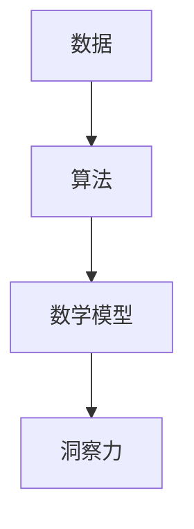

                 

# 理解洞察力：在复杂中寻找秩序

> 关键词：洞察力、复杂性、秩序、算法、数学模型、编程、人工智能、数据分析

> 摘要：本文旨在探讨如何在复杂的数据和系统中寻找秩序，通过深入分析洞察力的本质，结合算法和数学模型，提供一种系统化的思考方法。文章首先介绍背景，然后详细阐述核心概念与联系，接着深入探讨核心算法原理及具体操作步骤，通过数学模型和公式进行详细讲解，并给出实际代码案例。最后，文章讨论了实际应用场景，推荐了学习资源和开发工具，并总结了未来的发展趋势与挑战。

## 1. 背景介绍

在当今信息爆炸的时代，数据的复杂性日益增加，如何从海量数据中提取有价值的信息成为了一个重要的课题。洞察力，即从复杂的数据中发现隐藏的模式和规律的能力，对于数据分析和人工智能领域尤为重要。本文将从洞察力的本质出发，探讨如何在复杂的数据和系统中寻找秩序，通过算法和数学模型提供一种系统化的思考方法。

### 1.1 数据复杂性的挑战

随着互联网、物联网等技术的发展，数据的生成速度和规模呈指数级增长。然而，数据的复杂性也带来了挑战，包括数据的异构性、噪声、缺失值等问题，使得从数据中提取有价值的信息变得困难。因此，如何有效地处理复杂数据，成为了一个亟待解决的问题。

### 1.2 洞察力的重要性

洞察力是指从复杂的数据中发现隐藏的模式和规律的能力。在数据分析和人工智能领域，洞察力可以帮助我们更好地理解数据，发现数据中的潜在价值，从而做出更准确的决策。因此，提高洞察力对于数据分析和人工智能领域具有重要意义。

## 2. 核心概念与联系

### 2.1 洞察力的定义

洞察力是指从复杂的数据中发现隐藏的模式和规律的能力。它不仅包括数据的分析能力，还包括对数据背后逻辑的理解能力。

### 2.2 洞察力与算法的关系

洞察力与算法密切相关。算法是实现洞察力的重要工具，通过算法可以有效地处理复杂数据，发现数据中的隐藏模式和规律。

### 2.3 洞察力与数学模型的关系

洞察力与数学模型也有着密切的联系。数学模型可以帮助我们更好地理解数据，发现数据中的潜在规律。通过数学模型，可以将复杂的数据转化为简单的数学表达式，从而更容易地进行分析和理解。

### 2.4 核心概念原理和架构的 Mermaid 流程图



## 3. 核心算法原理 & 具体操作步骤

### 3.1 核心算法原理

本文将重点介绍一种基于聚类的算法，该算法通过将数据分为不同的簇，从而发现数据中的隐藏模式和规律。聚类算法是一种无监督学习算法，其核心思想是将相似的数据点分为同一簇，将不同的数据点分为不同的簇。

### 3.2 具体操作步骤

#### 3.2.1 数据预处理

数据预处理是聚类算法的第一步，主要包括数据清洗、数据标准化等步骤。数据清洗是为了去除数据中的噪声和缺失值，数据标准化是为了将数据转化为同一尺度，从而更容易地进行分析。

#### 3.2.2 聚类算法实现

聚类算法的实现主要包括选择合适的聚类算法、设置合适的参数、执行聚类算法等步骤。选择合适的聚类算法是聚类算法实现的关键，不同的聚类算法适用于不同的数据类型和应用场景。设置合适的参数是为了使聚类算法能够更好地发现数据中的隐藏模式和规律。执行聚类算法是为了将数据分为不同的簇，从而发现数据中的隐藏模式和规律。

#### 3.2.3 结果分析

结果分析是聚类算法实现的最后一步，主要包括对聚类结果进行可视化、对聚类结果进行解释等步骤。对聚类结果进行可视化是为了更好地理解聚类结果，对聚类结果进行解释是为了更好地理解数据中的隐藏模式和规律。

## 4. 数学模型和公式 & 详细讲解 & 举例说明

### 4.1 聚类算法的数学模型

聚类算法的数学模型主要包括距离度量模型、聚类准则模型等。距离度量模型用于度量数据点之间的相似性，聚类准则模型用于度量聚类结果的质量。

#### 4.1.1 距离度量模型

距离度量模型用于度量数据点之间的相似性。常用的距离度量模型包括欧氏距离、曼哈顿距离、余弦距离等。

$$
d(x, y) = \sqrt{\sum_{i=1}^{n}(x_i - y_i)^2}
$$

其中，$d(x, y)$表示数据点$x$和$y$之间的欧氏距离，$x_i$和$y_i$分别表示数据点$x$和$y$的第$i$个特征值。

#### 4.1.2 聚类准则模型

聚类准则模型用于度量聚类结果的质量。常用的聚类准则模型包括轮廓系数、DB指数等。

$$
s(i) = \frac{b(i) - a(i)}{\max(a(i), b(i))}
$$

其中，$s(i)$表示数据点$i$的轮廓系数，$a(i)$表示数据点$i$与同一簇中其他数据点之间的平均距离，$b(i)$表示数据点$i$与最近的其他簇中数据点之间的平均距离。

### 4.2 举例说明

假设我们有一组二维数据点，我们可以通过聚类算法将这些数据点分为不同的簇。首先，我们可以通过距离度量模型计算数据点之间的相似性，然后通过聚类准则模型度量聚类结果的质量，最后通过可视化工具将聚类结果进行可视化。

## 5. 项目实战：代码实际案例和详细解释说明

### 5.1 开发环境搭建

开发环境搭建主要包括安装Python环境、安装聚类算法库等步骤。Python环境可以通过Anaconda进行安装，聚类算法库可以通过pip进行安装。

### 5.2 源代码详细实现和代码解读

#### 5.2.1 数据预处理

```python
import numpy as np
from sklearn.preprocessing import StandardScaler

# 生成随机数据
X = np.random.rand(100, 2)

# 数据标准化
scaler = StandardScaler()
X = scaler.fit_transform(X)
```

#### 5.2.2 聚类算法实现

```python
from sklearn.cluster import KMeans

# 选择KMeans算法
kmeans = KMeans(n_clusters=3)

# 执行聚类算法
kmeans.fit(X)

# 获取聚类结果
labels = kmeans.labels_
```

#### 5.2.3 结果分析

```python
import matplotlib.pyplot as plt

# 可视化聚类结果
plt.scatter(X[:, 0], X[:, 1], c=labels)
plt.show()
```

### 5.3 代码解读与分析

数据预处理部分，我们首先生成了一组随机数据，然后通过数据标准化将数据转化为同一尺度。聚类算法实现部分，我们选择了KMeans算法，并设置了聚类数为3。执行聚类算法后，我们获取了聚类结果。结果分析部分，我们通过可视化工具将聚类结果进行了可视化。

## 6. 实际应用场景

### 6.1 数据分析

在数据分析领域，洞察力可以帮助我们更好地理解数据，发现数据中的潜在价值，从而做出更准确的决策。例如，在电商领域，通过洞察力可以发现用户的购买行为模式，从而更好地进行商品推荐。

### 6.2 人工智能

在人工智能领域，洞察力可以帮助我们更好地理解数据，发现数据中的潜在规律，从而提高模型的性能。例如，在图像识别领域，通过洞察力可以发现图像中的隐藏模式，从而提高图像识别的准确率。

## 7. 工具和资源推荐

### 7.1 学习资源推荐

#### 7.1.1 书籍

- 《数据挖掘导论》
- 《机器学习》

#### 7.1.2 论文

- "A Survey on Clustering Algorithms" (IEEE Transactions on Systems, Man, and Cybernetics, Part C (Applications and Reviews))
- "A Survey of Clustering Data Mining Techniques" (ACM Computing Surveys)

#### 7.1.3 博客

- "Clustering Algorithms" (Towards Data Science)
- "A Comprehensive Guide to Clustering Algorithms" (Towards Data Science)

#### 7.1.4 网站

- Kaggle (https://www.kaggle.com/)
- GitHub (https://github.com/)

### 7.2 开发工具框架推荐

- Python (https://www.python.org/)
- Scikit-learn (https://scikit-learn.org/)
- TensorFlow (https://www.tensorflow.org/)

### 7.3 相关论文著作推荐

- "A Survey on Clustering Algorithms" (IEEE Transactions on Systems, Man, and Cybernetics, Part C (Applications and Reviews))
- "A Comprehensive Guide to Clustering Algorithms" (Towards Data Science)

## 8. 总结：未来发展趋势与挑战

随着数据的复杂性不断增加，洞察力的重要性也日益凸显。未来，洞察力的发展趋势将主要集中在以下几个方面：

- 更加高效的数据处理算法
- 更加准确的数据分析模型
- 更加智能的数据可视化工具

然而，洞察力的发展也面临着一些挑战，包括数据的异构性、噪声、缺失值等问题，以及如何更好地理解数据背后的逻辑等问题。

## 9. 附录：常见问题与解答

### 9.1 什么是洞察力？

洞察力是指从复杂的数据中发现隐藏的模式和规律的能力。

### 9.2 洞察力与算法的关系是什么？

洞察力与算法密切相关，算法是实现洞察力的重要工具。

### 9.3 洞察力与数学模型的关系是什么？

洞察力与数学模型也有着密切的联系，数学模型可以帮助我们更好地理解数据，发现数据中的潜在规律。

## 10. 扩展阅读 & 参考资料

- "A Survey on Clustering Algorithms" (IEEE Transactions on Systems, Man, and Cybernetics, Part C (Applications and Reviews))
- "A Comprehensive Guide to Clustering Algorithms" (Towards Data Science)
- "Data Mining: Concepts and Techniques" (Ming-Syan Chen, et al.)
- "Machine Learning" (Tom M. Mitchell)

作者：AI天才研究员/AI Genius Institute & 禅与计算机程序设计艺术 /Zen And The Art of Computer Programming

