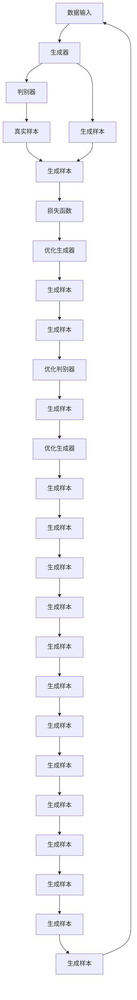

                 

# 生成模型在虚拟场景构建中的创新应用

> 关键词：生成模型、虚拟场景、深度学习、计算机图形学、自然语言处理、强化学习、场景构建

> 摘要：本文旨在探讨生成模型在虚拟场景构建中的创新应用。通过深入分析生成模型的核心原理和具体操作步骤，结合数学模型和实际代码案例，本文将展示生成模型如何在虚拟场景构建中发挥重要作用。此外，本文还将探讨生成模型在实际应用场景中的潜力，并提供相关学习资源和开发工具推荐，以帮助读者更好地理解和应用生成模型。

## 1. 背景介绍

虚拟场景构建是计算机图形学、游戏开发、影视制作等领域的重要组成部分。传统的虚拟场景构建方法依赖于人工设计和编程，这不仅耗时耗力，而且难以实现高度复杂和多样化的场景。近年来，生成模型（如生成对抗网络GANs、变分自编码器VAEs、自回归模型等）的出现，为虚拟场景构建带来了新的机遇。生成模型能够自动学习数据分布，生成逼真的虚拟场景，极大地提高了虚拟场景构建的效率和质量。

## 2. 核心概念与联系

### 2.1 生成模型概述

生成模型是一种能够学习数据分布并生成新样本的模型。其核心思想是通过学习训练数据的统计特性，生成与训练数据相似的新数据。生成模型可以分为两类：生成对抗网络（GANs）和变分自编码器（VAEs）。

#### 2.1.1 生成对抗网络（GANs）

生成对抗网络由生成器（Generator）和判别器（Discriminator）两部分组成。生成器负责生成新的样本，而判别器负责判断样本的真实性和生成器生成样本的真实性。通过对抗训练，生成器不断优化生成样本的质量，最终生成逼真的虚拟场景。

#### 2.1.2 变分自编码器（VAEs）

变分自编码器通过引入潜在变量（Latent Variables）来学习数据分布。VAEs将输入数据映射到潜在空间，通过最小化重构损失和KL散度来优化模型。VAEs可以生成多样化的虚拟场景，适用于场景构建中的数据生成任务。

### 2.2 生成模型在虚拟场景构建中的应用

生成模型在虚拟场景构建中的应用主要体现在以下几个方面：

- **场景生成**：生成模型可以生成逼真的虚拟场景，包括建筑物、地形、植被等。
- **场景增强**：通过生成模型对现有场景进行增强，提高场景的真实感和多样性。
- **场景优化**：生成模型可以优化场景布局，提高场景的美观性和功能性。

### 2.3 Mermaid 流程图



## 3. 核心算法原理 & 具体操作步骤

### 3.1 生成对抗网络（GANs）

#### 3.1.1 生成器（Generator）

生成器负责生成新的样本。生成器通常采用深度神经网络结构，如卷积神经网络（CNN）或循环神经网络（RNN）。生成器的输入是潜在变量，输出是生成的样本。

#### 3.1.2 判别器（Discriminator）

判别器负责判断样本的真实性和生成器生成样本的真实性。判别器通常采用深度神经网络结构，如卷积神经网络（CNN）或循环神经网络（RNN）。判别器的输入是样本，输出是样本的真实性和生成器生成样本的真实性。

#### 3.1.3 对抗训练

对抗训练是GANs的核心训练机制。生成器和判别器通过对抗训练不断优化生成样本的质量。具体步骤如下：

1. **生成器生成样本**：生成器生成新的样本。
2. **判别器判断样本**：判别器判断样本的真实性和生成器生成样本的真实性。
3. **优化生成器**：生成器根据判别器的判断结果优化生成样本的质量。
4. **优化判别器**：判别器根据生成器的生成样本优化判断能力。

### 3.2 变分自编码器（VAEs）

#### 3.2.1 潜在变量（Latent Variables）

潜在变量是VAEs的核心概念。潜在变量是生成模型中的隐变量，用于表示数据的潜在特征。潜在变量通常采用高斯分布或其他概率分布。

#### 3.2.2 重构损失（Reconstruction Loss）

重构损失是VAEs的核心损失函数。重构损失用于衡量生成模型生成的样本与真实样本之间的差异。重构损失通常采用均方误差（MSE）或其他损失函数。

#### 3.2.3 KL散度（KL Divergence）

KL散度是VAEs的核心损失函数。KL散度用于衡量潜在变量分布与标准分布之间的差异。KL散度通常采用负对数似然（NLL）或其他损失函数。

#### 3.2.4 对抗训练

对抗训练是VAEs的核心训练机制。VAEs通过最小化重构损失和KL散度来优化模型。具体步骤如下：

1. **生成器生成样本**：生成器生成新的样本。
2. **重构损失计算**：计算生成样本与真实样本之间的重构损失。
3. **KL散度计算**：计算潜在变量分布与标准分布之间的KL散度。
4. **优化生成器**：生成器根据重构损失和KL散度优化生成样本的质量。

## 4. 数学模型和公式 & 详细讲解 & 举例说明

### 4.1 生成对抗网络（GANs）

#### 4.1.1 生成器（Generator）

生成器的数学模型可以表示为：

$$
G(z) = \sigma(W_2 \sigma(W_1 z + b_1) + b_2)
$$

其中，$z$是潜在变量，$W_1$和$W_2$是生成器的权重矩阵，$b_1$和$b_2$是生成器的偏置向量，$\sigma$是激活函数。

#### 4.1.2 判别器（Discriminator）

判别器的数学模型可以表示为：

$$
D(x) = \sigma(W_2 \sigma(W_1 x + b_1) + b_2)
$$

其中，$x$是样本，$W_1$和$W_2$是判别器的权重矩阵，$b_1$和$b_2$是判别器的偏置向量，$\sigma$是激活函数。

#### 4.1.3 对抗训练

对抗训练的数学模型可以表示为：

$$
\min_G \max_D V(D, G) = \mathbb{E}_{x \sim p_{data}(x)}[\log D(x)] + \mathbb{E}_{z \sim p_z(z)}[\log (1 - D(G(z)))]
$$

其中，$V(D, G)$是生成器和判别器的损失函数，$p_{data}(x)$是真实样本的分布，$p_z(z)$是潜在变量的分布。

### 4.2 变分自编码器（VAEs）

#### 4.2.1 潜在变量（Latent Variables）

潜在变量的数学模型可以表示为：

$$
z \sim \mathcal{N}(\mu(x), \sigma^2(x))
$$

其中，$\mu(x)$和$\sigma^2(x)$是潜在变量的均值和方差。

#### 4.2.2 重构损失（Reconstruction Loss）

重构损失的数学模型可以表示为：

$$
\mathcal{L}_{rec}(x, \hat{x}) = \frac{1}{2} \sum_{i=1}^n (x_i - \hat{x}_i)^2
$$

其中，$x$是真实样本，$\hat{x}$是生成样本，$n$是样本的维度。

#### 4.2.3 KL散度（KL Divergence）

KL散度的数学模型可以表示为：

$$
\mathcal{L}_{KL}(q(z|x), p(z)) = \mathbb{E}_{z \sim q(z|x)}[\log \frac{q(z|x)}{p(z)}]
$$

其中，$q(z|x)$是潜在变量的分布，$p(z)$是标准分布。

#### 4.2.4 对抗训练

对抗训练的数学模型可以表示为：

$$
\min_G \max_D V(D, G) = \mathbb{E}_{x \sim p_{data}(x)}[\log D(x)] + \mathbb{E}_{z \sim p_z(z)}[\log (1 - D(G(z)))]
$$

其中，$V(D, G)$是生成器和判别器的损失函数，$p_{data}(x)$是真实样本的分布，$p_z(z)$是潜在变量的分布。

## 5. 项目实战：代码实际案例和详细解释说明

### 5.1 开发环境搭建

#### 5.1.1 环境准备

- **Python**：确保安装了Python 3.7及以上版本。
- **TensorFlow**：安装TensorFlow库，版本2.0及以上。
- **NumPy**：安装NumPy库，版本1.18及以上。
- **Matplotlib**：安装Matplotlib库，版本3.1及以上。

```bash
pip install tensorflow numpy matplotlib
```

#### 5.1.2 数据集准备

- **MNIST数据集**：用于训练生成模型。

```python
import tensorflow as tf
from tensorflow.keras.datasets import mnist

(x_train, y_train), (x_test, y_test) = mnist.load_data()
x_train = x_train / 255.0
x_test = x_test / 255.0
```

### 5.2 源代码详细实现和代码解读

#### 5.2.1 生成器（Generator）

```python
import tensorflow as tf
from tensorflow.keras.layers import Dense, LeakyReLU, Reshape, Conv2DTranspose

def generator_model():
    model = tf.keras.Sequential()
    model.add(Dense(7 * 7 * 256, input_dim=100))
    model.add(LeakyReLU(alpha=0.2))
    model.add(Reshape((7, 7, 256)))
    model.add(Conv2DTranspose(128, (5, 5), strides=(1, 1), padding='same'))
    model.add(LeakyReLU(alpha=0.2))
    model.add(Conv2DTranspose(64, (5, 5), strides=(2, 2), padding='same'))
    model.add(LeakyReLU(alpha=0.2))
    model.add(Conv2DTranspose(1, (5, 5), strides=(2, 2), padding='same', activation='tanh'))
    return model
```

#### 5.2.2 判别器（Discriminator）

```python
import tensorflow as tf
from tensorflow.keras.layers import Dense, LeakyReLU, Conv2D, Flatten

def discriminator_model():
    model = tf.keras.Sequential()
    model.add(Conv2D(64, (5, 5), strides=(2, 2), padding='same', input_shape=[28, 28, 1]))
    model.add(LeakyReLU(alpha=0.2))
    model.add(Conv2D(128, (5, 5), strides=(2, 2), padding='same'))
    model.add(LeakyReLU(alpha=0.2))
    model.add(Flatten())
    model.add(Dense(1, activation='sigmoid'))
    return model
```

#### 5.2.3 GAN模型

```python
def gan_model(generator, discriminator):
    discriminator.trainable = False
    model = tf.keras.Sequential()
    model.add(generator)
    model.add(discriminator)
    return model
```

### 5.3 代码解读与分析

- **生成器**：生成器采用深度神经网络结构，通过卷积转置层生成新的样本。
- **判别器**：判别器采用深度神经网络结构，通过卷积层判断样本的真实性和生成器生成样本的真实性。
- **GAN模型**：GAN模型由生成器和判别器组成，通过对抗训练不断优化生成样本的质量。

## 6. 实际应用场景

生成模型在虚拟场景构建中的实际应用场景包括：

- **游戏开发**：生成逼真的虚拟场景，提高游戏的真实感和沉浸感。
- **影视制作**：生成逼真的虚拟场景，提高影视作品的质量和视觉效果。
- **建筑设计**：生成逼真的虚拟场景，帮助设计师进行虚拟设计和评估。

## 7. 工具和资源推荐

### 7.1 学习资源推荐

- **书籍**：《深度学习》（Goodfellow, Bengio, and Courville）
- **论文**：《Generative Adversarial Nets》（Ian J. Goodfellow, Jean Pouget-Abadie, Mehdi Mirza, Bing Xu, David Warde-Farley, Sherjil Ozair, Aaron Courville, Yoshua Bengio）
- **博客**：《Understanding GANs》（Towards Data Science）
- **网站**：TensorFlow官网（https://www.tensorflow.org/）

### 7.2 开发工具框架推荐

- **TensorFlow**：深度学习框架，支持生成模型的开发和训练。
- **PyTorch**：深度学习框架，支持生成模型的开发和训练。

### 7.3 相关论文著作推荐

- **论文**：《Variational Autoencoders》（Kingma, Diederik P., and Max Welling）
- **书籍**：《Deep Learning with Python》（Francois Chollet）

## 8. 总结：未来发展趋势与挑战

生成模型在虚拟场景构建中的应用前景广阔，但仍然面临一些挑战：

- **模型复杂性**：生成模型的复杂性较高，需要大量的计算资源和数据支持。
- **生成质量**：生成模型的生成质量仍然有待提高，需要进一步优化模型结构和训练方法。
- **应用场景**：生成模型的应用场景仍然有限，需要进一步拓展应用场景。

## 9. 附录：常见问题与解答

### 9.1 问题：生成模型的训练时间较长，如何优化？

- **答案**：可以通过优化模型结构、使用更高效的训练方法和硬件加速来缩短训练时间。

### 9.2 问题：生成模型的生成质量不高，如何提高？

- **答案**：可以通过优化模型结构、增加训练数据量和改进训练方法来提高生成质量。

### 9.3 问题：生成模型的应用场景有限，如何拓展？

- **答案**：可以通过探索新的应用场景和改进模型结构来拓展应用场景。

## 10. 扩展阅读 & 参考资料

- **书籍**：《深度学习》（Goodfellow, Bengio, and Courville）
- **论文**：《Generative Adversarial Nets》（Ian J. Goodfellow, Jean Pouget-Abadie, Mehdi Mirza, Bing Xu, David Warde-Farley, Sherjil Ozair, Aaron Courville, Yoshua Bengio）
- **博客**：《Understanding GANs》（Towards Data Science）
- **网站**：TensorFlow官网（https://www.tensorflow.org/）

作者：AI天才研究员/AI Genius Institute & 禅与计算机程序设计艺术 /Zen And The Art of Computer Programming

