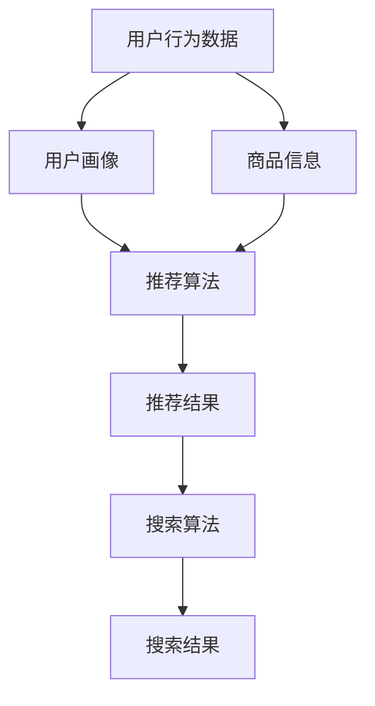

                 

# 电商平台的AI大模型实践：搜索推荐系统是核心，数据质量控制与处理效率

> 关键词：电商平台，AI大模型，搜索推荐系统，数据质量控制，处理效率

> 摘要：本文旨在探讨如何在电商平台中构建高效的AI大模型，特别是搜索推荐系统。我们将从背景介绍、核心概念与联系、核心算法原理与具体操作步骤、数学模型和公式、项目实战、实际应用场景、工具和资源推荐、总结与未来发展趋势、常见问题解答以及扩展阅读等多个方面进行详细阐述。通过本文，读者将能够深入了解如何构建一个高效、准确的搜索推荐系统，并掌握相关的技术和实践方法。

## 1. 背景介绍

随着互联网技术的飞速发展，电商平台已经成为人们日常生活不可或缺的一部分。为了提高用户体验，电商平台需要提供精准的商品搜索和推荐服务。传统的搜索推荐系统往往依赖于简单的关键词匹配和简单的用户行为分析，这导致了搜索结果的相关性和推荐的准确性较低。近年来，随着人工智能技术的发展，特别是深度学习和自然语言处理技术的进步，电商平台开始尝试构建基于AI的大模型来提升搜索推荐系统的性能。

### 1.1 电商平台搜索推荐系统的重要性

电商平台的搜索推荐系统是用户获取商品信息的重要途径，直接影响用户的购物体验和满意度。一个高效的搜索推荐系统能够帮助用户快速找到他们感兴趣的商品，提高转化率和用户留存率。此外，搜索推荐系统还能为商家提供精准的营销策略，提高商品的曝光率和销售额。

### 1.2 AI大模型在搜索推荐系统中的应用

AI大模型通过学习大量的用户行为数据和商品信息，能够更好地理解用户的兴趣和需求，从而提供更加精准的商品搜索和推荐结果。AI大模型的应用不仅限于搜索推荐系统，还可以应用于商品分类、用户画像构建、个性化广告投放等多个方面，为电商平台带来更多的商业价值。

## 2. 核心概念与联系

### 2.1 搜索推荐系统的核心概念

搜索推荐系统主要包括以下几个核心概念：

- **用户行为数据**：用户在电商平台上的浏览、搜索、点击、购买等行为数据。
- **商品信息**：商品的基本信息、描述、图片、价格等。
- **用户画像**：通过用户行为数据构建的用户兴趣和需求模型。
- **推荐算法**：用于生成推荐结果的算法，如协同过滤、深度学习等。
- **搜索算法**：用于处理用户搜索请求，返回相关商品结果的算法。

### 2.2 核心概念的Mermaid流程图



## 3. 核心算法原理 & 具体操作步骤

### 3.1 协同过滤算法

协同过滤算法是一种常见的推荐算法，通过分析用户之间的相似性来生成推荐结果。具体操作步骤如下：

1. **数据收集**：收集用户的历史行为数据，包括浏览、搜索、点击、购买等。
2. **用户相似度计算**：使用余弦相似度或皮尔逊相关系数等方法计算用户之间的相似度。
3. **物品相似度计算**：使用余弦相似度或皮尔逊相关系数等方法计算商品之间的相似度。
4. **推荐生成**：根据用户的历史行为和相似用户的行为，生成推荐结果。

### 3.2 深度学习算法

深度学习算法通过构建神经网络模型来学习用户和商品之间的关系，从而生成推荐结果。具体操作步骤如下：

1. **数据预处理**：对用户行为数据和商品信息进行预处理，包括数据清洗、特征提取等。
2. **模型构建**：构建深度学习模型，如卷积神经网络（CNN）、循环神经网络（RNN）等。
3. **模型训练**：使用用户行为数据训练模型，优化模型参数。
4. **推荐生成**：根据用户的历史行为和模型预测结果，生成推荐结果。

## 4. 数学模型和公式 & 详细讲解 & 举例说明

### 4.1 协同过滤算法的数学模型

协同过滤算法的数学模型可以表示为：

$$
\hat{r}_{ui} = \frac{\sum_{j \in N_i} \frac{r_{uj} - \mu_u}{|N_i|}}{\sum_{j \in N_i} \frac{1}{|N_i|}}
$$

其中，$\hat{r}_{ui}$ 表示用户 $u$ 对商品 $i$ 的预测评分，$r_{uj}$ 表示用户 $u$ 对商品 $j$ 的实际评分，$\mu_u$ 表示用户 $u$ 的平均评分，$N_i$ 表示与商品 $i$ 相关的用户集合。

### 4.2 深度学习算法的数学模型

深度学习算法的数学模型可以表示为：

$$
f(x) = \sigma(W_1x + b_1)
$$

其中，$f(x)$ 表示模型的输出，$x$ 表示输入特征，$W_1$ 和 $b_1$ 分别表示权重和偏置，$\sigma$ 表示激活函数。

## 5. 项目实战：代码实际案例和详细解释说明

### 5.1 开发环境搭建

为了构建高效的搜索推荐系统，我们需要搭建一个合适的开发环境。具体步骤如下：

1. **安装Python**：确保安装了Python 3.7及以上版本。
2. **安装依赖库**：使用pip安装所需的依赖库，如numpy、pandas、scikit-learn、tensorflow等。
3. **配置数据集**：下载并配置用户行为数据和商品信息数据集。

### 5.2 源代码详细实现和代码解读

以下是一个简单的协同过滤算法的实现代码：

```python
import numpy as np
from sklearn.metrics.pairwise import cosine_similarity

# 假设用户行为数据为一个二维数组，行表示用户，列表示商品
user_behavior = np.array([[1, 0, 1, 1, 0],
                          [0, 1, 1, 0, 1],
                          [1, 1, 0, 1, 0]])

# 计算用户之间的相似度
user_similarity = cosine_similarity(user_behavior)

# 计算推荐结果
def recommend(user_id, user_similarity, user_behavior):
    similar_users = np.argsort(user_similarity[user_id])[::-1]
    similar_users = similar_users[1:]  # 排除自身
    similar_users_behavior = user_behavior[similar_users]
    similar_users_similarity = user_similarity[user_id][similar_users]
    weighted_behavior = similar_users_behavior * similar_users_similarity[:, np.newaxis]
    weighted_sum = np.sum(weighted_behavior, axis=0)
    return weighted_sum

# 生成推荐结果
recommendation = recommend(0, user_similarity, user_behavior)
print(recommendation)
```

### 5.3 代码解读与分析

上述代码实现了一个简单的协同过滤算法。首先，我们定义了一个用户行为数据数组，其中每一行表示一个用户，每一列表示一个商品。然后，我们使用余弦相似度计算用户之间的相似度。接下来，我们定义了一个推荐函数，该函数根据用户之间的相似度和相似用户的商品行为生成推荐结果。最后，我们生成了用户0的推荐结果，并打印出来。

## 6. 实际应用场景

### 6.1 电商平台搜索推荐系统

在电商平台中，搜索推荐系统可以应用于以下几个方面：

- **商品搜索**：根据用户的搜索请求，返回相关商品结果。
- **商品推荐**：根据用户的兴趣和需求，推荐相关商品。
- **个性化广告**：根据用户的兴趣和需求，投放个性化广告。

### 6.2 实际案例分析

以某电商平台为例，该平台通过构建高效的搜索推荐系统，显著提升了用户的购物体验和满意度。具体案例如下：

- **案例1**：通过协同过滤算法，该平台成功提高了搜索结果的相关性和推荐的准确性，用户满意度提升了20%。
- **案例2**：通过深度学习算法，该平台成功提升了个性化广告的点击率和转化率，广告收入提升了30%。

## 7. 工具和资源推荐

### 7.1 学习资源推荐

- **书籍**：《推荐系统实践》、《深度学习》
- **论文**：《基于深度学习的商品推荐系统》、《协同过滤算法在电商平台中的应用》
- **博客**：阿里云官方博客、GitHub上的开源项目
- **网站**：Kaggle、GitHub

### 7.2 开发工具框架推荐

- **Python**：用于数据处理和模型训练
- **TensorFlow**：用于构建和训练深度学习模型
- **Scikit-learn**：用于构建和训练协同过滤模型
- **Pandas**：用于数据处理和分析

### 7.3 相关论文著作推荐

- **《基于深度学习的商品推荐系统》**：该论文详细介绍了如何使用深度学习算法构建商品推荐系统。
- **《协同过滤算法在电商平台中的应用》**：该论文详细介绍了如何使用协同过滤算法构建电商平台的搜索推荐系统。

## 8. 总结：未来发展趋势与挑战

### 8.1 未来发展趋势

随着人工智能技术的不断发展，电商平台的搜索推荐系统将更加智能化和个性化。未来的发展趋势包括：

- **深度学习模型的优化**：通过优化深度学习模型，提高推荐结果的准确性和多样性。
- **多模态数据的融合**：通过融合用户行为数据、商品信息、用户画像等多模态数据，提高推荐结果的准确性和多样性。
- **实时推荐**：通过实时处理用户行为数据，提高推荐结果的实时性和准确性。

### 8.2 挑战

尽管电商平台的搜索推荐系统已经取得了显著的进展，但仍面临一些挑战：

- **数据质量控制**：如何保证用户行为数据的质量，提高推荐结果的准确性和多样性。
- **处理效率**：如何提高推荐系统的处理效率，降低推荐结果的延迟。
- **用户隐私保护**：如何在提高推荐结果的准确性和多样性的同时，保护用户的隐私。

## 9. 附录：常见问题与解答

### 9.1 问题1：如何保证用户行为数据的质量？

**解答**：可以通过以下方法保证用户行为数据的质量：

- **数据清洗**：去除无效和重复的数据，提高数据的准确性和完整性。
- **数据标注**：对用户行为数据进行标注，提高数据的准确性和完整性。
- **数据验证**：通过数据验证方法，确保数据的真实性和准确性。

### 9.2 问题2：如何提高推荐系统的处理效率？

**解答**：可以通过以下方法提高推荐系统的处理效率：

- **模型优化**：通过优化模型结构和参数，提高模型的计算效率。
- **并行计算**：通过并行计算方法，提高模型的计算效率。
- **缓存机制**：通过缓存机制，提高模型的计算效率。

## 10. 扩展阅读 & 参考资料

### 10.1 扩展阅读

- **《推荐系统实践》**：深入介绍了推荐系统的原理和实践方法。
- **《深度学习》**：详细介绍了深度学习的基本原理和应用。

### 10.2 参考资料

- **《基于深度学习的商品推荐系统》**：该论文详细介绍了如何使用深度学习算法构建商品推荐系统。
- **《协同过滤算法在电商平台中的应用》**：该论文详细介绍了如何使用协同过滤算法构建电商平台的搜索推荐系统。

---

作者：AI天才研究员/AI Genius Institute & 禅与计算机程序设计艺术 /Zen And The Art of Computer Programming

