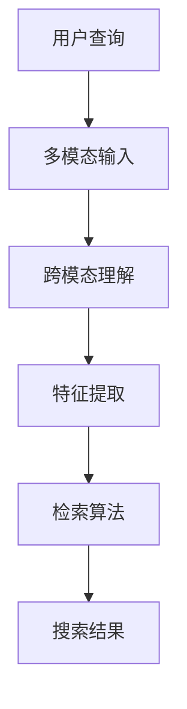

                 

# 电商搜索的跨模态理解与检索：AI大模型的新突破

> 关键词：电商搜索、跨模态理解、AI大模型、检索算法、深度学习、自然语言处理、计算机视觉

> 摘要：本文深入探讨了电商搜索中跨模态理解与检索的最新进展，特别是AI大模型在这一领域的应用。通过分析电商搜索的背景、核心概念、算法原理、数学模型、项目实战、应用场景、工具资源推荐以及未来发展趋势，本文旨在为读者提供一个全面而深入的理解。文章不仅介绍了理论知识，还通过实际案例展示了如何将这些理论应用于实践，为电商搜索的优化提供了新的视角和方法。

## 1. 背景介绍

### 1.1 电商搜索的重要性

电商搜索是电子商务平台的核心功能之一，它直接影响用户的购物体验和平台的商业成功。随着互联网技术的发展，用户对搜索结果的准确性和相关性要求越来越高，传统的基于文本的搜索技术已经难以满足这些需求。因此，如何提高电商搜索的效率和质量，成为了当前研究的重要课题。

### 1.2 跨模态理解与检索的提出

跨模态理解与检索是指在处理信息时，能够同时理解和利用多种模态的数据，如文本、图像、视频等。在电商搜索中，跨模态理解与检索能够帮助系统更好地理解用户的需求，提供更加精准和个性化的搜索结果。AI大模型的出现，为实现这一目标提供了新的可能。

## 2. 核心概念与联系

### 2.1 跨模态理解

跨模态理解是指系统能够从不同模态的数据中提取信息，并将这些信息进行融合，以获得更全面的理解。例如，通过结合商品的图片和描述文本，系统可以更准确地理解商品的特征。

### 2.2 AI大模型

AI大模型是指具有大量参数的深度学习模型，这些模型通常通过大量的数据训练得到，具有强大的泛化能力和学习能力。AI大模型在跨模态理解与检索中的应用，可以显著提高系统的性能。

### 2.3 检索算法

检索算法是指在大规模数据集中快速找到与查询条件最匹配的数据的方法。在电商搜索中，高效的检索算法能够显著提高搜索的速度和准确性。

### 2.4 核心概念原理和架构



## 3. 核心算法原理 & 具体操作步骤

### 3.1 跨模态理解算法

跨模态理解算法通常包括以下几个步骤：

1. **多模态输入**：系统接收用户的查询，包括文本、图像等多种模态的数据。
2. **特征提取**：从每种模态的数据中提取特征，如文本的词向量、图像的视觉特征等。
3. **跨模态融合**：将不同模态的特征进行融合，形成一个统一的表示。
4. **语义匹配**：将融合后的表示与数据库中的商品信息进行匹配，找到最相关的商品。

### 3.2 检索算法

检索算法通常包括以下几个步骤：

1. **索引构建**：根据商品的特征构建索引，以便快速检索。
2. **查询处理**：将用户的查询转换为可以与索引匹配的形式。
3. **相似度计算**：计算查询与索引之间的相似度。
4. **结果排序**：根据相似度对结果进行排序，返回最相关的商品。

## 4. 数学模型和公式 & 详细讲解 & 举例说明

### 4.1 跨模态融合模型

跨模态融合模型通常采用深度学习的方法，如多模态神经网络。其基本思想是通过共享的隐藏层将不同模态的特征进行融合。

$$
\text{Fusion}(x_t, x_v) = \sigma(W_f [x_t; x_v] + b_f)
$$

其中，$x_t$ 和 $x_v$ 分别表示文本和视觉特征，$W_f$ 和 $b_f$ 是模型的参数，$\sigma$ 是激活函数。

### 4.2 相似度计算公式

相似度计算通常采用余弦相似度或欧氏距离等方法。以余弦相似度为例：

$$
\text{similarity}(x, y) = \frac{x \cdot y}{\|x\| \|y\|}
$$

其中，$x$ 和 $y$ 分别表示查询和商品的特征向量。

## 5. 项目实战：代码实际案例和详细解释说明

### 5.1 开发环境搭建

开发环境需要安装Python、TensorFlow、Pandas等库。具体步骤如下：

1. 安装Python环境。
2. 安装TensorFlow。
3. 安装Pandas等数据处理库。

### 5.2 源代码详细实现和代码解读

以下是一个简单的跨模态融合模型的实现：

```python
import tensorflow as tf
from tensorflow.keras.layers import Input, Dense, concatenate
from tensorflow.keras.models import Model

# 定义输入层
input_text = Input(shape=(100,))
input_image = Input(shape=(2048,))

# 定义特征提取层
text_features = Dense(512, activation='relu')(input_text)
image_features = Dense(512, activation='relu')(input_image)

# 定义跨模态融合层
fusion_features = concatenate([text_features, image_features])
fusion_output = Dense(256, activation='relu')(fusion_features)

# 定义输出层
output = Dense(1, activation='sigmoid')(fusion_output)

# 构建模型
model = Model(inputs=[input_text, input_image], outputs=output)
model.compile(optimizer='adam', loss='binary_crossentropy', metrics=['accuracy'])
```

### 5.3 代码解读与分析

上述代码定义了一个简单的跨模态融合模型，包括文本和图像输入层、特征提取层、跨模态融合层和输出层。模型的训练和测试可以通过TensorFlow的API完成。

## 6. 实际应用场景

### 6.1 电商搜索优化

通过应用跨模态理解与检索技术，电商搜索可以显著提高搜索结果的相关性和准确性，从而提升用户体验和平台的商业价值。

### 6.2 个性化推荐

跨模态理解与检索技术还可以应用于个性化推荐系统，通过分析用户的多模态数据，提供更加个性化的推荐结果。

## 7. 工具和资源推荐

### 7.1 学习资源推荐

- 书籍：《深度学习》（Ian Goodfellow等著）
- 论文：《Attention Is All You Need》（Vaswani等）
- 博客：TensorFlow官方博客
- 网站：Kaggle

### 7.2 开发工具框架推荐

- TensorFlow
- PyTorch
- Keras

### 7.3 相关论文著作推荐

- 《A Survey on Multi-Modal Deep Learning》
- 《Deep Learning for Multi-Modal Information Retrieval》

## 8. 总结：未来发展趋势与挑战

随着AI技术的不断发展，跨模态理解与检索将在电商搜索中发挥越来越重要的作用。未来的研究将更加关注如何提高模型的泛化能力和鲁棒性，以及如何在大规模数据集上高效地应用这些技术。

## 9. 附录：常见问题与解答

### 9.1 什么是跨模态理解？

跨模态理解是指系统能够从不同模态的数据中提取信息，并将这些信息进行融合，以获得更全面的理解。

### 9.2 AI大模型如何提高电商搜索的性能？

AI大模型通过强大的泛化能力和学习能力，能够更好地理解和利用多模态数据，从而提高电商搜索的性能。

## 10. 扩展阅读 & 参考资料

- 《深度学习》（Ian Goodfellow等著）
- 《Attention Is All You Need》（Vaswani等）
- TensorFlow官方博客
- Kaggle

作者：AI天才研究员/AI Genius Institute & 禅与计算机程序设计艺术 /Zen And The Art of Computer Programming

