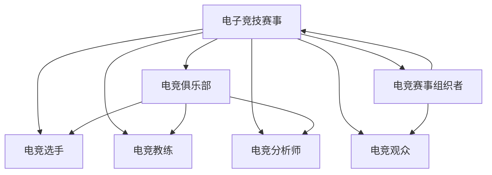

                 

# 电子竞技创业：新兴体育产业的机遇

> 关键词：电子竞技、体育产业、创业机会、技术驱动、数据分析、用户体验、商业模式

> 摘要：本文旨在探讨电子竞技作为新兴体育产业的潜力与机遇，通过分析其技术驱动的核心要素，包括数据分析、用户体验优化、商业模式创新等，为创业者提供有价值的见解和指导。我们将从背景介绍、核心概念与联系、核心算法原理、项目实战案例、实际应用场景、工具和资源推荐、未来发展趋势与挑战等多方面进行深入探讨。

## 1. 背景介绍

### 1.1 电子竞技的定义与现状
电子竞技（Esports）是指以电子游戏为竞技项目的体育赛事。近年来，随着互联网和移动设备的普及，电子竞技已经成为全球范围内增长最快的体育产业之一。根据Newzoo的报告，2022年全球电子竞技观众人数达到4.95亿，预计到2024年将达到5.32亿。电子竞技不仅吸引了大量年轻观众，还吸引了大量投资和赞助，成为体育产业的新宠。

### 1.2 电子竞技的商业价值
电子竞技的商业价值主要体现在以下几个方面：
- **观众基础**：庞大的观众群体为赛事组织者和赞助商提供了巨大的市场。
- **广告与赞助**：品牌通过赞助赛事和选手获得曝光，提升品牌知名度。
- **直播与流媒体**：电子竞技赛事通过直播平台获得大量流量，为平台带来广告收入。
- **游戏开发与发行**：游戏开发商通过电子竞技赛事推广游戏，增加游戏销量。
- **电竞俱乐部与选手**：电竞俱乐部通过选手的商业价值获得收入，选手通过代言和比赛奖金获得收益。

### 1.3 电子竞技的技术驱动因素
电子竞技的发展离不开技术的支持。从硬件设备到软件平台，从网络基础设施到数据分析工具，技术的进步为电子竞技提供了坚实的基础。例如，高性能的计算机和游戏设备提高了比赛的流畅性和公平性；高速网络和低延迟技术保证了比赛的实时性和稳定性；数据分析工具帮助选手和教练优化战术和训练计划。

## 2. 核心概念与联系

### 2.1 电子竞技的核心概念
- **电子竞技赛事**：以电子游戏为竞技项目的体育赛事。
- **电竞俱乐部**：组织和管理电竞选手的团队。
- **电竞选手**：参与电子竞技赛事的玩家。
- **电竞教练**：指导选手训练和比赛的教练。
- **电竞分析师**：通过数据分析提供战术建议的专家。
- **电竞赛事组织者**：负责赛事策划、执行和管理的机构。
- **电竞观众**：观看电子竞技赛事的观众。

### 2.2 核心概念的Mermaid流程图


## 3. 核心算法原理 & 具体操作步骤

### 3.1 数据分析算法
数据分析是电子竞技中不可或缺的一部分。通过分析比赛数据，可以优化选手的战术和训练计划，提高比赛成绩。常见的数据分析算法包括：
- **统计分析**：计算选手的平均得分、胜率等统计指标。
- **机器学习**：使用机器学习算法预测比赛结果，优化战术策略。
- **自然语言处理**：分析比赛解说和观众评论，了解观众偏好和反馈。

### 3.2 具体操作步骤
1. **数据收集**：收集比赛数据，包括选手表现、比赛结果、观众反馈等。
2. **数据预处理**：清洗数据，处理缺失值和异常值。
3. **特征工程**：提取有意义的特征，如选手的得分、比赛时间等。
4. **模型训练**：使用机器学习算法训练模型，预测比赛结果。
5. **模型评估**：评估模型的准确性和可靠性，调整参数优化模型。
6. **应用模型**：将模型应用于实际比赛，提供战术建议。

## 4. 数学模型和公式 & 详细讲解 & 举例说明

### 4.1 统计分析模型
统计分析模型主要用于计算选手的平均得分、胜率等统计指标。常用的统计指标包括：
- **平均得分**：$\bar{x} = \frac{1}{n} \sum_{i=1}^{n} x_i$
- **胜率**：$p = \frac{w}{n}$，其中 $w$ 是胜利次数，$n$ 是总比赛次数。

### 4.2 机器学习模型
机器学习模型主要用于预测比赛结果和优化战术策略。常用的机器学习算法包括：
- **逻辑回归**：用于二分类问题，预测比赛结果。
- **随机森林**：用于多分类问题，优化战术策略。
- **支持向量机**：用于高维数据分类，提高模型的泛化能力。

### 4.3 举例说明
假设我们有一个电子竞技比赛的数据集，包含选手的得分、比赛时间、观众反馈等信息。我们可以使用逻辑回归模型预测比赛结果。具体步骤如下：
1. **数据预处理**：清洗数据，处理缺失值和异常值。
2. **特征工程**：提取有意义的特征，如选手的得分、比赛时间等。
3. **模型训练**：使用逻辑回归算法训练模型。
4. **模型评估**：评估模型的准确性和可靠性，调整参数优化模型。
5. **应用模型**：将模型应用于实际比赛，提供战术建议。

## 5. 项目实战：代码实际案例和详细解释说明

### 5.1 开发环境搭建
为了实现电子竞技数据分析项目，我们需要搭建一个开发环境。具体步骤如下：
1. **安装Python**：确保安装了Python 3.8及以上版本。
2. **安装依赖库**：使用pip安装所需的库，如pandas、numpy、scikit-learn等。
3. **配置环境变量**：设置环境变量，确保Python和库的路径正确。

### 5.2 源代码详细实现和代码解读
以下是一个简单的电子竞技数据分析项目的代码实现：
```python
import pandas as pd
from sklearn.model_selection import train_test_split
from sklearn.linear_model import LogisticRegression
from sklearn.metrics import accuracy_score

# 1. 数据预处理
data = pd.read_csv('esports_data.csv')
data = data.dropna()  # 删除缺失值
data = data.drop_duplicates()  # 删除重复值

# 2. 特征工程
X = data[['score', 'time']]
y = data['result']

# 3. 模型训练
X_train, X_test, y_train, y_test = train_test_split(X, y, test_size=0.2, random_state=42)
model = LogisticRegression()
model.fit(X_train, y_train)

# 4. 模型评估
y_pred = model.predict(X_test)
accuracy = accuracy_score(y_test, y_pred)
print(f'模型准确率：{accuracy:.2f}')

# 5. 应用模型
new_data = pd.DataFrame({'score': [80], 'time': [120]})
prediction = model.predict(new_data)
print(f'预测结果：{prediction[0]}')
```

### 5.3 代码解读与分析
- **数据预处理**：删除缺失值和重复值，确保数据质量。
- **特征工程**：提取有意义的特征，如选手的得分和比赛时间。
- **模型训练**：使用逻辑回归算法训练模型。
- **模型评估**：评估模型的准确性和可靠性。
- **应用模型**：将模型应用于新数据，预测比赛结果。

## 6. 实际应用场景

### 6.1 选手训练与战术优化
通过数据分析，可以优化选手的训练计划和战术策略。例如，通过分析选手的历史表现，可以发现哪些战术更有效，哪些训练方法更合适。这有助于提高选手的比赛成绩，提升团队的整体实力。

### 6.2 赛事组织与管理
电子竞技赛事组织者可以通过数据分析优化赛事策划和执行。例如，通过分析观众的偏好和反馈，可以调整赛事的赛程和内容，提高观众的参与度和满意度。此外，通过分析比赛数据，可以发现比赛中的问题和改进空间，提高赛事的公平性和稳定性。

### 6.3 广告与赞助
品牌可以通过数据分析了解观众的偏好和行为，从而制定更有效的广告和赞助策略。例如，通过分析观众的年龄、性别、兴趣等信息，可以确定目标受众，制定更有针对性的广告策略。此外，通过分析观众的反馈和行为，可以评估广告和赞助的效果，优化策略。

## 7. 工具和资源推荐

### 7.1 学习资源推荐
- **书籍**：《数据科学实战》、《机器学习实战》、《Python数据分析》
- **论文**：《电子竞技数据分析方法研究》、《机器学习在电子竞技中的应用》
- **博客**：Medium上的电子竞技数据分析博客、GitHub上的电子竞技数据分析项目
- **网站**：Kaggle、GitHub、Stack Overflow

### 7.2 开发工具框架推荐
- **Python**：用于数据分析和机器学习
- **pandas**：用于数据处理和分析
- **numpy**：用于数值计算
- **scikit-learn**：用于机器学习
- **Jupyter Notebook**：用于代码编写和结果展示

### 7.3 相关论文著作推荐
- **《电子竞技数据分析方法研究》**：深入探讨电子竞技数据分析的方法和技术。
- **《机器学习在电子竞技中的应用》**：介绍机器学习在电子竞技中的具体应用案例。
- **《数据科学实战》**：提供数据科学的实际案例和实践指导。

## 8. 总结：未来发展趋势与挑战

### 8.1 未来发展趋势
- **技术进步**：随着技术的不断进步，电子竞技的数据分析将更加精准和高效。
- **商业模式创新**：电子竞技的商业模式将不断创新，提供更多元化的商业机会。
- **观众体验提升**：通过技术手段提升观众的观赛体验，吸引更多观众参与。

### 8.2 面临的挑战
- **数据安全**：保护选手和观众的隐私数据，防止数据泄露。
- **公平性问题**：确保比赛的公平性，防止作弊和不公平竞争。
- **观众流失**：保持观众的兴趣和参与度，防止观众流失。

## 9. 附录：常见问题与解答

### 9.1 问题1：如何获取电子竞技比赛数据？
**解答**：可以通过公开的比赛数据集、赛事组织者提供的数据、第三方数据提供商等途径获取电子竞技比赛数据。

### 9.2 问题2：如何处理缺失值和异常值？
**解答**：可以使用插值法、删除法、均值填充法等方法处理缺失值；可以使用离群点检测方法处理异常值。

### 9.3 问题3：如何评估模型的准确性和可靠性？
**解答**：可以使用交叉验证、混淆矩阵、ROC曲线等方法评估模型的准确性和可靠性。

## 10. 扩展阅读 & 参考资料

- **书籍**：《数据科学实战》、《机器学习实战》、《Python数据分析》
- **论文**：《电子竞技数据分析方法研究》、《机器学习在电子竞技中的应用》
- **博客**：Medium上的电子竞技数据分析博客、GitHub上的电子竞技数据分析项目
- **网站**：Kaggle、GitHub、Stack Overflow

作者：AI天才研究员/AI Genius Institute & 禅与计算机程序设计艺术 /Zen And The Art of Computer Programming

