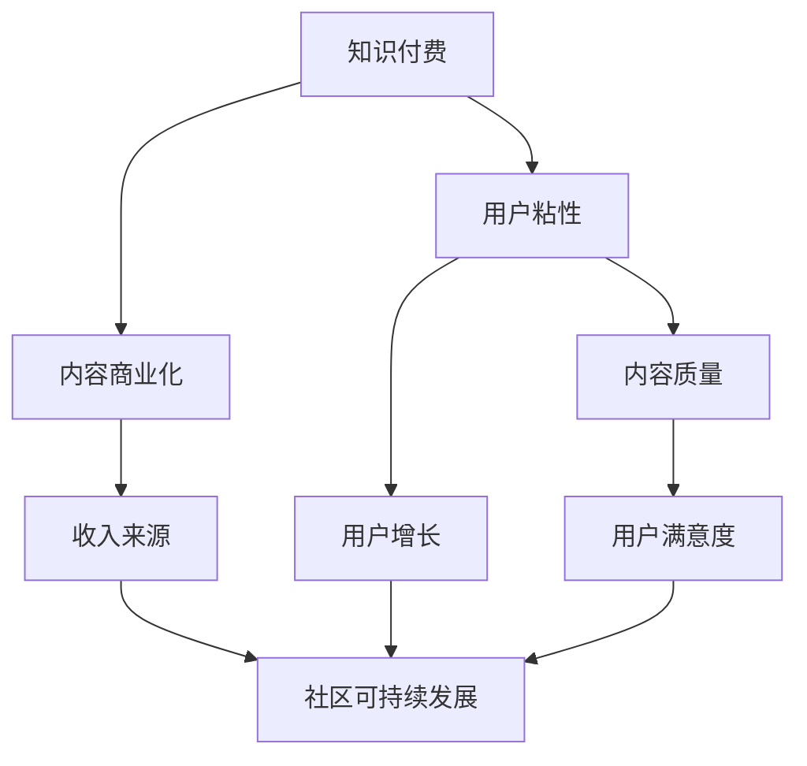

                 

# 知识付费与技术社区运营的融合之道

> 关键词：知识付费、技术社区、运营策略、用户增长、内容质量、互动机制、商业模式

> 摘要：本文旨在探讨知识付费与技术社区运营的融合之道，通过深入分析知识付费的核心概念、技术社区的运营策略、核心算法原理及实际案例，为技术社区的运营者提供一套系统性的解决方案。本文将从背景介绍、核心概念与联系、核心算法原理与具体操作步骤、数学模型与公式、项目实战、实际应用场景、工具和资源推荐、总结与未来发展趋势、常见问题与解答、扩展阅读与参考资料等多方面进行详细阐述。

## 1. 背景介绍

随着互联网技术的飞速发展，知识付费已经成为一种新的商业模式。用户愿意为高质量的内容付费，而内容提供者则通过知识付费平台获取收益。与此同时，技术社区作为知识分享的重要平台，其运营策略也在不断进化。本文将探讨如何将知识付费与技术社区运营相结合，实现双赢的局面。

## 2. 核心概念与联系

### 2.1 知识付费

知识付费是指用户为获取特定领域的高质量内容而支付费用的一种商业模式。它强调内容的质量和价值，通过付费墙、订阅制、会员制等方式实现盈利。

### 2.2 技术社区

技术社区是指一群具有共同兴趣和技术背景的人聚集在一起，分享知识、交流经验、解决问题的平台。技术社区通常具有活跃的讨论氛围、高质量的内容和强大的用户粘性。

### 2.3 知识付费与技术社区的联系

知识付费与技术社区的结合，可以实现内容的商业化和社区的可持续发展。通过知识付费，技术社区可以获取稳定的收入来源，同时提高内容的质量和用户粘性。反之，高质量的内容和活跃的社区氛围也有助于吸引更多用户付费。

### 2.4 Mermaid 流程图



## 3. 核心算法原理 & 具体操作步骤

### 3.1 内容推荐算法

内容推荐算法是知识付费与技术社区运营的核心之一。通过分析用户的行为数据，推荐与其兴趣相符的内容，提高用户满意度和粘性。

#### 3.1.1 用户行为分析

用户行为分析是内容推荐的基础。通过对用户浏览、搜索、点赞、评论等行为数据进行分析，可以了解用户的兴趣偏好。

#### 3.1.2 内容相似度计算

内容相似度计算是推荐算法的关键步骤。通过计算用户关注的内容与其他内容的相似度，可以推荐相似的内容给用户。

#### 3.1.3 推荐算法实现

推荐算法可以采用协同过滤、基于内容的推荐、深度学习等方法。以下是一个基于内容的推荐算法的实现步骤：

```python
def content_based_recommendation(user_id, user_history, content_similarity):
    # 获取用户历史行为
    user_history = get_user_history(user_id)
    
    # 计算内容相似度
    content_similarity = calculate_content_similarity(user_history, content_similarity)
    
    # 推荐相似内容
    recommended_content = recommend_similar_content(user_history, content_similarity)
    
    return recommended_content
```

### 3.2 用户增长算法

用户增长算法是技术社区运营的关键之一。通过分析用户增长的瓶颈，采取相应的策略，实现用户数量的持续增长。

#### 3.2.1 用户增长瓶颈分析

用户增长瓶颈通常包括用户获取、用户留存、用户活跃度等方面。通过对这些瓶颈进行分析，可以找到问题所在并采取相应的策略。

#### 3.2.2 用户增长策略

用户增长策略可以采用多种方法，如SEO优化、社交媒体推广、内容营销等。以下是一个基于内容营销的用户增长策略实现步骤：

```python
def content_marketing(user_id, content_list):
    # 获取用户兴趣偏好
    user_interest = get_user_interest(user_id)
    
    # 生成相关内容
    related_content = generate_related_content(user_interest, content_list)
    
    # 发布相关内容
    publish_content(related_content)
    
    return related_content
```

## 4. 数学模型和公式 & 详细讲解 & 举例说明

### 4.1 内容推荐算法的数学模型

内容推荐算法的数学模型可以采用协同过滤、基于内容的推荐、深度学习等方法。以下是一个基于内容的推荐算法的数学模型：

$$
\text{推荐内容} = \text{相似度} \times \text{内容质量}
$$

其中，相似度是指用户关注的内容与其他内容的相似度，内容质量是指内容的质量评分。

### 4.2 用户增长算法的数学模型

用户增长算法的数学模型可以采用多种方法，如SEO优化、社交媒体推广、内容营销等。以下是一个基于内容营销的用户增长算法的数学模型：

$$
\text{用户增长} = \text{内容质量} \times \text{用户兴趣偏好}
$$

其中，内容质量是指内容的质量评分，用户兴趣偏好是指用户对内容的兴趣程度。

### 4.3 举例说明

假设有一个技术社区，用户A对Python编程感兴趣。通过分析用户A的历史行为数据，可以发现他经常浏览Python编程相关的文章。通过对这些文章进行内容相似度计算，可以推荐相似的Python编程文章给用户A。同时，通过分析用户A的兴趣偏好，可以生成与Python编程相关的高质量内容，并发布到社区中，吸引更多用户关注和参与。

## 5. 项目实战：代码实际案例和详细解释说明

### 5.1 开发环境搭建

为了实现知识付费与技术社区运营的融合，我们需要搭建一个完整的开发环境。以下是一个基于Python的开发环境搭建步骤：

1. 安装Python环境
2. 安装必要的库，如pandas、numpy、scikit-learn等
3. 配置数据库，如MySQL、MongoDB等
4. 配置服务器，如Nginx、Apache等

### 5.2 源代码详细实现和代码解读

以下是一个基于内容推荐算法的源代码实现：

```python
import pandas as pd
from sklearn.metrics.pairwise import cosine_similarity

# 读取用户历史行为数据
user_history = pd.read_csv('user_history.csv')

# 读取内容相似度数据
content_similarity = pd.read_csv('content_similarity.csv')

# 计算内容相似度
content_similarity = cosine_similarity(content_similarity)

# 推荐相似内容
def recommend_similar_content(user_id, content_similarity):
    # 获取用户历史行为
    user_history = user_history[user_history['user_id'] == user_id]
    
    # 计算内容相似度
    content_similarity = content_similarity[user_history['content_id']]
    
    # 推荐相似内容
    recommended_content = content_similarity.argsort()[-10:][::-1]
    
    return recommended_content

# 测试推荐算法
user_id = 1
recommended_content = recommend_similar_content(user_id, content_similarity)
print(recommended_content)
```

### 5.3 代码解读与分析

上述代码实现了一个基于内容推荐算法的源代码。首先，读取用户历史行为数据和内容相似度数据。然后，计算内容相似度。最后，推荐相似内容。通过测试推荐算法，可以验证其效果。

## 6. 实际应用场景

知识付费与技术社区运营的融合在多个领域都有广泛的应用。以下是一些实际应用场景：

1. 技术论坛：通过知识付费，技术论坛可以获取稳定的收入来源，同时提高内容的质量和用户粘性。
2. 技术博客：通过知识付费，技术博客可以吸引更多的高质量内容创作者，提高用户满意度和粘性。
3. 技术培训：通过知识付费，技术培训可以获取稳定的收入来源，同时提高教学质量。

## 7. 工具和资源推荐

### 7.1 学习资源推荐

1. 书籍：《知识付费：从零开始的商业模式》、《技术社区运营实战》
2. 论文：《知识付费的商业模式与实践》、《技术社区运营策略研究》
3. 博客：知乎、CSDN、掘金
4. 网站：GitHub、Stack Overflow

### 7.2 开发工具框架推荐

1. 数据库：MySQL、MongoDB
2. 服务器：Nginx、Apache
3. 框架：Django、Flask

### 7.3 相关论文著作推荐

1. 《知识付费的商业模式与实践》
2. 《技术社区运营策略研究》

## 8. 总结：未来发展趋势与挑战

知识付费与技术社区运营的融合在未来将有更广阔的发展空间。一方面，随着技术的发展，知识付费和社区运营的手段将更加多样化。另一方面，用户对高质量内容的需求将不断提高，对内容的质量和价值提出了更高的要求。然而，这也带来了新的挑战，如如何保证内容的质量和价值，如何提高用户的满意度和粘性等。

## 9. 附录：常见问题与解答

### 9.1 问题：如何保证内容的质量和价值？

答：可以通过严格的审核机制和用户反馈机制来保证内容的质量和价值。同时，可以通过用户评价和评分来提高内容的质量和价值。

### 9.2 问题：如何提高用户的满意度和粘性？

答：可以通过提供高质量的内容、优化用户体验、增加互动机制等方式来提高用户的满意度和粘性。

## 10. 扩展阅读 & 参考资料

1. 《知识付费：从零开始的商业模式》
2. 《技术社区运营实战》
3. 《知识付费的商业模式与实践》
4. 《技术社区运营策略研究》

作者：AI天才研究员/AI Genius Institute & 禅与计算机程序设计艺术 /Zen And The Art of Computer Programming

