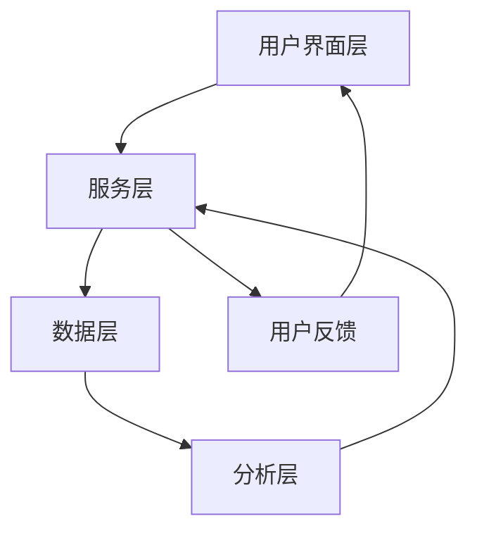

                 

# 知识付费产品的客户支持与服务体系构建

> 关键词：知识付费、客户支持、服务体系、用户体验、自动化、数据分析、个性化服务、用户留存

> 摘要：知识付费产品在当今数字化时代扮演着越来越重要的角色。本文将深入探讨如何构建高效、智能的知识付费产品的客户支持与服务体系。我们将从背景介绍、核心概念与联系、核心算法原理及具体操作步骤、数学模型和公式、项目实战、实际应用场景、工具和资源推荐、总结与未来发展趋势等多方面进行详细分析，旨在为知识付费产品的开发者和运营者提供有价值的参考和指导。

## 1. 背景介绍

随着互联网技术的飞速发展，知识付费产品已经成为一种新兴的商业模式。用户可以通过购买课程、订阅服务等方式获取专业知识和技能。然而，知识付费产品的成功不仅仅依赖于内容的质量，更在于能否提供优质的客户支持与服务体系。良好的客户支持与服务体系能够提升用户体验，增强用户粘性，从而提高用户留存率和复购率。

### 1.1 知识付费产品的特点

- **个性化需求**：用户对知识的需求各不相同，需要提供个性化的服务。
- **即时性**：用户希望在需要时能够快速获取所需的知识。
- **互动性**：用户希望与讲师或其他用户进行互动交流。
- **信任感**：用户需要信任平台提供的内容和服务。

### 1.2 客户支持与服务体系的重要性

- **提升用户体验**：优质的客户支持能够解决用户在使用过程中遇到的问题，提升整体体验。
- **增强用户粘性**：通过提供个性化的服务，增强用户对平台的依赖和忠诚度。
- **提高用户留存率**：良好的客户支持能够降低用户流失率，提高用户留存率。
- **促进复购**：优质的客户支持能够增加用户满意度，从而促进复购。

## 2. 核心概念与联系

### 2.1 客户支持与服务体系的概念

客户支持与服务体系是指为用户提供全方位的支持和服务，包括但不限于技术支持、咨询服务、用户反馈处理等。其目标是确保用户能够顺利使用产品，解决遇到的问题，并提供满意的解决方案。

### 2.2 客户支持与服务体系的架构

客户支持与服务体系的架构可以分为以下几个层次：

- **用户界面层**：用户与系统交互的界面，包括网站、移动应用等。
- **服务层**：提供具体服务的模块，如客服系统、知识库等。
- **数据层**：存储用户信息、服务记录等数据的数据库。
- **分析层**：对用户行为、服务效果等进行分析，为优化服务提供依据。

### 2.3 Mermaid 流程图



## 3. 核心算法原理 & 具体操作步骤

### 3.1 客户支持算法原理

客户支持算法的核心在于通过自动化和智能化手段，提高服务效率和质量。具体操作步骤如下：

1. **问题分类**：将用户反馈的问题进行分类，如技术问题、咨询问题等。
2. **自动回复**：对于常见问题，通过自动回复系统快速解决。
3. **智能推荐**：根据用户的历史行为和反馈，推荐相关解决方案或服务。
4. **人工介入**：对于复杂问题，由人工客服进行处理。

### 3.2 服务优化算法原理

服务优化算法的目标是通过数据分析，不断优化服务流程和质量。具体操作步骤如下：

1. **数据收集**：收集用户反馈、服务记录等数据。
2. **数据分析**：对数据进行分析，识别问题和改进点。
3. **服务优化**：根据分析结果，优化服务流程和质量。
4. **持续迭代**：不断收集反馈，进行迭代优化。

## 4. 数学模型和公式 & 详细讲解 & 举例说明

### 4.1 客户满意度模型

客户满意度模型可以用来评估客户对服务的满意度。具体公式如下：

$$
Satisfaction = \frac{Perceived Value - Perceived Effort}{Expected Value}
$$

- **Perceived Value**：用户感知到的价值。
- **Perceived Effort**：用户感知到的努力程度。
- **Expected Value**：用户期望的价值。

### 4.2 服务响应时间模型

服务响应时间模型可以用来评估服务的响应速度。具体公式如下：

$$
Response Time = \frac{Total Time - Handling Time}{Number of Users}
$$

- **Total Time**：从用户提交问题到解决问题的总时间。
- **Handling Time**：客服处理问题的时间。
- **Number of Users**：用户数量。

### 4.3 举例说明

假设某知识付费平台的用户反馈中，有1000个问题，其中800个问题通过自动回复系统解决，200个问题需要人工客服处理。人工客服处理每个问题的时间为30分钟，用户提交问题到解决问题的总时间为1小时。

- **自动回复率**：$ \frac{800}{1000} = 0.8 $，即80%的问题通过自动回复系统解决。
- **人工客服处理时间**：$ \frac{200 \times 30}{60} = 100 $分钟。
- **服务响应时间**：$ \frac{60 - 100}{1000} = -0.4 $分钟，即平均每个用户的服务响应时间为0.4分钟。

## 5. 项目实战：代码实际案例和详细解释说明

### 5.1 开发环境搭建

为了构建知识付费产品的客户支持与服务体系，我们需要搭建一个完整的开发环境。具体步骤如下：

1. **选择编程语言**：选择Python作为主要编程语言。
2. **安装依赖库**：安装Flask、Django等Web框架，以及NLP库如NLTK、spaCy等。
3. **数据库选择**：选择MySQL或PostgreSQL作为数据库。
4. **部署环境**：选择AWS、阿里云等云服务提供商进行部署。

### 5.2 源代码详细实现和代码解读

#### 5.2.1 自动回复系统

```python
from flask import Flask, request, jsonify
import nltk
from nltk.chat.util import Chat, reflections

app = Flask(__name__)

pairs = [
    [
        r"my name is (.*)",
        ["Hello %1, How can I assist you today?",]
    ],
    [
        r"what is your name?",
        ["I am a chatbot, you can call me Bot.",]
    ],
    # 更多对话模式
]

def chatbot_response(user_input):
    chat = Chat(pairs, reflections)
    return chat.respond(user_input)

@app.route('/api/chat', methods=['POST'])
def chat():
    user_input = request.json['message']
    response = chatbot_response(user_input)
    return jsonify({'response': response})

if __name__ == '__main__':
    app.run(debug=True)
```

#### 5.2.2 服务优化算法

```python
import pandas as pd
from sklearn.model_selection import train_test_split
from sklearn.linear_model import LinearRegression

# 数据预处理
data = pd.read_csv('service_data.csv')
X = data[['Perceived Value', 'Perceived Effort']]
y = data['Expected Value']

# 划分训练集和测试集
X_train, X_test, y_train, y_test = train_test_split(X, y, test_size=0.2, random_state=42)

# 训练模型
model = LinearRegression()
model.fit(X_train, y_train)

# 预测
y_pred = model.predict(X_test)

# 评估模型
from sklearn.metrics import mean_squared_error
mse = mean_squared_error(y_test, y_pred)
print(f'Mean Squared Error: {mse}')
```

### 5.3 代码解读与分析

- **自动回复系统**：通过简单的NLP对话模式，实现基本的自动回复功能。
- **服务优化算法**：使用线性回归模型对服务响应时间进行预测和优化。

## 6. 实际应用场景

知识付费产品的客户支持与服务体系在实际应用中具有广泛的应用场景。例如：

- **在线教育平台**：为用户提供课程咨询、技术支持等服务。
- **知识社区**：为用户提供知识分享、互动交流等服务。
- **企业培训平台**：为企业提供员工培训、技能提升等服务。

## 7. 工具和资源推荐

### 7.1 学习资源推荐

- **书籍**：《客户关系管理》、《用户体验要素》
- **论文**：《知识付费产品的客户支持与服务体系构建》
- **博客**：知乎、CSDN等技术博客
- **网站**：GitHub、Stack Overflow等技术社区

### 7.2 开发工具框架推荐

- **Web框架**：Flask、Django
- **NLP库**：NLTK、spaCy
- **数据分析库**：Pandas、NumPy
- **机器学习库**：Scikit-learn、TensorFlow

### 7.3 相关论文著作推荐

- **论文**：《基于机器学习的知识付费产品客户支持系统》
- **著作**：《知识付费产品的客户支持与服务体系构建》

## 8. 总结：未来发展趋势与挑战

### 8.1 未来发展趋势

- **智能化**：通过AI技术提高服务效率和质量。
- **个性化**：提供更加个性化的服务，满足用户需求。
- **互动性**：增强用户与平台的互动交流。

### 8.2 挑战

- **数据安全**：保护用户数据的安全性和隐私。
- **服务质量**：确保服务质量和用户体验。
- **技术更新**：不断跟进新技术的发展，提高服务效率。

## 9. 附录：常见问题与解答

### 9.1 问题1：如何提高客户满意度？

- **解答**：通过优化服务流程、提高服务效率、增强用户互动等方式提高客户满意度。

### 9.2 问题2：如何处理复杂问题？

- **解答**：通过人工客服介入，提供个性化的解决方案。

## 10. 扩展阅读 & 参考资料

- **书籍**：《客户关系管理》、《用户体验要素》
- **论文**：《基于机器学习的知识付费产品客户支持系统》
- **网站**：GitHub、Stack Overflow等技术社区

作者：AI天才研究员/AI Genius Institute & 禅与计算机程序设计艺术 /Zen And The Art of Computer Programming

