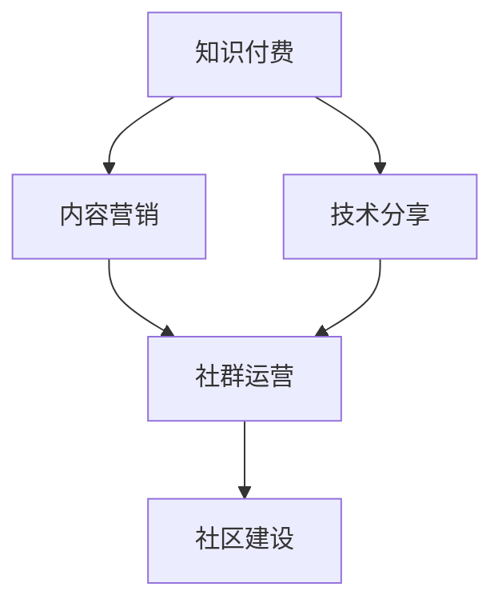

                 

# 知识付费：程序员的社群运营指导

> 关键词：知识付费，社群运营，程序员，技术分享，社区建设，内容营销

> 摘要：本文旨在探讨程序员如何通过知识付费的方式进行社群运营，从背景介绍、核心概念与联系、核心算法原理与操作步骤、数学模型和公式、项目实战、实际应用场景、工具和资源推荐、未来发展趋势与挑战、常见问题与解答以及扩展阅读与参考资料等多个维度进行深入分析。通过本文，读者可以全面了解知识付费在程序员社群运营中的应用，掌握社群运营的核心技巧，为自己的技术分享之路提供指导。

## 1. 背景介绍

### 1.1 知识付费的兴起

随着互联网技术的发展，知识付费逐渐成为一种新的商业模式。知识付费是指用户通过支付一定费用来获取知识、技能或服务的一种模式。这种模式不仅为知识提供者提供了新的收入来源，也为用户提供了更加便捷、高效的学习途径。对于程序员而言，知识付费不仅可以帮助他们分享自己的技术经验，还能通过这种方式获得一定的经济回报。

### 1.2 社群运营的重要性

社群运营是指通过一定的策略和手段，对社群进行管理和维护，以达到提高社群活跃度、增强社群凝聚力的目的。对于程序员来说，社群不仅是技术交流的平台，也是个人品牌建设的重要渠道。通过有效的社群运营，程序员可以更好地展示自己的技术实力，扩大自己的影响力。

### 1.3 知识付费与社群运营的结合

将知识付费与社群运营相结合，可以实现知识的高效传播和价值最大化。通过社群运营，可以吸引更多的用户关注和参与，从而提高知识付费产品的销量。同时，知识付费也可以为社群运营提供更多的资源和支持，帮助社群更好地发展。

## 2. 核心概念与联系

### 2.1 核心概念

- **知识付费**：用户通过支付一定费用来获取知识、技能或服务。
- **社群运营**：通过一定的策略和手段，对社群进行管理和维护。
- **技术分享**：程序员通过各种方式分享自己的技术知识和经验。
- **社区建设**：通过社群运营，建立一个活跃、健康的社区环境。
- **内容营销**：通过高质量的内容吸引和留住用户。

### 2.2 联系

知识付费与社群运营之间存在着密切的联系。知识付费可以为社群运营提供内容支持，而社群运营则可以为知识付费产品提供用户基础。两者相辅相成，共同促进社群的发展。

### 2.3 核心概念原理和架构的 Mermaid 流程图



## 3. 核心算法原理 & 具体操作步骤

### 3.1 核心算法原理

知识付费的核心算法原理在于如何通过有效的营销策略吸引用户，并通过高质量的内容留住用户。社群运营的核心算法原理在于如何通过有效的管理手段提高社群的活跃度和凝聚力。

### 3.2 具体操作步骤

#### 3.2.1 确定目标用户群体

首先，需要明确目标用户群体，了解他们的需求和兴趣点，以便提供更加精准的内容和服务。

#### 3.2.2 制定内容策略

根据目标用户群体的需求，制定相应的内容策略，包括内容的主题、形式、频率等。

#### 3.2.3 建立社群

选择合适的社群平台，建立自己的社群，并制定相应的社群规则。

#### 3.2.4 内容营销

通过各种渠道推广自己的内容，吸引用户关注和参与。

#### 3.2.5 社群运营

通过定期发布内容、组织活动等方式，提高社群的活跃度和凝聚力。

#### 3.2.6 数据分析

通过数据分析，了解用户的行为和反馈，不断优化内容和服务。

## 4. 数学模型和公式 & 详细讲解 & 举例说明

### 4.1 数学模型和公式

#### 4.1.1 用户增长模型

$$
\frac{dN}{dt} = rN\left(1 - \frac{N}{K}\right)
$$

其中，$N$ 表示用户数量，$r$ 表示增长速率，$K$ 表示环境容量。

#### 4.1.2 用户留存率模型

$$
L(t) = e^{-\lambda t}
$$

其中，$L(t)$ 表示在时间 $t$ 时的用户留存率，$\lambda$ 表示用户流失率。

### 4.2 详细讲解

用户增长模型描述了用户数量随时间的变化规律，而用户留存率模型则描述了用户留存率随时间的变化规律。通过这两个模型，可以更好地了解用户的行为和反馈，从而优化内容和服务。

### 4.3 举例说明

假设一个社群在初始时有1000名用户，增长速率为0.1，环境容量为10000。则用户数量随时间的变化规律可以表示为：

$$
\frac{dN}{dt} = 0.1N\left(1 - \frac{N}{10000}\right)
$$

假设用户流失率为0.05，则用户留存率随时间的变化规律可以表示为：

$$
L(t) = e^{-0.05t}
$$

## 5. 项目实战：代码实际案例和详细解释说明

### 5.1 开发环境搭建

#### 5.1.1 选择开发工具

选择合适的开发工具，如Python、Node.js等。

#### 5.1.2 安装必要的库

安装必要的库，如Flask、Django等。

#### 5.1.3 配置数据库

配置数据库，如MySQL、MongoDB等。

### 5.2 源代码详细实现和代码解读

#### 5.2.1 用户增长模型实现

```python
import numpy as np
import matplotlib.pyplot as plt

def user_growth_model(N0, r, K, t):
    N = N0 * np.exp(r * t) / (K + N0 * (np.exp(r * t) - 1) / K)
    return N

t = np.linspace(0, 10, 100)
N0 = 1000
r = 0.1
K = 10000

plt.plot(t, user_growth_model(N0, r, K, t))
plt.xlabel('Time')
plt.ylabel('Number of Users')
plt.title('User Growth Model')
plt.show()
```

#### 5.2.2 用户留存率模型实现

```python
import numpy as np
import matplotlib.pyplot as plt

def user_retention_model(lambda_, t):
    L = np.exp(-lambda_ * t)
    return L

t = np.linspace(0, 10, 100)
lambda_ = 0.05

plt.plot(t, user_retention_model(lambda_, t))
plt.xlabel('Time')
plt.ylabel('User Retention Rate')
plt.title('User Retention Model')
plt.show()
```

### 5.3 代码解读与分析

通过上述代码，可以实现用户增长模型和用户留存率模型的可视化。通过这两个模型，可以更好地了解用户的行为和反馈，从而优化内容和服务。

## 6. 实际应用场景

### 6.1 技术分享平台

技术分享平台是知识付费与社群运营相结合的一个典型应用场景。通过技术分享平台，程序员可以分享自己的技术知识和经验，吸引更多的用户关注和参与。

### 6.2 技术社区

技术社区是另一个典型的应用场景。通过技术社区，程序员可以建立自己的社群，通过定期发布内容、组织活动等方式，提高社群的活跃度和凝聚力。

## 7. 工具和资源推荐

### 7.1 学习资源推荐

- 书籍：《程序员的自我修养》、《深入浅出Node.js》
- 论文：《基于知识付费的社群运营策略研究》
- 博客：《程序员的日常》
- 网站：GitHub、Stack Overflow

### 7.2 开发工具框架推荐

- Python：Flask、Django
- Node.js：Express、Koa

### 7.3 相关论文著作推荐

- 《基于知识付费的社群运营策略研究》
- 《知识付费与社群运营的结合研究》

## 8. 总结：未来发展趋势与挑战

### 8.1 未来发展趋势

随着互联网技术的发展，知识付费与社群运营的结合将会越来越紧密。未来，知识付费将会更加多样化，社群运营将会更加智能化。

### 8.2 面临的挑战

知识付费与社群运营的结合也面临着一些挑战，如如何提高内容的质量、如何提高用户的留存率等。未来，需要通过不断的技术创新和管理优化，来应对这些挑战。

## 9. 附录：常见问题与解答

### 9.1 什么是知识付费？

知识付费是指用户通过支付一定费用来获取知识、技能或服务的一种模式。

### 9.2 什么是社群运营？

社群运营是指通过一定的策略和手段，对社群进行管理和维护，以达到提高社群活跃度、增强社群凝聚力的目的。

### 9.3 如何提高用户的留存率？

可以通过提供高质量的内容、定期发布内容、组织活动等方式，提高用户的留存率。

## 10. 扩展阅读 & 参考资料

- 书籍：《程序员的自我修养》、《深入浅出Node.js》
- 论文：《基于知识付费的社群运营策略研究》
- 博客：《程序员的日常》
- 网站：GitHub、Stack Overflow

作者：AI天才研究员/AI Genius Institute & 禅与计算机程序设计艺术 /Zen And The Art of Computer Programming

