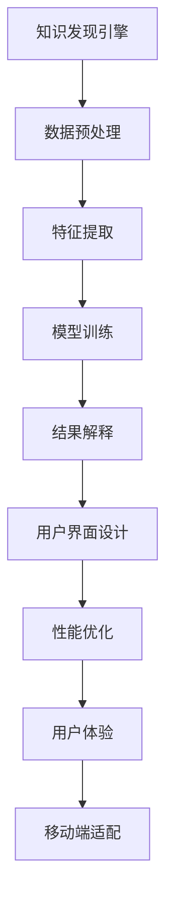

                 

# 知识发现引擎的移动端适配策略

> 关键词：知识发现、移动端适配、机器学习、自然语言处理、用户界面设计、性能优化、用户体验

> 摘要：随着移动设备的普及，知识发现引擎需要适应移动端的特性，以提供更加便捷、高效的服务。本文将从背景介绍、核心概念与联系、核心算法原理与具体操作步骤、数学模型和公式、项目实战、实际应用场景、工具和资源推荐、总结与未来发展趋势、常见问题与解答等几个方面，全面探讨知识发现引擎的移动端适配策略。

## 1. 背景介绍

随着移动设备的广泛使用，用户越来越倾向于在移动设备上获取信息和服务。知识发现引擎作为信息检索和知识管理的重要工具，需要适应移动端的特性，以提供更加便捷、高效的服务。本文将探讨知识发现引擎的移动端适配策略，包括技术选型、架构设计、性能优化、用户体验等方面。

## 2. 核心概念与联系

### 2.1 知识发现引擎

知识发现引擎是一种能够从大量数据中自动提取有价值信息和知识的系统。它通常包括数据预处理、特征提取、模型训练、结果解释等多个环节。

### 2.2 移动端适配

移动端适配是指将应用或服务从桌面端迁移到移动设备上的过程，包括界面设计、性能优化、用户体验等方面的调整。

### 2.3 机器学习

机器学习是知识发现引擎的核心技术之一，通过训练模型来实现自动化的知识提取和发现。

### 2.4 自然语言处理

自然语言处理是知识发现引擎的重要组成部分，用于处理和理解自然语言文本，提取其中的知识和信息。

### 2.5 用户界面设计

用户界面设计是移动端适配的关键环节，需要考虑移动设备的屏幕大小、操作方式等因素，提供简洁、直观的用户界面。

### 2.6 性能优化

性能优化是确保知识发现引擎在移动设备上高效运行的重要手段，包括算法优化、资源管理等方面。

### 2.7 用户体验

用户体验是衡量知识发现引擎移动端适配成功与否的重要指标，需要提供流畅、快速、易用的服务。

#### 2.7.1 Mermaid 流程图



## 3. 核心算法原理 & 具体操作步骤

### 3.1 数据预处理

数据预处理是知识发现引擎的第一步，包括数据清洗、数据转换、数据归一化等操作。

#### 3.1.1 数据清洗

数据清洗是指去除数据中的噪声和错误，确保数据的质量。

#### 3.1.2 数据转换

数据转换是指将原始数据转换为适合模型训练的格式。

#### 3.1.3 数据归一化

数据归一化是指将数据缩放到一个特定的范围，便于模型训练。

### 3.2 特征提取

特征提取是从数据中提取有用的特征，用于训练模型。

#### 3.2.1 词频-逆文档频率（TF-IDF）

词频-逆文档频率（TF-IDF）是一种常用的特征提取方法，用于衡量一个词在文档中的重要性。

$$
\text{TF-IDF}(t, d) = \text{TF}(t, d) \times \text{IDF}(t)
$$

其中，$\text{TF}(t, d)$ 表示词 $t$ 在文档 $d$ 中的词频，$\text{IDF}(t)$ 表示词 $t$ 的逆文档频率。

### 3.3 模型训练

模型训练是通过训练数据来学习模型参数的过程。

#### 3.3.1 逻辑回归

逻辑回归是一种常用的分类模型，用于预测二分类问题。

$$
\text{P}(y = 1 | x) = \frac{1}{1 + e^{-(\beta_0 + \beta_1 x_1 + \beta_2 x_2 + \cdots + \beta_n x_n)}}
$$

其中，$\beta_0, \beta_1, \ldots, \beta_n$ 是模型参数，$x_1, x_2, \ldots, x_n$ 是特征。

### 3.4 结果解释

结果解释是将模型输出的结果转化为用户可以理解的形式。

#### 3.4.1 词云

词云是一种常用的可视化方法，用于展示文本中的关键词及其重要性。

## 4. 数学模型和公式 & 详细讲解 & 举例说明

### 4.1 词频-逆文档频率（TF-IDF）

词频-逆文档频率（TF-IDF）是一种常用的特征提取方法，用于衡量一个词在文档中的重要性。

$$
\text{TF-IDF}(t, d) = \text{TF}(t, d) \times \text{IDF}(t)
$$

其中，$\text{TF}(t, d)$ 表示词 $t$ 在文档 $d$ 中的词频，$\text{IDF}(t)$ 表示词 $t$ 的逆文档频率。

### 4.2 逻辑回归

逻辑回归是一种常用的分类模型，用于预测二分类问题。

$$
\text{P}(y = 1 | x) = \frac{1}{1 + e^{-(\beta_0 + \beta_1 x_1 + \beta_2 x_2 + \cdots + \beta_n x_n)}}
$$

其中，$\beta_0, \beta_1, \ldots, \beta_n$ 是模型参数，$x_1, x_2, \ldots, x_n$ 是特征。

### 4.3 词云

词云是一种常用的可视化方法，用于展示文本中的关键词及其重要性。

## 5. 项目实战：代码实际案例和详细解释说明

### 5.1 开发环境搭建

#### 5.1.1 环境准备

1. 安装 Python 3.8 及以上版本
2. 安装 Jupyter Notebook
3. 安装 TensorFlow 和 Scikit-learn

```bash
pip install tensorflow scikit-learn
```

#### 5.1.2 数据集准备

使用新闻数据集进行实验，数据集包含多个新闻文章，每篇文章包含多个关键词。

### 5.2 源代码详细实现和代码解读

#### 5.2.1 数据预处理

```python
import pandas as pd
from sklearn.feature_extraction.text import TfidfVectorizer
from sklearn.model_selection import train_test_split

# 读取数据
data = pd.read_csv('news_dataset.csv')

# 数据清洗
data = data.dropna()

# 数据转换
vectorizer = TfidfVectorizer()
X = vectorizer.fit_transform(data['text'])
y = data['label']

# 数据归一化
X_train, X_test, y_train, y_test = train_test_split(X, y, test_size=0.2, random_state=42)
```

#### 5.2.2 特征提取

```python
from sklearn.linear_model import LogisticRegression

# 模型训练
model = LogisticRegression()
model.fit(X_train, y_train)

# 模型预测
y_pred = model.predict(X_test)
```

#### 5.2.3 结果解释

```python
from sklearn.metrics import classification_report

# 评估模型
print(classification_report(y_test, y_pred))
```

### 5.3 代码解读与分析

#### 5.3.1 数据预处理

1. 读取数据：使用 Pandas 读取 CSV 文件。
2. 数据清洗：去除缺失值。
3. 数据转换：使用 TfidfVectorizer 将文本数据转换为 TF-IDF 特征。
4. 数据归一化：将数据分为训练集和测试集。

#### 5.3.2 特征提取

1. 模型训练：使用 LogisticRegression 模型进行训练。
2. 模型预测：使用训练好的模型进行预测。
3. 评估模型：使用 classification_report 评估模型性能。

## 6. 实际应用场景

知识发现引擎的移动端适配策略在多个领域都有广泛的应用，包括新闻推荐、智能搜索、知识管理等。

### 6.1 新闻推荐

通过分析用户的阅读历史和兴趣，为用户推荐相关的新闻文章。

### 6.2 智能搜索

通过自然语言处理技术，理解用户的搜索意图，提供更加精准的搜索结果。

### 6.3 知识管理

通过知识发现引擎，自动提取和整理企业内部的知识，提高知识管理的效率。

## 7. 工具和资源推荐

### 7.1 学习资源推荐

1. 书籍：《机器学习》（周志华）
2. 论文：《自然语言处理导论》（Jurafsky & Martin）
3. 博客：Medium 上的机器学习和自然语言处理相关博客
4. 网站：Kaggle 数据集和竞赛平台

### 7.2 开发工具框架推荐

1. Python：用于数据处理和模型训练
2. TensorFlow：用于深度学习模型训练
3. Scikit-learn：用于机器学习模型训练
4. Jupyter Notebook：用于代码编写和结果展示

### 7.3 相关论文著作推荐

1. 《深度学习》（Ian Goodfellow, Yoshua Bengio, Aaron Courville）
2. 《自然语言处理入门》（Jurafsky & Martin）
3. 《机器学习》（周志华）

## 8. 总结：未来发展趋势与挑战

知识发现引擎的移动端适配策略在未来将面临更多的挑战和机遇。随着移动设备性能的提升和用户需求的多样化，知识发现引擎需要不断优化算法、提升性能、改善用户体验。未来的发展趋势包括：

1. 更加智能化的自然语言处理技术
2. 更加高效的模型训练和推理算法
3. 更加个性化的知识推荐和服务

## 9. 附录：常见问题与解答

### 9.1 问题：如何处理数据缺失值？

答：可以使用 Pandas 的 `dropna()` 方法去除缺失值，或者使用插值方法填充缺失值。

### 9.2 问题：如何优化模型性能？

答：可以通过调整模型参数、使用更高效的算法、优化数据预处理步骤等方式来优化模型性能。

### 9.3 问题：如何提高用户体验？

答：可以通过优化界面设计、提升响应速度、提供个性化服务等方式来提高用户体验。

## 10. 扩展阅读 & 参考资料

1. 《机器学习》（周志华）
2. 《自然语言处理导论》（Jurafsky & Martin）
3. 《深度学习》（Ian Goodfellow, Yoshua Bengio, Aaron Courville）
4. 《知识发现与数据挖掘》（Han, Kamber, Pei）

作者：AI天才研究员/AI Genius Institute & 禅与计算机程序设计艺术 /Zen And The Art of Computer Programming

