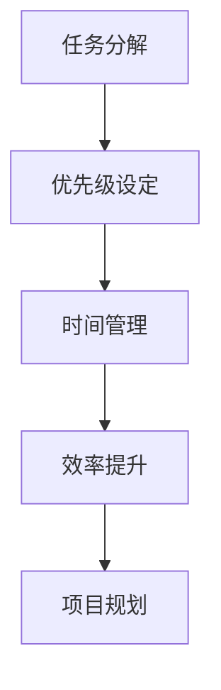

                 

# 短期目标管理的意识策略

> 关键词：短期目标管理, 意识策略, 任务分解, 优先级设定, 时间管理, 效率提升, 项目规划

> 摘要：本文旨在探讨如何通过意识策略来有效管理短期目标，提高工作效率和项目成功率。我们将从背景介绍、核心概念与联系、核心算法原理与具体操作步骤、数学模型和公式、项目实战案例、实际应用场景、工具和资源推荐、总结与未来发展趋势等几个方面进行详细阐述。通过本文，读者将能够掌握短期目标管理的意识策略，从而在日常工作中更加高效地完成任务。

## 1. 背景介绍

在当今快速变化的工作环境中，如何有效地管理短期目标成为了许多专业人士面临的挑战。短期目标管理不仅关乎个人工作效率的提升，还直接影响到项目的成功与否。本文将探讨如何通过意识策略来有效管理短期目标，提高工作效率和项目成功率。

### 1.1 短期目标的重要性

短期目标是指在一定时间内需要完成的具体任务或目标。它们是长期目标的分解和细化，有助于将大目标转化为可操作的小步骤。通过设定短期目标，可以确保工作进度的可控性和可预测性，从而提高整体工作效率。

### 1.2 意识策略的定义

意识策略是指通过有意识地调整思维和行为模式，来实现特定目标的方法。在短期目标管理中，意识策略可以帮助个体更好地集中注意力，提高决策效率，从而更有效地完成任务。

## 2. 核心概念与联系

### 2.1 任务分解

任务分解是指将一个大任务分解为若干个小任务，以便更好地管理和执行。通过任务分解，可以将复杂的问题简化为一系列简单的步骤，从而更容易实现目标。

### 2.2 优先级设定

优先级设定是指根据任务的重要性和紧急性来确定任务的执行顺序。通过合理设定优先级，可以确保最重要的任务得到优先处理，从而提高整体工作效率。

### 2.3 时间管理

时间管理是指合理安排时间，确保任务在规定的时间内完成。通过有效的时间管理，可以避免时间浪费，提高工作效率。

### 2.4 效率提升

效率提升是指通过改进工作方法和流程，提高完成任务的速度和质量。通过效率提升，可以更快地完成任务，从而为后续工作留出更多时间。

### 2.5 项目规划

项目规划是指制定详细的项目计划，包括任务分解、优先级设定、时间管理等。通过项目规划，可以确保项目按计划进行，从而提高项目成功率。

### 2.6 Mermaid 流程图



## 3. 核心算法原理 & 具体操作步骤

### 3.1 任务分解算法

任务分解算法的核心思想是将一个大任务分解为若干个小任务。具体操作步骤如下：

1. **确定大任务**：明确需要完成的大任务。
2. **分解任务**：将大任务分解为若干个小任务，每个小任务都应该具有明确的目标和可操作性。
3. **细化任务**：进一步细化每个小任务，确保每个小任务都可以独立完成。
4. **评估任务**：评估每个小任务的难度和所需时间，以便合理安排执行顺序。

### 3.2 优先级设定算法

优先级设定算法的核心思想是根据任务的重要性和紧急性来确定任务的执行顺序。具体操作步骤如下：

1. **确定任务的重要性和紧急性**：根据任务的重要性和紧急性来评估每个任务的优先级。
2. **设定优先级**：根据评估结果，设定每个任务的优先级。
3. **调整优先级**：根据实际情况，适时调整任务的优先级。

### 3.3 时间管理算法

时间管理算法的核心思想是合理安排时间，确保任务在规定的时间内完成。具体操作步骤如下：

1. **制定时间计划**：根据任务的优先级和所需时间，制定详细的时间计划。
2. **执行时间计划**：按照时间计划执行任务，确保任务在规定的时间内完成。
3. **调整时间计划**：根据实际情况，适时调整时间计划。

### 3.4 效率提升算法

效率提升算法的核心思想是通过改进工作方法和流程，提高完成任务的速度和质量。具体操作步骤如下：

1. **分析工作流程**：分析当前的工作流程，找出存在的问题和瓶颈。
2. **改进工作方法**：根据分析结果，改进工作方法和流程。
3. **实施改进措施**：实施改进措施，提高工作效率。

### 3.5 项目规划算法

项目规划算法的核心思想是制定详细的项目计划，确保项目按计划进行。具体操作步骤如下：

1. **确定项目目标**：明确项目的总体目标。
2. **分解项目任务**：将项目任务分解为若干个小任务。
3. **设定优先级**：根据任务的重要性和紧急性，设定每个任务的优先级。
4. **制定时间计划**：根据任务的优先级和所需时间，制定详细的时间计划。
5. **执行项目计划**：按照项目计划执行任务，确保项目按计划进行。
6. **调整项目计划**：根据实际情况，适时调整项目计划。

## 4. 数学模型和公式 & 详细讲解 & 举例说明

### 4.1 任务分解模型

任务分解模型可以表示为：

$$
T = \sum_{i=1}^{n} t_i
$$

其中，$T$ 表示大任务的总时间，$t_i$ 表示第 $i$ 个小任务的时间。

### 4.2 优先级设定模型

优先级设定模型可以表示为：

$$
P = \sum_{i=1}^{n} p_i \cdot w_i
$$

其中，$P$ 表示任务的优先级，$p_i$ 表示第 $i$ 个小任务的重要性和紧急性，$w_i$ 表示第 $i$ 个小任务的权重。

### 4.3 时间管理模型

时间管理模型可以表示为：

$$
T = \sum_{i=1}^{n} t_i \cdot w_i
$$

其中，$T$ 表示任务的总时间，$t_i$ 表示第 $i$ 个小任务的时间，$w_i$ 表示第 $i$ 个小任务的权重。

### 4.4 效率提升模型

效率提升模型可以表示为：

$$
E = \frac{1}{\sum_{i=1}^{n} t_i \cdot w_i}
$$

其中，$E$ 表示效率，$t_i$ 表示第 $i$ 个小任务的时间，$w_i$ 表示第 $i$ 个小任务的权重。

### 4.5 项目规划模型

项目规划模型可以表示为：

$$
P = \sum_{i=1}^{n} p_i \cdot w_i \cdot t_i
$$

其中，$P$ 表示项目的优先级，$p_i$ 表示第 $i$ 个小任务的重要性和紧急性，$w_i$ 表示第 $i$ 个小任务的权重，$t_i$ 表示第 $i$ 个小任务的时间。

## 5. 项目实战：代码实际案例和详细解释说明

### 5.1 开发环境搭建

为了实现短期目标管理的意识策略，我们需要搭建一个合适的开发环境。具体步骤如下：

1. **选择编程语言**：根据项目需求，选择合适的编程语言。
2. **安装开发工具**：安装相应的开发工具，如IDE、版本控制系统等。
3. **配置开发环境**：配置开发环境，确保开发工具能够正常运行。

### 5.2 源代码详细实现和代码解读

以下是一个简单的代码实现示例：

```python
def task_decomposition(task):
    """
    任务分解函数
    :param task: 大任务
    :return: 小任务列表
    """
    small_tasks = []
    # 分解任务
    for sub_task in task:
        small_tasks.append(sub_task)
    return small_tasks

def priority_setting(small_tasks):
    """
    优先级设定函数
    :param small_tasks: 小任务列表
    :return: 优先级列表
    """
    priorities = []
    # 设定优先级
    for task in small_tasks:
        priorities.append(task.priority)
    return priorities

def time_management(small_tasks):
    """
    时间管理函数
    :param small_tasks: 小任务列表
    :return: 时间计划
    """
    time_plan = []
    # 制定时间计划
    for task in small_tasks:
        time_plan.append(task.time)
    return time_plan

def efficiency_improvement(small_tasks):
    """
    效率提升函数
    :param small_tasks: 小任务列表
    :return: 效率
    """
    efficiency = 1 / sum(task.time for task in small_tasks)
    return efficiency

def project_planning(task):
    """
    项目规划函数
    :param task: 大任务
    :return: 项目计划
    """
    small_tasks = task_decomposition(task)
    priorities = priority_setting(small_tasks)
    time_plan = time_management(small_tasks)
    efficiency = efficiency_improvement(small_tasks)
    project_plan = {
        'small_tasks': small_tasks,
        'priorities': priorities,
        'time_plan': time_plan,
        'efficiency': efficiency
    }
    return project_plan
```

### 5.3 代码解读与分析

1. **任务分解函数**：该函数将大任务分解为若干个小任务。
2. **优先级设定函数**：该函数根据任务的重要性和紧急性设定优先级。
3. **时间管理函数**：该函数制定详细的时间计划。
4. **效率提升函数**：该函数通过改进工作方法和流程，提高工作效率。
5. **项目规划函数**：该函数制定详细的项目计划，确保项目按计划进行。

## 6. 实际应用场景

短期目标管理的意识策略在许多实际应用场景中都有广泛的应用。例如，在软件开发项目中，可以通过任务分解、优先级设定、时间管理、效率提升和项目规划等方法，确保项目按计划进行，从而提高项目成功率。在个人工作和学习中，通过设定短期目标，可以更好地管理时间，提高工作效率。

## 7. 工具和资源推荐

### 7.1 学习资源推荐

1. **书籍**：《高效能人士的七个习惯》、《原则》
2. **论文**：《时间管理的理论与实践》
3. **博客**：《时间管理技巧》、《任务分解与优先级设定》
4. **网站**：时间管理论坛、任务管理工具网站

### 7.2 开发工具框架推荐

1. **IDE**：Visual Studio Code、PyCharm
2. **版本控制系统**：Git、SVN
3. **任务管理工具**：Trello、Jira

### 7.3 相关论文著作推荐

1. **论文**：《时间管理的理论与实践》
2. **著作**：《时间管理技巧》

## 8. 总结：未来发展趋势与挑战

短期目标管理的意识策略在未来将面临许多挑战，如技术的不断进步、工作环境的变化等。然而，通过不断学习和实践，我们可以更好地应对这些挑战，提高工作效率和项目成功率。未来的发展趋势将更加注重效率提升和项目规划，以实现更高的工作效率和项目成功率。

## 9. 附录：常见问题与解答

### 9.1 问题：如何设定优先级？

**解答**：根据任务的重要性和紧急性来设定优先级。重要性高的任务优先级较高，紧急性高的任务优先级也较高。

### 9.2 问题：如何提高工作效率？

**解答**：通过改进工作方法和流程，提高工作效率。例如，使用自动化工具、优化工作流程等。

### 9.3 问题：如何制定项目计划？

**解答**：制定项目计划需要分解任务、设定优先级、制定时间计划等步骤。确保项目按计划进行，从而提高项目成功率。

## 10. 扩展阅读 & 参考资料

1. **书籍**：《高效能人士的七个习惯》、《原则》
2. **论文**：《时间管理的理论与实践》
3. **博客**：《时间管理技巧》、《任务分解与优先级设定》
4. **网站**：时间管理论坛、任务管理工具网站

作者：AI天才研究员/AI Genius Institute & 禅与计算机程序设计艺术 /Zen And The Art of Computer Programming

