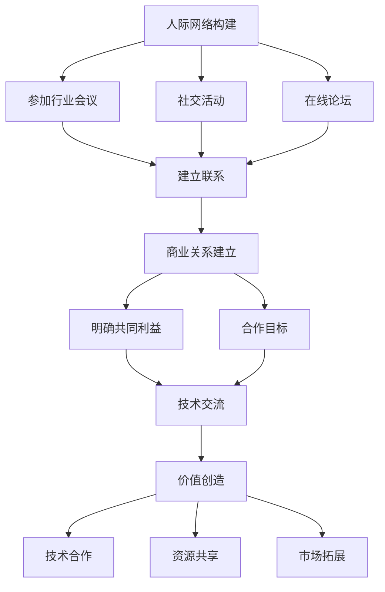

                 

# 程序员创业者的人际网络拓展：建立有价值的商业关系

> 关键词：人际网络、商业关系、创业者、技术交流、合作机会、价值创造

> 摘要：在当今快速变化的商业环境中，程序员创业者的人际网络拓展对于获取合作机会、创造价值和实现商业成功至关重要。本文将从核心概念、算法原理、实际案例、应用场景、工具推荐等多个维度，深入探讨如何建立和维护有价值的商业关系。通过系统化的分析和实践，帮助程序员创业者构建强大的人际网络，从而在竞争激烈的市场中脱颖而出。

## 1. 背景介绍

在当今的商业环境中，技术是推动创新和发展的核心驱动力。对于程序员创业者而言，技术能力是基础，但要实现商业成功，还需要建立广泛且有价值的商业关系。人际网络不仅能够提供技术交流的机会，还能带来合作机会、资源支持和市场洞察。本文旨在探讨如何通过系统化的策略和方法，建立和维护有价值的商业关系，帮助程序员创业者在竞争激烈的市场中脱颖而出。

## 2. 核心概念与联系

### 2.1 人际网络

**定义**：人际网络是指个人或组织通过各种形式的联系和互动所形成的复杂关系网。在商业环境中，人际网络可以为创业者提供信息、资源、合作机会和支持。

### 2.2 商业关系

**定义**：商业关系是指个人或组织之间基于共同利益而建立的互动和合作。在商业环境中，商业关系可以带来资源交换、市场拓展和价值创造。

### 2.3 价值创造

**定义**：价值创造是指通过合作和互动，为参与者带来利益和收益的过程。在商业环境中，价值创造可以通过技术合作、资源共享和市场拓展等多种方式实现。

### 2.4 核心概念原理与架构

#### 2.4.1 人际网络的构建

**原理**：人际网络的构建需要通过主动的交流和互动来实现。创业者可以通过参加行业会议、社交活动、在线论坛等方式，与同行建立联系。

#### 2.4.2 商业关系的建立

**原理**：商业关系的建立需要明确共同利益和合作目标。创业者可以通过技术交流、资源共享等方式，与潜在合作伙伴建立联系。

#### 2.4.3 价值创造的实现

**原理**：价值创造的实现需要通过合作和互动，为参与者带来利益和收益。创业者可以通过技术合作、资源共享和市场拓展等方式，实现价值创造。

### 2.5 Mermaid 流程图



## 3. 核心算法原理 & 具体操作步骤

### 3.1 人际网络构建算法

**算法原理**：通过主动的交流和互动，建立广泛的人际网络。

**具体操作步骤**：

1. **确定目标**：明确自己希望通过人际网络实现的目标，如获取合作机会、资源支持等。
2. **选择平台**：选择适合自己的交流平台，如行业会议、社交活动、在线论坛等。
3. **积极参与**：积极参与平台上的交流和互动，主动与他人建立联系。
4. **维护关系**：定期与联系人保持沟通，维护良好的人际关系。

### 3.2 商业关系建立算法

**算法原理**：通过明确共同利益和合作目标，建立商业关系。

**具体操作步骤**：

1. **确定共同利益**：明确与潜在合作伙伴之间的共同利益，如技术互补、市场拓展等。
2. **设定合作目标**：设定明确的合作目标，如共同开发新产品、共享资源等。
3. **建立联系**：通过技术交流、资源共享等方式，与潜在合作伙伴建立联系。
4. **达成协议**：通过谈判和协商，达成合作协议，明确双方的权利和义务。

### 3.3 价值创造实现算法

**算法原理**：通过合作和互动，为参与者带来利益和收益。

**具体操作步骤**：

1. **技术合作**：通过技术合作，实现技术互补和资源共享。
2. **资源共享**：通过资源共享，实现资源优化和价值最大化。
3. **市场拓展**：通过市场拓展，实现市场覆盖和客户增长。
4. **持续优化**：通过持续优化合作模式，实现价值创造的持续增长。

## 4. 数学模型和公式 & 详细讲解 & 举例说明

### 4.1 人际网络构建模型

**数学模型**：通过建立人际网络，可以增加合作机会和资源支持。假设 \( N \) 为参与者的数量，\( P \) 为参与者之间的联系概率，则人际网络的构建可以表示为：

$$
\text{网络规模} = N \times P
$$

**详细讲解**：通过增加参与者的数量和提高参与者之间的联系概率，可以构建更广泛的人际网络。例如，假设一个创业团队有 10 个成员，每个成员与其他成员之间的联系概率为 0.5，则该团队的人际网络规模为：

$$
\text{网络规模} = 10 \times 0.5 = 5
$$

### 4.2 商业关系建立模型

**数学模型**：通过建立商业关系，可以实现资源交换和价值创造。假设 \( V \) 为商业关系的价值，\( C \) 为合作成本，则商业关系的建立可以表示为：

$$
\text{价值创造} = V - C
$$

**详细讲解**：通过明确共同利益和合作目标，可以实现资源交换和价值创造。例如，假设两个创业团队之间的合作价值为 100 万元，合作成本为 20 万元，则该商业关系的价值创造为：

$$
\text{价值创造} = 100 - 20 = 80 \text{万元}
$$

### 4.3 价值创造实现模型

**数学模型**：通过合作和互动，可以实现价值创造。假设 \( T \) 为技术合作的价值，\( R \) 为资源共享的价值，\( M \) 为市场拓展的价值，则价值创造可以表示为：

$$
\text{价值创造} = T + R + M
$$

**详细讲解**：通过技术合作、资源共享和市场拓展，可以实现价值创造。例如，假设一个创业团队通过技术合作实现价值 50 万元，通过资源共享实现价值 30 万元，通过市场拓展实现价值 20 万元，则该创业团队的价值创造为：

$$
\text{价值创造} = 50 + 30 + 20 = 100 \text{万元}
$$

## 5. 项目实战：代码实际案例和详细解释说明

### 5.1 开发环境搭建

**开发环境**：使用 Python 作为开发语言，使用 Flask 作为 Web 框架，使用 SQLite 作为数据库。

**步骤**：

1. **安装 Python**：确保已安装 Python 3.8 或更高版本。
2. **安装 Flask**：使用 pip 安装 Flask。

```bash
pip install Flask
```

3. **安装 SQLite**：确保已安装 SQLite。

### 5.2 源代码详细实现和代码解读

**代码实现**：

```python
from flask import Flask, request, jsonify
import sqlite3

app = Flask(__name__)

# 连接数据库
def get_db_connection():
    conn = sqlite3.connect('network.db')
    conn.row_factory = sqlite3.Row
    return conn

# 创建数据库表
def create_table():
    conn = get_db_connection()
    conn.execute('''
        CREATE TABLE IF NOT EXISTS relationships (
            id INTEGER PRIMARY KEY,
            participant1 TEXT NOT NULL,
            participant2 TEXT NOT NULL,
            common_interest TEXT NOT NULL,
            cooperation_target TEXT NOT NULL
        )
    ''')
    conn.commit()
    conn.close()

# 添加联系人
@app.route('/add_relationship', methods=['POST'])
def add_relationship():
    data = request.get_json()
    conn = get_db_connection()
    conn.execute('INSERT INTO relationships (participant1, participant2, common_interest, cooperation_target) VALUES (?, ?, ?, ?)', 
                 (data['participant1'], data['participant2'], data['common_interest'], data['cooperation_target']))
    conn.commit()
    conn.close()
    return jsonify({'message': 'Relationship added successfully'})

# 获取联系人
@app.route('/get_relationships', methods=['GET'])
def get_relationships():
    conn = get_db_connection()
    rows = conn.execute('SELECT * FROM relationships').fetchall()
    conn.close()
    return jsonify([dict(row) for row in rows])

if __name__ == '__main__':
    create_table()
    app.run(debug=True)
```

### 5.3 代码解读与分析

**代码解读**：

1. **导入模块**：导入 Flask 和 SQLite 相关模块。
2. **创建 Flask 应用**：创建一个 Flask 应用实例。
3. **连接数据库**：定义一个函数 `get_db_connection` 用于连接 SQLite 数据库。
4. **创建数据库表**：定义一个函数 `create_table` 用于创建数据库表。
5. **添加联系人**：定义一个路由 `/add_relationship` 用于添加联系人。
6. **获取联系人**：定义一个路由 `/get_relationships` 用于获取联系人。
7. **运行应用**：在主函数中调用 `create_table` 函数，并启动 Flask 应用。

## 6. 实际应用场景

### 6.1 技术交流

**应用场景**：通过技术交流，可以获取最新的技术趋势和最佳实践，提高技术水平。

**案例**：参加行业会议、技术论坛等，与同行进行技术交流。

### 6.2 合作机会

**应用场景**：通过合作机会，可以实现资源共享和价值创造。

**案例**：与潜在合作伙伴建立联系，共同开发新产品、共享资源等。

### 6.3 资源支持

**应用场景**：通过资源支持，可以获取资金、技术、市场等资源，加速企业发展。

**案例**：与投资者、合作伙伴建立联系，获取资金支持和技术资源。

## 7. 工具和资源推荐

### 7.1 学习资源推荐

- **书籍**：《黑客与画家》、《创业维艰》
- **论文**：《人际网络对创业成功的影响》
- **博客**：Medium、TechCrunch
- **网站**：LinkedIn、GitHub

### 7.2 开发工具框架推荐

- **开发工具**：Visual Studio Code、PyCharm
- **框架**：Flask、Django

### 7.3 相关论文著作推荐

- **论文**：《商业关系对创业成功的影响》
- **著作**：《创业者的商业关系管理》

## 8. 总结：未来发展趋势与挑战

### 8.1 未来发展趋势

1. **技术合作**：技术合作将成为主流，通过技术互补和资源共享，实现价值创造。
2. **市场拓展**：市场拓展将成为重要趋势，通过市场覆盖和客户增长，实现商业成功。
3. **价值创造**：价值创造将成为核心目标，通过合作和互动，实现利益最大化。

### 8.2 挑战

1. **竞争加剧**：市场竞争将更加激烈，需要建立更广泛的人际网络和商业关系。
2. **技术更新**：技术更新速度加快，需要不断学习和适应新技术。
3. **资源有限**：资源有限，需要合理分配和利用资源。

## 9. 附录：常见问题与解答

### 9.1 问题：如何建立广泛的人际网络？

**解答**：可以通过参加行业会议、社交活动、在线论坛等方式，与同行建立联系。

### 9.2 问题：如何明确共同利益和合作目标？

**解答**：可以通过技术交流、资源共享等方式，明确共同利益和合作目标。

### 9.3 问题：如何实现价值创造？

**解答**：可以通过技术合作、资源共享和市场拓展等方式，实现价值创造。

## 10. 扩展阅读 & 参考资料

- **书籍**：《黑客与画家》、《创业维艰》
- **论文**：《人际网络对创业成功的影响》
- **博客**：Medium、TechCrunch
- **网站**：LinkedIn、GitHub

---

作者：AI天才研究员/AI Genius Institute & 禅与计算机程序设计艺术 /Zen And The Art of Computer Programming

