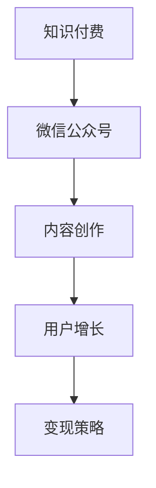

                 

# 程序员如何利用微信公众号进行知识付费

> 关键词：知识付费，微信公众号，程序员，技术分享，内容创作，用户增长，变现策略

> 摘要：本文旨在探讨程序员如何通过微信公众号这一平台进行知识付费，实现个人技术价值的变现。文章将从背景介绍、核心概念与联系、核心算法原理与具体操作步骤、数学模型和公式、项目实战、实际应用场景、工具和资源推荐、未来发展趋势与挑战、常见问题与解答以及扩展阅读与参考资料等多方面进行详细阐述，帮助读者深入了解并掌握利用微信公众号进行知识付费的方法和技巧。

## 1. 背景介绍

### 1.1 知识付费的兴起

随着互联网技术的发展，知识付费逐渐成为一种新的商业模式。知识付费是指用户为获取特定的知识、技能或信息而支付费用的行为。这种模式不仅为内容创作者提供了变现的途径，也为用户提供了更加高效、便捷的学习方式。

### 1.2 微信公众号的普及

微信公众号作为微信生态中的重要组成部分，自2012年推出以来，凭借其强大的社交属性和传播能力，迅速吸引了大量用户和内容创作者。对于程序员而言，微信公众号不仅是一个分享技术知识的平台，也是一个展示个人技术实力和实现知识变现的重要渠道。

### 1.3 程序员的知识付费现状

目前，许多程序员通过微信公众号分享技术文章、教程、视频等，吸引了大量粉丝。然而，如何将这些粉丝转化为付费用户，实现知识付费，仍然是一个挑战。本文将从多个角度探讨这一问题。

## 2. 核心概念与联系

### 2.1 核心概念

- **知识付费**：用户为获取特定的知识、技能或信息而支付费用的行为。
- **微信公众号**：微信生态中的一个重要组成部分，提供内容分享、互动交流等功能。
- **内容创作**：通过文字、图片、视频等形式创作有价值的内容。
- **用户增长**：通过各种策略吸引和保留用户。
- **变现策略**：将内容转化为经济收益的方法。

### 2.2 联系

- **知识付费与微信公众号**：微信公众号为知识付费提供了平台，内容创作者可以通过公众号分享知识，吸引用户付费。
- **内容创作与用户增长**：高质量的内容创作是吸引和保留用户的关键。
- **用户增长与变现策略**：用户增长是实现知识付费的基础，而变现策略则是将用户转化为付费用户的关键。

### 2.3 核心概念原理和架构的 Mermaid 流程图



## 3. 核心算法原理 & 具体操作步骤

### 3.1 核心算法原理

知识付费的核心在于内容的价值。内容的价值可以通过以下几个方面来衡量：

- **实用性**：内容是否能够解决用户实际问题。
- **新颖性**：内容是否具有创新性，能够吸引用户。
- **深度**：内容是否深入浅出，易于理解。

### 3.2 具体操作步骤

#### 3.2.1 确定目标用户群体

- **市场调研**：通过问卷调查、社交媒体分析等方式了解目标用户的需求和偏好。
- **用户画像**：根据调研结果，构建用户画像，明确目标用户群体的特征。

#### 3.2.2 创作高质量内容

- **内容规划**：根据用户画像，规划内容主题和形式。
- **内容创作**：撰写高质量的技术文章、制作教程视频等。
- **内容优化**：通过SEO优化、社交媒体分享等方式提高内容的可见度。

#### 3.2.3 建立用户社区

- **互动交流**：通过评论、问答等方式与用户互动，建立社区氛围。
- **用户反馈**：收集用户反馈，不断优化内容和服务。

#### 3.2.4 实施变现策略

- **付费订阅**：提供付费订阅服务，用户支付费用后可以获取更多内容。
- **付费课程**：开设付费课程，提供系统化的学习路径。
- **付费咨询**：提供一对一的付费咨询服务。

## 4. 数学模型和公式 & 详细讲解 & 举例说明

### 4.1 数学模型和公式

#### 4.1.1 用户增长模型

用户增长可以使用以下公式来描述：

$$
\text{用户增长} = \text{新用户} + \text{老用户复购} - \text{用户流失}
$$

#### 4.1.2 变现率模型

变现率可以使用以下公式来描述：

$$
\text{变现率} = \frac{\text{付费用户数}}{\text{总用户数}} \times 100\%
$$

### 4.2 详细讲解

#### 4.2.1 用户增长模型

用户增长模型中，新用户指的是通过各种渠道吸引的新用户，老用户复购指的是老用户再次购买服务，用户流失指的是用户不再使用服务。通过优化这三个因素，可以提高用户增长。

#### 4.2.2 变现率模型

变现率模型中，付费用户数指的是实际支付费用的用户数，总用户数指的是所有用户数。通过提高付费用户数和减少总用户数，可以提高变现率。

### 4.3 举例说明

假设一个微信公众号有10000名用户，其中1000名用户支付了费用，那么变现率为：

$$
\text{变现率} = \frac{1000}{10000} \times 100\% = 10\%
$$

## 5. 项目实战：代码实际案例和详细解释说明

### 5.1 开发环境搭建

#### 5.1.1 硬件环境

- **操作系统**：Windows 10 / macOS / Linux
- **开发工具**：Visual Studio Code / PyCharm / IntelliJ IDEA

#### 5.1.2 软件环境

- **编程语言**：Python / JavaScript
- **框架**：Django / Flask / Express
- **数据库**：MySQL / MongoDB
- **微信公众号开发工具**：微信公众平台开发者工具

### 5.2 源代码详细实现和代码解读

#### 5.2.1 创建微信公众号

```python
import requests

def create_wechat_public_account(appid, secret):
    url = f"https://api.weixin.qq.com/cgi-bin/token?grant_type=client_credential&appid={appid}&secret={secret}"
    response = requests.get(url)
    access_token = response.json().get('access_token')
    return access_token
```

#### 5.2.2 发布文章

```python
def publish_article(access_token, title, content):
    url = f"https://api.weixin.qq.com/cgi-bin/material/add_news?access_token={access_token}"
    data = {
        "articles": [
            {
                "title": title,
                "content": content,
                "thumb_media_id": "your_thumb_media_id",
                "author": "your_author",
                "digest": "your_digest",
                "show_cover_pic": 1
            }
        ]
    }
    response = requests.post(url, json=data)
    return response.json()
```

### 5.3 代码解读与分析

#### 5.3.1 创建微信公众号

- **appid**：微信公众号的唯一标识符。
- **secret**：微信公众号的密钥。
- **access_token**：用于调用微信公众号API的令牌。

#### 5.3.2 发布文章

- **access_token**：调用微信公众号API的令牌。
- **title**：文章标题。
- **content**：文章内容。
- **thumb_media_id**：文章封面图片的媒体ID。
- **author**：文章作者。
- **digest**：文章摘要。
- **show_cover_pic**：是否显示封面图片。

## 6. 实际应用场景

### 6.1 技术分享

通过微信公众号分享技术文章、教程、视频等，吸引技术爱好者关注，提高个人知名度。

### 6.2 付费订阅

提供付费订阅服务，用户支付费用后可以获取更多内容，如独家技术文章、视频教程等。

### 6.3 付费课程

开设付费课程，提供系统化的学习路径，帮助用户提升技术水平。

### 6.4 付费咨询

提供一对一的付费咨询服务，解决用户在技术学习和项目开发中的具体问题。

## 7. 工具和资源推荐

### 7.1 学习资源推荐

- **书籍**：《程序员的自我修养》、《深入浅出Node.js》
- **论文**：《微信公众号知识付费模式研究》
- **博客**：掘金、SegmentFault
- **网站**：CSDN、GitHub

### 7.2 开发工具框架推荐

- **编程语言**：Python、JavaScript
- **框架**：Django、Flask、Express
- **数据库**：MySQL、MongoDB
- **微信公众号开发工具**：微信公众平台开发者工具

### 7.3 相关论文著作推荐

- **《微信公众号知识付费模式研究》**：探讨微信公众号知识付费模式的现状和未来发展趋势。
- **《程序员的自我修养》**：深入浅出地讲解程序员必备的知识和技能。

## 8. 总结：未来发展趋势与挑战

### 8.1 未来发展趋势

- **内容多元化**：内容形式将更加多元化，包括图文、视频、音频等。
- **个性化推荐**：通过算法推荐个性化内容，提高用户满意度。
- **社交互动**：加强社交互动功能，提高用户粘性。

### 8.2 挑战

- **内容质量**：如何持续创作高质量内容，满足用户需求。
- **用户增长**：如何有效吸引和保留用户。
- **变现策略**：如何将内容转化为经济收益。

## 9. 附录：常见问题与解答

### 9.1 什么是知识付费？

知识付费是指用户为获取特定的知识、技能或信息而支付费用的行为。

### 9.2 如何确定目标用户群体？

通过市场调研和用户画像构建，明确目标用户群体的特征。

### 9.3 如何提高内容质量？

通过持续学习和实践，提高内容的实用性、新颖性和深度。

## 10. 扩展阅读 & 参考资料

- **书籍**：《程序员的自我修养》、《深入浅出Node.js》
- **论文**：《微信公众号知识付费模式研究》
- **博客**：掘金、SegmentFault
- **网站**：CSDN、GitHub

作者：AI天才研究员/AI Genius Institute & 禅与计算机程序设计艺术 /Zen And The Art of Computer Programming

