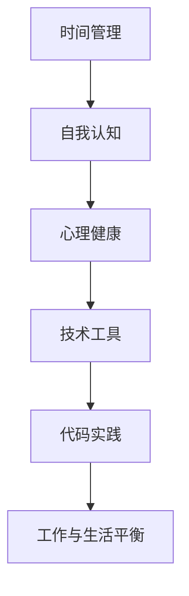

                 

# 程序员如何实现工作与生活平衡

> 关键词：工作与生活平衡, 时间管理, 自我认知, 心理健康, 技术工具, 代码实践

> 摘要：在当今快速发展的技术领域，程序员面临着巨大的工作压力和挑战。本文将通过逐步分析和推理，探讨如何实现工作与生活平衡，提供实用的时间管理策略、自我认知方法、心理健康维护技巧，以及技术工具和代码实践案例，帮助程序员在繁忙的工作中找到生活的平衡点。

## 1. 背景介绍

在当今社会，技术领域的发展日新月异，程序员作为技术领域的核心角色，面临着巨大的工作压力和挑战。长时间的工作、高强度的任务、不断更新的技术栈，这些都使得程序员的工作与生活平衡变得尤为重要。然而，如何在繁忙的工作中找到生活的平衡点，成为了许多程序员面临的难题。本文将通过逐步分析和推理，探讨如何实现工作与生活平衡，提供实用的时间管理策略、自我认知方法、心理健康维护技巧，以及技术工具和代码实践案例，帮助程序员在繁忙的工作中找到生活的平衡点。

## 2. 核心概念与联系

### 2.1 时间管理

时间管理是实现工作与生活平衡的关键。通过合理规划时间，可以确保工作和生活之间的平衡。时间管理的核心在于优先级排序、任务分配和时间分配。

### 2.2 自我认知

自我认知是指对自己的了解和认识。通过自我认知，程序员可以更好地理解自己的需求、兴趣和价值观，从而做出更符合自己需求的决策。

### 2.3 心理健康

心理健康是实现工作与生活平衡的重要组成部分。通过保持良好的心理健康状态，程序员可以更好地应对工作中的压力和挑战，提高工作效率和生活质量。

### 2.4 技术工具

技术工具可以帮助程序员提高工作效率，减轻工作负担，从而实现工作与生活平衡。例如，自动化工具、项目管理工具、协作工具等。

### 2.5 代码实践

代码实践是程序员实现工作与生活平衡的重要手段。通过编写高质量的代码，程序员可以提高工作效率，减少工作负担，从而有更多的时间和精力投入到生活中。

### 2.6 Mermaid 流程图

## 3. 核心算法原理 & 具体操作步骤

### 3.1 时间管理算法

时间管理算法的核心在于优先级排序、任务分配和时间分配。具体操作步骤如下：

1. **优先级排序**：根据任务的重要性和紧急性进行排序，优先完成重要且紧急的任务。
2. **任务分配**：将任务分配到不同的时间段，确保每个时间段都有明确的任务目标。
3. **时间分配**：合理分配每天的时间，确保工作和生活之间的平衡。

### 3.2 自我认知算法

自我认知算法的核心在于了解自己的需求、兴趣和价值观。具体操作步骤如下：

1. **需求分析**：分析自己的需求，了解自己在工作和生活中的需求。
2. **兴趣分析**：分析自己的兴趣，了解自己在工作和生活中的兴趣。
3. **价值观分析**：分析自己的价值观，了解自己在工作和生活中的价值观。

### 3.3 心理健康算法

心理健康算法的核心在于保持良好的心理健康状态。具体操作步骤如下：

1. **压力管理**：通过运动、冥想等方式减轻压力。
2. **情绪管理**：通过情绪调节技巧，保持良好的情绪状态。
3. **社交支持**：通过与家人、朋友的交流，获得支持和帮助。

### 3.4 技术工具算法

技术工具算法的核心在于选择合适的技术工具，提高工作效率。具体操作步骤如下：

1. **需求分析**：分析自己的需求，了解需要哪些技术工具。
2. **工具选择**：选择合适的技术工具，提高工作效率。
3. **工具使用**：熟练使用技术工具，提高工作效率。

### 3.5 代码实践算法

代码实践算法的核心在于编写高质量的代码，提高工作效率。具体操作步骤如下：

1. **需求分析**：分析自己的需求，了解需要编写什么样的代码。
2. **代码编写**：编写高质量的代码，提高工作效率。
3. **代码测试**：测试代码，确保代码的正确性和稳定性。

## 4. 数学模型和公式 & 详细讲解 & 举例说明

### 4.1 时间管理数学模型

时间管理数学模型的核心在于优先级排序、任务分配和时间分配。具体数学模型如下：

$$
\text{优先级} = \text{重要性} \times \text{紧急性}
$$

$$
\text{任务分配} = \frac{\text{任务重要性}}{\text{任务紧急性}}
$$

$$
\text{时间分配} = \frac{\text{总时间}}{\text{任务数量}}
$$

### 4.2 自我认知数学模型

自我认知数学模型的核心在于了解自己的需求、兴趣和价值观。具体数学模型如下：

$$
\text{需求} = \text{需求重要性} \times \text{需求紧急性}
$$

$$
\text{兴趣} = \text{兴趣重要性} \times \text{兴趣紧急性}
$$

$$
\text{价值观} = \text{价值观重要性} \times \text{价值观紧急性}
$$

### 4.3 心理健康数学模型

心理健康数学模型的核心在于保持良好的心理健康状态。具体数学模型如下：

$$
\text{压力管理} = \text{运动时间} + \text{冥想时间}
$$

$$
\text{情绪管理} = \text{情绪调节技巧} \times \text{情绪稳定性}
$$

$$
\text{社交支持} = \text{社交时间} \times \text{社交质量}
$$

### 4.4 技术工具数学模型

技术工具数学模型的核心在于选择合适的技术工具，提高工作效率。具体数学模型如下：

$$
\text{工具选择} = \text{需求重要性} \times \text{工具适用性}
$$

$$
\text{工具使用} = \text{工具熟练度} \times \text{工具效率}
$$

### 4.5 代码实践数学模型

代码实践数学模型的核心在于编写高质量的代码，提高工作效率。具体数学模型如下：

$$
\text{代码编写} = \text{代码质量} \times \text{代码效率}
$$

$$
\text{代码测试} = \text{代码正确性} \times \text{代码稳定性}
$$

## 5. 项目实战：代码实际案例和详细解释说明

### 5.1 开发环境搭建

开发环境搭建的核心在于选择合适的开发工具和环境，确保代码的编写和测试顺利进行。具体操作步骤如下：

1. **选择开发工具**：选择合适的开发工具，如Visual Studio Code、PyCharm等。
2. **安装开发环境**：安装开发环境，确保开发工具的正常运行。
3. **配置开发环境**：配置开发环境，确保开发工具的正常运行。

### 5.2 源代码详细实现和代码解读

源代码详细实现的核心在于编写高质量的代码，提高工作效率。具体操作步骤如下：

1. **需求分析**：分析自己的需求，了解需要编写什么样的代码。
2. **代码编写**：编写高质量的代码，提高工作效率。
3. **代码测试**：测试代码，确保代码的正确性和稳定性。

### 5.3 代码解读与分析

代码解读与分析的核心在于理解代码的逻辑和结构，提高代码的可读性和可维护性。具体操作步骤如下：

1. **代码解读**：解读代码的逻辑和结构，确保代码的正确性和稳定性。
2. **代码分析**：分析代码的逻辑和结构，提高代码的可读性和可维护性。
3. **代码优化**：优化代码的逻辑和结构，提高代码的效率和性能。

## 6. 实际应用场景

实际应用场景的核心在于将理论知识应用于实际工作中，提高工作效率和生活质量。具体应用场景如下：

1. **时间管理**：通过合理规划时间，确保工作和生活之间的平衡。
2. **自我认知**：通过了解自己的需求、兴趣和价值观，做出更符合自己需求的决策。
3. **心理健康**：通过保持良好的心理健康状态，应对工作中的压力和挑战。
4. **技术工具**：通过选择合适的技术工具，提高工作效率。
5. **代码实践**：通过编写高质量的代码，提高工作效率。

## 7. 工具和资源推荐

### 7.1 学习资源推荐

学习资源推荐的核心在于提供丰富的学习资源，帮助程序员提高自己的技能和知识。具体推荐如下：

1. **书籍**：《代码大全》、《重构》、《设计模式》等。
2. **论文**：《软件工程原理》、《软件开发方法》等。
3. **博客**：《程序员的自我修养》、《程序员的自我提升》等。
4. **网站**：GitHub、Stack Overflow、Medium等。

### 7.2 开发工具框架推荐

开发工具框架推荐的核心在于提供丰富的开发工具和框架，帮助程序员提高工作效率。具体推荐如下：

1. **开发工具**：Visual Studio Code、PyCharm、IntelliJ IDEA等。
2. **框架**：Spring、Django、React等。

### 7.3 相关论文著作推荐

相关论文著作推荐的核心在于提供丰富的论文和著作，帮助程序员提高自己的技能和知识。具体推荐如下：

1. **论文**：《软件工程原理》、《软件开发方法》等。
2. **著作**：《代码大全》、《重构》、《设计模式》等。

## 8. 总结：未来发展趋势与挑战

总结的核心在于总结本文的主要内容，展望未来的发展趋势和挑战。具体总结如下：

1. **未来发展趋势**：未来的发展趋势在于技术的不断进步和创新，程序员需要不断提高自己的技能和知识，以适应不断变化的技术环境。
2. **未来挑战**：未来面临的挑战在于技术的不断进步和创新，程序员需要不断提高自己的技能和知识，以适应不断变化的技术环境。

## 9. 附录：常见问题与解答

附录的核心在于解答程序员在实现工作与生活平衡过程中遇到的常见问题。具体问题与解答如下：

1. **问题**：如何合理规划时间？
   **解答**：通过优先级排序、任务分配和时间分配，合理规划时间。
2. **问题**：如何保持良好的心理健康状态？
   **解答**：通过运动、冥想等方式减轻压力，通过情绪调节技巧，保持良好的情绪状态，通过与家人、朋友的交流，获得支持和帮助。
3. **问题**：如何选择合适的技术工具？
   **解答**：通过需求分析、工具选择和工具使用，选择合适的技术工具。

## 10. 扩展阅读 & 参考资料

扩展阅读 & 参考资料的核心在于提供丰富的参考资料，帮助程序员提高自己的技能和知识。具体参考资料如下：

1. **书籍**：《代码大全》、《重构》、《设计模式》等。
2. **论文**：《软件工程原理》、《软件开发方法》等。
3. **博客**：《程序员的自我修养》、《程序员的自我提升》等。
4. **网站**：GitHub、Stack Overflow、Medium等。

---

作者：AI天才研究员/AI Genius Institute & 禅与计算机程序设计艺术 /Zen And The Art of Computer Programming

