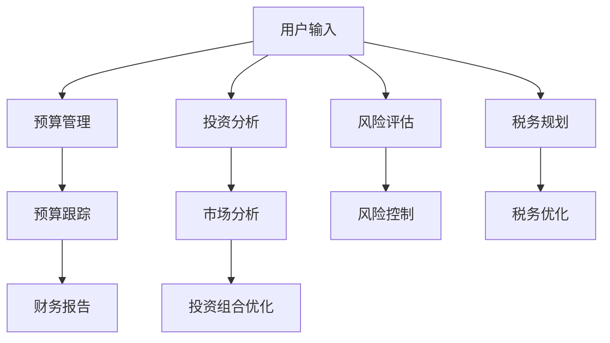

                 

# 程序员的理财工具箱：软件推荐

> 关键词：理财工具箱, 软件推荐, 程序员, 投资策略, 财务规划, 量化投资, 机器学习

> 摘要：本文旨在为程序员提供一套全面的理财工具箱，通过深入分析理财软件的核心概念、算法原理、数学模型、实际案例和应用场景，帮助程序员更好地理解和应用这些工具，从而实现财务规划和投资策略的优化。我们将从软件推荐的角度出发，探讨如何利用现代技术手段提升理财效率和收益。

## 1. 背景介绍

在当今数字化时代，理财软件已经成为许多程序员不可或缺的工具。这些软件不仅能够帮助用户管理个人财务，还能提供专业的投资建议。然而，市面上的理财软件种类繁多，功能各异，如何选择合适的理财软件成为了一个挑战。本文将从以下几个方面进行探讨：

- **理财软件的功能与特点**：介绍理财软件的基本功能，如预算管理、投资分析、风险评估等。
- **目标用户群体**：分析不同类型的用户群体，如新手投资者、资深投资者、企业财务管理人员等。
- **市场现状**：概述当前理财软件市场的现状和发展趋势。

### 1.1 理财软件的功能与特点

理财软件通常具备以下几个核心功能：

- **预算管理**：帮助用户制定和跟踪个人或企业的预算。
- **投资分析**：提供市场分析、投资组合优化等服务。
- **风险评估**：评估投资风险，提供风险控制建议。
- **税务规划**：提供税务优化建议，帮助用户合法避税。
- **财务报告**：生成详细的财务报表，帮助用户了解财务状况。

### 1.2 目标用户群体

理财软件的目标用户群体主要包括：

- **新手投资者**：需要学习基本投资知识，寻求入门指导。
- **资深投资者**：希望优化投资组合，提高投资回报。
- **企业财务管理人员**：需要管理企业财务，进行税务规划。

### 1.3 市场现状

当前理财软件市场呈现出以下几个特点：

- **竞争激烈**：市场上存在大量理财软件，竞争激烈。
- **技术创新**：新技术如人工智能、大数据等被广泛应用于理财软件中。
- **个性化需求**：用户对个性化服务的需求日益增长。

## 2. 核心概念与联系

### 2.1 理财软件的核心概念

理财软件的核心概念主要包括以下几个方面：

- **预算管理**：通过设定和跟踪预算，帮助用户控制支出，实现财务目标。
- **投资分析**：利用数据分析和模型预测，为用户提供投资建议。
- **风险评估**：通过风险评估模型，帮助用户识别和管理投资风险。
- **税务规划**：提供税务优化建议，帮助用户合法避税。

### 2.2 核心概念原理与架构

理财软件的核心概念原理和架构可以通过以下流程图进行描述：



## 3. 核心算法原理 & 具体操作步骤

### 3.1 预算管理算法原理

预算管理算法的核心原理是通过设定和跟踪预算，帮助用户控制支出，实现财务目标。具体操作步骤如下：

1. **预算设定**：用户根据自己的收入和支出情况，设定每月的预算。
2. **预算跟踪**：系统实时跟踪用户的支出情况，与预算进行对比。
3. **财务报告**：生成详细的财务报告，帮助用户了解财务状况。

### 3.2 投资分析算法原理

投资分析算法的核心原理是利用数据分析和模型预测，为用户提供投资建议。具体操作步骤如下：

1. **数据收集**：收集市场数据，包括股票价格、交易量等。
2. **数据分析**：利用数据分析技术，提取有价值的信息。
3. **模型预测**：利用机器学习模型进行预测，提供投资建议。

### 3.3 风险评估算法原理

风险评估算法的核心原理是通过风险评估模型，帮助用户识别和管理投资风险。具体操作步骤如下：

1. **风险因素识别**：识别影响投资风险的因素，如市场波动、政策变化等。
2. **风险评估模型**：利用统计模型评估风险。
3. **风险控制**：根据评估结果，提供风险控制建议。

### 3.4 税务规划算法原理

税务规划算法的核心原理是提供税务优化建议，帮助用户合法避税。具体操作步骤如下：

1. **税务信息收集**：收集用户的税务信息，如收入、支出等。
2. **税务优化建议**：利用税务优化模型，提供税务优化建议。
3. **税务报告**：生成税务报告，帮助用户了解税务状况。

## 4. 数学模型和公式 & 详细讲解 & 举例说明

### 4.1 预算管理数学模型

预算管理数学模型的核心公式为：

$$
\text{预算} = \text{收入} - \text{支出}
$$

### 4.2 投资分析数学模型

投资分析数学模型的核心公式为：

$$
\text{投资回报率} = \frac{\text{投资收益}}{\text{投资成本}}
$$

### 4.3 风险评估数学模型

风险评估数学模型的核心公式为：

$$
\text{风险} = \text{标准差} \times \text{风险系数}
$$

### 4.4 税务规划数学模型

税务规划数学模型的核心公式为：

$$
\text{应纳税额} = \text{收入} - \text{免税额} - \text{扣除额}
$$

## 5. 项目实战：代码实际案例和详细解释说明

### 5.1 开发环境搭建

为了实现上述功能，我们需要搭建一个开发环境。具体步骤如下：

1. **选择编程语言**：选择Python作为开发语言，因为它具有丰富的库支持。
2. **安装开发工具**：安装Python开发环境，如Anaconda。
3. **安装依赖库**：安装必要的库，如pandas、numpy、matplotlib等。

### 5.2 源代码详细实现和代码解读

以下是一个简单的预算管理功能的实现代码：

```python
import pandas as pd

class BudgetManager:
    def __init__(self, income, expenses):
        self.income = income
        self.expenses = expenses
        self.budget = self.income - self.expenses

    def track_expenses(self, expense):
        self.expenses += expense
        self.budget = self.income - self.expenses

    def generate_report(self):
        return f"Budget: {self.budget}"

# 示例
income = 5000
expenses = 3000
budget_manager = BudgetManager(income, expenses)
budget_manager.track_expenses(500)
print(budget_manager.generate_report())
```

### 5.3 代码解读与分析

上述代码实现了一个简单的预算管理功能。具体解释如下：

- **类定义**：定义了一个`BudgetManager`类，用于管理预算。
- **初始化方法**：在初始化时，设置收入和支出，并计算预算。
- **跟踪支出方法**：增加支出，并重新计算预算。
- **生成报告方法**：生成当前的预算报告。

## 6. 实际应用场景

### 6.1 个人财务管理

个人财务管理是理财软件最常见的应用场景之一。通过预算管理、投资分析等功能，帮助用户更好地管理个人财务。

### 6.2 企业财务管理

企业财务管理是另一个重要的应用场景。通过预算管理、税务规划等功能，帮助企业更好地管理财务，提高财务效率。

### 6.3 投资组合优化

投资组合优化是理财软件的重要应用场景之一。通过投资分析、风险评估等功能，帮助用户优化投资组合，提高投资回报。

## 7. 工具和资源推荐

### 7.1 学习资源推荐

- **书籍**：《财务自由之路》、《投资中庸之道》
- **论文**：《现代投资组合理论》、《风险管理与投资策略》
- **博客**：Medium上的理财和投资相关博客
- **网站**：Investopedia、Yahoo Finance

### 7.2 开发工具框架推荐

- **编程语言**：Python、R
- **开发工具**：PyCharm、Jupyter Notebook
- **库**：pandas、numpy、matplotlib

### 7.3 相关论文著作推荐

- **论文**：《机器学习在投资中的应用》、《大数据在风险管理中的应用》
- **著作**：《量化投资策略》、《财务规划与风险管理》

## 8. 总结：未来发展趋势与挑战

### 8.1 未来发展趋势

- **技术融合**：技术融合将成为未来理财软件的发展趋势，如人工智能、大数据等技术的应用。
- **个性化服务**：个性化服务将成为未来理财软件的重要发展方向。
- **用户体验**：用户体验将成为未来理财软件的核心竞争力。

### 8.2 挑战

- **数据安全**：数据安全将是理财软件面临的重要挑战。
- **法律法规**：法律法规的变化将对理财软件产生影响。
- **技术更新**：技术更新将对理财软件的开发和维护带来挑战。

## 9. 附录：常见问题与解答

### 9.1 问题1：如何选择合适的理财软件？

**解答**：选择合适的理财软件需要考虑以下几个方面：功能、用户评价、安全性等。

### 9.2 问题2：如何优化投资组合？

**解答**：优化投资组合需要考虑以下几个方面：风险评估、市场分析、投资策略等。

## 10. 扩展阅读 & 参考资料

- **书籍**：《财务自由之路》、《投资中庸之道》
- **论文**：《现代投资组合理论》、《风险管理与投资策略》
- **网站**：Investopedia、Yahoo Finance

---

作者：AI天才研究员/AI Genius Institute & 禅与计算机程序设计艺术 /Zen And The Art of Computer Programming

