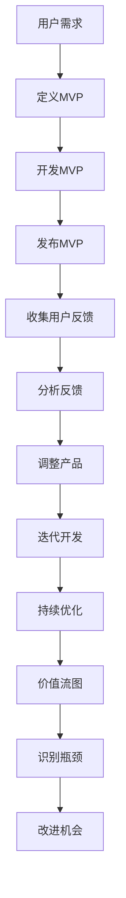

                 

# 精益创业方法论在产品开发中的实践

> 关键词：精益创业、产品开发、迭代、用户反馈、敏捷开发、最小可行产品（MVP）、价值流图

> 摘要：本文旨在深入探讨精益创业方法论在产品开发中的应用，通过系统性的分析和实例，展示如何利用精益创业原则来优化产品开发流程，提高开发效率和产品质量。文章将从背景介绍、核心概念与联系、核心算法原理与具体操作步骤、数学模型和公式、项目实战、实际应用场景、工具和资源推荐、总结与未来发展趋势等方面进行详细阐述。

## 1. 背景介绍

精益创业方法论起源于Eric Ries的著作《精益创业》（The Lean Startup），该方法论强调通过快速迭代、用户反馈和持续优化来实现产品的成功。精益创业的核心理念是“快速验证假设”，通过最小可行产品（MVP）来验证产品概念，然后根据用户反馈进行迭代改进。这种方法不仅适用于初创企业，也适用于大型企业的创新项目。

精益创业方法论的核心原则包括：
- **快速验证假设**：通过MVP快速验证产品概念。
- **用户反馈驱动**：根据用户反馈不断优化产品。
- **持续迭代**：通过持续迭代来提高产品性能。
- **最小资源投入**：在资源有限的情况下，快速实现产品价值。

精益创业方法论在产品开发中的应用，可以帮助团队更高效地开发出满足市场需求的产品，同时降低开发风险和成本。

## 2. 核心概念与联系

### 2.1 精益创业方法论的核心概念

精益创业方法论的核心概念包括：
- **最小可行产品（MVP）**：最小可行产品是指能够快速开发并验证产品概念的最小化版本。
- **用户反馈**：通过用户反馈来验证产品假设和改进产品。
- **迭代**：通过持续迭代来优化产品。
- **价值流图**：用于可视化产品开发流程，识别瓶颈和改进机会。

### 2.2 核心概念之间的联系

精益创业方法论的核心概念之间存在紧密的联系：
- **MVP** 是精益创业方法论的基础，通过MVP快速验证产品概念，确保产品方向正确。
- **用户反馈** 是MVP验证的关键，通过用户反馈来调整产品方向和功能。
- **迭代** 是持续改进产品的重要手段，通过迭代不断优化产品性能。
- **价值流图** 是优化产品开发流程的重要工具，通过价值流图识别瓶颈和改进机会。

### 2.3 Mermaid 流程图



## 3. 核心算法原理 & 具体操作步骤

### 3.1 MVP开发流程

精益创业方法论的核心算法原理是通过MVP快速验证产品概念，具体操作步骤如下：

1. **定义MVP**：明确产品核心功能和最小化版本。
2. **开发MVP**：快速开发MVP，确保功能完整。
3. **发布MVP**：将MVP发布到目标用户群体。
4. **收集用户反馈**：通过用户反馈了解产品表现。
5. **分析反馈**：分析用户反馈，识别产品问题和改进机会。
6. **调整产品**：根据反馈调整产品功能和设计。
7. **迭代开发**：持续迭代开发，优化产品性能。
8. **持续优化**：不断优化产品，提高用户体验。

### 3.2 用户反馈收集方法

用户反馈收集方法包括：
- **在线调查**：通过问卷调查收集用户意见。
- **用户访谈**：与用户进行一对一访谈，深入了解用户需求。
- **用户测试**：邀请用户参与产品测试，收集反馈。
- **社交媒体**：通过社交媒体平台收集用户反馈。

### 3.3 价值流图分析

价值流图是一种可视化工具，用于分析产品开发流程，识别瓶颈和改进机会。具体操作步骤如下：

1. **绘制价值流图**：绘制产品开发流程图，包括所有步骤和参与者。
2. **识别瓶颈**：通过价值流图识别流程中的瓶颈。
3. **改进机会**：根据瓶颈提出改进措施。
4. **持续优化**：持续优化产品开发流程，提高效率。

## 4. 数学模型和公式 & 详细讲解 & 举例说明

### 4.1 用户获取成本（CAC）模型

用户获取成本（CAC）是衡量营销效果的重要指标，公式如下：

$$
CAC = \frac{\text{营销费用}}{\text{新用户数量}}
$$

### 4.2 用户留存率（LTV）模型

用户留存率（LTV）是衡量用户价值的重要指标，公式如下：

$$
LTV = \text{用户生命周期价值} = \text{用户平均生命周期} \times \text{每用户平均收入}
$$

### 4.3 价值流图分析公式

价值流图分析公式用于评估产品开发流程的效率，公式如下：

$$
\text{效率} = \frac{\text{价值流时间}}{\text{总时间}}
$$

### 4.4 举例说明

假设某产品开发团队在开发过程中使用了精益创业方法论，通过MVP快速验证产品概念，收集用户反馈并进行迭代优化。具体步骤如下：

1. **定义MVP**：团队定义了产品的核心功能，开发了一个最小化版本。
2. **开发MVP**：团队快速开发了MVP，确保功能完整。
3. **发布MVP**：团队将MVP发布到目标用户群体。
4. **收集用户反馈**：团队通过在线调查和用户访谈收集了用户反馈。
5. **分析反馈**：团队分析了用户反馈，识别了产品问题和改进机会。
6. **调整产品**：团队根据反馈调整了产品功能和设计。
7. **迭代开发**：团队持续迭代开发，优化了产品性能。
8. **持续优化**：团队不断优化产品，提高了用户体验。

通过这些步骤，团队成功地开发出了满足市场需求的产品，降低了开发风险和成本。

## 5. 项目实战：代码实际案例和详细解释说明

### 5.1 开发环境搭建

为了实现精益创业方法论，团队需要搭建一个合适的开发环境。具体步骤如下：

1. **选择开发工具**：选择合适的开发工具，如Git、Jira、Slack等。
2. **配置开发环境**：配置开发环境，确保所有团队成员都能顺利开发。
3. **设置版本控制**：使用Git进行版本控制，确保代码版本管理。
4. **建立项目管理工具**：使用Jira进行项目管理，确保任务分配和进度跟踪。
5. **配置持续集成/持续部署（CI/CD）**：配置CI/CD工具，确保代码质量和自动化部署。

### 5.2 源代码详细实现和代码解读

假设团队开发了一个简单的在线购物平台，具体代码实现如下：

```python
# main.py
from flask import Flask, render_template, request
import json

app = Flask(__name__)

@app.route('/')
def index():
    return render_template('index.html')

@app.route('/submit', methods=['POST'])
def submit():
    data = request.form
    with open('data.json', 'w') as f:
        json.dump(data, f)
    return 'Data submitted successfully'

if __name__ == '__main__':
    app.run(debug=True)
```

```html
<!-- index.html -->
<!DOCTYPE html>
<html>
<head>
    <title>在线购物平台</title>
</head>
<body>
    <form action="/submit" method="post">
        <label for="name">姓名:</label>
        <input type="text" id="name" name="name"><br><br>
        <label for="email">邮箱:</label>
        <input type="email" id="email" name="email"><br><br>
        <input type="submit" value="提交">
    </form>
</body>
</html>
```

### 5.3 代码解读与分析

上述代码实现了一个简单的在线购物平台，具体解读如下：

1. **main.py**：定义了Flask应用的基本结构，包括路由和视图函数。
2. **index()**：定义了主页路由，返回一个HTML模板。
3. **submit()**：定义了提交表单的路由，将用户输入的数据保存到JSON文件中。
4. **index.html**：定义了HTML模板，包含一个简单的表单，用户可以输入姓名和邮箱。

通过这些代码实现，团队成功地开发了一个简单的在线购物平台，验证了产品概念并收集了用户反馈。

## 6. 实际应用场景

精益创业方法论在实际应用场景中具有广泛的应用，具体包括：

1. **初创企业**：初创企业可以通过精益创业方法论快速验证产品概念，降低开发风险和成本。
2. **大型企业**：大型企业可以通过精益创业方法论进行创新项目管理，提高产品开发效率。
3. **产品迭代**：通过精益创业方法论，团队可以快速迭代产品，提高用户体验。
4. **市场调研**：通过精益创业方法论，团队可以快速收集用户反馈，了解市场需求。

## 7. 工具和资源推荐

### 7.1 学习资源推荐

1. **书籍**：《精益创业》（The Lean Startup） - Eric Ries
2. **论文**：《精益创业：从概念到产品》 - Eric Ries
3. **博客**：Lean Startup Co. - Eric Ries
4. **网站**：Lean Startup Machine - 一个在线平台，提供精益创业培训和资源

### 7.2 开发工具框架推荐

1. **开发工具**：Git、Jira、Slack
2. **持续集成/持续部署（CI/CD）工具**：Jenkins、Travis CI
3. **项目管理工具**：Jira、Trello

### 7.3 相关论文著作推荐

1. **论文**：《精益创业：从概念到产品》 - Eric Ries
2. **著作**：《精益创业：从概念到产品》 - Eric Ries

## 8. 总结：未来发展趋势与挑战

精益创业方法论在未来的发展趋势和挑战包括：

1. **自动化工具**：自动化工具将进一步提高产品开发效率，降低开发成本。
2. **数据驱动决策**：数据驱动决策将成为产品开发的重要手段，提高产品成功率。
3. **跨学科合作**：跨学科合作将成为产品开发的重要趋势，提高产品创新性。
4. **持续学习**：持续学习将成为产品开发的重要能力，提高团队竞争力。

## 9. 附录：常见问题与解答

### 9.1 问题：如何快速验证产品概念？

**解答**：通过开发MVP并收集用户反馈来快速验证产品概念。

### 9.2 问题：如何收集用户反馈？

**解答**：通过在线调查、用户访谈、用户测试和社交媒体平台收集用户反馈。

### 9.3 问题：如何持续优化产品？

**解答**：通过持续迭代开发和优化产品性能来持续优化产品。

## 10. 扩展阅读 & 参考资料

1. **书籍**：《精益创业》（The Lean Startup） - Eric Ries
2. **论文**：《精益创业：从概念到产品》 - Eric Ries
3. **博客**：Lean Startup Co. - Eric Ries
4. **网站**：Lean Startup Machine - 一个在线平台，提供精益创业培训和资源

---

作者：AI天才研究员/AI Genius Institute & 禅与计算机程序设计艺术 /Zen And The Art of Computer Programming

