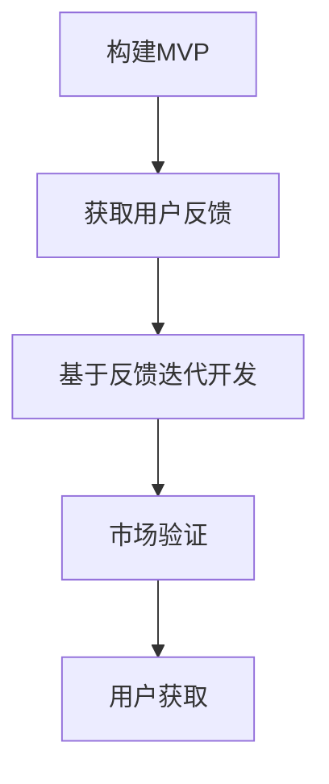

                 

# 精益创业方法论：技术型创业者的成功之道

> 关键词：精益创业、技术型创业、MVP、用户反馈、迭代开发、敏捷开发、创业成功

> 摘要：本文旨在为技术型创业者提供一套系统化的精益创业方法论，通过详细阐述精益创业的核心概念、原理、操作步骤、数学模型、项目实战、应用场景、工具资源推荐以及未来发展趋势与挑战，帮助创业者在技术驱动的创业道路上更加稳健地前行。文章从背景介绍开始，逐步深入到精益创业的各个关键环节，最后总结未来的发展趋势与挑战，并提供常见问题解答和扩展阅读资料，旨在为技术型创业者提供全面而深入的指导。

## 1. 背景介绍

### 1.1 精益创业的起源与发展

精益创业方法论起源于制造业，特别是丰田生产系统中的精益生产理念。精益生产强调通过消除浪费、提高效率来实现价值最大化。精益创业则是将这一理念应用于创业领域，通过快速迭代、用户反馈、最小化可行产品（MVP）等手段，以最小的成本和最快的速度验证产品假设，从而提高创业成功率。

### 1.2 技术型创业的特点与挑战

技术型创业是指以技术创新为核心，通过开发新技术、新产品或新服务来满足市场需求的创业活动。这类创业活动往往伴随着高风险和高不确定性，尤其是在产品开发、市场验证、用户获取等方面。精益创业方法论为技术型创业者提供了一套系统化的解决方案，帮助他们更好地应对这些挑战。

## 2. 核心概念与联系

### 2.1 精益创业的核心概念

精益创业的核心概念包括：最小化可行产品（MVP）、用户反馈、迭代开发、敏捷开发等。这些概念相互联系，共同构成了精益创业方法论的基础。

### 2.2 精益创业的架构原理

精益创业的架构原理可以概括为：通过构建最小化可行产品（MVP），快速获取用户反馈，基于反馈进行迭代开发，最终实现产品的市场验证和用户获取。这一过程强调的是快速迭代和持续优化，以最小的成本和最快的速度验证产品假设。

### 2.3 Mermaid 流程图



## 3. 核心算法原理 & 具体操作步骤

### 3.1 算法原理

精益创业的核心算法原理在于通过构建最小化可行产品（MVP），快速获取用户反馈，基于反馈进行迭代开发，最终实现产品的市场验证和用户获取。这一过程强调的是快速迭代和持续优化，以最小的成本和最快的速度验证产品假设。

### 3.2 具体操作步骤

#### 3.2.1 确定产品假设

首先，创业者需要明确产品的核心价值主张，即产品能够解决的用户痛点或满足的用户需求。这一过程需要基于市场调研和用户访谈，确保产品假设的合理性和可行性。

#### 3.2.2 构建最小化可行产品（MVP）

接下来，创业者需要构建最小化可行产品（MVP），即能够验证产品假设的最简版本。MVP的设计原则是“足够好”，即能够满足用户的基本需求，但不包含所有功能。这一过程需要创业者在产品设计、开发、测试等方面进行权衡，确保MVP的快速构建和低成本。

#### 3.2.3 获取用户反馈

MVP上线后，创业者需要通过各种渠道获取用户反馈，包括用户访谈、问卷调查、数据分析等。这一过程需要创业者建立有效的用户反馈机制，确保用户反馈的及时性和准确性。

#### 3.2.4 基于反馈迭代开发

基于用户反馈，创业者需要对产品进行迭代开发，不断优化产品功能和用户体验。这一过程需要创业者建立敏捷开发团队，确保开发过程的高效性和灵活性。

#### 3.2.5 市场验证与用户获取

通过迭代开发，创业者需要实现产品的市场验证和用户获取。市场验证是指通过用户反馈和数据分析，验证产品的市场潜力和用户需求。用户获取是指通过各种渠道，吸引用户使用产品并形成用户粘性。这一过程需要创业者建立有效的市场推广和用户运营机制，确保产品的市场竞争力和用户粘性。

## 4. 数学模型和公式 & 详细讲解 & 举例说明

### 4.1 数学模型和公式

精益创业的核心数学模型是基于用户反馈的迭代开发模型。这一模型可以表示为：

$$
f(x) = g(h(x))
$$

其中，$x$ 表示产品假设，$h(x)$ 表示最小化可行产品（MVP），$g(h(x))$ 表示基于用户反馈的迭代开发过程。这一模型强调的是通过快速迭代和持续优化，以最小的成本和最快的速度验证产品假设。

### 4.2 详细讲解

#### 4.2.1 产品假设

产品假设是指创业者对产品的核心价值主张的假设，即产品能够解决的用户痛点或满足的用户需求。这一假设需要基于市场调研和用户访谈，确保产品的合理性和可行性。

#### 4.2.2 最小化可行产品（MVP）

最小化可行产品（MVP）是指能够验证产品假设的最简版本。MVP的设计原则是“足够好”，即能够满足用户的基本需求，但不包含所有功能。这一过程需要创业者在产品设计、开发、测试等方面进行权衡，确保MVP的快速构建和低成本。

#### 4.2.3 用户反馈

用户反馈是指通过各种渠道获取用户对产品的反馈，包括用户访谈、问卷调查、数据分析等。这一过程需要创业者建立有效的用户反馈机制，确保用户反馈的及时性和准确性。

#### 4.2.4 迭代开发

迭代开发是指基于用户反馈，对产品进行持续优化的过程。这一过程需要创业者建立敏捷开发团队，确保开发过程的高效性和灵活性。

#### 4.2.5 市场验证与用户获取

市场验证是指通过用户反馈和数据分析，验证产品的市场潜力和用户需求。用户获取是指通过各种渠道，吸引用户使用产品并形成用户粘性。这一过程需要创业者建立有效的市场推广和用户运营机制，确保产品的市场竞争力和用户粘性。

### 4.3 举例说明

假设某创业者开发了一款在线教育平台，产品假设是该平台能够提供高质量的在线课程，满足用户的学习需求。为了验证这一假设，创业者构建了一个最小化可行产品（MVP），即一个包含少量课程的在线教育平台。MVP上线后，创业者通过用户访谈和问卷调查，获取了用户对平台的反馈。基于用户反馈，创业者对平台进行了迭代开发，不断优化课程内容和用户体验。通过这一过程，创业者验证了产品的市场潜力和用户需求，并成功吸引了大量用户使用平台。

## 5. 项目实战：代码实际案例和详细解释说明

### 5.1 开发环境搭建

#### 5.1.1 选择开发工具

选择适合的开发工具是构建最小化可行产品（MVP）的关键步骤之一。对于在线教育平台，可以选择使用React或Vue等前端框架，以及Node.js或Django等后端框架。此外，还需要选择适合的数据库和服务器环境，如MySQL或MongoDB等。

#### 5.1.2 安装开发环境

安装开发环境需要按照开发工具的官方文档进行。对于前端框架，需要安装Node.js和npm，然后使用npm安装React或Vue等框架。对于后端框架，需要安装Python和pip，然后使用pip安装Node.js或Django等框架。对于数据库和服务器环境，需要安装相应的数据库和服务器软件，并进行相应的配置。

### 5.2 源代码详细实现和代码解读

#### 5.2.1 前端代码实现

前端代码实现需要使用React或Vue等前端框架。以下是一个简单的React组件示例：

```javascript
import React from 'react';

function CourseList(props) {
  return (
    <div>
      <h1>课程列表</h1>
      <ul>
        {props.courses.map(course => (
          <li key={course.id}>{course.name}</li>
        ))}
      </ul>
    </div>
  );
}

export default CourseList;
```

#### 5.2.2 后端代码实现

后端代码实现需要使用Node.js或Django等后端框架。以下是一个简单的Node.js示例：

```javascript
const express = require('express');
const app = express();

app.get('/courses', (req, res) => {
  const courses = [
    { id: 1, name: '课程1' },
    { id: 2, name: '课程2' },
    { id: 3, name: '课程3' }
  ];
  res.json(courses);
});

app.listen(3000, () => {
  console.log('服务器运行在 http://localhost:3000');
});
```

### 5.3 代码解读与分析

#### 5.3.1 前端代码解读

前端代码实现使用了React框架，定义了一个名为CourseList的组件，该组件接收一个名为courses的props，该props是一个包含课程信息的数组。组件渲染了一个包含课程列表的div元素，其中包含一个标题和一个ul元素，该ul元素使用map函数遍历courses数组，生成一个li元素列表。

#### 5.3.2 后端代码解读

后端代码实现使用了Node.js框架，定义了一个名为app的Express应用。该应用定义了一个名为/courses的路由，该路由接收GET请求，返回一个包含课程信息的JSON数组。该应用运行在3000端口，可以通过访问http://localhost:3000/courses获取课程信息。

## 6. 实际应用场景

### 6.1 在线教育平台

在线教育平台是一个典型的精益创业应用场景。通过构建最小化可行产品（MVP），快速获取用户反馈，基于反馈进行迭代开发，最终实现产品的市场验证和用户获取。这一过程需要创业者建立有效的用户反馈机制，确保用户反馈的及时性和准确性。同时，需要建立有效的市场推广和用户运营机制，确保产品的市场竞争力和用户粘性。

### 6.2 移动应用开发

移动应用开发也是一个典型的精益创业应用场景。通过构建最小化可行产品（MVP），快速获取用户反馈，基于反馈进行迭代开发，最终实现产品的市场验证和用户获取。这一过程需要创业者建立有效的用户反馈机制，确保用户反馈的及时性和准确性。同时，需要建立有效的市场推广和用户运营机制，确保产品的市场竞争力和用户粘性。

## 7. 工具和资源推荐

### 7.1 学习资源推荐

#### 7.1.1 书籍

- 《精益创业》（Eric Ries）
- 《敏捷软件开发：原则、模式与实践》（Robert C. Martin）
- 《用户体验要素》（Jesse James Garrett）

#### 7.1.2 论文

- "The Lean Startup Method" (Eric Ries)
- "Agile Software Development: Principles, Patterns, and Practices" (Robert C. Martin)

#### 7.1.3 博客

- Eric Ries的博客（https://www.ericries.com/）
- Martin Fowler的博客（https://martinfowler.com/）

#### 7.1.4 网站

- 精益创业社区（https://theleanstartup.com/）
- 敏捷开发社区（https://www.agilealliance.org/）

### 7.2 开发工具框架推荐

- React（https://reactjs.org/）
- Vue（https://vuejs.org/）
- Node.js（https://nodejs.org/）
- Django（https://www.djangoproject.com/）

### 7.3 相关论文著作推荐

- "The Lean Startup" (Eric Ries)
- "Agile Software Development: Principles, Patterns, and Practices" (Robert C. Martin)
- "The Lean Startup Method" (Eric Ries)

## 8. 总结：未来发展趋势与挑战

### 8.1 未来发展趋势

精益创业方法论在未来的发展趋势将更加注重数据驱动和用户导向。随着大数据和人工智能技术的发展，精益创业将更加依赖于数据分析和用户反馈，以实现产品的快速迭代和持续优化。同时，精益创业将更加注重用户体验和用户满意度，以实现产品的市场竞争力和用户粘性。

### 8.2 未来挑战

精益创业在未来将面临更加激烈的市场竞争和技术挑战。随着技术的快速发展和市场的不断变化，精益创业将面临更加复杂的市场环境和技术挑战。同时，精益创业将面临更加严格的法律法规和技术标准，以确保产品的合法性和安全性。

## 9. 附录：常见问题与解答

### 9.1 什么是精益创业？

精益创业是一种创业方法论，通过构建最小化可行产品（MVP），快速获取用户反馈，基于反馈进行迭代开发，最终实现产品的市场验证和用户获取。这一过程强调的是快速迭代和持续优化，以最小的成本和最快的速度验证产品假设。

### 9.2 什么是最小化可行产品（MVP）？

最小化可行产品（MVP）是指能够验证产品假设的最简版本。MVP的设计原则是“足够好”，即能够满足用户的基本需求，但不包含所有功能。这一过程需要创业者在产品设计、开发、测试等方面进行权衡，确保MVP的快速构建和低成本。

### 9.3 如何获取用户反馈？

获取用户反馈需要通过各种渠道，包括用户访谈、问卷调查、数据分析等。这一过程需要创业者建立有效的用户反馈机制，确保用户反馈的及时性和准确性。

### 9.4 如何进行迭代开发？

进行迭代开发需要基于用户反馈，对产品进行持续优化。这一过程需要创业者建立敏捷开发团队，确保开发过程的高效性和灵活性。

### 9.5 如何实现市场验证与用户获取？

实现市场验证与用户获取需要通过用户反馈和数据分析，验证产品的市场潜力和用户需求。同时，需要通过各种渠道，吸引用户使用产品并形成用户粘性。这一过程需要创业者建立有效的市场推广和用户运营机制，确保产品的市场竞争力和用户粘性。

## 10. 扩展阅读 & 参考资料

- Eric Ries的博客（https://www.ericries.com/）
- Martin Fowler的博客（https://martinfowler.com/）
- 精益创业社区（https://theleanstartup.com/）
- 敏捷开发社区（https://www.agilealliance.org/）

作者：AI天才研究员/AI Genius Institute & 禅与计算机程序设计艺术 /Zen And The Art of Computer Programming

