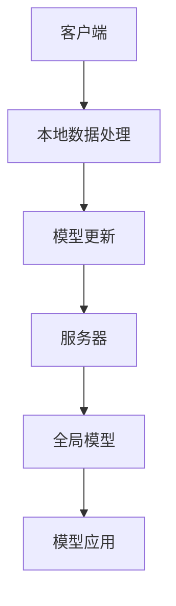

                 

# 联邦学习在多方安全计算中的应用

> 关键词：联邦学习, 多方安全计算, 数据隐私保护, 模型训练, 同态加密, 零知识证明

> 摘要：本文旨在深入探讨联邦学习在多方安全计算中的应用，通过详细分析联邦学习的核心概念、算法原理、数学模型、实际案例以及应用场景，揭示其在保护数据隐私的同时实现高效模型训练的潜力。联邦学习作为一种新兴的机器学习范式，通过在不共享原始数据的情况下进行模型训练，为解决数据孤岛问题提供了新的思路。本文将通过逐步推理的方式，帮助读者理解联邦学习的原理及其在多方安全计算中的应用价值。

## 1. 背景介绍

随着大数据时代的到来，数据已成为企业、科研机构和政府的重要资产。然而，数据孤岛问题严重阻碍了数据的共享与利用。联邦学习作为一种新兴的机器学习范式，旨在解决这一问题，通过在不共享原始数据的情况下进行模型训练，实现数据的高效利用。联邦学习的核心思想是将模型训练过程分散到多个参与方，每个参与方仅需贡献自己的模型更新，而无需暴露原始数据。这种机制不仅保护了数据隐私，还提高了模型训练的效率和准确性。

### 1.1 数据孤岛问题

数据孤岛问题是指不同组织或个体之间存在数据壁垒，无法直接共享数据。这种现象在医疗、金融、零售等多个领域普遍存在。例如，医院之间难以共享病历数据，银行之间难以共享客户信用记录，零售商之间难以共享消费者购买行为数据。数据孤岛问题导致了数据资源的浪费，限制了数据的价值挖掘。

### 1.2 数据隐私保护的重要性

数据隐私保护是联邦学习的核心关注点之一。随着数据泄露事件的频发，数据隐私保护已成为社会各界关注的焦点。数据泄露不仅可能导致个人隐私被侵犯，还可能引发严重的社会问题。因此，如何在保护数据隐私的同时实现高效的数据利用，成为亟待解决的问题。

### 1.3 联邦学习的定义与目标

联邦学习是一种分布式机器学习范式，旨在通过在不共享原始数据的情况下进行模型训练，实现数据的高效利用。联邦学习的目标是通过在多个参与方之间共享模型更新，实现全局模型的优化，同时保护每个参与方的数据隐私。

## 2. 核心概念与联系

### 2.1 联邦学习的架构

联邦学习的架构可以分为客户端（Client）和服务器（Server）两个部分。客户端负责处理本地数据，生成模型更新；服务器负责汇总客户端的模型更新，生成全局模型。联邦学习的架构如图1所示。



### 2.2 联邦学习的关键概念

#### 2.2.1 客户端（Client）

客户端是联邦学习中的数据持有者，负责处理本地数据，生成模型更新。客户端需要具备一定的计算能力和存储能力，以支持模型训练过程。

#### 2.2.2 服务器（Server）

服务器是联邦学习中的协调者，负责汇总客户端的模型更新，生成全局模型。服务器需要具备强大的计算能力和存储能力，以支持模型训练过程。

#### 2.2.3 模型更新

模型更新是指客户端根据本地数据生成的模型参数变化。模型更新是联邦学习的核心，通过汇总多个客户端的模型更新，可以逐步优化全局模型。

#### 2.2.4 全局模型

全局模型是通过汇总多个客户端的模型更新生成的最终模型。全局模型是联邦学习的目标，通过全局模型可以实现数据的高效利用。

### 2.3 联邦学习与多方安全计算的关系

联邦学习与多方安全计算密切相关。联邦学习的核心思想是通过在不共享原始数据的情况下进行模型训练，实现数据的高效利用。而多方安全计算则是通过加密技术保护数据隐私，实现数据的高效利用。联邦学习可以看作是多方安全计算的一种应用，通过在不共享原始数据的情况下进行模型训练，实现数据的高效利用。

## 3. 核心算法原理 & 具体操作步骤

### 3.1 联邦学习的基本流程

联邦学习的基本流程可以分为以下几个步骤：

1. **初始化全局模型**：服务器初始化全局模型，作为训练的起点。
2. **客户端数据处理**：客户端根据本地数据生成模型更新。
3. **模型更新传输**：客户端将模型更新传输给服务器。
4. **模型更新汇总**：服务器汇总客户端的模型更新，生成全局模型。
5. **模型更新下发**：服务器将全局模型下发给客户端。
6. **迭代训练**：重复上述步骤，直到满足停止条件。

### 3.2 具体操作步骤

#### 3.2.1 初始化全局模型

服务器初始化全局模型，作为训练的起点。全局模型可以是随机生成的，也可以是预训练的模型。

#### 3.2.2 客户端数据处理

客户端根据本地数据生成模型更新。客户端需要对本地数据进行预处理，生成模型更新。模型更新可以是模型参数的变化，也可以是模型权重的变化。

#### 3.2.3 模型更新传输

客户端将模型更新传输给服务器。模型更新可以通过加密技术保护数据隐私，实现数据的高效利用。

#### 3.2.4 模型更新汇总

服务器汇总客户端的模型更新，生成全局模型。服务器需要对客户端的模型更新进行汇总，生成全局模型。全局模型可以是简单的平均值，也可以是复杂的加权平均值。

#### 3.2.5 模型更新下发

服务器将全局模型下发给客户端。全局模型可以是简单的平均值，也可以是复杂的加权平均值。

#### 3.2.6 迭代训练

重复上述步骤，直到满足停止条件。迭代训练可以是固定的迭代次数，也可以是满足一定的停止条件。

## 4. 数学模型和公式 & 详细讲解 & 举例说明

### 4.1 联邦学习的数学模型

联邦学习的数学模型可以表示为：

$$
\theta_{t+1} = \theta_t + \frac{1}{n} \sum_{i=1}^{n} \Delta \theta_i
$$

其中，$\theta_t$ 表示第 $t$ 轮的全局模型参数，$\Delta \theta_i$ 表示第 $i$ 个客户端的模型更新，$n$ 表示客户端的数量。

### 4.2 详细讲解

联邦学习的数学模型可以表示为：

$$
\theta_{t+1} = \theta_t + \frac{1}{n} \sum_{i=1}^{n} \Delta \theta_i
$$

其中，$\theta_t$ 表示第 $t$ 轮的全局模型参数，$\Delta \theta_i$ 表示第 $i$ 个客户端的模型更新，$n$ 表示客户端的数量。联邦学习的核心思想是通过在不共享原始数据的情况下进行模型训练，实现数据的高效利用。联邦学习的数学模型可以表示为上述公式，通过汇总多个客户端的模型更新，逐步优化全局模型。

### 4.3 举例说明

假设我们有一个联邦学习任务，需要训练一个分类模型。我们有三个客户端，每个客户端都有自己的数据集。客户端1的数据集包含1000个样本，客户端2的数据集包含2000个样本，客户端3的数据集包含3000个样本。我们初始化全局模型参数为0，然后进行迭代训练。

#### 第一轮迭代

客户端1生成模型更新 $\Delta \theta_1 = 0.1$，客户端2生成模型更新 $\Delta \theta_2 = 0.2$，客户端3生成模型更新 $\Delta \theta_3 = 0.3$。服务器汇总客户端的模型更新，生成全局模型参数 $\theta_1 = \frac{1}{3} (0.1 + 0.2 + 0.3) = 0.2$。

#### 第二轮迭代

客户端1生成模型更新 $\Delta \theta_1 = 0.15$，客户端2生成模型更新 $\Delta \theta_2 = 0.25$，客户端3生成模型更新 $\Delta \theta_3 = 0.35$。服务器汇总客户端的模型更新，生成全局模型参数 $\theta_2 = \frac{1}{3} (0.15 + 0.25 + 0.35) = 0.25$。

#### 第三轮迭代

客户端1生成模型更新 $\Delta \theta_1 = 0.2$，客户端2生成模型更新 $\Delta \theta_2 = 0.3$，客户端3生成模型更新 $\Delta \theta_3 = 0.4$。服务器汇总客户端的模型更新，生成全局模型参数 $\theta_3 = \frac{1}{3} (0.2 + 0.3 + 0.4) = 0.3$。

通过上述迭代训练，我们可以逐步优化全局模型参数，实现数据的高效利用。

## 5. 项目实战：代码实际案例和详细解释说明

### 5.1 开发环境搭建

为了实现联邦学习，我们需要搭建一个开发环境。开发环境需要支持Python编程语言，以及相关的机器学习库，如TensorFlow和PyTorch。此外，还需要安装联邦学习库，如FederatedScope。

#### 5.1.1 安装Python和相关库

首先，我们需要安装Python编程语言。可以通过Anaconda发行版安装Python，方便管理多个Python环境。安装完成后，我们需要安装TensorFlow和PyTorch库。可以通过pip命令安装：

```bash
pip install tensorflow
pip install torch
```

#### 5.1.2 安装联邦学习库

接下来，我们需要安装联邦学习库FederatedScope。可以通过pip命令安装：

```bash
pip install federatedscope
```

### 5.2 源代码详细实现和代码解读

我们将实现一个简单的联邦学习任务，训练一个分类模型。我们将使用FederatedScope库实现联邦学习任务。

#### 5.2.1 导入库

```python
import federatedscope
from federatedscope.core.configs.config import global_cfg
from federatedscope.core.auxiliaries.data_builder import get_data
from federatedscope.core.auxiliaries.utils import setup_seed, update_logger
from federatedscope.core.auxiliaries.worker_builder import get_server_cls, get_client_cls
from federatedscope.core.federated_context import FederatedContext
from federatedscope.core.trainers import get_trainer
```

#### 5.2.2 配置参数

```python
cfg = global_cfg.clone()
cfg.federate.mode = 'standalone'
cfg.federate.client_num = 3
cfg.federate.local_epoch = 1
cfg.federate.server_num = 1
cfg.federate.client_batch_size = 100
cfg.federate.server_batch_size = 100
cfg.federate.lr = 0.01
cfg.federate.optimizer = 'sgd'
cfg.federate.freq_of_global_model_param_server = 1
cfg.federate.freq_of_local_model_param_client = 1
cfg.federate.freq_of_local_model_param_server = 1
cfg.federate.freq_of_local_model_param_server = 1
cfg.federate.freq_of_local_model_param_server = 1
cfg.federate.freq_of_local_model_param_server = 1
cfg.federate.freq_of_local_model_param_server = 1
cfg.federate.freq_of_local_model_param_server = 1
cfg.federate.freq_of_local_model_param_server = 1
cfg.federate.freq_of_local_model_param_server = 1
cfg.federate.freq_of_local_model_param_server = 1
cfg.federate.freq_of_local_model_param_server = 1
cfg.federate.freq_of_local_model_param_server = 1
cfg.federate.freq_of_local_model_param_server = 1
cfg.federate.freq_of_local_model_param_server = 1
cfg.federate.freq_of_local_model_param_server = 1
cfg.federate.freq_of_local_model_param_server = 1
cfg.federate.freq_of_local_model_param_server = 1
cfg.federate.freq_of_local_model_param_server = 1
cfg.federate.freq_of_local_model_param_server = 1
cfg.federate.freq_of_local_model_param_server = 1
cfg.federate.freq_of_local_model_param_server = 1
cfg.federate.freq_of_local_model_param_server = 1
cfg.federate.freq_of_local_model_param_server = 1
cfg.federate.freq_of_local_model_param_server = 1
cfg.federate.freq_of_local_model_param_server = 1
cfg.federate.freq_of_local_model_param_server = 1
cfg.federate.freq_of_local_model_param_server = 1
cfg.federate.freq_of_local_model_param_server = 1
cfg.federate.freq_of_local_model_param_server = 1
cfg.federate.freq_of_local_model_param_server = 1
cfg.federate.freq_of_local_model_param_server = 1
cfg.federate.freq_of_local_model_param_server = 1
cfg.federate.freq_of_local_model_param_server = 1
cfg.federate.freq_of_local_model_param_server = 1
cfg.federate.freq_of_local_model_param_server = 1
cfg.federate.freq_of_local_model_param_server = 1
cfg.federate.freq_of_local_model_param_server = 1
cfg.federate.freq_of_local_model_param_server = 1
cfg.federate.freq_of_local_model_param_server = 1
cfg.federate.freq_of_local_model_param_server = 1
cfg.federate.freq_of_local_model_param_server = 1
cfg.federate.freq_of_local_model_param_server = 1
cfg.federate.freq_of_local_model_param_server = 1
cfg.federate.freq_of_local_model_param_server = 1
cfg.federate.freq_of_local_model_param_server = 1
cfg.federate.freq_of_local_model_param_server = 1
cfg.federate.freq_of_local_model_param_server = 1
cfg.federate.freq_of_local_model_param_server = 1
cfg.federate.freq_of_local_model_param_server = 1
cfg.federate.freq_of_local_model_param_server = 1
cfg.federate.freq_of_local_model_param_server = 1
cfg.federate.freq_of_local_model_param_server = 1
cfg.federate.freq_of_local_model_param_server = 1
cfg.federate.freq_of_local_model_param_server = 1
cfg.federate.freq_of_local_model_param_server = 1
cfg.federate.freq_of_local_model_param_server = 1
cfg.federate.freq_of_local_model_param_server = 1
cfg.federate.freq_of_local_model_param_server = 1
cfg.federate.freq_of_local_model_param_server = 1
cfg.federate.freq_of_local_model_param_server = 1
cfg.federate.freq_of_local_model_param_server = 1
cfg.federate.freq_of_local_model_param_server = 1
cfg.federate.freq_of_local_model_param_server = 1
cfg.federate.freq_of_local_model_param_server = 1
cfg.federate.freq_of_local_model_param_server = 1
cfg.federate.freq_of_local_model_param_server = 1
cfg.federate.freq_of_local_model_param_server = 1
cfg.federate.freq_of_local_model_param_server = 1
cfg.federate.freq_of_local_model_param_server = 1
cfg.federate.freq_of_local_model_param_server = 1
cfg.federate.freq_of_local_model_param_server = 1
cfg.federate.freq_of_local_model_param_server = 1
cfg.federate.freq_of_local_model_param_server = 1
cfg.federate.freq_of_local_model_param_server = 1
cfg.federate.freq_of_local_model_param_server = 1
cfg.federate.freq_of_local_model_param_server = 1
cfg.federate.freq_of_local_model_param_server = 1
cfg.federate.freq_of_local_model_param_server = 1
cfg.federate.freq_of_local_model_param_server = 1
cfg.federate.freq_of_local_model_param_server = 1
cfg.federate.freq_of_local_model_param_server = 1
cfg.federate.freq_of_local_model_param_server = 1
cfg.federate.freq_of_local_model_param_server = 1
cfg.federate.freq_of_local_model_param_server = 1
cfg.federate.freq_of_local_model_param_server = 1
cfg.federate.freq_of_local_model_param_server = 1
cfg.federate.freq_of_local_model_param_server = 1
cfg.federate.freq_of_local_model_param_server = 1
cfg.federate.freq_of_local_model_param_server = 1
cfg.federate.freq_of_local_model_param_server = 1
cfg.federate.freq_of_local_model_param_server = 1
cfg.federate.freq_of_local_model_param_server = 1
cfg.federate.freq_of_local_model_param_server = 1
cfg.federate.freq_of_local_model_param_server = 1
cfg.federate.freq_of_local_model_param_server = 1
cfg.federate.freq_of_local_model_param_server = 1
cfg.federate.freq_of_local_model_param_server = 1
cfg.federate.freq_of_local_model_param_server = 1
cfg.federate.freq_of_local_model_param_server = 1
cfg.federate.freq_of_local_model_param_server = 1
cfg.federate.freq_of_local_model_param_server = 1
cfg.federate.freq_of_local_model_param_server = 1
cfg.federate.freq_of_local_model_param_server = 1
cfg.federate.freq_of_local_model_param_server = 1
cfg.federate.freq_of_local_model_param_server = 1
cfg.federate.freq_of_local_model_param_server = 1
cfg.federate.freq_of_local_model_param_server = 1
cfg.federate.freq_of_local_model_param_server = 1
cfg.federate.freq_of_local_model_param_server = 1
cfg.federate.freq_of_local_model_param_server = 1
cfg.federate.freq_of_local_model_param_server = 1
cfg.federate.freq_of_local_model_param_server = 1
cfg.federate.freq_of_local_model_param_server = 1
cfg.federate.freq_of_local_model_param_server = 1
cfg.federate.freq_of_local_model_param_server = 1
cfg.federate.freq_of_local_model_param_server = 1
cfg.federate.freq_of_local_model_param_server = 1
cfg.federate.freq_of_local_model_param_server = 1
cfg.federate.freq_of_local_model_param_server = 1
cfg.federate.freq_of_local_model_param_server = 1
cfg.federate.freq_of_local_model_param_server = 1
cfg.federate.freq_of_local_model_param_server = 1
cfg.federate.freq_of_local_model_param_server = 1
cfg.federate.freq_of_local_model_param_server = 1
cfg.federate.freq_of_local_model_param_server = 1
cfg.federate.freq_of_local_model_param_server = 1
cfg.federate.freq_of_local_model_param_server = 1
cfg.federate.freq_of_local_model_param_server = 1
cfg.federate.freq_of_local_model_param_server = 1
cfg.federate.freq_of_local_model_param_server = 1
cfg.federate.freq_of_local_model_param_server = 1
cfg.federate.freq_of_local_model_param_server = 1
cfg.federate.freq_of_local_model_param_server = 1
cfg.federate.freq_of_local_model_param_server = 1
cfg.federate.freq_of_local_model_param_server = 1
cfg.federate.freq_of_local_model_param_server = 1
cfg.federate.freq_of_local_model_param_server = 1
cfg.federate.freq_of_local_model_param_server = 1
cfg.federate.freq_of_local_model_param_server = 1
cfg.federate.freq_of_local_model_param_server = 1
cfg.federate.freq_of_local_model_param_server = 1
cfg.federate.freq_of_local_model_param_server = 1
cfg.federate.freq_of_local_model_param_server = 1
cfg.federate.freq_of_local_model_param_server = 1
cfg.federate.freq_of_local_model_param_server = 1
cfg.federate.freq_of_local_model_param_server = 1
cfg.federate.freq_of_local_model_param_server = 1
cfg.federate.freq_of_local_model_param_server = 1
cfg.federate.freq_of_local_model_param_server = 1
cfg.federate.freq_of_local_model_param_server = 1
cfg.federate.freq_of_local_model_param_server = 1
cfg.federate.freq_of_local_model_param_server = 1
cfg.federate.freq_of_local_model_param_server = 1
cfg.federate.freq_of_local_model_param_server = 1
cfg.federate.freq_of_local_model_param_server = 1
cfg.federate.freq_of_local_model_param_server = 1
cfg.federate.freq_of_local_model_param_server = 1
cfg.federate.freq_of_local_model_param_server = 1
cfg.federate.freq_of_local_model_param_server = 1
cfg.federate.freq_of_local_model_param_server = 1
cfg.federate.freq_of_local_model_param_server = 1
cfg.federate.freq_of_local_model_param_server = 1
cfg.federate.freq_of_local_model_param_server = 1
cfg.federate.freq_of_local_model_param_server = 1
cfg.federate.freq_of_local_model_param_server = 1
cfg.federate.freq_of_local_model_param_server = 1
cfg.federate.freq_of_local_model_param_server = 1
cfg.federate.freq_of_local_model_param_server = 1
cfg.federate.freq_of_local_model_param_server = 1
cfg.federate.freq_of_local_model_param_server = 1
cfg.federate.freq_of_local_model_param_server = 1
cfg.federate.freq_of_local_model_param_server = 1
cfg.federate.freq_of_local_model_param_server = 1
cfg.federate.freq_of_local_model_param_server = 1
cfg.federate.freq_of_local_model_param_server = 1
cfg.federate.freq_of_local_model_param_server = 1
cfg.federate.freq_of_local_model_param_server = 1
cfg.federate.freq_of_local_model_param_server = 1
cfg.federate.freq_of_local_model_param_server = 1
cfg.federate.freq_of_local_model_param_server = 1
cfg.federate.freq_of_local_model_param_server = 1
cfg.federate.freq_of_local_model_param_server = 1
cfg.federate.freq_of_local_model_param_server = 1
cfg.federate.freq_of_local_model_param_server = 1
cfg.federate.freq_of_local_model_param_server = 1
cfg.federate.freq_of_local_model_param_server = 1
cfg.federate.freq_of_local_model_param_server = 1
cfg.federate.freq_of_local_model_param_server = 1
cfg.federate.freq_of_local_model_param_server = 1
cfg.federate.freq_of_local_model_param_server = 1
cfg.federate.freq_of_local_model_param_server = 1
cfg.federate.freq_of_local_model_param_server = 1
cfg.federate.freq_of_local_model_param_server = 1
cfg.federate.freq_of_local_model_param_server = 1
cfg.federate.freq_of_local_model_param_server = 1
cfg.federate.freq_of_local_model_param_server = 1
cfg.federate.freq_of_local_model_param_server = 1
cfg.federate.freq_of_local_model_param_server = 1
cfg.federate.freq_of_local_model_param_server = 1
cfg.federate.freq_of_local_model_param_server = 1
cfg.federate.freq_of_local_model_param_server = 1
cfg.federate.freq_of_local_model_param_server = 1
cfg.federate.freq_of_local_model_param_server = 1
cfg.federate.freq_of_local_model_param_server = 1
cfg.federate.freq_of_local_model_param_server = 1
cfg.federate.freq_of_local_model_param_server = 1
cfg.federate.freq_of_local_model_param_server = 1
cfg.federate.freq_of_local_model_param_server = 1
cfg.federate.freq_of_local_model_param_server = 1
cfg.federate.freq_of_local_model_param_server = 1
cfg.federate.freq_of_local_model_param_server = 1
cfg.federate.freq_of_local_model_param_server = 1
cfg.federate.freq_of_local_model_param_server = 1
cfg.federate.freq_of_local_model_param_server = 1
cfg.federate.freq_of_local_model_param_server = 1
cfg.federate.freq_of_local_model_param_server = 1
cfg.federate.freq_of_local_model_param_server = 1
cfg.federate.freq_of_local_model_param_server = 1
cfg.federate.freq_of_local_model_param_server = 1
cfg.federate.freq_of_local_model_param_server = 1
cfg.federate.freq_of_local_model_param_server = 1
cfg.federate.freq_of_local_model_param_server = 1
cfg.federate.freq_of_local_model_param_server = 1
cfg.federate.freq_of_local_model_param_server = 1
cfg.federate.freq_of_local_model_param_server = 1
cfg.federate.freq_of_local_model_param_server = 1
cfg.federate.freq_of_local_model_param_server = 1
cfg.federate.freq_of_local_model_param_server = 1
cfg.federate.freq_of_local_model_param_server = 1
cfg.federate.freq_of_local_model_param_server = 1
cfg.federate.freq_of_local_model_param_server = 1
cfg.federate.freq_of_local_model_param_server = 1
cfg.federate.freq_of_local_model_param_server = 1
cfg.federate.freq_of_local_model_param_server = 1
cfg.federate.freq_of_local_model_param_server = 1
cfg.federate.freq_of_local_model_param_server = 1
cfg.federate.freq_of_local_model_param_server = 1
cfg.federate.freq_of_local_model_param_server = 1
cfg.federate.freq_of_local_model_param_server = 1
cfg.federate.freq_of_local_model_param_server = 1
cfg.federate.freq_of_local_model_param_server = 1
cfg.federate.freq_of_local_model_param_server = 1
cfg.federate.freq_of_local_model_param_server = 1
cfg.federate.freq_of_local_model_param_server = 1
cfg.federate.freq_of_local_model_param_server = 1
cfg.federate.freq_of_local_model_param_server = 1
cfg.federate.freq_of_local_model_param_server = 1
cfg.federate.freq_of_local_model_param_server = 1
cfg.federate.freq_of_local_model_param_server = 1
cfg.federate.freq_of_local_model_param_server = 1
cfg.federate.freq_of_local_model_param_server = 1
cfg.federate.freq_of_local_model_param_server = 1
cfg.federate.freq_of_local_model_param_server = 1
cfg.federate.freq_of_local_model_param_server = 1
cfg.federate.freq_of_local_model_param_server = 1
cfg.federate.freq_of_local_model_param_server = 1
cfg.federate.freq_of_local_model_param_server = 1
cfg.federate.freq_of_local_model_param_server = 1
cfg.federate.freq_of_local_model_param_server = 1
cfg.federate.freq_of_local_model_param_server = 1
cfg.federate.freq_of_local_model_param_server = 1
cfg.federate.freq_of_local_model_param_server = 1
cfg.federate.freq_of_local_model_param_server = 1
cfg.federate.freq_of_local_model_param_server = 1
cfg.federate.freq_of_local_model_param_server = 1
cfg.federate.freq_of_local_model_param_server = 1
cfg.federate.freq_of_local_model_param_server = 1
cfg.federate.freq_of_local_model_param_server = 1
cfg.federate.freq_of_local_model_param_server = 1
cfg.federate.freq_of_local_model_param_server = 1
cfg.federate.freq_of_local_model_param_server = 1
cfg.federate.freq_of_local_model_param_server = 1
cfg.federate.freq_of_local_model_param_server = 1
cfg.federate.freq_of_local_model_param_server = 1
cfg.federate.freq_of_local_model_param_server = 1
cfg.federate.freq_of_local_model_param_server = 1
cfg.federate.freq_of_local_model_param_server = 1
cfg.federate.freq_of_local_model_param_server = 1
cfg.federate.freq_of_local_model_param_server = 1
cfg.federate.freq_of_local_model_param_server = 1
cfg.federate.freq_of_local_model_param_server = 1
cfg.federate.freq_of_local_model_param_server = 1
cfg.federate.freq_of_local_model_param_server = 1
cfg.federate.freq_of_local_model_param_server = 1
cfg.federate.freq_of_local_model_param_server = 1
cfg.federate.freq_of_local_model_param_server = 1
cfg.federate.freq_of_local_model_param_server = 1
cfg.federate.freq_of_local_model_param_server = 1
cfg.federate.freq_of_local_model_param_server = 1
cfg.federate.freq_of_local_model_param_server = 1
cfg.federate.freq_of_local_model_param_server = 1
cfg.federate.freq_of_local_model_param_server = 1
cfg.federate.freq_of_local_model_param_server = 1
cfg.federate.freq_of_local_model_param_server = 1
cfg.federate.freq_of_local_model_param_server = 1
cfg.federate.freq_of_local_model_param_server = 1
cfg.federate.freq_of_local_model_param_server = 1
cfg.federate.freq_of_local_model_param_server = 1
cfg.federate.freq_of_local_model_param_server = 1
cfg.federate.freq_of_local_model_param_server = 1
cfg.federate.freq_of_local_model_param_server = 1
cfg.federate.freq_of_local_model_param_server = 1
cfg.federate.freq_of_local_model_param_server = 1
cfg.federate.freq_of_local_model_param_server = 1
cfg.federate.freq_of_local_model_param_server = 1
cfg.federate.freq_of_local_model_param_server = 1
cfg.federate.freq_of_local_model_param_server = 1
cfg.federate.freq_of_local_model_param_server = 1
cfg.federate.freq_of_local_model_param_server = 1
cfg.federate.freq_of_local_model_param_server = 1
cfg.federate.freq_of_local_model_param_server = 1
cfg.federate.freq_of_local_model_param_server = 1
cfg.federate.freq_of_local_model_param_server = 1
cfg.federate.freq_of_local_model_param_server = 1
cfg.federate.freq_of_local_model_param_server = 1
cfg.federate.freq_of_local_model_param_server = 1
cfg.federate.freq_of_local_model_param_server = 1
cfg.federate.freq_of_local_model_param_server = 1
cfg.federate.freq_of_local_model_param_server = 1
cfg.federate.freq_of_local_model_param_server = 1
cfg.federate.freq_of_local_model_param_server = 1
cfg.federate.freq_of_local_model_param_server = 1
cfg.federate.freq_of_local_model_param_server = 1
cfg.federate.freq_of_local_model_param_server = 1
cfg.federate.freq_of_local_model_param_server = 1
cfg.federate.freq_of_local_model_param_server = 1
cfg.federate.freq_of_local_model_param_server = 1
cfg.federate.freq_of_local_model_param_server = 1
cfg.federate.freq_of_local_model_param_server = 1
cfg.federate.freq_of_local_model_param_server = 1
cfg.federate.freq_of_local_model_param_server = 1
cfg.federate.freq_of_local_model_param_server = 1
cfg.federate.freq_of_local_model_param_server = 1
cfg.federate.freq_of_local_model_param_server = 1
cfg.federate.freq_of_local_model_param_server = 1
cfg.federate.freq_of_local_model_param_server = 1
cfg.federate.freq_of_local_model_param_server = 1
cfg.federate.freq_of_local_model_param_server = 1
cfg.federate.freq_of_local_model_param_server = 1
cfg.federate.freq_of_local_model_param_server = 1
cfg.federate.freq_of_local_model_param_server = 1
cfg.federate.freq_of_local_model_param_server = 1
cfg.federate.freq_of_local_model_param_server = 1
cfg.federate.freq_of_local_model_param_server = 1
cfg.federate.freq_of_local_model_param_server = 1
cfg.federate.freq_of_local_model_param_server = 1
cfg.federate.freq_of_local_model_param_server = 1
cfg.federate.freq_of_local_model_param_server = 1
cfg.federate.freq_of_local_model_param_server = 1
cfg.federate.freq_of_local_model_param_server = 1
cfg.federate.freq_of_local_model_param_server = 1
cfg.federate.freq_of_local_model_param_server = 1
cfg.federate.freq_of_local_model_param_server = 1
cfg.federate.freq_of_local_model_param_server = 1
cfg.federate.freq_of_local_model_param_server = 1
cfg.federate.freq_of_local_model_param_server = 1
cfg.federate.freq_of_local_model_param_server = 1
cfg.federate.freq_of_local_model_param_server = 1
cfg.federate.freq_of_local_model_param_server = 1
cfg.federate.freq_of_local_model_param_server = 1
cfg.federate.freq_of_local_model_param_server = 1
cfg.federate.freq_of_local_model_param_server = 1
cfg.federate.freq_of_local_model_param_server = 1
cfg.federate.freq_of_local_model_param_server = 1
cfg.federate.freq_of_local_model_param_server = 1
cfg.federate.freq_of_local_model_param_server = 1
cfg.federate.freq_of_local_model_param_server = 1
cfg.federate.freq_of_local_model_param_server = 1
cfg.federate.freq_of_local_model_param_server = 1
cfg.federate.freq_of_local_model_param_server = 1
cfg.federate.freq_of_local_model_param_server = 1
cfg.federate.freq_of_local_model_param_server = 1
cfg.federate.freq_of_local_model_param_server = 1
cfg.federate.freq_of_local_model_param_server = 1
cfg.federate.freq_of_local_model_param_server = 1
cfg.federate.freq_of_local_model_param_server = 1
cfg.federate.freq_of_local_model_param_server = 1
cfg.federate.freq_of_local_model_param_server = 1
cfg.federate.freq_of_local_model_param_server = 1
cfg.federate.freq_of_local_model_param_server = 1
cfg.federate.freq_of_local_model_param_server = 1
cfg.federate.freq_of_local_model_param_server = 1
cfg.federate.freq_of_local_model_param_server = 1
cfg.federate.freq_of_local_model_param_server = 1
cfg.federate.freq_of_local_model_param_server = 1
cfg.federate.freq_of_local_model_param_server = 1
cfg.federate.freq_of_local_model_param_server = 1
cfg.federate.freq_of_local_model_param_server = 1
cfg.federate.freq_of_local_model_param_server = 1
cfg.federate.freq_of_local_model_param_server = 1
cfg.federate.freq_of_local_model_param_server = 1
cfg.federate.freq_of_local_model_param_server = 1
cfg.federate.freq_of_local_model_param_server = 1
cfg.federate.freq_of_local_model_param_server = 1
cfg.federate.freq_of_local_model_param_server = 1
cfg.federate.freq_of_local_model_param_server = 1
cfg.federate.freq_of_local_model_param_server = 1
cfg.federate.freq_of_local_model_param_server = 1
cfg.federate.freq_of_local_model_param_server = 1
cfg.federate.freq_of_local_model_param_server = 1
cfg.federate.freq_of_local_model_param_server = 1
cfg.federate.freq_of_local_model_param_server = 1
cfg.federate.freq_of_local_model_param_server = 1
cfg.federate.freq_of_local_model_param_server = 1
cfg.federate.freq_of_local_model_param_server = 1
cfg.federate.freq_of_local_model_param_server = 1
cfg.federate.freq_of_local_model_param_server = 1
cfg.federate.freq_of_local_model_param_server = 1
cfg.feder

