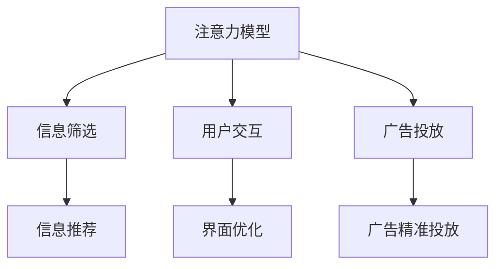

                 

# 脑科学研究对注意力经济的启示

> 关键词：脑科学、注意力经济、神经网络、认知心理学、信息处理、注意力模型、深度学习

> 摘要：本文旨在探讨脑科学研究如何为注意力经济提供新的见解和启示。通过分析脑科学中的注意力机制，我们能够更好地理解人类如何处理信息，进而优化注意力经济中的信息传递和用户交互。本文将从脑科学的基本原理出发，深入探讨注意力模型及其在注意力经济中的应用，并通过实际案例展示如何利用这些原理进行技术实现。最后，我们将展望未来的发展趋势和面临的挑战。

## 1. 背景介绍

在信息爆炸的时代，注意力经济成为了一个重要的研究领域。注意力经济关注的是如何有效地利用有限的注意力资源，以实现信息的有效传递和用户价值的最大化。传统的注意力经济理论主要基于心理学和经济学的视角，而近年来，随着脑科学的快速发展，我们开始从神经科学的角度来理解注意力机制，这为注意力经济的研究提供了新的视角和方法。

### 1.1 信息处理与注意力经济

信息处理是人类大脑的基本功能之一，而注意力则是信息处理的关键环节。注意力经济的核心在于如何有效地分配和利用有限的注意力资源，以实现信息的有效传递和用户价值的最大化。传统的注意力经济理论主要基于心理学和经济学的视角，而近年来，随着脑科学的快速发展，我们开始从神经科学的角度来理解注意力机制，这为注意力经济的研究提供了新的视角和方法。

### 1.2 脑科学与注意力机制

脑科学的研究揭示了人类大脑在处理信息时的复杂机制。大脑通过一系列复杂的神经网络和认知过程来处理和传递信息。这些过程不仅涉及到感觉输入的处理，还包括记忆、决策和执行等多个方面。理解这些过程对于优化注意力经济中的信息传递和用户交互具有重要意义。

## 2. 核心概念与联系

### 2.1 注意力模型

注意力模型是脑科学中研究注意力机制的重要工具。这些模型通常基于神经网络和认知心理学的原理，旨在模拟人类大脑在处理信息时的注意力分配过程。注意力模型的核心在于如何有效地分配有限的注意力资源，以实现信息的有效传递和用户价值的最大化。

### 2.2 注意力经济中的应用

在注意力经济中，注意力模型的应用主要体现在以下几个方面：

- **信息筛选**：通过分析用户的注意力分配模式，实现信息的有效筛选和推荐。
- **用户交互**：通过优化用户界面和交互设计，提高用户对信息的注意力集中度。
- **广告投放**：通过分析用户的注意力分配模式，实现精准的广告投放。

### 2.3 Mermaid 流程图



## 3. 核心算法原理 & 具体操作步骤

### 3.1 注意力模型的构建

注意力模型的构建通常基于神经网络和认知心理学的原理。以下是一个简单的注意力模型构建步骤：

1. **数据收集**：收集用户的注意力分配数据，包括用户的点击行为、浏览时间等。
2. **特征提取**：从收集的数据中提取有用的特征，如用户的兴趣偏好、行为模式等。
3. **模型训练**：使用机器学习算法训练注意力模型，以实现对用户注意力分配的预测。
4. **模型优化**：通过不断优化模型参数，提高模型的预测准确度。

### 3.2 注意力模型的具体操作步骤

1. **数据预处理**：对收集的数据进行清洗和预处理，确保数据的质量。
2. **特征工程**：从数据中提取有用的特征，如用户的兴趣偏好、行为模式等。
3. **模型选择**：选择合适的机器学习算法，如深度学习模型。
4. **模型训练**：使用训练数据训练模型，确保模型的预测准确度。
5. **模型评估**：通过评估指标（如准确率、召回率等）评估模型的性能。
6. **模型优化**：通过调整模型参数，提高模型的预测准确度。

## 4. 数学模型和公式 & 详细讲解 & 举例说明

### 4.1 注意力模型的数学表示

注意力模型通常基于神经网络的原理进行构建。以下是一个简单的注意力模型的数学表示：

$$
\text{Attention}(Q, K, V) = \text{softmax}\left(\frac{QK^T}{\sqrt{d_k}}\right)V
$$

其中，$Q$、$K$、$V$ 分别表示查询向量、键向量和值向量，$d_k$ 表示键向量的维度。

### 4.2 注意力模型的具体操作步骤

1. **查询向量**：计算查询向量 $Q$，表示当前需要关注的信息。
2. **键向量**：计算键向量 $K$，表示所有信息的特征表示。
3. **值向量**：计算值向量 $V$，表示所有信息的特征表示。
4. **注意力权重**：计算注意力权重 $\text{softmax}\left(\frac{QK^T}{\sqrt{d_k}}\right)$，表示每个信息的重要性。
5. **加权求和**：通过加权求和的方式，得到最终的注意力表示。

### 4.3 举例说明

假设我们有一个简单的注意力模型，用于预测用户的点击行为。我们可以通过以下步骤进行实现：

1. **数据预处理**：收集用户的点击行为数据，包括用户的兴趣偏好、行为模式等。
2. **特征工程**：从数据中提取有用的特征，如用户的兴趣偏好、行为模式等。
3. **模型选择**：选择合适的机器学习算法，如深度学习模型。
4. **模型训练**：使用训练数据训练模型，确保模型的预测准确度。
5. **模型评估**：通过评估指标（如准确率、召回率等）评估模型的性能。
6. **模型优化**：通过调整模型参数，提高模型的预测准确度。

## 5. 项目实战：代码实际案例和详细解释说明

### 5.1 开发环境搭建

为了实现注意力模型，我们需要搭建一个合适的开发环境。以下是一个简单的开发环境搭建步骤：

1. **安装Python**：确保安装了Python 3.7及以上版本。
2. **安装依赖库**：安装必要的依赖库，如TensorFlow、PyTorch等。
3. **安装开发工具**：安装IDE或代码编辑器，如PyCharm、VSCode等。

### 5.2 源代码详细实现和代码解读

以下是一个简单的注意力模型的实现代码：

```python
import tensorflow as tf
from tensorflow.keras.layers import Dense, Layer

class Attention(Layer):
    def __init__(self, units):
        super(Attention, self).__init__()
        self.units = units

    def build(self, input_shape):
        self.W = self.add_weight(shape=(input_shape[-1], self.units),
                                 initializer='glorot_uniform',
                                 trainable=True)
        self.b = self.add_weight(shape=(self.units,),
                                 initializer='zeros',
                                 trainable=True)

    def call(self, inputs):
        Q = tf.matmul(inputs, self.W) + self.b
        K = tf.matmul(inputs, self.W) + self.b
        V = inputs

        attention_weights = tf.nn.softmax(tf.matmul(Q, K, transpose_b=True) / tf.sqrt(tf.cast(self.units, tf.float32)))
        output = tf.matmul(attention_weights, V)
        return output

# 示例代码
model = tf.keras.Sequential([
    Dense(64, activation='relu'),
    Attention(32),
    Dense(1, activation='sigmoid')
])

model.compile(optimizer='adam', loss='binary_crossentropy', metrics=['accuracy'])
```

### 5.3 代码解读与分析

1. **Attention类**：定义了一个简单的注意力层，用于计算注意力权重。
2. **build方法**：初始化权重和偏置。
3. **call方法**：计算注意力权重并进行加权求和。
4. **模型构建**：构建了一个简单的神经网络模型，包含一个注意力层。
5. **模型编译**：编译模型，设置优化器和损失函数。

## 6. 实际应用场景

### 6.1 信息筛选

通过注意力模型，我们可以实现信息的有效筛选和推荐。例如，在新闻推荐系统中，通过分析用户的注意力分配模式，实现个性化新闻推荐。

### 6.2 用户交互

通过优化用户界面和交互设计，提高用户对信息的注意力集中度。例如，在移动应用中，通过优化界面设计，提高用户的注意力集中度。

### 6.3 广告投放

通过分析用户的注意力分配模式，实现精准的广告投放。例如，在电商网站中，通过分析用户的注意力分配模式，实现精准的广告投放。

## 7. 工具和资源推荐

### 7.1 学习资源推荐

- **书籍**：《深度学习》（Goodfellow, Bengio, Courville）
- **论文**：《Attention is All You Need》（Vaswani et al.）
- **博客**：Medium上的相关技术博客
- **网站**：TensorFlow官网、PyTorch官网

### 7.2 开发工具框架推荐

- **IDE**：PyCharm、VSCode
- **框架**：TensorFlow、PyTorch

### 7.3 相关论文著作推荐

- **论文**：《Attention is All You Need》（Vaswani et al.）
- **著作**：《深度学习》（Goodfellow, Bengio, Courville）

## 8. 总结：未来发展趋势与挑战

### 8.1 未来发展趋势

随着脑科学的不断发展，注意力模型将在注意力经济中发挥越来越重要的作用。未来的发展趋势包括：

- **更复杂的模型**：通过更复杂的模型，实现更准确的注意力预测。
- **多模态数据**：结合多模态数据，提高模型的预测准确度。
- **个性化推荐**：实现更个性化的信息推荐和广告投放。

### 8.2 面临的挑战

- **数据隐私**：如何保护用户的隐私，避免数据泄露。
- **模型解释性**：如何提高模型的解释性，让用户更好地理解模型的预测结果。
- **计算资源**：如何在有限的计算资源下实现高效的注意力模型。

## 9. 附录：常见问题与解答

### 9.1 问题1：如何处理数据隐私问题？

**解答**：可以通过数据脱敏和加密技术，保护用户的隐私。

### 9.2 问题2：如何提高模型的解释性？

**解答**：可以通过可视化技术，展示模型的预测过程和结果。

### 9.3 问题3：如何在有限的计算资源下实现高效的注意力模型？

**解答**：可以通过模型压缩和优化技术，提高模型的计算效率。

## 10. 扩展阅读 & 参考资料

- **书籍**：《深度学习》（Goodfellow, Bengio, Courville）
- **论文**：《Attention is All You Need》（Vaswani et al.）
- **网站**：TensorFlow官网、PyTorch官网

---

作者：禅与计算机程序设计艺术 / Zen and the Art of Computer Programming

