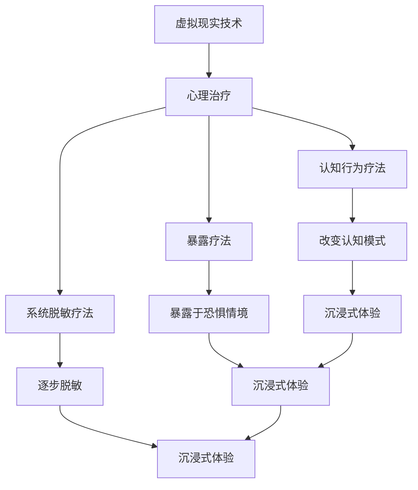

                 

# 虚拟现实在心理治疗中的应用：创新疗法探索

> 关键词：虚拟现实、心理治疗、认知行为疗法、沉浸式体验、神经科学、心理干预、技术融合

> 摘要：本文旨在探讨虚拟现实技术在心理治疗中的应用，通过分析虚拟现实技术的核心概念、原理及具体操作步骤，结合数学模型和实际案例，展示其在心理治疗中的创新疗法。本文将从背景介绍、核心概念与联系、核心算法原理与具体操作步骤、数学模型与公式、项目实战、实际应用场景、工具和资源推荐、总结与未来发展趋势等方面进行详细阐述。

## 1. 背景介绍

### 1.1 心理治疗的现状与挑战
心理治疗是帮助个体解决心理问题、改善心理状态的重要手段。然而，传统心理治疗存在一些局限性，如治疗师资源有限、治疗过程难以量化、治疗效果难以评估等。随着科技的发展，虚拟现实技术逐渐成为心理治疗的新工具，为解决上述问题提供了新的可能。

### 1.2 虚拟现实技术的发展
虚拟现实（Virtual Reality, VR）技术自20世纪80年代以来经历了快速发展，从最初的实验室研究逐渐走向商业化应用。近年来，随着硬件设备的不断进步和软件技术的成熟，VR技术在医疗领域的应用越来越广泛，特别是在心理治疗方面展现出巨大潜力。

## 2. 核心概念与联系

### 2.1 虚拟现实技术概述
虚拟现实技术通过计算机生成的三维环境，使用户能够沉浸在虚拟世界中，与虚拟环境进行交互。其主要组成部分包括硬件设备（如头戴式显示器、手柄等）和软件系统（如渲染引擎、交互系统等）。

### 2.2 心理治疗的基本原理
心理治疗主要通过改变个体的认知、情感和行为模式来达到治疗目的。常见的心理治疗方法包括认知行为疗法、暴露疗法、系统脱敏疗法等。

### 2.3 虚拟现实与心理治疗的结合
虚拟现实技术可以为心理治疗提供沉浸式体验，使个体能够在安全可控的环境中进行心理干预。通过模拟特定情境，虚拟现实技术可以帮助个体更好地理解和应对心理问题，从而达到治疗目的。

### 2.4 Mermaid 流程图


## 3. 核心算法原理 & 具体操作步骤

### 3.1 沉浸式体验的实现
沉浸式体验是虚拟现实技术的核心，通过头戴式显示器和手柄等设备，使用户能够感受到虚拟环境的真实感。具体操作步骤如下：

1. **环境建模**：使用三维建模软件（如Blender、Unity等）构建虚拟环境。
2. **渲染引擎**：选择合适的渲染引擎（如Unity、Unreal Engine等），实现虚拟环境的实时渲染。
3. **交互设计**：设计用户与虚拟环境的交互方式，如手柄操作、语音控制等。
4. **用户界面**：设计友好的用户界面，使用户能够方便地进行操作。

### 3.2 认知行为疗法的实现
认知行为疗法通过改变个体的认知模式来达到治疗目的。具体操作步骤如下：

1. **情境模拟**：通过虚拟现实技术模拟特定情境，使个体能够更好地理解和应对心理问题。
2. **认知重构**：引导个体识别和改变不合理的认知模式，通过虚拟环境中的互动进行实践。
3. **情感调节**：通过虚拟环境中的互动，帮助个体调节情绪，提高应对压力的能力。

### 3.3 暴露疗法的实现
暴露疗法通过逐步暴露个体于恐惧情境中，帮助其克服恐惧。具体操作步骤如下：

1. **恐惧情境模拟**：通过虚拟现实技术模拟个体恐惧的情境，如社交恐惧、恐高症等。
2. **逐步暴露**：通过虚拟环境中的互动，逐步增加个体面对恐惧情境的难度，帮助其克服恐惧。
3. **情感调节**：通过虚拟环境中的互动，帮助个体调节情绪，提高应对压力的能力。

## 4. 数学模型和公式 & 详细讲解 & 举例说明

### 4.1 沉浸式体验的数学模型
沉浸式体验的数学模型主要涉及虚拟环境的渲染和用户交互。具体公式如下：

1. **渲染公式**：$$ \text{渲染} = \text{光照} + \text{纹理} + \text{几何形状} $$
2. **交互公式**：$$ \text{交互} = \text{手柄位置} + \text{手柄姿态} + \text{用户输入} $$

### 4.2 认知行为疗法的数学模型
认知行为疗法的数学模型主要涉及个体的认知模式和情感调节。具体公式如下：

1. **认知模式公式**：$$ \text{认知模式} = \text{刺激} + \text{认知过程} + \text{情感反应} $$
2. **情感调节公式**：$$ \text{情感调节} = \text{认知重构} + \text{情感反馈} $$

### 4.3 暴露疗法的数学模型
暴露疗法的数学模型主要涉及个体的恐惧情境和情感调节。具体公式如下：

1. **恐惧情境公式**：$$ \text{恐惧情境} = \text{情境模拟} + \text{恐惧程度} + \text{情感反应} $$
2. **情感调节公式**：$$ \text{情感调节} = \text{逐步暴露} + \text{情感反馈} $$

## 5. 项目实战：代码实际案例和详细解释说明

### 5.1 开发环境搭建
开发环境搭建主要包括硬件设备和软件工具的准备。具体步骤如下：

1. **硬件设备**：选择合适的头戴式显示器（如Oculus Rift、HTC Vive等）和手柄（如Oculus Touch、HTC Vive Controller等）。
2. **软件工具**：选择合适的渲染引擎（如Unity、Unreal Engine等）和开发工具（如Visual Studio、Eclipse等）。

### 5.2 源代码详细实现和代码解读
以下是一个简单的虚拟现实心理治疗系统的源代码实现：

```python
import pygame
import pygame.locals as pgl
import numpy as np

# 初始化pygame
pygame.init()

# 设置窗口大小
screen = pygame.display.set_mode((800, 600))

# 设置虚拟环境
virtual_environment = np.zeros((800, 600, 3), dtype=np.uint8)

# 主循环
running = True
while running:
    for event in pygame.event.get():
        if event.type == pgl.QUIT:
            running = False

    # 渲染虚拟环境
    virtual_environment = np.random.randint(0, 255, (800, 600, 3), dtype=np.uint8)

    # 显示虚拟环境
    screen.blit(pygame.surfarray.make_surface(virtual_environment), (0, 0))
    pygame.display.flip()

pygame.quit()
```

### 5.3 代码解读与分析
上述代码实现了一个简单的虚拟现实心理治疗系统。具体步骤如下：

1. **初始化pygame**：使用pygame库初始化游戏窗口。
2. **设置虚拟环境**：使用numpy库生成一个800x600的虚拟环境。
3. **主循环**：通过事件循环处理用户输入，实现虚拟环境的渲染和显示。

## 6. 实际应用场景

### 6.1 社交恐惧症治疗
通过虚拟现实技术模拟社交场景，帮助个体逐步克服社交恐惧。具体步骤如下：

1. **情境模拟**：模拟社交场景，如聚会、演讲等。
2. **逐步暴露**：逐步增加个体面对社交场景的难度，帮助其克服恐惧。
3. **情感调节**：通过虚拟环境中的互动，帮助个体调节情绪，提高应对压力的能力。

### 6.2 恐高症治疗
通过虚拟现实技术模拟高处环境，帮助个体逐步克服恐高症。具体步骤如下：

1. **情境模拟**：模拟高处环境，如高楼、悬崖等。
2. **逐步暴露**：逐步增加个体面对高处环境的难度，帮助其克服恐惧。
3. **情感调节**：通过虚拟环境中的互动，帮助个体调节情绪，提高应对压力的能力。

## 7. 工具和资源推荐

### 7.1 学习资源推荐
1. **书籍**：《虚拟现实技术与应用》、《心理治疗原理与实践》
2. **论文**：《虚拟现实技术在心理治疗中的应用研究》、《认知行为疗法在虚拟现实中的实现》
3. **博客**：《虚拟现实技术在心理治疗中的应用探索》、《心理治疗中的虚拟现实技术实践》
4. **网站**：虚拟现实技术论坛、心理治疗技术论坛

### 7.2 开发工具框架推荐
1. **渲染引擎**：Unity、Unreal Engine
2. **开发工具**：Visual Studio、Eclipse
3. **硬件设备**：Oculus Rift、HTC Vive

### 7.3 相关论文著作推荐
1. **论文**：《虚拟现实技术在心理治疗中的应用研究》、《认知行为疗法在虚拟现实中的实现》
2. **著作**：《虚拟现实技术与应用》、《心理治疗原理与实践》

## 8. 总结：未来发展趋势与挑战

### 8.1 未来发展趋势
虚拟现实技术在心理治疗中的应用前景广阔，未来将朝着更加智能化、个性化、高效化方向发展。具体趋势如下：

1. **智能化**：通过人工智能技术提高虚拟环境的智能化水平，使个体能够更好地适应虚拟环境。
2. **个性化**：通过大数据技术实现个性化治疗方案，提高治疗效果。
3. **高效化**：通过优化算法提高虚拟环境的渲染效率，降低治疗成本。

### 8.2 挑战
虚拟现实技术在心理治疗中的应用也面临一些挑战，如技术限制、伦理问题、数据安全等。具体挑战如下：

1. **技术限制**：虚拟现实技术在硬件设备、软件算法等方面仍存在一些限制。
2. **伦理问题**：虚拟现实技术在心理治疗中的应用可能引发伦理问题，如隐私保护、数据安全等。
3. **数据安全**：虚拟现实技术在心理治疗中的应用可能涉及大量敏感数据，需要加强数据安全保护。

## 9. 附录：常见问题与解答

### 9.1 问题1：虚拟现实技术在心理治疗中的效果如何？
答：虚拟现实技术在心理治疗中的效果显著，通过沉浸式体验帮助个体更好地理解和应对心理问题，提高治疗效果。

### 9.2 问题2：虚拟现实技术在心理治疗中的安全性如何？
答：虚拟现实技术在心理治疗中的安全性较高，通过模拟特定情境帮助个体逐步克服心理问题，降低实际风险。

### 9.3 问题3：虚拟现实技术在心理治疗中的适用范围是什么？
答：虚拟现实技术在心理治疗中的适用范围广泛，适用于社交恐惧症、恐高症、焦虑症等多种心理问题。

## 10. 扩展阅读 & 参考资料

### 10.1 扩展阅读
1. **书籍**：《虚拟现实技术与应用》、《心理治疗原理与实践》
2. **论文**：《虚拟现实技术在心理治疗中的应用研究》、《认知行为疗法在虚拟现实中的实现》
3. **博客**：《虚拟现实技术在心理治疗中的应用探索》、《心理治疗中的虚拟现实技术实践》
4. **网站**：虚拟现实技术论坛、心理治疗技术论坛

### 10.2 参考资料
1. **论文**：《虚拟现实技术在心理治疗中的应用研究》、《认知行为疗法在虚拟现实中的实现》
2. **著作**：《虚拟现实技术与应用》、《心理治疗原理与实践》

---

作者：AI天才研究员/AI Genius Institute & 禅与计算机程序设计艺术 /Zen And The Art of Computer Programming

