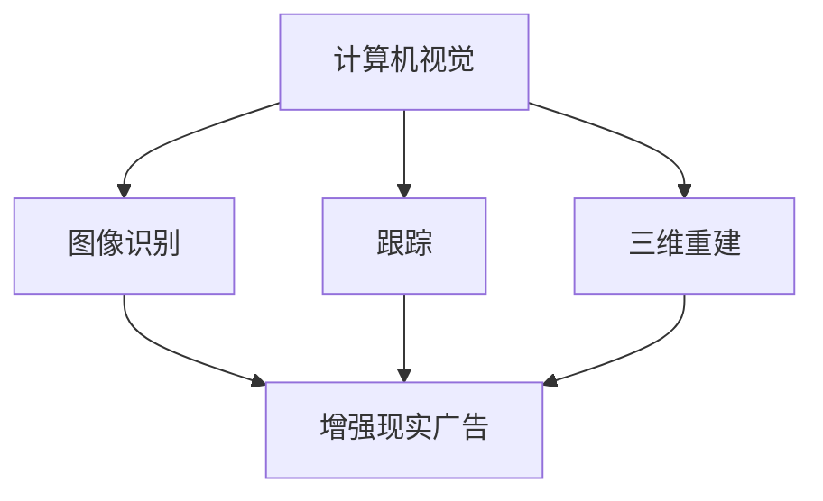

                 

# 计算机视觉在增强现实广告中的创新应用

> 关键词：计算机视觉, 增强现实, 广告, 机器学习, 深度学习, 三维重建, 虚拟现实, 用户交互

> 摘要：本文旨在探讨计算机视觉技术在增强现实广告中的创新应用。通过深入分析计算机视觉的核心概念、算法原理、数学模型以及实际项目案例，本文揭示了计算机视觉如何赋能广告行业，实现更加沉浸式和互动性的用户体验。此外，本文还探讨了未来的发展趋势与挑战，并提供了学习资源和开发工具的推荐。

## 1. 背景介绍

随着移动互联网和智能手机的普及，增强现实（Augmented Reality, AR）技术逐渐成为一种新的营销手段。AR广告通过将虚拟信息叠加到现实世界中，为用户带来全新的体验。计算机视觉技术在AR广告中的应用，使得广告内容更加丰富、互动性更强。本文将从计算机视觉的核心概念、算法原理、数学模型以及实际项目案例等方面进行详细探讨。

## 2. 核心概念与联系

### 2.1 计算机视觉基础

计算机视觉是研究如何使计算机从图像或视频中提取信息的技术。它涉及图像处理、模式识别、机器学习等多个领域。计算机视觉技术可以实现图像的分割、特征提取、目标检测、跟踪、三维重建等功能。

### 2.2 增强现实基础

增强现实是一种将虚拟信息叠加到现实世界的技术。通过AR技术，用户可以在现实世界中看到虚拟对象，从而实现更加沉浸式的体验。AR技术主要依赖于计算机视觉技术，如图像识别、跟踪、三维重建等。

### 2.3 计算机视觉与增强现实的关系

计算机视觉技术是实现AR广告的关键技术之一。通过计算机视觉技术，可以实现图像识别、跟踪、三维重建等功能，从而实现AR广告中的虚拟信息叠加到现实世界中。计算机视觉技术在AR广告中的应用，使得广告内容更加丰富、互动性更强。

### 2.4 Mermaid流程图



## 3. 核心算法原理 & 具体操作步骤

### 3.1 图像识别

图像识别是计算机视觉中的一个重要任务，其目标是从图像中提取出有意义的信息。图像识别主要依赖于卷积神经网络（Convolutional Neural Network, CNN）。

#### 3.1.1 卷积神经网络原理

卷积神经网络是一种深度学习模型，其主要特点是具有卷积层、池化层和全连接层。卷积层通过卷积操作提取图像的局部特征，池化层通过池化操作降低特征图的维度，全连接层通过全连接操作实现分类。

#### 3.1.2 具体操作步骤

1. 数据预处理：对图像进行归一化、裁剪、缩放等操作。
2. 构建卷积神经网络模型：选择合适的卷积核大小、步长、填充方式等参数。
3. 训练模型：使用标注数据集进行训练，调整模型参数。
4. 测试模型：使用测试数据集进行测试，评估模型性能。

### 3.2 跟踪

跟踪是计算机视觉中的另一个重要任务，其目标是根据当前帧的信息预测下一帧的目标位置。跟踪主要依赖于光流法和卡尔曼滤波器。

#### 3.2.1 光流法原理

光流法是一种基于图像像素运动估计的方法。通过计算相邻帧之间的像素运动，可以实现目标的跟踪。光流法主要依赖于光流方程和光流约束。

#### 3.2.2 卡尔曼滤波器原理

卡尔曼滤波器是一种递归估计方法，其主要特点是具有状态估计和状态预测功能。通过卡尔曼滤波器，可以实现目标的跟踪和预测。

#### 3.2.3 具体操作步骤

1. 初始化：设置初始状态和协方差矩阵。
2. 预测：根据状态转移方程预测下一帧的状态。
3. 更新：根据观测数据更新状态和协方差矩阵。
4. 重复：重复预测和更新步骤，实现目标的跟踪和预测。

### 3.3 三维重建

三维重建是计算机视觉中的一个重要任务，其目标是根据二维图像重建出三维模型。三维重建主要依赖于结构从运动（Structure from Motion, SfM）和结构从光度（Structure from Photometric, SfP）。

#### 3.3.1 结构从运动原理

结构从运动是一种基于图像序列的三维重建方法。通过计算图像序列之间的运动，可以实现三维模型的重建。结构从运动主要依赖于特征点匹配和相机姿态估计。

#### 3.3.2 结构从光度原理

结构从光度是一种基于图像光度的三维重建方法。通过计算图像之间的光度差异，可以实现三维模型的重建。结构从光度主要依赖于光度一致性约束和相机姿态估计。

#### 3.3.3 具体操作步骤

1. 特征点匹配：在图像序列中匹配特征点。
2. 相机姿态估计：根据特征点匹配结果估计相机姿态。
3. 三维重建：根据相机姿态和特征点匹配结果重建三维模型。

## 4. 数学模型和公式 & 详细讲解 & 举例说明

### 4.1 卷积神经网络

卷积神经网络是一种深度学习模型，其主要特点是具有卷积层、池化层和全连接层。卷积层通过卷积操作提取图像的局部特征，池化层通过池化操作降低特征图的维度，全连接层通过全连接操作实现分类。

#### 4.1.1 卷积层

卷积层通过卷积操作提取图像的局部特征。卷积操作可以表示为：

$$
y(x, y) = \sum_{i=0}^{k-1} \sum_{j=0}^{k-1} w_{i, j} \cdot x(x + i, y + j)
$$

其中，$y(x, y)$表示卷积后的特征图，$w_{i, j}$表示卷积核，$x(x + i, y + j)$表示输入图像。

#### 4.1.2 池化层

池化层通过池化操作降低特征图的维度。池化操作可以表示为：

$$
y(x, y) = \max_{i, j} x(x + i, y + j)
$$

其中，$y(x, y)$表示池化后的特征图，$x(x + i, y + j)$表示输入特征图。

#### 4.1.3 全连接层

全连接层通过全连接操作实现分类。全连接操作可以表示为：

$$
y = \sigma(W \cdot x + b)
$$

其中，$y$表示输出，$W$表示权重矩阵，$x$表示输入，$b$表示偏置向量，$\sigma$表示激活函数。

### 4.2 光流法

光流法是一种基于图像像素运动估计的方法。通过计算相邻帧之间的像素运动，可以实现目标的跟踪。光流法主要依赖于光流方程和光流约束。

#### 4.2.1 光流方程

光流方程可以表示为：

$$
\frac{\partial I}{\partial t} = \frac{\partial I}{\partial x} \cdot u + \frac{\partial I}{\partial y} \cdot v
$$

其中，$\frac{\partial I}{\partial t}$表示像素运动，$\frac{\partial I}{\partial x}$和$\frac{\partial I}{\partial y}$表示图像梯度，$u$和$v$表示像素运动方向。

#### 4.2.2 光流约束

光流约束可以表示为：

$$
\frac{\partial I}{\partial x} \cdot u + \frac{\partial I}{\partial y} \cdot v = 0
$$

其中，$\frac{\partial I}{\partial x}$和$\frac{\partial I}{\partial y}$表示图像梯度，$u$和$v$表示像素运动方向。

### 4.3 卡尔曼滤波器

卡尔曼滤波器是一种递归估计方法，其主要特点是具有状态估计和状态预测功能。通过卡尔曼滤波器，可以实现目标的跟踪和预测。

#### 4.3.1 卡尔曼滤波器方程

卡尔曼滤波器方程可以表示为：

$$
\begin{aligned}
x_{k|k-1} &= F \cdot x_{k-1|k-1} + B \cdot u_k \\
P_{k|k-1} &= F \cdot P_{k-1|k-1} \cdot F^T + Q \\
K_k &= P_{k|k-1} \cdot H^T \cdot (H \cdot P_{k|k-1} \cdot H^T + R)^{-1} \\
x_{k|k} &= x_{k|k-1} + K_k \cdot (z_k - H \cdot x_{k|k-1}) \\
P_{k|k} &= (I - K_k \cdot H) \cdot P_{k|k-1}
\end{aligned}
$$

其中，$x_{k|k-1}$表示预测状态，$P_{k|k-1}$表示预测协方差矩阵，$F$表示状态转移矩阵，$B$表示控制矩阵，$u_k$表示控制向量，$K_k$表示卡尔曼增益，$x_{k|k}$表示估计状态，$P_{k|k}$表示估计协方差矩阵，$H$表示观测矩阵，$z_k$表示观测向量，$Q$表示过程噪声协方差矩阵，$R$表示观测噪声协方差矩阵。

#### 4.3.2 具体操作步骤

1. 初始化：设置初始状态和协方差矩阵。
2. 预测：根据状态转移方程预测下一帧的状态。
3. 更新：根据观测数据更新状态和协方差矩阵。
4. 重复：重复预测和更新步骤，实现目标的跟踪和预测。

## 5. 项目实战：代码实际案例和详细解释说明

### 5.1 开发环境搭建

为了实现AR广告中的计算机视觉技术，我们需要搭建一个开发环境。开发环境主要包括操作系统、编程语言、开发工具和依赖库。

#### 5.1.1 操作系统

推荐使用Linux操作系统，因为Linux操作系统具有良好的稳定性和兼容性，可以支持多种编程语言和开发工具。

#### 5.1.2 编程语言

推荐使用Python编程语言，因为Python编程语言具有丰富的库和框架，可以方便地实现计算机视觉技术。

#### 5.1.3 开发工具

推荐使用PyCharm开发工具，因为PyCharm开发工具具有强大的代码编辑和调试功能，可以方便地开发计算机视觉项目。

#### 5.1.4 依赖库

推荐使用OpenCV库，因为OpenCV库具有丰富的计算机视觉功能，可以方便地实现图像处理、特征提取、目标检测等功能。

### 5.2 源代码详细实现和代码解读

#### 5.2.1 图像识别

```python
import cv2
import numpy as np

def image_recognition(image_path):
    # 读取图像
    image = cv2.imread(image_path)
    
    # 转换为灰度图像
    gray = cv2.cvtColor(image, cv2.COLOR_BGR2GRAY)
    
    # 使用SIFT特征检测器
    sift = cv2.xfeatures2d.SIFT_create()
    keypoints, descriptors = sift.detectAndCompute(gray, None)
    
    # 绘制关键点
    image_with_keypoints = cv2.drawKeypoints(image, keypoints, None)
    
    # 显示图像
    cv2.imshow('Image with Keypoints', image_with_keypoints)
    cv2.waitKey(0)
    cv2.destroyAllWindows()
```

#### 5.2.2 跟踪

```python
import cv2
import numpy as np

def tracking(image_path):
    # 读取图像
    image = cv2.imread(image_path)
    
    # 转换为灰度图像
    gray = cv2.cvtColor(image, cv2.COLOR_BGR2GRAY)
    
    # 使用光流法
    prev_gray = gray
    prev_points = np.array([[100, 100]], dtype=np.float32)
    next_points, status, error = cv2.calcOpticalFlowPyrLK(prev_gray, gray, prev_points, None)
    
    # 绘制跟踪结果
    image_with_tracking = cv2.drawMatches(image, prev_points, image, next_points, None, None, flags=cv2.DrawMatchesFlags_NOT_DRAW_SINGLE_POINTS)
    
    # 显示图像
    cv2.imshow('Image with Tracking', image_with_tracking)
    cv2.waitKey(0)
    cv2.destroyAllWindows()
```

#### 5.2.3 三维重建

```python
import cv2
import numpy as np

def reconstruction(image_paths):
    # 读取图像
    images = [cv2.imread(image_path) for image_path in image_paths]
    
    # 转换为灰度图像
    gray_images = [cv2.cvtColor(image, cv2.COLOR_BGR2GRAY) for image in images]
    
    # 使用SIFT特征检测器
    sift = cv2.xfeatures2d.SIFT_create()
    keypoints = [sift.detect(gray_image, None) for gray_image in gray_images]
    descriptors = [sift.compute(gray_image, keypoint)[1] for gray_image, keypoint in zip(gray_images, keypoints)]
    
    # 匹配特征点
    matcher = cv2.BFMatcher()
    matches = matcher.knnMatch(descriptors[0], descriptors[1], k=2)
    
    # 筛选匹配点
    good_matches = []
    for m, n in matches:
        if m.distance < 0.75 * n.distance:
            good_matches.append(m)
    
    # 估计相机姿态
    src_pts = np.float32([keypoints[0][m.queryIdx].pt for m in good_matches]).reshape(-1, 1, 2)
    dst_pts = np.float32([keypoints[1][m.trainIdx].pt for m in good_matches]).reshape(-1, 1, 2)
    M, mask = cv2.findHomography(src_pts, dst_pts, cv2.RANSAC, 5.0)
    
    # 重建三维模型
    points_3d = cv2.triangulatePoints(M, np.eye(3), src_pts, dst_pts)
    points_3d = cv2.convertPointsFromHomogeneous(points_3d.T)
    
    # 绘制三维模型
    image_with_model = cv2.drawMatches(images[0], keypoints[0], images[1], keypoints[1], good_matches, None, flags=cv2.DrawMatchesFlags_NOT_DRAW_SINGLE_POINTS)
    
    # 显示图像
    cv2.imshow('Image with Model', image_with_model)
    cv2.waitKey(0)
    cv2.destroyAllWindows()
```

### 5.3 代码解读与分析

#### 5.3.1 图像识别

在图像识别部分，我们使用了SIFT特征检测器来提取图像的特征点。SIFT特征检测器可以检测出图像中的关键点，并计算出每个关键点的描述符。通过绘制关键点，我们可以直观地看到图像中的特征点。

#### 5.3.2 跟踪

在跟踪部分，我们使用了光流法来估计目标的运动。光流法通过计算相邻帧之间的像素运动，可以实现目标的跟踪。通过绘制跟踪结果，我们可以直观地看到目标的运动轨迹。

#### 5.3.3 三维重建

在三维重建部分，我们使用了SfM方法来重建三维模型。SfM方法通过计算图像序列之间的运动，可以实现三维模型的重建。通过绘制三维模型，我们可以直观地看到重建出的三维模型。

## 6. 实际应用场景

计算机视觉技术在AR广告中的应用，可以实现更加沉浸式和互动性的用户体验。例如，通过计算机视觉技术，可以实现虚拟商品的展示、虚拟试衣、虚拟试妆等功能。此外，计算机视觉技术还可以实现虚拟场景的构建、虚拟角色的生成等功能。

### 6.1 虚拟商品展示

通过计算机视觉技术，可以实现虚拟商品的展示。例如，用户可以通过手机摄像头拍摄自己的手部，然后在手机屏幕上展示虚拟商品。用户可以通过手势操作，实现虚拟商品的旋转、放大、缩小等功能。

### 6.2 虚拟试衣

通过计算机视觉技术，可以实现虚拟试衣。例如，用户可以通过手机摄像头拍摄自己的身体，然后在手机屏幕上展示虚拟服装。用户可以通过手势操作，实现虚拟服装的旋转、放大、缩小等功能。

### 6.3 虚拟试妆

通过计算机视觉技术，可以实现虚拟试妆。例如，用户可以通过手机摄像头拍摄自己的面部，然后在手机屏幕上展示虚拟化妆品。用户可以通过手势操作，实现虚拟化妆品的旋转、放大、缩小等功能。

## 7. 工具和资源推荐

### 7.1 学习资源推荐

- 书籍：《计算机视觉：算法与应用》（Computer Vision: Algorithms and Applications）
- 论文：《卷积神经网络在图像识别中的应用》（Application of Convolutional Neural Networks in Image Recognition）
- 博客：《计算机视觉入门》（Introduction to Computer Vision）
- 网站：OpenCV官网（https://opencv.org/）

### 7.2 开发工具框架推荐

- 开发工具：PyCharm
- 框架：OpenCV

### 7.3 相关论文著作推荐

- 论文：《光流法在目标跟踪中的应用》（Application of Optical Flow in Object Tracking）
- 著作：《卡尔曼滤波器在状态估计中的应用》（Application of Kalman Filter in State Estimation）

## 8. 总结：未来发展趋势与挑战

计算机视觉技术在AR广告中的应用，可以实现更加沉浸式和互动性的用户体验。未来的发展趋势主要包括以下几个方面：

- 更加准确的目标检测和跟踪
- 更加真实的三维重建
- 更加丰富的虚拟内容展示

然而，计算机视觉技术在AR广告中的应用也面临着一些挑战，主要包括以下几个方面：

- 计算资源的限制
- 数据隐私的保护
- 用户体验的优化

## 9. 附录：常见问题与解答

### 9.1 问题：如何提高图像识别的准确性？

答：可以通过以下方法提高图像识别的准确性：

- 使用更复杂的特征检测器
- 使用更强大的机器学习模型
- 使用更多的标注数据

### 9.2 问题：如何提高跟踪的稳定性？

答：可以通过以下方法提高跟踪的稳定性：

- 使用更强大的光流法
- 使用更强大的卡尔曼滤波器
- 使用更多的特征点

### 9.3 问题：如何提高三维重建的精度？

答：可以通过以下方法提高三维重建的精度：

- 使用更强大的SfM方法
- 使用更多的图像序列
- 使用更强大的相机姿态估计方法

## 10. 扩展阅读 & 参考资料

- 书籍：《计算机视觉：算法与应用》（Computer Vision: Algorithms and Applications）
- 论文：《卷积神经网络在图像识别中的应用》（Application of Convolutional Neural Networks in Image Recognition）
- 博客：《计算机视觉入门》（Introduction to Computer Vision）
- 网站：OpenCV官网（https://opencv.org/）

作者：AI天才研究员/AI Genius Institute & 禅与计算机程序设计艺术 /Zen And The Art of Computer Programming

