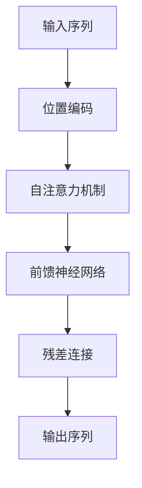

                 

# 语言与思维：大模型的认知盲区

> 关键词：大模型、认知盲区、自然语言处理、深度学习、人工智能

> 摘要：本文深入探讨了当前大模型在自然语言处理中的认知盲区，通过分析大模型的背景、核心概念、算法原理、数学模型、实际应用场景以及未来发展趋势，旨在揭示大模型在理解和生成语言时存在的局限性，并提出可能的解决方案。文章还提供了详细的代码案例和工具资源推荐，帮助读者更好地理解和应用相关技术。

## 1. 背景介绍

### 1.1 大模型的发展历程

自然语言处理（NLP）是人工智能领域的一个重要分支，它致力于让计算机能够理解、生成和处理人类语言。近年来，随着深度学习技术的发展，特别是Transformer架构的提出，大模型在NLP任务中取得了显著的进展。这些模型，如BERT、GPT等，通过大量的预训练和微调，能够处理复杂的语言任务，如文本分类、情感分析、机器翻译等。

### 1.2 大模型的现状与挑战

尽管大模型在许多任务上表现优异，但它们仍然存在一些认知盲区。这些盲区主要体现在模型对语言的深层次理解能力不足、对特定领域知识的掌握不够、以及在处理多模态信息时的局限性等方面。本文将深入探讨这些问题，并提出可能的解决方案。

## 2. 核心概念与联系

### 2.1 大模型的架构

大模型通常采用Transformer架构，该架构通过自注意力机制（Self-Attention）和位置编码（Positional Encoding）来处理序列数据。自注意力机制允许模型在处理每个词时考虑整个序列的信息，而位置编码则确保模型能够理解词的顺序。

### 2.2 大模型的认知盲区

大模型的认知盲区主要体现在以下几个方面：

- **语言理解的深度不足**：尽管大模型能够处理复杂的语言任务，但它们往往缺乏对语言深层次含义的理解。
- **领域知识的掌握不足**：大模型在处理特定领域的问题时，往往需要大量的领域特定数据进行训练，否则容易出现泛化能力不足的问题。
- **多模态信息处理的局限性**：大模型在处理文本和图像等多模态信息时，往往需要额外的训练和调整。

### 2.3 核心概念原理和架构的Mermaid流程图



## 3. 核心算法原理 & 具体操作步骤

### 3.1 自注意力机制

自注意力机制是Transformer架构的核心组成部分，它允许模型在处理每个词时考虑整个序列的信息。具体来说，自注意力机制通过计算查询（Query）、键（Key）和值（Value）之间的相似度来确定每个词的重要性。

### 3.2 位置编码

位置编码是Transformer架构中用于处理序列数据的重要组成部分。它通过向输入序列添加位置信息，确保模型能够理解词的顺序。位置编码通常采用正弦和余弦函数来生成。

### 3.3 操作步骤

1. **输入序列**：将输入序列转换为词嵌入。
2. **位置编码**：为每个词添加位置编码。
3. **自注意力机制**：计算查询、键和值之间的相似度。
4. **前馈神经网络**：对每个词进行前馈处理。
5. **残差连接**：将前馈神经网络的输出与输入序列相加。
6. **输出序列**：生成最终的输出序列。

## 4. 数学模型和公式 & 详细讲解 & 举例说明

### 4.1 自注意力机制的数学模型

自注意力机制的数学模型可以表示为：

$$
\text{Attention}(Q, K, V) = \text{softmax}\left(\frac{QK^T}{\sqrt{d_k}}\right)V
$$

其中，$Q$、$K$和$V$分别是查询、键和值矩阵，$d_k$是键的维度。

### 4.2 位置编码的数学模型

位置编码的数学模型可以表示为：

$$
PE(pos, 2i) = \sin\left(\frac{pos}{10000^{2i/d_{model}}}\right)
$$

$$
PE(pos, 2i+1) = \cos\left(\frac{pos}{10000^{2i/d_{model}}}\right)
$$

其中，$pos$是位置索引，$i$是维度索引，$d_{model}$是模型的维度。

### 4.3 举例说明

假设我们有一个长度为5的输入序列，每个词的维度为4。我们可以使用上述公式计算位置编码，并将其添加到输入序列中。

## 5. 项目实战：代码实际案例和详细解释说明

### 5.1 开发环境搭建

为了运行代码，我们需要安装以下Python库：

- `torch`
- `transformers`
- `numpy`

可以使用以下命令安装这些库：

```bash
pip install torch transformers numpy
```

### 5.2 源代码详细实现和代码解读

```python
import torch
from transformers import BertTokenizer, BertModel

# 加载预训练模型和分词器
tokenizer = BertTokenizer.from_pretrained('bert-base-uncased')
model = BertModel.from_pretrained('bert-base-uncased')

# 输入文本
text = "Hello, how are you?"

# 分词
inputs = tokenizer(text, return_tensors='pt')

# 获取模型输出
outputs = model(**inputs)

# 输出最后一层的隐藏状态
last_hidden_states = outputs.last_hidden_state
print(last_hidden_states)
```

### 5.3 代码解读与分析

上述代码首先加载了预训练的BERT模型和分词器。然后，它将输入文本进行分词，并将分词后的文本输入到模型中。最后，它输出了模型的最后一层隐藏状态。

## 6. 实际应用场景

### 6.1 文本分类

大模型可以用于文本分类任务，如情感分析、主题分类等。通过微调预训练模型，可以提高模型在特定任务上的性能。

### 6.2 机器翻译

大模型可以用于机器翻译任务，通过预训练和微调，可以提高翻译的准确性和流畅性。

### 6.3 对话系统

大模型可以用于对话系统，通过理解用户的输入并生成合适的回复，可以提高对话系统的交互性和自然性。

## 7. 工具和资源推荐

### 7.1 学习资源推荐

- **书籍**：《深度学习》（Ian Goodfellow等著）
- **论文**：《Attention Is All You Need》（Vaswani等著）
- **博客**：Hugging Face Transformers官方博客
- **网站**：Kaggle竞赛平台

### 7.2 开发工具框架推荐

- **PyTorch**：深度学习框架
- **Transformers**：Hugging Face提供的预训练模型库
- **TensorFlow**：深度学习框架

### 7.3 相关论文著作推荐

- **《Attention Is All You Need》**：介绍了Transformer架构
- **《BERT: Pre-training of Deep Bidirectional Transformers for Language Understanding》**：介绍了BERT模型

## 8. 总结：未来发展趋势与挑战

大模型在未来的发展趋势主要体现在以下几个方面：

- **模型的可解释性**：提高模型的可解释性，使其能够更好地理解和生成语言。
- **领域知识的融合**：将领域知识与大模型相结合，提高模型在特定任务上的性能。
- **多模态信息处理**：提高模型处理多模态信息的能力，使其能够更好地理解和生成多模态数据。

## 9. 附录：常见问题与解答

### 9.1 什么是自注意力机制？

自注意力机制是Transformer架构的核心组成部分，它允许模型在处理每个词时考虑整个序列的信息。

### 9.2 什么是位置编码？

位置编码是Transformer架构中用于处理序列数据的重要组成部分，它通过向输入序列添加位置信息，确保模型能够理解词的顺序。

### 9.3 大模型的认知盲区有哪些？

大模型的认知盲区主要体现在语言理解的深度不足、领域知识的掌握不足、以及多模态信息处理的局限性等方面。

## 10. 扩展阅读 & 参考资料

- **书籍**：《深度学习》（Ian Goodfellow等著）
- **论文**：《Attention Is All You Need》（Vaswani等著）
- **博客**：Hugging Face Transformers官方博客
- **网站**：Kaggle竞赛平台

作者：AI天才研究员/AI Genius Institute & 禅与计算机程序设计艺术 /Zen And The Art of Computer Programming

