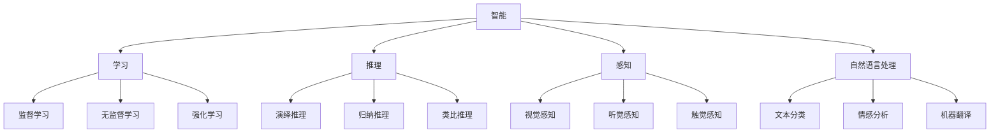

                 

# 达特茅斯会议的科学家团队

> 关键词：达特茅斯会议, 人工智能, 图灵奖, 科学家团队, 逻辑推理, 程序设计, 技术博客

> 摘要：本文将回顾1956年达特茅斯会议，探讨会议中科学家团队对人工智能领域的开创性贡献。通过逐步分析和推理，我们将深入理解会议的核心概念、算法原理、数学模型，并通过实际代码案例进行详细解释。最后，我们将展望人工智能的未来发展趋势与挑战。

## 1. 背景介绍

1956年，达特茅斯会议（Dartmouth Conference）在汉诺威新罕布什尔州的达特茅斯学院举行，标志着人工智能（Artificial Intelligence, AI）作为一个独立学科的诞生。会议由约翰·麦卡锡（John McCarthy）、马文·明斯基（Marvin Minsky）、克劳德·香农（Claude Shannon）和纳撒尼尔·罗切斯特（Nathaniel Rochester）共同发起。这次会议汇聚了当时最杰出的科学家，包括约翰·冯·诺伊曼（John von Neumann）、艾伦·图灵（Alan Turing）等，共同探讨了机器智能的可能性。

### 1.1 会议背景

- **历史背景**：20世纪50年代，计算机科学正处于快速发展阶段，早期的计算机已经能够执行复杂的计算任务。然而，人们开始思考计算机是否能够模拟人类的智能。
- **学术背景**：艾伦·图灵在1950年提出了图灵测试，引发了关于机器能否思考的广泛讨论。约翰·冯·诺伊曼也在研究如何使计算机具有更高级的智能。
- **组织背景**：约翰·麦卡锡和马文·明斯基等人意识到，需要一个专门的会议来探讨机器智能的可能性，从而促成了达特茅斯会议的召开。

### 1.2 会议目标

- **定义AI**：明确人工智能的定义和目标。
- **研究方向**：探讨机器学习、自然语言处理、感知和推理等领域的研究方向。
- **技术挑战**：讨论实现机器智能的技术挑战和解决方案。

## 2. 核心概念与联系

### 2.1 人工智能定义

- **AI定义**：人工智能是指由机器模拟、扩展和增强人类智能的技术。
- **核心概念**：智能、学习、推理、感知、自然语言处理等。

### 2.2 核心概念原理与架构

#### 2.2.1 智能

- **智能定义**：智能是指能够理解、学习、推理、解决问题和适应环境的能力。
- **智能模型**：智能模型可以分为感知智能、认知智能和行为智能。

#### 2.2.2 学习

- **学习定义**：学习是指机器通过经验或数据改进其性能的能力。
- **学习模型**：学习模型可以分为监督学习、无监督学习和强化学习。

#### 2.2.3 推理

- **推理定义**：推理是指机器根据已知信息推导出新信息的能力。
- **推理模型**：推理模型可以分为演绎推理、归纳推理和类比推理。

#### 2.2.4 感知

- **感知定义**：感知是指机器通过传感器获取环境信息的能力。
- **感知模型**：感知模型可以分为视觉感知、听觉感知和触觉感知。

#### 2.2.5 自然语言处理

- **自然语言处理定义**：自然语言处理是指机器理解和生成人类语言的能力。
- **自然语言处理模型**：自然语言处理模型可以分为文本分类、情感分析、机器翻译等。

### 2.3 Mermaid流程图



## 3. 核心算法原理 & 具体操作步骤

### 3.1 监督学习

- **监督学习定义**：监督学习是指机器通过已标注的数据学习映射关系。
- **具体操作步骤**：
  1. 收集标注数据。
  2. 选择合适的特征。
  3. 选择合适的模型。
  4. 训练模型。
  5. 评估模型性能。
  6. 调整模型参数。

### 3.2 无监督学习

- **无监督学习定义**：无监督学习是指机器通过未标注的数据学习数据的内在结构。
- **具体操作步骤**：
  1. 收集未标注数据。
  2. 选择合适的特征。
  3. 选择合适的模型。
  4. 训练模型。
  5. 评估模型性能。
  6. 调整模型参数。

### 3.3 强化学习

- **强化学习定义**：强化学习是指机器通过与环境的交互学习最优策略。
- **具体操作步骤**：
  1. 定义环境和奖励机制。
  2. 选择合适的模型。
  3. 训练模型。
  4. 评估模型性能。
  5. 调整模型参数。

## 4. 数学模型和公式 & 详细讲解 & 举例说明

### 4.1 监督学习

- **数学模型**：监督学习的数学模型可以表示为 \( y = f(x) \)，其中 \( x \) 是输入特征，\( y \) 是输出标签，\( f \) 是学习到的映射关系。
- **公式**：损失函数 \( L(y, \hat{y}) \) 衡量预测值 \( \hat{y} \) 与真实值 \( y \) 之间的差异。
- **举例说明**：假设我们有一个二分类问题，使用逻辑回归模型，损失函数可以表示为 \( L(y, \hat{y}) = -y \log(\hat{y}) - (1-y) \log(1-\hat{y}) \)。

### 4.2 无监督学习

- **数学模型**：无监督学习的数学模型可以表示为 \( Z = g(X) \)，其中 \( X \) 是输入数据，\( Z \) 是学习到的内在结构，\( g \) 是学习到的映射关系。
- **公式**：聚类损失函数 \( L(Z, X) \) 衡量聚类结果与输入数据之间的差异。
- **举例说明**：假设我们有一个聚类问题，使用K-means算法，聚类损失函数可以表示为 \( L(Z, X) = \sum_{i=1}^{n} \sum_{j=1}^{k} \mathbb{1}_{z_i = j} \| x_i - \mu_j \|^2 \)，其中 \( z_i \) 是第 \( i \) 个样本的聚类标签，\( \mu_j \) 是第 \( j \) 个聚类的中心。

### 4.3 强化学习

- **数学模型**：强化学习的数学模型可以表示为 \( V(s) = \mathbb{E}[R_t | s_t = s] \)，其中 \( V(s) \) 是状态 \( s \) 的价值函数，\( R_t \) 是从状态 \( s_t \) 开始的累积奖励。
- **公式**：贝尔曼方程 \( V(s) = \mathbb{E}[R_t + \gamma V(s')] | s_t = s \) 描述了状态价值函数的递归关系。
- **举例说明**：假设我们有一个简单的迷宫问题，使用Q-learning算法，贝尔曼方程可以表示为 \( Q(s, a) = \mathbb{E}[R_t + \gamma \max_{a'} Q(s', a') | s_t = s, a_t = a] \)，其中 \( Q(s, a) \) 是状态 \( s \) 和动作 \( a \) 的Q值。

## 5. 项目实战：代码实际案例和详细解释说明

### 5.1 开发环境搭建

- **环境要求**：Python 3.8+，TensorFlow 2.0+，Jupyter Notebook。
- **安装依赖**：使用 `pip install tensorflow jupyter` 命令安装所需库。

### 5.2 源代码详细实现和代码解读

```python
import tensorflow as tf
from tensorflow.keras import layers

# 定义模型
model = tf.keras.Sequential([
    layers.Dense(64, activation='relu', input_shape=(10,)),
    layers.Dense(64, activation='relu'),
    layers.Dense(10, activation='softmax')
])

# 编译模型
model.compile(optimizer='adam',
              loss='sparse_categorical_crossentropy',
              metrics=['accuracy'])

# 加载数据
(x_train, y_train), (x_test, y_test) = tf.keras.datasets.mnist.load_data()

# 数据预处理
x_train = x_train / 255.0
x_test = x_test / 255.0

# 训练模型
model.fit(x_train, y_train, epochs=5)

# 评估模型
test_loss, test_acc = model.evaluate(x_test, y_test)
print(f'Test accuracy: {test_acc}')
```

### 5.3 代码解读与分析

- **模型定义**：使用 `Sequential` 模型定义了一个三层神经网络，每层包含64个神经元，激活函数为ReLU。
- **编译模型**：使用 `adam` 优化器，损失函数为 `sparse_categorical_crossentropy`，评估指标为准确率。
- **数据加载**：使用 `mnist` 数据集，包含60000个训练样本和10000个测试样本。
- **数据预处理**：将像素值归一化到0-1之间。
- **模型训练**：使用5个epoch训练模型。
- **模型评估**：评估模型在测试集上的性能。

## 6. 实际应用场景

- **自动驾驶**：通过感知和推理技术实现车辆的自主驾驶。
- **医疗诊断**：通过自然语言处理和机器学习技术辅助医生进行疾病诊断。
- **金融风控**：通过机器学习技术预测市场趋势和识别欺诈行为。
- **智能客服**：通过自然语言处理技术实现智能客服系统的对话能力。

## 7. 工具和资源推荐

### 7.1 学习资源推荐

- **书籍**：《深度学习》（Goodfellow, Bengio, Courville）
- **论文**：《神经网络与深度学习》（Bengio, LeCun, Hinton）
- **博客**：Medium上的AI相关博客
- **网站**：Kaggle、GitHub

### 7.2 开发工具框架推荐

- **TensorFlow**：强大的深度学习框架。
- **PyTorch**：灵活的深度学习框架。
- **Jupyter Notebook**：交互式编程环境。

### 7.3 相关论文著作推荐

- **论文**：《强化学习：一种计算智能方法》（Sutton, Barto）
- **著作**：《机器学习》（Mitchell）

## 8. 总结：未来发展趋势与挑战

- **未来发展趋势**：随着计算能力的提升和数据量的增加，人工智能将在更多领域发挥重要作用。
- **挑战**：数据隐私、算法偏见、伦理道德等问题需要得到重视和解决。

## 9. 附录：常见问题与解答

- **Q1**：什么是图灵测试？
- **A1**：图灵测试是一种评估机器是否具有智能的方法，通过让人类评委与机器和人类进行对话，如果评委无法区分机器和人类，则认为机器具有智能。

## 10. 扩展阅读 & 参考资料

- **参考文献**：[1] Goodfellow, I., Bengio, Y., & Courville, A. (2016). Deep Learning. MIT Press.
- **参考文献**：[2] Sutton, R. S., & Barto, A. G. (2018). Reinforcement Learning: An Introduction. MIT Press.

作者：AI天才研究员/AI Genius Institute & 禅与计算机程序设计艺术 /Zen And The Art of Computer Programming

