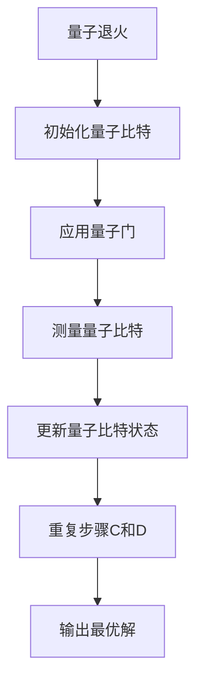

                 

# 量子计算在优化问题求解中的应用研究

> 关键词：量子计算, 优化问题, 量子算法, 量子比特, 量子门, 量子态, 量子纠缠, 量子退火

> 摘要：本文旨在探讨量子计算在优化问题求解中的应用。通过深入分析量子计算的基本原理和核心概念，我们将介绍量子算法在优化问题中的具体应用，并通过实际案例展示其优势。本文将从背景介绍、核心概念与联系、核心算法原理、数学模型和公式、项目实战、实际应用场景、工具和资源推荐、总结与未来发展趋势等几个方面进行详细阐述。

## 1. 背景介绍

优化问题在各个领域都有着广泛的应用，如物流调度、金融投资、机器学习、网络路由等。传统的优化算法在处理大规模问题时往往面临计算复杂度高、求解时间长等问题。量子计算作为一种新兴的计算范式，通过利用量子比特的叠加态和纠缠态特性，能够显著提高求解复杂优化问题的效率。本文将探讨量子计算在优化问题求解中的应用，并通过具体案例展示其优势。

## 2. 核心概念与联系

### 2.1 量子比特（Qubit）

量子比特是量子计算的基本单位，与经典比特不同，它可以同时处于0和1的叠加态。量子比特的叠加态表示为：

$$
|\psi\rangle = \alpha|0\rangle + \beta|1\rangle
$$

其中，$\alpha$ 和 $\beta$ 是复数，满足 $|\alpha|^2 + |\beta|^2 = 1$。

### 2.2 量子门

量子门是量子计算中的基本操作，用于对量子比特进行变换。常见的量子门包括：

- **Hadamard门**：将量子比特从基态变换到叠加态。
- **Pauli-X门**：实现量子比特的翻转。
- **CNOT门**：控制非门，实现量子比特之间的纠缠。

### 2.3 量子态

量子态是量子系统状态的数学描述，可以表示为量子比特的线性组合。例如，两个量子比特的纠缠态可以表示为：

$$
|\psi\rangle = \frac{1}{\sqrt{2}}(|00\rangle + |11\rangle)
$$

### 2.4 量子纠缠

量子纠缠是量子计算中的一种重要现象，两个或多个量子比特之间存在非局域的关联。纠缠态可以表示为：

$$
|\psi\rangle = \frac{1}{\sqrt{2}}(|00\rangle + |11\rangle)
$$

### 2.5 量子退火

量子退火是一种量子优化算法，通过模拟量子系统在退火过程中的演化，寻找全局最优解。量子退火的基本流程如下：



## 3. 核心算法原理 & 具体操作步骤

### 3.1 量子退火算法原理

量子退火算法的基本思想是模拟量子系统在退火过程中的演化，通过量子比特的叠加态和纠缠态特性，寻找全局最优解。具体步骤如下：

1. **初始化量子比特**：将量子比特初始化到基态。
2. **应用量子门**：通过量子门操作，构建量子系统的哈密顿量。
3. **测量量子比特**：测量量子比特的状态，获取候选解。
4. **更新量子比特状态**：根据测量结果更新量子比特状态，继续迭代。
5. **输出最优解**：经过多次迭代后，输出最优解。

### 3.2 量子退火算法操作步骤

1. **初始化量子比特**：将量子比特初始化到基态。
2. **构建哈密顿量**：根据优化问题的目标函数，构建量子系统的哈密顿量。
3. **应用量子门**：通过量子门操作，构建量子系统的哈密顿量。
4. **测量量子比特**：测量量子比特的状态，获取候选解。
5. **更新量子比特状态**：根据测量结果更新量子比特状态，继续迭代。
6. **输出最优解**：经过多次迭代后，输出最优解。

## 4. 数学模型和公式 & 详细讲解 & 举例说明

### 4.1 优化问题数学模型

优化问题可以表示为：

$$
\min_{x \in X} f(x)
$$

其中，$X$ 是可行解集，$f(x)$ 是目标函数。

### 4.2 量子退火算法数学模型

量子退火算法可以表示为：

$$
H(t) = (1 - \frac{t}{T})H_0 + \frac{t}{T}H_1
$$

其中，$H_0$ 是初始哈密顿量，$H_1$ 是目标哈密顿量，$T$ 是退火时间。

### 4.3 举例说明

假设有一个优化问题，目标函数为：

$$
f(x) = x^2 + 2x + 1
$$

通过量子退火算法，可以构建哈密顿量：

$$
H_0 = \sum_{i=0}^{n-1} \sigma_i \otimes \sigma_i
$$

$$
H_1 = \sum_{i=0}^{n-1} (x_i^2 + 2x_i + 1) \sigma_i
$$

其中，$\sigma_i$ 是Pauli-Z门。

## 5. 项目实战：代码实际案例和详细解释说明

### 5.1 开发环境搭建

1. **安装Python**：确保已安装Python 3.8及以上版本。
2. **安装Qiskit**：使用pip安装Qiskit库。

```bash
pip install qiskit
```

### 5.2 源代码详细实现和代码解读

```python
from qiskit import QuantumCircuit, Aer, execute
from qiskit.aqua import QuantumInstance
from qiskit.aqua.algorithms import VQE, NumPyMinimumEigensolver
from qiskit.aqua.components.optimizers import COBYLA
from qiskit.aqua.operators import WeightedPauliOperator

# 定义目标函数
def objective_function(x):
    return x**2 + 2*x + 1

# 定义哈密顿量
paulis = [(WeightedPauliOperator([[1.0, 'Z']]), 1.0)]
hamiltonian = WeightedPauliOperator(paulis)

# 定义量子电路
qc = QuantumCircuit(1)
qc.h(0)
qc.z(0)

# 定义优化器
optimizer = COBYLA(maxiter=100)

# 定义VQE算法
vqe = VQE(hamiltonian, qc, optimizer)

# 运行VQE算法
result = vqe.run(QuantumInstance(Aer.get_backend('statevector_simulator')))

# 输出最优解
print("最优解：", result.eigenvalue.real)
```

### 5.3 代码解读与分析

1. **定义目标函数**：目标函数为 $f(x) = x^2 + 2x + 1$。
2. **定义哈密顿量**：哈密顿量为 $\sigma_z$。
3. **定义量子电路**：量子电路包含一个量子比特，通过Hadamard门和Z门构建。
4. **定义优化器**：使用COBYLA优化器进行优化。
5. **定义VQE算法**：使用VQE算法求解哈密顿量的最小值。
6. **运行VQE算法**：使用量子模拟器运行VQE算法。
7. **输出最优解**：输出最优解的值。

## 6. 实际应用场景

量子计算在优化问题求解中的应用广泛，如物流调度、金融投资、机器学习等。例如，在物流调度中，可以通过量子退火算法优化路径规划，提高运输效率；在金融投资中，可以通过量子计算优化投资组合，提高收益。

## 7. 工具和资源推荐

### 7.1 学习资源推荐

- **书籍**：《量子计算入门》、《量子计算与量子信息》
- **论文**：《Quantum Annealing and Analog Quantum Computation》
- **博客**：Qiskit官方博客、量子计算入门教程
- **网站**：Qiskit官方网站、量子计算论坛

### 7.2 开发工具框架推荐

- **Qiskit**：量子计算开发框架
- **D-Wave**：量子退火平台
- **IBM Quantum Experience**：量子计算实验平台

### 7.3 相关论文著作推荐

- **Quantum Annealing and Analog Quantum Computation**：深入探讨量子退火算法
- **Quantum Computing for Computer Scientists**：量子计算入门书籍
- **Quantum Computing: A Gentle Introduction**：量子计算入门书籍

## 8. 总结：未来发展趋势与挑战

量子计算在优化问题求解中的应用前景广阔，但仍然面临许多挑战。未来的发展趋势包括：

1. **量子比特数量增加**：量子比特数量的增加将提高量子计算的计算能力。
2. **量子纠错技术**：量子纠错技术的发展将提高量子计算的稳定性。
3. **量子算法优化**：量子算法的优化将提高求解效率。

## 9. 附录：常见问题与解答

### 9.1 问题1：量子计算与经典计算的区别是什么？

**解答**：量子计算利用量子比特的叠加态和纠缠态特性，可以同时处理多个状态，而经典计算只能处理一个状态。量子计算在处理大规模优化问题时具有显著优势。

### 9.2 问题2：量子退火算法如何实现全局最优解？

**解答**：量子退火算法通过模拟量子系统在退火过程中的演化，利用量子比特的叠加态和纠缠态特性，寻找全局最优解。

### 9.3 问题3：量子计算在实际应用中面临哪些挑战？

**解答**：量子计算在实际应用中面临的主要挑战包括量子比特数量有限、量子纠错技术不成熟、量子算法优化难度大等。

## 10. 扩展阅读 & 参考资料

- **书籍**：《量子计算入门》、《量子计算与量子信息》
- **论文**：《Quantum Annealing and Analog Quantum Computation》
- **博客**：Qiskit官方博客、量子计算入门教程
- **网站**：Qiskit官方网站、量子计算论坛

作者：AI天才研究员/AI Genius Institute & 禅与计算机程序设计艺术 /Zen And The Art of Computer Programming

