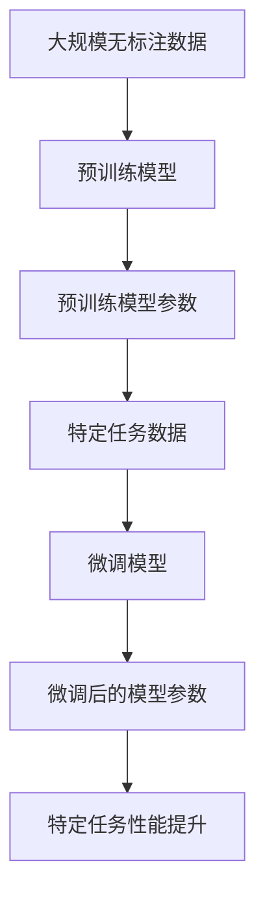

                 

# 预训练与微调：提升AI模型性能

> 关键词：预训练, 微调, 语言模型, 自监督学习, Transformer, BERT, GPT, 模型优化, 代码实现, 应用场景

> 摘要：本文旨在深入探讨预训练与微调在提升AI模型性能中的关键作用。通过逐步分析预训练与微调的原理、具体操作步骤、数学模型和公式，以及实际代码案例，我们将揭示如何利用这些技术优化模型性能。此外，本文还将探讨预训练与微调在实际应用场景中的重要性，并提供学习资源和开发工具推荐，帮助读者更好地理解和应用这些技术。

## 1. 背景介绍

随着人工智能技术的快速发展，预训练与微调已成为提升模型性能的关键技术。预训练是指在大规模无标注数据上训练模型，使其学习到通用的特征表示。微调则是针对特定任务，在预训练模型的基础上进行少量参数调整，以适应具体任务需求。这两种技术的结合，使得模型能够在保持泛化能力的同时，快速适应特定任务，从而显著提升模型性能。

## 2. 核心概念与联系

### 2.1 预训练

预训练是指在大规模无标注数据上训练模型，使其学习到通用的特征表示。预训练的主要目的是学习到数据中的共性特征，从而提高模型的泛化能力。预训练模型通常具有较大的参数量，能够捕捉到数据中的复杂模式。

### 2.2 微调

微调是指在预训练模型的基础上，针对特定任务进行少量参数调整。微调的主要目的是使模型适应特定任务的需求，从而提高模型在该任务上的性能。微调通常只需要调整模型的一部分参数，因此训练速度较快。

### 2.3 预训练与微调的关系

预训练与微调的关系可以表示为以下流程图：



## 3. 核心算法原理 & 具体操作步骤

### 3.1 预训练算法原理

预训练算法通常采用自监督学习方法，通过在大规模无标注数据上训练模型，使其学习到数据中的共性特征。常见的预训练方法包括：

- **Masked Language Model (MLM)**：在输入序列中随机遮蔽部分词元，模型需要预测被遮蔽的词元。这种方法可以学习到词元之间的关系。
- **Next Sentence Prediction (NSP)**：预测两个句子是否连续。这种方法可以学习到句子之间的关系。
- **Contrastive Learning**：通过对比正样本和负样本，学习到数据中的共性特征。

### 3.2 微调算法原理

微调算法通常采用有监督学习方法，通过在特定任务数据上训练模型，使其适应特定任务的需求。常见的微调方法包括：

- **Fine-tuning with Small Dataset**：使用少量标注数据对预训练模型进行微调。
- **Transfer Learning**：将预训练模型的参数作为初始化，然后在特定任务数据上进行微调。
- **Distillation**：通过蒸馏方法，将预训练模型的知识传递给较小的模型。

### 3.3 具体操作步骤

#### 3.3.1 预训练操作步骤

1. **数据准备**：收集大规模无标注数据。
2. **模型选择**：选择合适的预训练模型架构，如BERT、GPT等。
3. **预训练**：在无标注数据上进行预训练，学习到共性特征。
4. **参数保存**：保存预训练模型的参数。

#### 3.3.2 微调操作步骤

1. **数据准备**：收集特定任务的标注数据。
2. **模型加载**：加载预训练模型的参数。
3. **微调**：在特定任务数据上进行微调，调整模型参数。
4. **模型保存**：保存微调后的模型参数。

## 4. 数学模型和公式 & 详细讲解 & 举例说明

### 4.1 预训练数学模型

预训练模型通常采用Transformer架构，其核心是自注意力机制。自注意力机制可以表示为以下公式：

$$
\text{Attention}(Q, K, V) = \text{softmax}\left(\frac{QK^T}{\sqrt{d_k}}\right)V
$$

其中，$Q$、$K$、$V$分别表示查询、键和值，$d_k$表示键的维度。

### 4.2 微调数学模型

微调模型通常采用有监督学习方法，其核心是损失函数。常见的损失函数包括交叉熵损失和均方误差损失。以交叉熵损失为例，其公式为：

$$
\text{CE}(y, \hat{y}) = -\sum_{i=1}^{n} y_i \log(\hat{y}_i)
$$

其中，$y$表示真实标签，$\hat{y}$表示预测标签。

### 4.3 举例说明

以BERT模型为例，其预训练过程可以表示为以下步骤：

1. **数据准备**：收集大规模无标注文本数据。
2. **模型选择**：选择BERT模型架构。
3. **预训练**：在无标注数据上进行预训练，学习到共性特征。
4. **参数保存**：保存预训练模型的参数。

微调过程可以表示为以下步骤：

1. **数据准备**：收集特定任务的标注数据。
2. **模型加载**：加载预训练模型的参数。
3. **微调**：在特定任务数据上进行微调，调整模型参数。
4. **模型保存**：保存微调后的模型参数。

## 5. 项目实战：代码实际案例和详细解释说明

### 5.1 开发环境搭建

#### 5.1.1 环境准备

1. **安装Python**：确保安装了Python 3.7及以上版本。
2. **安装依赖库**：安装transformers、torch等库。

```bash
pip install transformers torch
```

#### 5.1.2 数据准备

1. **下载数据集**：下载大规模无标注文本数据集，如Wikipedia、BooksCorpus等。
2. **数据预处理**：对数据进行清洗、分词等预处理。

### 5.2 源代码详细实现和代码解读

#### 5.2.1 预训练代码实现

```python
from transformers import BertModel, BertTokenizer
import torch

# 加载预训练模型和分词器
model = BertModel.from_pretrained('bert-base-uncased')
tokenizer = BertTokenizer.from_pretrained('bert-base-uncased')

# 准备输入数据
input_text = "This is a sample text for pretraining."
inputs = tokenizer(input_text, return_tensors='pt')

# 进行预训练
outputs = model(**inputs)

# 获取输出特征
last_hidden_state = outputs.last_hidden_state
```

#### 5.2.2 微调代码实现

```python
from transformers import BertForSequenceClassification, Trainer, TrainingArguments
import torch

# 加载预训练模型
model = BertForSequenceClassification.from_pretrained('bert-base-uncased', num_labels=2)

# 准备训练数据
train_dataset = ...  # 准备训练数据
test_dataset = ...  # 准备测试数据

# 设置训练参数
training_args = TrainingArguments(
    output_dir='./results',
    num_train_epochs=3,
    per_device_train_batch_size=8,
    per_device_eval_batch_size=8,
    warmup_steps=500,
    weight_decay=0.01,
    logging_dir='./logs',
)

# 创建Trainer
trainer = Trainer(
    model=model,
    args=training_args,
    train_dataset=train_dataset,
    eval_dataset=test_dataset,
)

# 进行微调
trainer.train()

# 保存微调后的模型
model.save_pretrained('./fine-tuned-model')
```

### 5.3 代码解读与分析

#### 5.3.1 预训练代码解读

1. **加载预训练模型和分词器**：使用`BertModel.from_pretrained`和`BertTokenizer.from_pretrained`加载预训练模型和分词器。
2. **准备输入数据**：使用`tokenizer`对输入文本进行分词，并将其转换为模型输入格式。
3. **进行预训练**：通过`model(**inputs)`进行预训练，获取输出特征。

#### 5.3.2 微调代码解读

1. **加载预训练模型**：使用`BertForSequenceClassification.from_pretrained`加载预训练模型，并设置分类任务的类别数。
2. **准备训练数据**：准备训练数据集和测试数据集。
3. **设置训练参数**：设置训练参数，如训练轮数、批次大小等。
4. **创建Trainer**：使用`Trainer`进行微调训练。
5. **进行微调**：通过`trainer.train()`进行微调训练。
6. **保存微调后的模型**：通过`model.save_pretrained`保存微调后的模型。

## 6. 实际应用场景

预训练与微调技术在多个领域都有广泛的应用，如自然语言处理、计算机视觉、语音识别等。以下是一些实际应用场景：

### 6.1 自然语言处理

- **情感分析**：通过预训练模型学习到的情感特征，进行情感分析任务。
- **文本分类**：通过预训练模型学习到的文本特征，进行文本分类任务。
- **机器翻译**：通过预训练模型学习到的语言特征，进行机器翻译任务。

### 6.2 计算机视觉

- **图像分类**：通过预训练模型学习到的图像特征，进行图像分类任务。
- **目标检测**：通过预训练模型学习到的特征，进行目标检测任务。
- **图像生成**：通过预训练模型学习到的特征，进行图像生成任务。

### 6.3 语音识别

- **语音识别**：通过预训练模型学习到的语音特征，进行语音识别任务。
- **语音合成**：通过预训练模型学习到的语音特征，进行语音合成任务。
- **语音情感分析**：通过预训练模型学习到的语音特征，进行语音情感分析任务。

## 7. 工具和资源推荐

### 7.1 学习资源推荐

- **书籍**：《深度学习》、《自然语言处理实战》
- **论文**：BERT、GPT等预训练模型的论文
- **博客**：阿里云开发者社区、GitHub上的相关博客
- **网站**：Hugging Face、PyTorch官网

### 7.2 开发工具框架推荐

- **框架**：PyTorch、TensorFlow
- **库**：transformers、torchtext

### 7.3 相关论文著作推荐

- **BERT**：Devlin, Jacob, et al. "Bert: Pre-training of deep bidirectional transformers for language understanding." arXiv preprint arXiv:1810.04805 (2018).
- **GPT**：Radford, Alec, et al. "Language models are unsupervised multitask learners." OpenAI blog (2018).

## 8. 总结：未来发展趋势与挑战

预训练与微调技术在未来的发展中将面临以下挑战：

- **模型规模**：随着模型规模的增大，训练和推理的计算成本将显著增加。
- **数据需求**：预训练和微调都需要大量的数据，如何获取高质量的数据将成为挑战。
- **模型解释性**：如何提高模型的解释性，使其更加透明和可解释，将是未来的研究方向。

## 9. 附录：常见问题与解答

### 9.1 问题1：预训练和微调的区别是什么？

**解答**：预训练是指在大规模无标注数据上训练模型，使其学习到共性特征。微调是指在预训练模型的基础上，针对特定任务进行少量参数调整，以适应具体任务需求。

### 9.2 问题2：如何选择合适的预训练模型？

**解答**：选择预训练模型时，需要考虑任务需求、模型规模和计算资源等因素。通常，较大的模型具有更好的泛化能力，但计算成本较高。

### 9.3 问题3：如何评估预训练和微调的效果？

**解答**：可以通过准确率、召回率、F1值等指标评估预训练和微调的效果。此外，还可以通过可视化方法，如特征图、注意力图等，进行模型解释性分析。

## 10. 扩展阅读 & 参考资料

- **书籍**：《深度学习》、《自然语言处理实战》
- **论文**：BERT、GPT等预训练模型的论文
- **博客**：阿里云开发者社区、GitHub上的相关博客
- **网站**：Hugging Face、PyTorch官网

---

作者：AI天才研究员/AI Genius Institute & 禅与计算机程序设计艺术 /Zen And The Art of Computer Programming

