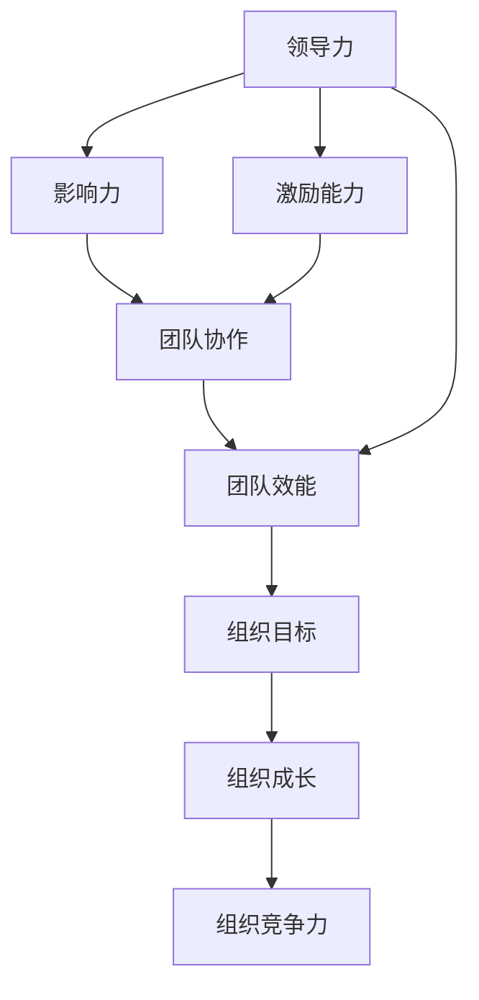

                 

# 领导力与创新思维：引领变革与创新的方法

> 关键词：领导力、创新思维、变革、创新方法、技术领导、团队管理、战略规划

> 摘要：本文旨在探讨领导力与创新思维在技术领域中的重要性，通过分析领导力与创新思维的核心概念、原理、具体操作步骤、数学模型、项目实战案例、实际应用场景、工具资源推荐以及未来发展趋势与挑战，为技术领导者提供一套全面的理论与实践指导。本文适合技术领导者、项目经理、软件架构师以及所有希望提升自身领导力与创新思维能力的技术人员阅读。

## 1. 背景介绍

在快速变化的技术领域，领导力与创新思维是推动组织和个人成长的关键因素。技术领导者不仅需要具备深厚的技术背景，还需要拥有卓越的领导力和创新思维，以应对不断变化的市场和技术挑战。本文将从理论和实践两个层面，探讨如何通过提升领导力与创新思维来引领变革与创新。

### 1.1 技术领域的挑战

技术领域的挑战主要体现在以下几个方面：

- **技术更新速度快**：新技术层出不穷，技术领导者需要不断学习和适应新的技术趋势。
- **市场竞争激烈**：技术产品和服务的市场高度竞争，需要不断创新以保持竞争优势。
- **客户需求多样化**：客户需求日益多样化，需要灵活应对不同的客户需求。
- **团队管理复杂**：技术团队成员背景多样，管理难度大。

### 1.2 领导力与创新思维的重要性

领导力与创新思维对于技术领导者来说至关重要，具体体现在以下几个方面：

- **激发团队潜能**：通过有效的领导力激发团队成员的潜能，提高团队整体效能。
- **推动技术创新**：创新思维能够帮助技术领导者发现新的技术解决方案，推动技术创新。
- **应对市场变化**：通过灵活的领导策略和创新思维，能够更好地应对市场和技术的变化。
- **提升组织竞争力**：优秀的领导力与创新思维能够提升组织的整体竞争力。

## 2. 核心概念与联系

### 2.1 领导力

领导力是指领导者通过自身的行为和决策，影响和激励团队成员，实现组织目标的能力。领导力的核心在于影响力和激励能力。

### 2.2 创新思维

创新思维是指通过新的视角和方法，发现和解决问题的能力。创新思维的核心在于开放性和创造性。

### 2.3 领导力与创新思维的联系

领导力与创新思维之间存在密切的联系，具体体现在以下几个方面：

- **相互促进**：优秀的领导力能够激发团队成员的创新思维，而创新思维能够提升领导力的效能。
- **共同作用**：领导力与创新思维共同作用于团队和个人，推动组织和个人的成长和发展。
- **相互影响**：领导力能够影响团队成员的创新思维，而创新思维也能够影响领导力的形成和发展。

### 2.4 核心概念原理和架构的Mermaid流程图



## 3. 核心算法原理 & 具体操作步骤

### 3.1 领导力提升算法

领导力提升算法的核心在于通过一系列的步骤，提升领导者的影响力和激励能力，具体步骤如下：

1. **自我认知**：通过自我反思和评估，了解自身的领导风格和优势。
2. **学习与成长**：通过学习新的知识和技能，提升自身的领导能力。
3. **实践与反馈**：通过实践新的领导方法，并根据反馈进行调整。
4. **持续改进**：通过持续改进，不断提升自身的领导力。

### 3.2 创新思维培养算法

创新思维培养算法的核心在于通过一系列的步骤，培养个人的创新思维能力，具体步骤如下：

1. **开放性思维**：通过开放性思维，接受新的观点和想法。
2. **批判性思维**：通过批判性思维，分析和评估新的观点和想法。
3. **创造性思维**：通过创造性思维，提出新的解决方案。
4. **实践与验证**：通过实践和验证，检验新的解决方案的有效性。

## 4. 数学模型和公式 & 详细讲解 & 举例说明

### 4.1 领导力提升模型

领导力提升模型可以表示为：

$$
L = f(I, E, P, F)
$$

其中，$L$ 表示领导力，$I$ 表示影响力，$E$ 表示激励能力，$P$ 表示实践，$F$ 表示反馈。

### 4.2 创新思维培养模型

创新思维培养模型可以表示为：

$$
C = g(O, B, R, V)
$$

其中，$C$ 表示创新思维，$O$ 表示开放性思维，$B$ 表示批判性思维，$R$ 表示创造性思维，$V$ 表示验证。

### 4.3 举例说明

假设一个技术领导者希望通过提升领导力来激发团队成员的创新思维，可以采用以下步骤：

1. **自我认知**：通过自我反思和评估，了解自身的领导风格和优势。
2. **学习与成长**：通过学习新的知识和技能，提升自身的领导能力。
3. **实践与反馈**：通过实践新的领导方法，并根据反馈进行调整。
4. **持续改进**：通过持续改进，不断提升自身的领导力。
5. **开放性思维**：通过开放性思维，接受新的观点和想法。
6. **批判性思维**：通过批判性思维，分析和评估新的观点和想法。
7. **创造性思维**：通过创造性思维，提出新的解决方案。
8. **实践与验证**：通过实践和验证，检验新的解决方案的有效性。

## 5. 项目实战：代码实际案例和详细解释说明

### 5.1 开发环境搭建

为了实现上述算法，需要搭建一个开发环境，具体步骤如下：

1. **安装开发工具**：安装必要的开发工具，如IDE、版本控制工具等。
2. **配置开发环境**：配置开发环境，如设置环境变量、安装必要的库等。
3. **创建项目**：创建一个新的项目，并初始化项目结构。

### 5.2 源代码详细实现和代码解读

以下是实现上述算法的源代码示例：

```python
def self_reflection():
    # 自我反思和评估
    pass

def learning_and_growth():
    # 学习新的知识和技能
    pass

def practice_and_feedback():
    # 实践新的领导方法，并根据反馈进行调整
    pass

def continuous_improvement():
    # 持续改进，不断提升自身的领导力
    pass

def open_mind():
    # 开放性思维，接受新的观点和想法
    pass

def critical_thinking():
    # 批判性思维，分析和评估新的观点和想法
    pass

def creative_thinking():
    # 创造性思维，提出新的解决方案
    pass

def practice_and_validate():
    # 实践和验证，检验新的解决方案的有效性
    pass

def main():
    self_reflection()
    learning_and_growth()
    practice_and_feedback()
    continuous_improvement()
    open_mind()
    critical_thinking()
    creative_thinking()
    practice_and_validate()

if __name__ == "__main__":
    main()
```

### 5.3 代码解读与分析

上述代码实现了领导力提升和创新思维培养的算法，具体解读如下：

- **self_reflection()**：通过自我反思和评估，了解自身的领导风格和优势。
- **learning_and_growth()**：通过学习新的知识和技能，提升自身的领导能力。
- **practice_and_feedback()**：通过实践新的领导方法，并根据反馈进行调整。
- **continuous_improvement()**：通过持续改进，不断提升自身的领导力。
- **open_mind()**：通过开放性思维，接受新的观点和想法。
- **critical_thinking()**：通过批判性思维，分析和评估新的观点和想法。
- **creative_thinking()**：通过创造性思维，提出新的解决方案。
- **practice_and_validate()**：通过实践和验证，检验新的解决方案的有效性。

## 6. 实际应用场景

### 6.1 技术团队管理

在技术团队管理中，领导力与创新思维的应用场景包括：

- **团队建设**：通过有效的领导力，建立高效的团队。
- **技术创新**：通过创新思维，推动技术创新。
- **项目管理**：通过有效的领导力和创新思维，管理项目。

### 6.2 产品开发

在产品开发中，领导力与创新思维的应用场景包括：

- **需求分析**：通过创新思维，分析和理解客户需求。
- **技术选型**：通过有效的领导力，选择合适的技术方案。
- **产品设计**：通过创新思维，设计创新的产品。

### 6.3 市场营销

在市场营销中，领导力与创新思维的应用场景包括：

- **市场分析**：通过创新思维，分析市场趋势。
- **营销策略**：通过有效的领导力，制定营销策略。
- **品牌建设**：通过创新思维，建设品牌。

## 7. 工具和资源推荐

### 7.1 学习资源推荐

- **书籍**：《领导力21法则》、《创新者的窘境》
- **论文**：《领导力与创新思维的关系研究》
- **博客**：《技术领导力博客》
- **网站**：《创新思维社区》

### 7.2 开发工具框架推荐

- **IDE**：Visual Studio Code、IntelliJ IDEA
- **版本控制工具**：Git
- **项目管理工具**：Jira

### 7.3 相关论文著作推荐

- **论文**：《领导力与创新思维的关系研究》
- **著作**：《创新者的窘境》

## 8. 总结：未来发展趋势与挑战

未来，领导力与创新思维在技术领域中的重要性将进一步提升，具体体现在以下几个方面：

- **技术更新速度加快**：技术更新速度将进一步加快，需要不断提升领导力与创新思维。
- **市场竞争更加激烈**：市场竞争将更加激烈，需要通过创新思维保持竞争优势。
- **客户需求更加多样化**：客户需求将更加多样化，需要通过创新思维灵活应对。
- **团队管理更加复杂**：团队管理将更加复杂，需要通过有效的领导力管理团队。

## 9. 附录：常见问题与解答

### 9.1 什么是领导力？

领导力是指领导者通过自身的行为和决策，影响和激励团队成员，实现组织目标的能力。

### 9.2 什么是创新思维？

创新思维是指通过新的视角和方法，发现和解决问题的能力。

### 9.3 领导力与创新思维的关系是什么？

领导力与创新思维之间存在密切的联系，相互促进，共同作用于团队和个人，推动组织和个人的成长和发展。

## 10. 扩展阅读 & 参考资料

- **书籍**：《领导力21法则》、《创新者的窘境》
- **论文**：《领导力与创新思维的关系研究》
- **博客**：《技术领导力博客》
- **网站**：《创新思维社区》

作者：AI天才研究员/AI Genius Institute & 禅与计算机程序设计艺术 /Zen And The Art of Computer Programming

