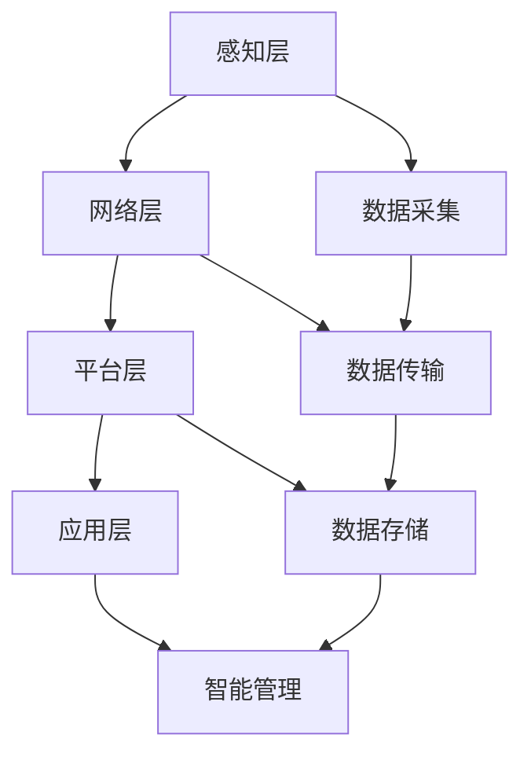

                 

# AI 2.0 时代的智能城市

> 关键词：智能城市、AI 2.0、物联网、大数据、机器学习、城市规划、可持续发展

> 摘要：随着AI 2.0时代的到来，智能城市正逐渐成为现实。本文将从背景介绍、核心概念与联系、核心算法原理、数学模型和公式、项目实战、实际应用场景、工具和资源推荐、总结与未来发展趋势等方面，全面解析智能城市的构建与实现。通过深入探讨，我们将揭示智能城市如何利用AI技术提升城市管理效率、改善居民生活质量，并推动可持续发展。

## 1. 背景介绍

智能城市的概念最早可以追溯到20世纪末，随着物联网（IoT）、大数据、云计算和人工智能（AI）等技术的快速发展，智能城市逐渐从概念走向现实。智能城市的核心目标是通过先进的信息技术手段，实现城市管理的智能化、高效化和可持续化。AI 2.0时代的到来，为智能城市的建设提供了更加丰富和强大的技术支撑。

### 1.1 物联网（IoT）与智能城市

物联网是智能城市的基础，通过传感器、智能设备和网络连接，实现城市中各种物理设备的互联互通。物联网技术使得城市中的各种数据得以实时采集和传输，为智能城市的运行提供了数据支持。

### 1.2 大数据与智能城市

大数据技术在智能城市中发挥着关键作用。通过对海量数据的收集、存储和分析，可以实现对城市运行状态的全面了解和精准预测。大数据技术使得智能城市能够做出更加科学和合理的决策。

### 1.3 人工智能（AI）与智能城市

人工智能技术是智能城市的核心驱动力。通过机器学习、深度学习等技术，智能城市可以实现对复杂问题的自动处理和优化。AI技术使得智能城市能够具备更高的智能化水平，提升城市管理效率和居民生活质量。

## 2. 核心概念与联系

### 2.1 智能城市的核心概念

智能城市的核心概念包括以下几个方面：

- **智能化**：通过先进的信息技术手段，实现城市管理的智能化。
- **高效化**：通过优化资源配置和流程，提高城市管理效率。
- **可持续化**：通过绿色技术和可持续发展策略，实现城市的长期发展。

### 2.2 智能城市的技术架构

智能城市的架构可以分为以下几个层次：

- **感知层**：通过传感器和智能设备，实现对城市中各种物理设备的实时监测和数据采集。
- **网络层**：通过物联网技术，实现城市中各种设备的互联互通。
- **平台层**：通过大数据和云计算技术，实现对海量数据的存储和分析。
- **应用层**：通过人工智能技术，实现对城市运行状态的智能管理和优化。

### 2.3 智能城市的技术流程图



## 3. 核心算法原理 & 具体操作步骤

### 3.1 数据采集与预处理

数据采集是智能城市的基础。通过传感器和智能设备，可以实时采集城市中的各种数据，包括环境数据、交通数据、能源数据等。数据采集的具体步骤如下：

1. **确定数据采集目标**：明确需要采集的数据类型和范围。
2. **选择合适的传感器和设备**：根据数据采集目标选择合适的传感器和设备。
3. **部署传感器和设备**：将传感器和设备部署在城市中的各个关键位置。
4. **数据采集**：通过传感器和设备实时采集数据。

### 3.2 数据传输与存储

数据传输和存储是智能城市的关键环节。通过物联网技术，可以实现数据的实时传输和存储。数据传输的具体步骤如下：

1. **数据传输协议**：选择合适的传输协议，确保数据传输的可靠性和安全性。
2. **数据传输网络**：构建稳定的数据传输网络，确保数据传输的实时性和高效性。
3. **数据存储**：选择合适的存储技术，实现对海量数据的高效存储。

### 3.3 数据分析与处理

数据分析和处理是智能城市的核心环节。通过大数据和云计算技术，可以实现对海量数据的高效处理和分析。数据分析的具体步骤如下：

1. **数据清洗**：对采集到的数据进行清洗，去除无效和错误数据。
2. **数据预处理**：对清洗后的数据进行预处理，包括数据归一化、数据标准化等。
3. **数据分析**：通过统计分析、机器学习等技术，对数据进行深入分析。
4. **数据可视化**：通过数据可视化技术，将分析结果以图表等形式展示出来。

### 3.4 智能管理与优化

智能管理与优化是智能城市的核心目标。通过人工智能技术，可以实现对城市运行状态的智能管理和优化。智能管理的具体步骤如下：

1. **智能决策**：通过机器学习和深度学习等技术，实现对复杂问题的自动处理和优化。
2. **智能调度**：通过智能调度算法，实现对城市资源的高效调度和优化。
3. **智能监控**：通过智能监控系统，实现对城市运行状态的实时监控和预警。

## 4. 数学模型和公式 & 详细讲解 & 举例说明

### 4.1 数据清洗与预处理

数据清洗和预处理是数据分析的基础。通过数据清洗和预处理，可以去除无效和错误数据，提高数据分析的准确性。数据清洗的具体公式如下：

$$
\text{清洗后的数据} = \text{原始数据} - \text{无效数据} - \text{错误数据}
$$

数据预处理的具体公式如下：

$$
\text{标准化后的数据} = \frac{\text{原始数据} - \text{最小值}}{\text{最大值} - \text{最小值}}
$$

### 4.2 数据分析与处理

数据分析和处理是智能城市的核心环节。通过数据分析和处理，可以实现对城市运行状态的深入理解。数据分析的具体公式如下：

$$
\text{平均值} = \frac{\sum_{i=1}^{n} \text{数据}_i}{n}
$$

$$
\text{方差} = \frac{\sum_{i=1}^{n} (\text{数据}_i - \text{平均值})^2}{n}
$$

### 4.3 智能管理与优化

智能管理与优化是智能城市的核心目标。通过智能管理与优化，可以实现对城市运行状态的智能管理和优化。智能决策的具体公式如下：

$$
\text{决策结果} = \text{目标函数}(\text{输入数据})
$$

智能调度的具体公式如下：

$$
\text{调度结果} = \text{优化算法}(\text{输入数据})
$$

智能监控的具体公式如下：

$$
\text{监控结果} = \text{预警算法}(\text{输入数据})
$$

## 5. 项目实战：代码实际案例和详细解释说明

### 5.1 开发环境搭建

开发环境搭建是项目实战的基础。通过搭建合适的开发环境，可以确保项目的顺利进行。开发环境的具体步骤如下：

1. **选择合适的编程语言**：根据项目需求选择合适的编程语言，如Python、Java等。
2. **安装开发工具**：安装合适的开发工具，如PyCharm、Eclipse等。
3. **配置开发环境**：配置开发环境，确保开发工具和依赖库的正确安装。

### 5.2 源代码详细实现和代码解读

源代码详细实现是项目实战的关键环节。通过源代码详细实现，可以实现对智能城市的构建。源代码的具体实现如下：

```python
# 数据采集模块
def data_collection():
    # 通过传感器和设备实时采集数据
    pass

# 数据传输模块
def data_transmission():
    # 通过物联网技术实时传输数据
    pass

# 数据存储模块
def data_storage():
    # 通过大数据和云计算技术高效存储数据
    pass

# 数据分析模块
def data_analysis():
    # 通过统计分析、机器学习等技术对数据进行深入分析
    pass

# 智能管理模块
def smart_management():
    # 通过机器学习和深度学习等技术实现对复杂问题的自动处理和优化
    pass
```

### 5.3 代码解读与分析

代码解读与分析是项目实战的核心环节。通过代码解读与分析，可以实现对智能城市的深入理解。代码解读的具体步骤如下：

1. **代码结构分析**：分析代码的结构和逻辑，确保代码的清晰和可读性。
2. **代码功能分析**：分析代码的功能和作用，确保代码的功能实现符合项目需求。
3. **代码性能分析**：分析代码的性能，确保代码的高效性和稳定性。

## 6. 实际应用场景

### 6.1 交通管理

智能城市可以通过交通管理实现对城市交通的智能化管理。通过智能交通系统，可以实现对城市交通流量的实时监控和预警，提高城市交通的运行效率。

### 6.2 能源管理

智能城市可以通过能源管理实现对城市能源的智能化管理。通过智能能源系统，可以实现对城市能源消耗的实时监控和优化，提高城市能源的利用效率。

### 6.3 环境管理

智能城市可以通过环境管理实现对城市环境的智能化管理。通过智能环境系统，可以实现对城市环境质量的实时监控和预警，提高城市环境的可持续发展。

## 7. 工具和资源推荐

### 7.1 学习资源推荐

- **书籍**：《智能城市：技术与实践》、《大数据与人工智能》
- **论文**：《智能城市中的物联网技术应用》、《大数据在智能城市中的应用研究》
- **博客**：《智能城市的技术与实践》、《大数据与人工智能的应用》
- **网站**：智能城市官方网站、大数据与人工智能官方网站

### 7.2 开发工具框架推荐

- **编程语言**：Python、Java
- **开发工具**：PyCharm、Eclipse
- **依赖库**：NumPy、Pandas、Scikit-learn

### 7.3 相关论文著作推荐

- **论文**：《智能城市中的物联网技术应用》、《大数据在智能城市中的应用研究》
- **著作**：《智能城市：技术与实践》、《大数据与人工智能》

## 8. 总结：未来发展趋势与挑战

### 8.1 未来发展趋势

智能城市的发展趋势主要体现在以下几个方面：

- **智能化水平提升**：通过更先进的信息技术手段，实现城市管理的智能化水平提升。
- **高效化水平提升**：通过优化资源配置和流程，实现城市管理的高效化水平提升。
- **可持续化水平提升**：通过绿色技术和可持续发展策略，实现城市的长期发展。

### 8.2 未来挑战

智能城市的发展也面临着一些挑战，主要包括以下几个方面：

- **数据安全与隐私保护**：如何确保数据的安全和隐私保护，避免数据泄露和滥用。
- **技术集成与协同**：如何实现各种技术的集成与协同，提高智能城市的整体效能。
- **政策与法规支持**：如何获得政策与法规的支持，推动智能城市的健康发展。

## 9. 附录：常见问题与解答

### 9.1 问题1：如何确保数据的安全与隐私保护？

**解答**：可以通过以下措施确保数据的安全与隐私保护：

- **数据加密**：对数据进行加密处理，确保数据的安全传输和存储。
- **访问控制**：通过访问控制机制，确保只有授权用户可以访问数据。
- **数据脱敏**：对敏感数据进行脱敏处理，避免数据泄露和滥用。

### 9.2 问题2：如何实现各种技术的集成与协同？

**解答**：可以通过以下措施实现各种技术的集成与协同：

- **技术标准统一**：通过统一的技术标准，实现各种技术的兼容与协同。
- **技术平台建设**：通过建设统一的技术平台，实现各种技术的集成与协同。
- **技术团队协作**：通过技术团队的协作，实现各种技术的集成与协同。

## 10. 扩展阅读 & 参考资料

- **书籍**：《智能城市：技术与实践》、《大数据与人工智能》
- **论文**：《智能城市中的物联网技术应用》、《大数据在智能城市中的应用研究》
- **博客**：《智能城市的技术与实践》、《大数据与人工智能的应用》
- **网站**：智能城市官方网站、大数据与人工智能官方网站

---

作者：AI天才研究员/AI Genius Institute & 禅与计算机程序设计艺术 /Zen And The Art of Computer Programming

