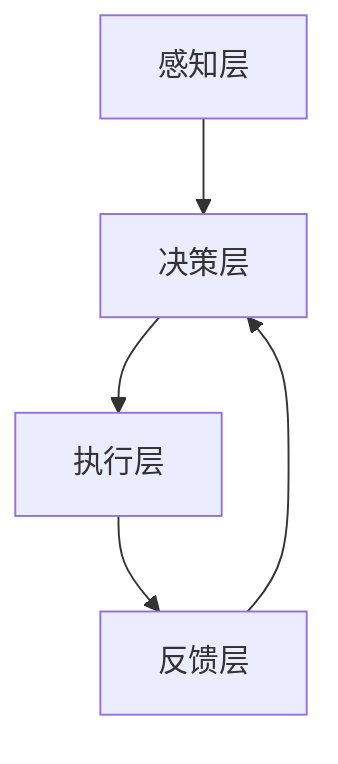

                 

# AI 与人类的协作：共创未来

> 关键词：人工智能, 人机协作, 未来趋势, 技术伦理, 自动化, 数据驱动, 机器学习

> 摘要：本文旨在探讨人工智能与人类协作的未来趋势，通过深入分析人机协作的核心概念、算法原理、实际应用案例，以及面临的挑战和未来发展方向，为读者提供全面的技术洞察和思考。本文将从技术、伦理、应用等多个维度，探讨如何通过人机协作共创未来。

## 1. 背景介绍

随着技术的飞速发展，人工智能（AI）已经从科幻小说中的概念转变为现实世界中的关键技术。AI技术的发展不仅改变了我们的生活方式，还深刻影响了各行各业的工作方式。人机协作作为AI技术的重要应用领域，正逐渐成为推动社会进步的关键力量。本文将从技术、伦理、应用等多个维度，探讨人机协作的核心概念、算法原理、实际应用案例，以及面临的挑战和未来发展方向。

## 2. 核心概念与联系

### 2.1 人机协作的基本概念

人机协作是指人类与机器之间通过交互和合作，共同完成任务的一种模式。这种协作模式可以提高工作效率、减少人为错误，并且能够实现人类难以完成的任务。人机协作的核心在于如何实现人类与机器之间的有效沟通和协作，从而达到最优的工作效果。

### 2.2 人机协作的架构

人机协作的架构可以分为以下几个层次：

- **感知层**：机器通过传感器获取环境信息，如视觉、听觉、触觉等。
- **决策层**：基于感知层获取的信息，机器进行分析和决策，生成相应的动作指令。
- **执行层**：执行层负责将决策层生成的指令转化为实际动作，如机械臂的移动、语音的生成等。
- **反馈层**：执行层的动作结果反馈给决策层，形成闭环控制。

### 2.3 人机协作的Mermaid流程图



## 3. 核心算法原理 & 具体操作步骤

### 3.1 机器学习算法

机器学习是实现人机协作的关键技术之一。通过机器学习，机器可以从大量数据中学习规律，从而实现对未知数据的预测和决策。常见的机器学习算法包括监督学习、无监督学习和强化学习。

#### 3.1.1 监督学习

监督学习是一种基于已知输入和输出数据的机器学习方法。通过训练模型，使其能够对新的输入数据进行准确的预测。

#### 3.1.2 无监督学习

无监督学习是一种没有明确标签数据的机器学习方法。通过聚类、降维等技术，发现数据中的潜在结构和模式。

#### 3.1.3 强化学习

强化学习是一种通过试错学习的方法。通过与环境的交互，机器学习如何采取最优行动以最大化累积奖励。

### 3.2 具体操作步骤

1. **数据收集**：收集大量的训练数据，包括输入和输出。
2. **数据预处理**：对数据进行清洗、归一化等预处理操作。
3. **模型选择**：根据任务需求选择合适的机器学习算法。
4. **模型训练**：使用训练数据对模型进行训练。
5. **模型评估**：使用测试数据对模型进行评估，确保模型的泛化能力。
6. **模型优化**：根据评估结果调整模型参数，提高模型性能。
7. **模型部署**：将训练好的模型部署到实际应用中。

## 4. 数学模型和公式 & 详细讲解 & 举例说明

### 4.1 监督学习中的损失函数

监督学习中的损失函数用于衡量模型预测值与真实值之间的差异。常见的损失函数包括均方误差（MSE）、交叉熵损失等。

#### 4.1.1 均方误差（MSE）

均方误差是监督学习中最常用的损失函数之一，用于衡量预测值与真实值之间的差异。

$$
\text{MSE} = \frac{1}{n} \sum_{i=1}^{n} (y_i - \hat{y}_i)^2
$$

其中，$y_i$ 是真实值，$\hat{y}_i$ 是预测值，$n$ 是样本数量。

### 4.2 无监督学习中的聚类算法

无监督学习中的聚类算法用于将数据集划分为多个簇，每个簇中的数据具有相似的特征。

#### 4.2.1 K-means聚类算法

K-means聚类算法是一种常用的无监督学习算法，通过迭代优化的方式将数据划分为K个簇。

1. **初始化**：随机选择K个数据点作为初始质心。
2. **分配**：将每个数据点分配到最近的质心所在的簇。
3. **更新**：重新计算每个簇的质心。
4. **重复**：重复步骤2和3，直到质心不再变化或达到最大迭代次数。

## 5. 项目实战：代码实际案例和详细解释说明

### 5.1 开发环境搭建

为了实现人机协作项目，我们需要搭建一个合适的开发环境。这里以Python为例，介绍如何搭建开发环境。

1. **安装Python**：确保安装了Python 3.8及以上版本。
2. **安装依赖库**：使用pip安装必要的库，如numpy、pandas、scikit-learn等。
3. **安装开发工具**：安装Jupyter Notebook或PyCharm等开发工具。

### 5.2 源代码详细实现和代码解读

以下是一个简单的监督学习项目示例，使用K近邻算法（KNN）进行手写数字识别。

```python
import numpy as np
from sklearn.datasets import load_digits
from sklearn.model_selection import train_test_split
from sklearn.neighbors import KNeighborsClassifier
from sklearn.metrics import accuracy_score

# 加载数据集
digits = load_digits()
X = digits.data
y = digits.target

# 划分训练集和测试集
X_train, X_test, y_train, y_test = train_test_split(X, y, test_size=0.2, random_state=42)

# 创建KNN分类器
knn = KNeighborsClassifier(n_neighbors=3)

# 训练模型
knn.fit(X_train, y_train)

# 预测测试集
y_pred = knn.predict(X_test)

# 计算准确率
accuracy = accuracy_score(y_test, y_pred)
print(f"Accuracy: {accuracy}")
```

### 5.3 代码解读与分析

1. **数据加载**：使用`load_digits`函数加载手写数字数据集。
2. **数据划分**：使用`train_test_split`函数将数据集划分为训练集和测试集。
3. **模型创建**：创建KNN分类器，设置邻居数为3。
4. **模型训练**：使用训练集数据训练模型。
5. **模型预测**：使用测试集数据进行预测。
6. **模型评估**：计算预测结果的准确率。

## 6. 实际应用场景

### 6.1 工业自动化

在工业自动化领域，人机协作可以实现生产线的智能化管理。通过机器视觉技术，机器人可以识别和处理各种生产任务，提高生产效率和质量。

### 6.2 医疗健康

在医疗健康领域，人机协作可以实现精准医疗。通过机器学习技术，医生可以快速诊断疾病，提高诊断准确率。此外，机器人可以协助医生进行手术，提高手术成功率。

### 6.3 金融服务

在金融服务领域，人机协作可以实现智能风控。通过机器学习技术，金融机构可以实时监测风险，提高风险管理能力。此外，机器人可以协助客户进行理财规划，提高客户满意度。

## 7. 工具和资源推荐

### 7.1 学习资源推荐

- **书籍**：《机器学习》（周志华著）
- **论文**：《深度学习》（Ian Goodfellow, Yoshua Bengio, Aaron Courville著）
- **博客**：Medium上的AI相关博客
- **网站**：Kaggle、GitHub等开源平台

### 7.2 开发工具框架推荐

- **开发工具**：Jupyter Notebook、PyCharm
- **框架**：TensorFlow、PyTorch

### 7.3 相关论文著作推荐

- **论文**：《强化学习：一种基于试错学习的方法》（Richard S. Sutton, Andrew G. Barto著）
- **著作**：《统计学习方法》（李航著）

## 8. 总结：未来发展趋势与挑战

### 8.1 未来发展趋势

1. **技术融合**：AI技术将与更多领域深度融合，实现更多创新应用。
2. **智能化**：AI技术将更加智能化，能够更好地理解和适应人类需求。
3. **伦理规范**：AI技术的发展将更加注重伦理规范，确保技术的安全和公平。

### 8.2 面临的挑战

1. **数据安全**：如何保护数据安全，防止数据泄露和滥用。
2. **算法偏见**：如何避免算法偏见，确保算法的公平性和公正性。
3. **技术伦理**：如何处理AI技术带来的伦理问题，确保技术的健康发展。

## 9. 附录：常见问题与解答

### 9.1 问题1：如何选择合适的机器学习算法？

**解答**：选择合适的机器学习算法需要考虑任务需求、数据特点和计算资源等因素。可以通过实验和比较不同算法的性能来选择最优算法。

### 9.2 问题2：如何处理数据缺失值？

**解答**：处理数据缺失值的方法包括删除缺失值、插值法和使用机器学习模型进行预测等。具体方法需要根据数据特点和任务需求来选择。

## 10. 扩展阅读 & 参考资料

- **书籍**：《机器学习》（周志华著）
- **论文**：《深度学习》（Ian Goodfellow, Yoshua Bengio, Aaron Courville著）
- **网站**：Kaggle、GitHub等开源平台

---

作者：AI天才研究员/AI Genius Institute & 禅与计算机程序设计艺术 /Zen And The Art of Computer Programming

