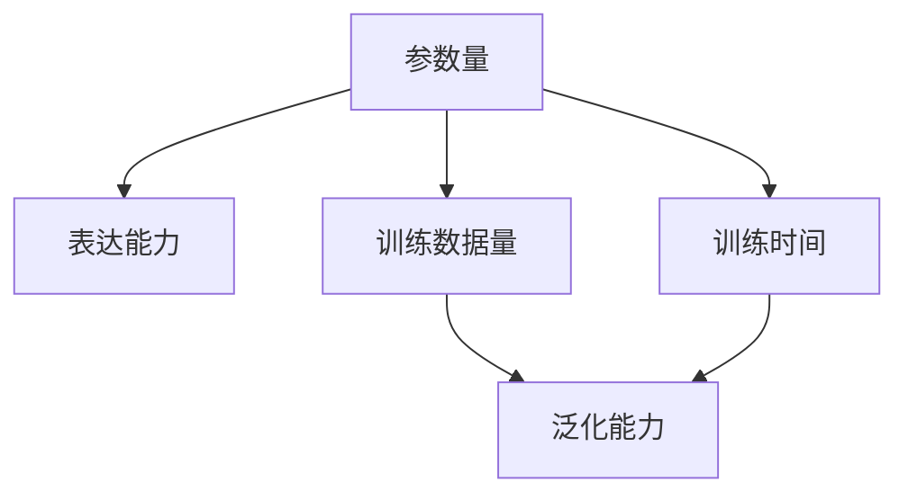

                 

# AI 大模型创业：如何利用技术优势？

> 关键词：大模型、创业、技术优势、AI、深度学习、自然语言处理、模型训练、商业应用

> 摘要：本文旨在为创业者提供一个全面的视角，探讨如何利用大模型的技术优势进行创业。我们将从背景介绍、核心概念与联系、核心算法原理与具体操作步骤、数学模型和公式、项目实战、实际应用场景、工具和资源推荐、总结与未来发展趋势等方面进行深入分析，帮助读者理解大模型的商业潜力，并提供实用的创业指导。

## 1. 背景介绍

随着人工智能技术的飞速发展，大模型已经成为推动行业变革的关键力量。大模型是指参数量巨大、训练数据量庞大、训练时间长的模型，如GPT、BERT等。这些模型在自然语言处理、图像识别、语音识别等多个领域展现出卓越的能力。大模型的出现不仅推动了技术的进步，也为创业者提供了前所未有的机会。本文将探讨如何利用大模型的技术优势进行创业，帮助创业者在竞争激烈的市场中脱颖而出。

## 2. 核心概念与联系

### 2.1 大模型概述

大模型是指参数量巨大、训练数据量庞大、训练时间长的模型。这些模型通常具有强大的泛化能力和表达能力，能够处理复杂的任务。大模型的核心在于其参数量和训练数据量，这使得模型能够学习到更丰富的特征表示，从而在各种任务上表现出色。

### 2.2 核心概念原理

大模型的核心概念包括参数量、训练数据量、训练时间、泛化能力、表达能力等。这些概念相互关联，共同决定了大模型的性能。

#### 2.2.1 参数量

参数量是指模型中参数的数量。参数量越大，模型的表达能力越强，能够学习到更复杂的特征表示。参数量的增加使得模型能够捕捉到更多的细节，从而提高模型的性能。

#### 2.2.2 训练数据量

训练数据量是指用于训练模型的数据量。训练数据量越大，模型能够学习到的数据特征越多，从而提高模型的泛化能力。大量的训练数据有助于模型更好地理解任务的复杂性，提高模型的准确性。

#### 2.2.3 训练时间

训练时间是指训练模型所需的时间。训练时间越长，模型能够学习到的数据特征越多，从而提高模型的性能。训练时间的增加使得模型能够进行更长时间的优化，从而提高模型的准确性。

#### 2.2.4 泛化能力

泛化能力是指模型在未见过的数据上表现的能力。大模型通常具有较强的泛化能力，能够在未见过的数据上表现出色。泛化能力的提高使得模型能够更好地适应不同的应用场景。

#### 2.2.5 表达能力

表达能力是指模型能够表达复杂特征的能力。大模型通常具有较强的表达能力，能够表达复杂的特征表示。表达能力的提高使得模型能够更好地处理复杂的任务。

### 2.3 核心概念原理的Mermaid流程图



## 3. 核心算法原理 & 具体操作步骤

### 3.1 核心算法原理

大模型的核心算法通常包括深度学习算法、自然语言处理算法、图像识别算法等。这些算法通过多层次的特征提取和学习，使得模型能够处理复杂的任务。具体来说，大模型的核心算法包括以下步骤：

#### 3.1.1 数据预处理

数据预处理是大模型训练的第一步。数据预处理包括数据清洗、数据增强、数据归一化等步骤。数据预处理的目的是提高数据的质量，使得模型能够更好地学习到数据的特征。

#### 3.1.2 模型构建

模型构建是大模型训练的关键步骤。模型构建包括选择合适的网络结构、设置超参数等步骤。模型构建的目的是构建一个能够学习到数据特征的模型。

#### 3.1.3 模型训练

模型训练是大模型训练的核心步骤。模型训练包括前向传播、反向传播、优化等步骤。模型训练的目的是通过优化算法使得模型能够更好地学习到数据的特征。

#### 3.1.4 模型评估

模型评估是大模型训练的最后一步。模型评估包括计算模型的准确率、损失等指标。模型评估的目的是评估模型的性能，从而优化模型。

### 3.2 具体操作步骤

#### 3.2.1 数据预处理

数据预处理的具体操作步骤包括：

1. **数据清洗**：去除无效数据、处理缺失值等。
2. **数据增强**：通过数据扩增、数据变换等方法增加数据量。
3. **数据归一化**：将数据归一化到一定的范围，提高模型的训练效果。

#### 3.2.2 模型构建

模型构建的具体操作步骤包括：

1. **选择网络结构**：选择合适的网络结构，如Transformer、CNN等。
2. **设置超参数**：设置网络的超参数，如学习率、批次大小等。
3. **初始化权重**：初始化网络的权重，如使用Xavier初始化等。

#### 3.2.3 模型训练

模型训练的具体操作步骤包括：

1. **前向传播**：通过网络计算输出。
2. **反向传播**：计算损失函数的梯度。
3. **优化**：通过优化算法更新网络的权重。

#### 3.2.4 模型评估

模型评估的具体操作步骤包括：

1. **计算准确率**：计算模型的准确率。
2. **计算损失**：计算模型的损失。
3. **计算其他指标**：计算其他评估指标，如F1分数、AUC等。

## 4. 数学模型和公式 & 详细讲解 & 举例说明

### 4.1 数学模型和公式

大模型的核心数学模型通常包括损失函数、优化算法等。这些数学模型通过优化算法使得模型能够更好地学习到数据的特征。

#### 4.1.1 损失函数

损失函数是衡量模型性能的重要指标。损失函数通常包括交叉熵损失、均方误差损失等。损失函数的目的是衡量模型的预测结果与真实结果之间的差异。

#### 4.1.2 优化算法

优化算法是通过优化损失函数使得模型能够更好地学习到数据的特征。优化算法通常包括梯度下降、Adam等。优化算法的目的是通过优化损失函数使得模型的性能得到提高。

### 4.2 详细讲解 & 举例说明

#### 4.2.1 损失函数

损失函数的详细讲解包括：

1. **交叉熵损失**：交叉熵损失是衡量分类任务中模型性能的重要指标。交叉熵损失的公式为：

   $$ L = -\frac{1}{N} \sum_{i=1}^{N} \sum_{j=1}^{C} y_{ij} \log(p_{ij}) $$

   其中，$N$是样本数量，$C$是类别数量，$y_{ij}$是真实标签，$p_{ij}$是模型预测的概率。

2. **均方误差损失**：均方误差损失是衡量回归任务中模型性能的重要指标。均方误差损失的公式为：

   $$ L = \frac{1}{N} \sum_{i=1}^{N} (y_i - \hat{y}_i)^2 $$

   其中，$N$是样本数量，$y_i$是真实标签，$\hat{y}_i$是模型预测值。

#### 4.2.2 优化算法

优化算法的详细讲解包括：

1. **梯度下降**：梯度下降是通过计算损失函数的梯度来更新模型的权重。梯度下降的公式为：

   $$ w_{t+1} = w_t - \eta \nabla L(w_t) $$

   其中，$w_t$是当前权重，$\eta$是学习率，$\nabla L(w_t)$是损失函数的梯度。

2. **Adam**：Adam是通过计算损失函数的梯度和梯度的平方来更新模型的权重。Adam的公式为：

   $$ m_t = \beta_1 m_{t-1} + (1 - \beta_1) \nabla L(w_t) $$
   $$ v_t = \beta_2 v_{t-1} + (1 - \beta_2) (\nabla L(w_t))^2 $$
   $$ \hat{m}_t = \frac{m_t}{1 - \beta_1^t} $$
   $$ \hat{v}_t = \frac{v_t}{1 - \beta_2^t} $$
   $$ w_{t+1} = w_t - \eta \frac{\hat{m}_t}{\sqrt{\hat{v}_t} + \epsilon} $$

   其中，$m_t$是梯度的移动平均，$v_t$是梯度平方的移动平均，$\beta_1$和$\beta_2$是超参数，$\epsilon$是常数。

### 4.3 举例说明

#### 4.3.1 交叉熵损失

交叉熵损失的举例说明包括：

1. **分类任务**：假设有一个分类任务，有3个类别，真实标签为$y = [1, 0, 0]$，模型预测的概率为$p = [0.7, 0.2, 0.1]$。计算交叉熵损失：

   $$ L = -\frac{1}{1} \sum_{i=1}^{3} y_i \log(p_i) = -\log(0.7) \approx 0.357 $$

2. **回归任务**：假设有一个回归任务，真实标签为$y = 3$，模型预测值为$\hat{y} = 2.5$。计算均方误差损失：

   $$ L = \frac{1}{1} (3 - 2.5)^2 = 0.25 $$

## 5. 项目实战：代码实际案例和详细解释说明

### 5.1 开发环境搭建

开发环境搭建的具体操作步骤包括：

1. **安装Python**：安装Python 3.8及以上版本。
2. **安装依赖库**：安装TensorFlow、PyTorch等深度学习库。
3. **安装开发工具**：安装Jupyter Notebook、VS Code等开发工具。

### 5.2 源代码详细实现和代码解读

#### 5.2.1 数据预处理

数据预处理的具体代码实现包括：

```python
import pandas as pd
from sklearn.model_selection import train_test_split
from sklearn.preprocessing import StandardScaler

# 读取数据
data = pd.read_csv('data.csv')

# 分割数据
X = data.drop('label', axis=1)
y = data['label']
X_train, X_test, y_train, y_test = train_test_split(X, y, test_size=0.2, random_state=42)

# 数据归一化
scaler = StandardScaler()
X_train = scaler.fit_transform(X_train)
X_test = scaler.transform(X_test)
```

#### 5.2.2 模型构建

模型构建的具体代码实现包括：

```python
import tensorflow as tf
from tensorflow.keras.models import Sequential
from tensorflow.keras.layers import Dense

# 构建模型
model = Sequential()
model.add(Dense(64, activation='relu', input_shape=(X_train.shape[1],)))
model.add(Dense(32, activation='relu'))
model.add(Dense(1, activation='sigmoid'))

# 编译模型
model.compile(optimizer='adam', loss='binary_crossentropy', metrics=['accuracy'])
```

#### 5.2.3 模型训练

模型训练的具体代码实现包括：

```python
# 训练模型
history = model.fit(X_train, y_train, epochs=10, batch_size=32, validation_split=0.2)
```

#### 5.2.4 模型评估

模型评估的具体代码实现包括：

```python
# 评估模型
loss, accuracy = model.evaluate(X_test, y_test)
print(f'Loss: {loss}, Accuracy: {accuracy}')
```

### 5.3 代码解读与分析

#### 5.3.1 数据预处理

数据预处理的代码解读包括：

1. **读取数据**：使用`pandas`读取数据。
2. **分割数据**：使用`train_test_split`将数据分为训练集和测试集。
3. **数据归一化**：使用`StandardScaler`对数据进行归一化。

#### 5.3.2 模型构建

模型构建的代码解读包括：

1. **构建模型**：使用`Sequential`构建模型，添加`Dense`层。
2. **编译模型**：使用`adam`优化器和`binary_crossentropy`损失函数编译模型。

#### 5.3.3 模型训练

模型训练的代码解读包括：

1. **训练模型**：使用`fit`方法训练模型，设置`epochs`和`batch_size`。

#### 5.3.4 模型评估

模型评估的代码解读包括：

1. **评估模型**：使用`evaluate`方法评估模型，输出损失和准确率。

## 6. 实际应用场景

大模型在多个领域都有广泛的应用，如自然语言处理、图像识别、语音识别等。具体的应用场景包括：

1. **自然语言处理**：大模型在自然语言处理领域有广泛的应用，如文本分类、情感分析、机器翻译等。
2. **图像识别**：大模型在图像识别领域有广泛的应用，如物体检测、图像分类、图像生成等。
3. **语音识别**：大模型在语音识别领域有广泛的应用，如语音识别、语音合成、语音情感分析等。

## 7. 工具和资源推荐

### 7.1 学习资源推荐

1. **书籍**：《深度学习》、《神经网络与深度学习》、《自然语言处理实战》等。
2. **论文**：《Attention Is All You Need》、《BERT: Pre-training of Deep Bidirectional Transformers for Language Understanding》等。
3. **博客**：阿里云开发者社区、GitHub等。
4. **网站**：TensorFlow官网、PyTorch官网等。

### 7.2 开发工具框架推荐

1. **开发工具**：Jupyter Notebook、VS Code等。
2. **深度学习库**：TensorFlow、PyTorch等。

### 7.3 相关论文著作推荐

1. **论文**：《Attention Is All You Need》、《BERT: Pre-training of Deep Bidirectional Transformers for Language Understanding》等。
2. **著作**：《深度学习》、《神经网络与深度学习》、《自然语言处理实战》等。

## 8. 总结：未来发展趋势与挑战

大模型在未来的发展趋势包括：

1. **参数量增加**：大模型的参数量将继续增加，从而提高模型的表达能力。
2. **训练数据量增加**：大模型的训练数据量将继续增加，从而提高模型的泛化能力。
3. **训练时间增加**：大模型的训练时间将继续增加，从而提高模型的性能。

大模型面临的挑战包括：

1. **计算资源需求**：大模型的训练和推理需要大量的计算资源，这使得大模型的应用受到限制。
2. **模型解释性**：大模型的解释性较差，这使得大模型的应用受到限制。
3. **数据隐私**：大模型的训练需要大量的数据，这使得数据隐私成为一个重要的问题。

## 9. 附录：常见问题与解答

### 9.1 问题1：大模型的参数量如何增加？

**解答**：大模型的参数量可以通过增加网络层数、增加网络宽度等方法增加。增加网络层数可以提高模型的表达能力，增加网络宽度可以提高模型的表达能力。

### 9.2 问题2：大模型的训练数据量如何增加？

**解答**：大模型的训练数据量可以通过数据扩增、数据变换等方法增加。数据扩增可以增加数据量，数据变换可以增加数据多样性。

### 9.3 问题3：大模型的训练时间如何减少？

**解答**：大模型的训练时间可以通过使用更高效的优化算法、使用更高效的硬件等方法减少。使用更高效的优化算法可以提高训练速度，使用更高效的硬件可以提高训练速度。

## 10. 扩展阅读 & 参考资料

1. **书籍**：《深度学习》、《神经网络与深度学习》、《自然语言处理实战》等。
2. **论文**：《Attention Is All You Need》、《BERT: Pre-training of Deep Bidirectional Transformers for Language Understanding》等。
3. **博客**：阿里云开发者社区、GitHub等。
4. **网站**：TensorFlow官网、PyTorch官网等。

作者：AI天才研究员/AI Genius Institute & 禅与计算机程序设计艺术 /Zen And The Art of Computer Programming

