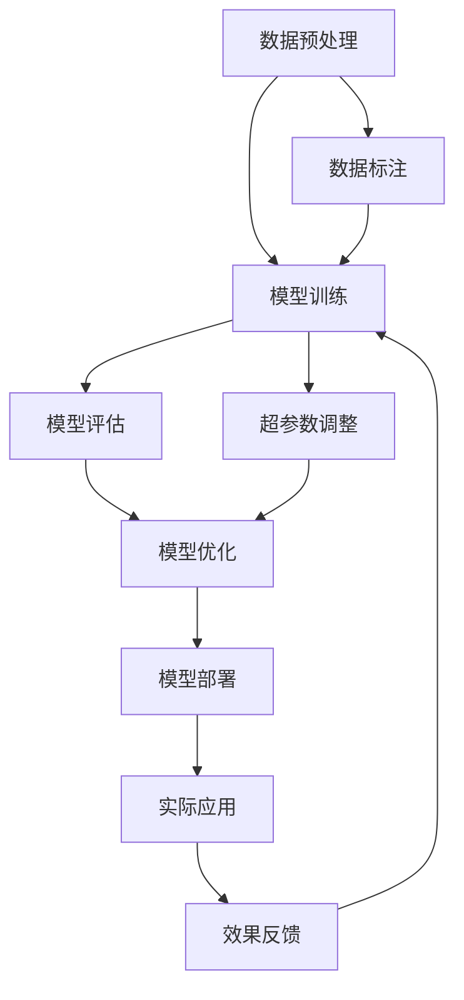

                 

# AI 大模型创业：如何利用技术优势？

> 关键词：大模型、创业、技术优势、AI、深度学习、自然语言处理、模型优化、商业应用

> 摘要：本文旨在探讨如何利用大模型的技术优势进行创业，从背景介绍、核心概念与联系、核心算法原理与具体操作步骤、数学模型和公式、项目实战、实际应用场景、工具和资源推荐、总结与未来发展趋势等多方面进行详细阐述。通过本文，读者可以深入了解大模型的创业机会和技术实现路径，为实际应用提供指导。

## 1. 背景介绍

随着人工智能技术的飞速发展，大模型（如GPT、BERT等）已经成为推动行业变革的关键力量。大模型具有强大的语言理解和生成能力，能够处理复杂的自然语言任务，如文本生成、情感分析、机器翻译等。这些技术优势使得大模型在多个领域展现出巨大的商业潜力。本文将探讨如何利用大模型的技术优势进行创业，从技术实现到商业应用进行全面分析。

## 2. 核心概念与联系

### 2.1 大模型概述

大模型是指参数量巨大、训练数据量丰富、训练时间较长的深度学习模型。这些模型通常包含数亿甚至数十亿个参数，能够捕捉到数据中的复杂模式和细微特征。大模型的核心优势在于其强大的泛化能力和对未知数据的适应能力。

### 2.2 核心概念原理

#### 2.2.1 深度学习基础

深度学习是一种基于神经网络的机器学习方法，通过多层非线性变换实现对复杂数据的建模。深度学习的核心在于多层次的特征提取和表示学习，能够从原始数据中自动学习到高层次的抽象特征。

#### 2.2.2 自然语言处理（NLP）

自然语言处理是研究计算机与人类自然语言交互的学科，涉及文本分析、情感分析、机器翻译等多个任务。大模型在自然语言处理领域表现出色，能够实现高质量的文本生成和理解。

### 2.3 核心概念架构



## 3. 核心算法原理 & 具体操作步骤

### 3.1 模型训练

模型训练是大模型创业的核心步骤，主要包括数据预处理、模型选择、超参数调整和训练过程。

#### 3.1.1 数据预处理

数据预处理是模型训练的基础，主要包括数据清洗、分词、标注等步骤。数据预处理的质量直接影响模型的训练效果。

#### 3.1.2 模型选择

选择合适的模型架构是模型训练的关键。常见的大模型架构包括Transformer、BERT、GPT等。选择模型时需要考虑任务需求、计算资源和训练时间等因素。

#### 3.1.3 超参数调整

超参数调整是模型训练的重要环节，主要包括学习率、批次大小、优化器等参数的调整。合理的超参数设置能够提高模型的训练效果。

#### 3.1.4 训练过程

训练过程包括前向传播、反向传播和参数更新等步骤。训练过程中需要监控损失函数和准确率，确保模型的训练效果。

### 3.2 模型评估

模型评估是衡量模型性能的重要步骤，主要包括准确率、召回率、F1值等指标的计算。

### 3.3 模型优化

模型优化是提高模型性能的关键步骤，主要包括正则化、dropout、学习率衰减等技术的应用。

### 3.4 模型部署

模型部署是将训练好的模型应用于实际场景的过程，主要包括模型的保存、加载和推理等步骤。

## 4. 数学模型和公式 & 详细讲解 & 举例说明

### 4.1 Transformer模型

Transformer模型是大模型的核心架构之一，其主要特点是自注意力机制和位置编码。

#### 4.1.1 自注意力机制

自注意力机制是Transformer的核心，通过计算输入序列中每个位置与其他位置的注意力权重，实现对输入序列的全局建模。

$$
\text{Attention}(Q, K, V) = \text{softmax}\left(\frac{QK^T}{\sqrt{d_k}}\right)V
$$

#### 4.1.2 位置编码

位置编码是Transformer中用于表示输入序列位置信息的技术，通过正弦和余弦函数实现。

$$
\text{positional\_encoding}(pos, i) = \begin{cases}
\sin\left(\frac{pos}{10000^{\frac{2i}{d}}}\right) & \text{if } i \text{ is even} \\
\cos\left(\frac{pos}{10000^{\frac{2i-1}{d}}}\right) & \text{if } i \text{ is odd}
\end{cases}
$$

### 4.2 BERT模型

BERT模型是大模型中的另一重要架构，其主要特点是双向编码和掩码语言模型。

#### 4.2.1 双向编码

BERT模型通过双向编码实现对输入序列的全局建模，能够捕捉到上下文信息。

#### 4.2.2 掩码语言模型

掩码语言模型是BERT模型中的预训练任务，通过随机掩码部分输入序列，实现对模型的预训练。

## 5. 项目实战：代码实际案例和详细解释说明

### 5.1 开发环境搭建

开发环境搭建是项目实战的第一步，主要包括安装Python、TensorFlow或PyTorch等深度学习框架，配置GPU环境等。

#### 5.1.1 安装Python

```bash
sudo apt-get update
sudo apt-get install python3.8
```

#### 5.1.2 安装TensorFlow

```bash
pip install tensorflow
```

### 5.2 源代码详细实现和代码解读

#### 5.2.1 数据预处理

```python
import pandas as pd
from sklearn.model_selection import train_test_split

# 加载数据
data = pd.read_csv('data.csv')

# 数据清洗
data = data.dropna()

# 分割数据集
train_data, test_data = train_test_split(data, test_size=0.2)

# 数据预处理
train_data['text'] = train_data['text'].apply(lambda x: x.lower())
test_data['text'] = test_data['text'].apply(lambda x: x.lower())
```

#### 5.2.2 模型选择

```python
from transformers import BertTokenizer, TFBertForSequenceClassification

# 加载预训练模型
tokenizer = BertTokenizer.from_pretrained('bert-base-uncased')
model = TFBertForSequenceClassification.from_pretrained('bert-base-uncased')
```

#### 5.2.3 超参数调整

```python
from transformers import AdamW

# 定义优化器
optimizer = AdamW(model.parameters(), lr=2e-5)

# 定义训练参数
batch_size = 16
epochs = 3
```

#### 5.2.4 训练过程

```python
from transformers import DataCollatorWithPadding

# 定义数据收集器
data_collator = DataCollatorWithPadding(tokenizer=tokenizer)

# 定义训练数据集
train_dataset = tokenizer(train_data['text'].tolist(), padding=True, truncation=True, max_length=128)

# 定义验证数据集
test_dataset = tokenizer(test_data['text'].tolist(), padding=True, truncation=True, max_length=128)

# 定义训练参数
train_args = TrainingArguments(
    output_dir='./results',
    num_train_epochs=epochs,
    per_device_train_batch_size=batch_size,
    per_device_eval_batch_size=batch_size,
    warmup_steps=500,
    weight_decay=0.01,
    logging_dir='./logs',
    logging_steps=10,
)

# 定义训练器
trainer = Trainer(
    model=model,
    args=train_args,
    train_dataset=train_dataset,
    eval_dataset=test_dataset,
    tokenizer=tokenizer,
    data_collator=data_collator,
    compute_metrics=compute_metrics,
)

# 开始训练
trainer.train()
```

### 5.3 代码解读与分析

通过上述代码，我们可以看到整个训练过程的详细步骤。首先，我们加载了预训练的BERT模型和相应的分词器。然后，我们定义了训练参数，包括优化器、批次大小、训练轮数等。接着，我们对数据进行了预处理，包括清洗和分词。最后，我们使用`Trainer`类进行模型训练，并监控训练过程中的损失函数和准确率。

## 6. 实际应用场景

### 6.1 文本生成

大模型在文本生成领域具有广泛的应用，如自动摘要、对话系统等。

### 6.2 情感分析

大模型在情感分析领域表现出色，能够准确识别文本中的情感倾向。

### 6.3 机器翻译

大模型在机器翻译领域具有强大的翻译能力，能够实现高质量的跨语言翻译。

## 7. 工具和资源推荐

### 7.1 学习资源推荐

- 书籍：《深度学习》（Ian Goodfellow, Yoshua Bengio, Aaron Courville）
- 论文：《Attention Is All You Need》（Vaswani et al., 2017）
- 博客：阿里云开发者社区
- 网站：Hugging Face

### 7.2 开发工具框架推荐

- Python
- TensorFlow
- PyTorch
- Hugging Face Transformers库

### 7.3 相关论文著作推荐

- 《BERT: Pre-training of Deep Bidirectional Transformers for Language Understanding》（Devlin et al., 2018）
- 《GPT-2: Language Models are Unsupervised Multitask Learners》（Radford et al., 2019）

## 8. 总结：未来发展趋势与挑战

### 8.1 未来发展趋势

- 大模型将继续向更大规模、更复杂架构发展
- 大模型在更多领域的应用将更加广泛
- 大模型的训练和推理效率将进一步提高

### 8.2 挑战

- 训练大模型所需的计算资源和时间成本较高
- 大模型的可解释性和泛化能力仍需进一步提升
- 大模型的安全性和隐私保护问题亟待解决

## 9. 附录：常见问题与解答

### 9.1 问题：如何选择合适的模型架构？

答：选择模型架构时需要考虑任务需求、计算资源和训练时间等因素。对于文本生成任务，可以考虑使用GPT模型；对于情感分析任务，可以考虑使用BERT模型。

### 9.2 问题：如何提高模型的训练效果？

答：提高模型训练效果的方法包括数据预处理、超参数调整、正则化等技术的应用。

## 10. 扩展阅读 & 参考资料

- 《深度学习》（Ian Goodfellow, Yoshua Bengio, Aaron Courville）
- 《Attention Is All You Need》（Vaswani et al., 2017）
- 《BERT: Pre-training of Deep Bidirectional Transformers for Language Understanding》（Devlin et al., 2018）
- 《GPT-2: Language Models are Unsupervised Multitask Learners》（Radford et al., 2019）

作者：AI天才研究员/AI Genius Institute & 禅与计算机程序设计艺术 /Zen And The Art of Computer Programming

