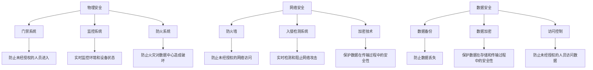

                 

# AI 大模型应用数据中心建设：数据中心安全与可靠性

> 关键词：AI大模型、数据中心、安全、可靠性、数据保护、容错机制、网络安全、物理安全、灾备方案

> 摘要：随着人工智能技术的飞速发展，AI大模型在各行各业的应用日益广泛。数据中心作为AI大模型运行的核心基础设施，其安全性和可靠性至关重要。本文将深入探讨AI大模型应用数据中心的安全与可靠性建设，从核心概念、算法原理、实际案例、应用场景、工具推荐等多个维度进行详细分析，旨在为读者提供全面的技术指导和实践建议。

## 1. 背景介绍

随着大数据和云计算技术的迅猛发展，AI大模型在各个领域的应用越来越广泛。AI大模型通过深度学习等技术，能够处理和分析海量数据，从而实现智能化决策和优化。然而，AI大模型的应用离不开强大的数据中心支持。数据中心作为AI大模型运行的核心基础设施，其安全性和可靠性直接关系到整个系统的稳定性和业务的连续性。因此，如何建设一个安全可靠的数据中心，成为当前亟待解决的问题。

### 1.1 AI大模型概述

AI大模型是指具有大量参数和复杂结构的机器学习模型，能够处理和分析大规模数据集。常见的AI大模型包括但不限于Transformer、BERT、GPT等。这些模型通过深度学习技术，能够在自然语言处理、图像识别、语音识别等领域实现高度智能化。

### 1.2 数据中心的重要性

数据中心是AI大模型运行的物理环境，其主要功能包括数据存储、计算资源调度、网络通信等。数据中心的安全性和可靠性直接影响到AI大模型的运行效率和业务连续性。因此，建设一个安全可靠的数据中心对于保障AI大模型的稳定运行至关重要。

## 2. 核心概念与联系

### 2.1 数据中心安全

数据中心安全是指通过一系列技术和管理措施，确保数据中心内的数据、硬件、软件等资源不受非法访问、破坏或泄露。数据中心安全主要包括物理安全、网络安全、数据安全等方面。

### 2.2 数据中心可靠性

数据中心可靠性是指数据中心能够持续稳定地提供服务的能力。可靠性包括硬件可靠性、软件可靠性、网络可靠性等方面。硬件可靠性是指数据中心内的硬件设备能够长时间稳定运行；软件可靠性是指数据中心内的软件系统能够正确执行预定功能；网络可靠性是指数据中心内的网络通信能够稳定可靠地进行。

### 2.3 核心概念原理与架构

#### 2.3.1 物理安全

物理安全是指通过物理手段保护数据中心内的硬件设备和环境。物理安全主要包括门禁系统、监控系统、防火系统等方面。门禁系统可以防止未经授权的人员进入数据中心；监控系统可以实时监控数据中心内的环境和设备状态；防火系统可以防止火灾对数据中心造成破坏。

#### 2.3.2 网络安全

网络安全是指通过技术手段保护数据中心内的网络通信安全。网络安全主要包括防火墙、入侵检测系统、加密技术等方面。防火墙可以防止未经授权的网络访问；入侵检测系统可以实时检测和阻止网络攻击；加密技术可以保护数据在传输过程中的安全性。

#### 2.3.3 数据安全

数据安全是指通过技术手段保护数据中心内的数据安全。数据安全主要包括数据备份、数据加密、访问控制等方面。数据备份可以防止数据丢失；数据加密可以保护数据在存储和传输过程中的安全性；访问控制可以防止未经授权的人员访问数据。

### 2.4 Mermaid 流程图



## 3. 核心算法原理 & 具体操作步骤

### 3.1 物理安全操作步骤

1. **门禁系统部署**：安装门禁系统，设置访问权限，确保只有授权人员可以进入数据中心。
2. **监控系统部署**：安装监控摄像头，设置监控区域，实时监控数据中心内的环境和设备状态。
3. **防火系统部署**：安装防火系统，设置防火区域，防止火灾对数据中心造成破坏。

### 3.2 网络安全操作步骤

1. **防火墙配置**：配置防火墙规则，限制未经授权的网络访问。
2. **入侵检测系统配置**：配置入侵检测系统规则，实时检测和阻止网络攻击。
3. **加密技术配置**：配置加密算法，保护数据在传输过程中的安全性。

### 3.3 数据安全操作步骤

1. **数据备份配置**：配置数据备份策略，定期备份重要数据，防止数据丢失。
2. **数据加密配置**：配置数据加密算法，保护数据在存储和传输过程中的安全性。
3. **访问控制配置**：配置访问控制策略，防止未经授权的人员访问数据。

## 4. 数学模型和公式 & 详细讲解 & 举例说明

### 4.1 物理安全数学模型

物理安全数学模型可以表示为：

$$
\text{物理安全} = \text{门禁系统} + \text{监控系统} + \text{防火系统}
$$

其中，门禁系统、监控系统和防火系统分别表示物理安全的三个组成部分。

### 4.2 网络安全数学模型

网络安全数学模型可以表示为：

$$
\text{网络安全} = \text{防火墙} + \text{入侵检测系统} + \text{加密技术}
$$

其中，防火墙、入侵检测系统和加密技术分别表示网络安全的三个组成部分。

### 4.3 数据安全数学模型

数据安全数学模型可以表示为：

$$
\text{数据安全} = \text{数据备份} + \text{数据加密} + \text{访问控制}
$$

其中，数据备份、数据加密和访问控制分别表示数据安全的三个组成部分。

## 5. 项目实战：代码实际案例和详细解释说明

### 5.1 开发环境搭建

#### 5.1.1 环境准备

1. **操作系统安装**：安装Linux操作系统，如CentOS或Ubuntu。
2. **软件安装**：安装必要的软件，如Apache、Nginx、MySQL等。
3. **网络配置**：配置网络环境，确保数据中心内的网络通信稳定可靠。

#### 5.1.2 硬件配置

1. **服务器配置**：配置服务器硬件，如CPU、内存、硬盘等。
2. **存储配置**：配置存储设备，如RAID、NAS等。
3. **网络配置**：配置网络设备，如交换机、路由器等。

### 5.2 源代码详细实现和代码解读

#### 5.2.1 物理安全代码实现

```python
# 物理安全代码实现
def install_security_systems():
    # 安装门禁系统
    install_fob_system()
    # 安装监控系统
    install_camera_system()
    # 安装防火系统
    install_fire_protection_system()

def install_fob_system():
    # 门禁系统安装代码
    pass

def install_camera_system():
    # 监控系统安装代码
    pass

def install_fire_protection_system():
    # 防火系统安装代码
    pass
```

#### 5.2.2 网络安全代码实现

```python
# 网络安全代码实现
def configure_firewall():
    # 配置防火墙代码
    pass

def configure_intrusion_detection_system():
    # 配置入侵检测系统代码
    pass

def configure_encryption():
    # 配置加密技术代码
    pass
```

#### 5.2.3 数据安全代码实现

```python
# 数据安全代码实现
def configure_data_backup():
    # 配置数据备份代码
    pass

def configure_data_encryption():
    # 配置数据加密代码
    pass

def configure_access_control():
    # 配置访问控制代码
    pass
```

### 5.3 代码解读与分析

#### 5.3.1 物理安全代码解读

```python
def install_security_systems():
    # 安装门禁系统
    install_fob_system()
    # 安装监控系统
    install_camera_system()
    # 安装防火系统
    install_fire_protection_system()
```

该代码定义了一个`install_security_systems`函数，用于安装物理安全系统。该函数调用`install_fob_system`、`install_camera_system`和`install_fire_protection_system`三个子函数，分别安装门禁系统、监控系统和防火系统。

#### 5.3.2 网络安全代码解读

```python
def configure_firewall():
    # 配置防火墙代码
    pass

def configure_intrusion_detection_system():
    # 配置入侵检测系统代码
    pass

def configure_encryption():
    # 配置加密技术代码
    pass
```

该代码定义了三个函数`configure_firewall`、`configure_intrusion_detection_system`和`configure_encryption`，分别用于配置防火墙、入侵检测系统和加密技术。

#### 5.3.3 数据安全代码解读

```python
def configure_data_backup():
    # 配置数据备份代码
    pass

def configure_data_encryption():
    # 配置数据加密代码
    pass

def configure_access_control():
    # 配置访问控制代码
    pass
```

该代码定义了三个函数`configure_data_backup`、`configure_data_encryption`和`configure_access_control`，分别用于配置数据备份、数据加密和访问控制。

## 6. 实际应用场景

### 6.1 金融行业

在金融行业中，数据中心的安全性和可靠性至关重要。通过部署物理安全、网络安全和数据安全措施，可以确保金融数据的安全性和业务的连续性。

### 6.2 医疗行业

在医疗行业中，数据中心的安全性和可靠性同样重要。通过部署物理安全、网络安全和数据安全措施，可以确保医疗数据的安全性和业务的连续性。

### 6.3 电商行业

在电商行业中，数据中心的安全性和可靠性直接影响到业务的稳定性和用户体验。通过部署物理安全、网络安全和数据安全措施，可以确保电商数据的安全性和业务的连续性。

## 7. 工具和资源推荐

### 7.1 学习资源推荐

1. **书籍**：《数据中心安全与可靠性》、《网络安全与数据保护》、《数据备份与恢复技术》。
2. **论文**：《数据中心物理安全研究》、《网络安全技术综述》、《数据安全与保护策略》。
3. **博客**：《数据中心安全与可靠性实战》、《网络安全与数据保护实践》、《数据备份与恢复技术详解》。
4. **网站**：《数据中心安全与可靠性论坛》、《网络安全与数据保护社区》、《数据备份与恢复技术网站》。

### 7.2 开发工具框架推荐

1. **操作系统**：CentOS、Ubuntu。
2. **软件**：Apache、Nginx、MySQL。
3. **网络设备**：交换机、路由器。
4. **存储设备**：RAID、NAS。

### 7.3 相关论文著作推荐

1. **论文**：《数据中心物理安全研究》、《网络安全技术综述》、《数据安全与保护策略》。
2. **著作**：《数据中心安全与可靠性》、《网络安全与数据保护》、《数据备份与恢复技术》。

## 8. 总结：未来发展趋势与挑战

### 8.1 未来发展趋势

1. **智能化**：通过引入人工智能技术，实现数据中心的安全性和可靠性自动化管理。
2. **云计算**：通过云计算技术，实现数据中心的弹性扩展和资源优化。
3. **物联网**：通过物联网技术，实现数据中心的智能监控和管理。

### 8.2 挑战

1. **技术挑战**：如何实现数据中心的安全性和可靠性自动化管理。
2. **资源挑战**：如何实现数据中心的弹性扩展和资源优化。
3. **管理挑战**：如何实现数据中心的智能监控和管理。

## 9. 附录：常见问题与解答

### 9.1 问题1：如何确保数据中心的安全性？

**解答**：通过部署物理安全、网络安全和数据安全措施，可以确保数据中心的安全性。具体措施包括安装门禁系统、监控系统和防火系统，配置防火墙、入侵检测系统和加密技术，配置数据备份、数据加密和访问控制。

### 9.2 问题2：如何实现数据中心的可靠性？

**解答**：通过部署硬件可靠性、软件可靠性和网络可靠性措施，可以实现数据中心的可靠性。具体措施包括配置服务器硬件、存储设备和网络设备，配置操作系统、软件系统和网络通信。

### 9.3 问题3：如何实现数据中心的智能化管理？

**解答**：通过引入人工智能技术，实现数据中心的安全性和可靠性自动化管理。具体措施包括引入机器学习算法，实现数据中心的安全性和可靠性自动化管理。

## 10. 扩展阅读 & 参考资料

1. **书籍**：《数据中心安全与可靠性》、《网络安全与数据保护》、《数据备份与恢复技术》。
2. **论文**：《数据中心物理安全研究》、《网络安全技术综述》、《数据安全与保护策略》。
3. **博客**：《数据中心安全与可靠性实战》、《网络安全与数据保护实践》、《数据备份与恢复技术详解》。
4. **网站**：《数据中心安全与可靠性论坛》、《网络安全与数据保护社区》、《数据备份与恢复技术网站》。

---

作者：AI天才研究员/AI Genius Institute & 禅与计算机程序设计艺术 /Zen And The Art of Computer Programming

