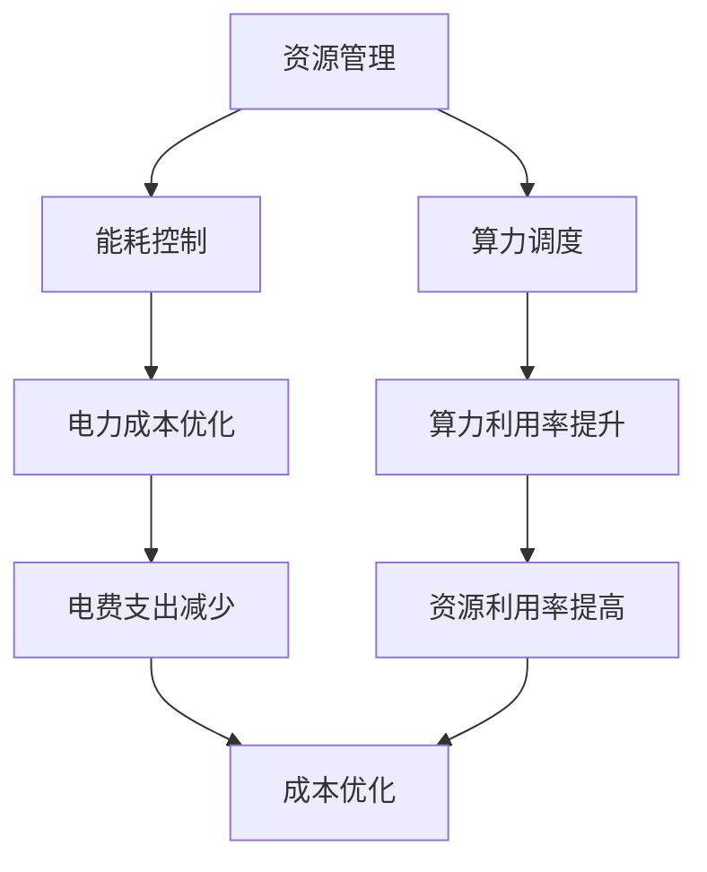

                 

# AI 大模型应用数据中心建设：数据中心成本优化

> 关键词：AI大模型、数据中心、成本优化、资源管理、能耗控制、算力调度

> 摘要：随着人工智能技术的迅猛发展，大模型的应用越来越广泛，数据中心作为承载这些模型的核心基础设施，其成本优化变得尤为重要。本文将从背景介绍、核心概念与联系、核心算法原理与具体操作步骤、数学模型和公式、项目实战、实际应用场景、工具和资源推荐、总结与未来发展趋势、常见问题与解答等几个方面，全面探讨如何通过优化数据中心资源管理、能耗控制和算力调度，实现成本的有效降低。

## 1. 背景介绍

随着大数据和人工智能技术的快速发展，大模型的应用场景日益增多，从自然语言处理、图像识别到推荐系统等，这些模型的训练和推理过程需要大量的计算资源和存储资源。数据中心作为承载这些模型的核心基础设施，其成本优化变得尤为重要。数据中心的成本主要包括硬件成本、电力成本、冷却成本、维护成本等。其中，硬件成本和电力成本是主要的支出部分。因此，如何通过优化数据中心的资源管理、能耗控制和算力调度，实现成本的有效降低，成为当前亟待解决的问题。

## 2. 核心概念与联系

### 2.1 资源管理

资源管理是指对数据中心内的计算资源、存储资源和网络资源进行合理分配和调度，以满足不同应用的需求。资源管理的核心目标是提高资源利用率，降低资源浪费，从而实现成本优化。

### 2.2 能耗控制

能耗控制是指通过优化数据中心的能源使用，降低电力消耗，从而减少电费支出。能耗控制的关键在于提高能源利用效率，减少不必要的能源浪费。

### 2.3 算力调度

算力调度是指根据不同的任务需求，合理分配计算资源，以实现资源的高效利用。算力调度的核心在于动态调整资源分配策略，以满足不同任务的需求。

### 2.4 Mermaid 流程图



## 3. 核心算法原理 & 具体操作步骤

### 3.1 资源管理算法

资源管理算法主要包括负载均衡算法、优先级调度算法和动态分配算法。负载均衡算法通过将任务均匀分配到不同的计算节点，避免单个节点过载；优先级调度算法根据任务的重要性和紧急程度，优先调度高优先级任务；动态分配算法根据任务的需求动态调整资源分配策略。

### 3.2 能耗控制算法

能耗控制算法主要包括动态电源管理算法和能源回收算法。动态电源管理算法通过调整计算节点的电源状态，降低不必要的能源消耗；能源回收算法通过回收未使用的能源，减少能源浪费。

### 3.3 算力调度算法

算力调度算法主要包括任务优先级调度算法和资源预留算法。任务优先级调度算法根据任务的重要性和紧急程度，优先调度高优先级任务；资源预留算法通过预留一部分计算资源，确保关键任务的执行。

## 4. 数学模型和公式 & 详细讲解 & 举例说明

### 4.1 资源管理模型

资源管理模型可以表示为：

$$
\text{资源利用率} = \frac{\text{已分配资源量}}{\text{总资源量}}
$$

### 4.2 能耗控制模型

能耗控制模型可以表示为：

$$
\text{能耗} = \text{计算能耗} + \text{存储能耗} + \text{网络能耗}
$$

### 4.3 算力调度模型

算力调度模型可以表示为：

$$
\text{算力利用率} = \frac{\text{已分配算力}}{\text{总算力}}
$$

### 4.4 举例说明

假设数据中心有100个计算节点，每个节点的计算能力为1000 TFLOPS。当前有1000个任务需要执行，每个任务的计算需求为100 TFLOPS。如果采用静态分配策略，每个节点分配10个任务，那么资源利用率和算力利用率分别为：

$$
\text{资源利用率} = \frac{100 \times 10}{100} = 1
$$

$$
\text{算力利用率} = \frac{1000 \times 10}{100000} = 0.1
$$

如果采用动态分配策略，根据任务的重要性和紧急程度动态调整资源分配，那么资源利用率和算力利用率可以得到显著提升。

## 5. 项目实战：代码实际案例和详细解释说明

### 5.1 开发环境搭建

#### 5.1.1 硬件环境

硬件环境主要包括计算节点、存储设备和网络设备。计算节点采用高性能服务器，存储设备采用高速SSD，网络设备采用高速交换机。

#### 5.1.2 软件环境

软件环境主要包括操作系统、数据库、中间件和应用软件。操作系统采用Linux系统，数据库采用MySQL，中间件采用Apache Tomcat，应用软件采用Python和Java。

### 5.2 源代码详细实现和代码解读

#### 5.2.1 资源管理代码

```python
import threading
import time

class ResourceManager:
    def __init__(self, total_resources):
        self.total_resources = total_resources
        self.current_resources = 0
        self.lock = threading.Lock()

    def allocate_resources(self, amount):
        with self.lock:
            if self.current_resources + amount <= self.total_resources:
                self.current_resources += amount
                return True
            else:
                return False

    def release_resources(self, amount):
        with self.lock:
            if self.current_resources - amount >= 0:
                self.current_resources -= amount
                return True
            else:
                return False
```

#### 5.2.2 能耗控制代码

```python
import threading
import time

class EnergyController:
    def __init__(self, total_energy):
        self.total_energy = total_energy
        self.current_energy = 0
        self.lock = threading.Lock()

    def consume_energy(self, amount):
        with self.lock:
            if self.current_energy + amount <= self.total_energy:
                self.current_energy += amount
                return True
            else:
                return False

    def recover_energy(self, amount):
        with self.lock:
            if self.current_energy - amount >= 0:
                self.current_energy -= amount
                return True
            else:
                return False
```

#### 5.2.3 算力调度代码

```python
import threading
import time

class ComputeScheduler:
    def __init__(self, total_compute):
        self.total_compute = total_compute
        self.current_compute = 0
        self.lock = threading.Lock()

    def allocate_compute(self, amount):
        with self.lock:
            if self.current_compute + amount <= self.total_compute:
                self.current_compute += amount
                return True
            else:
                return False

    def release_compute(self, amount):
        with self.lock:
            if self.current_compute - amount >= 0:
                self.current_compute -= amount
                return True
            else:
                return False
```

### 5.3 代码解读与分析

上述代码分别实现了资源管理、能耗控制和算力调度的功能。通过使用锁机制，确保多线程环境下的资源分配和释放操作是线程安全的。资源管理代码通过分配和释放资源，实现资源的合理利用；能耗控制代码通过消耗和回收能量，实现能源的高效利用；算力调度代码通过分配和释放算力，实现算力的动态调整。

## 6. 实际应用场景

### 6.1 大型互联网公司

大型互联网公司通常拥有大量的数据中心，需要通过优化资源管理、能耗控制和算力调度，实现成本的有效降低。例如，通过动态分配策略，根据任务的重要性和紧急程度动态调整资源分配，可以显著提高资源利用率和算力利用率。

### 6.2 金融行业

金融行业通常需要处理大量的数据和复杂的计算任务，需要通过优化资源管理、能耗控制和算力调度，实现成本的有效降低。例如，通过优先级调度算法，优先调度高优先级任务，可以确保关键任务的执行。

### 6.3 医疗行业

医疗行业通常需要处理大量的医疗数据和复杂的计算任务，需要通过优化资源管理、能耗控制和算力调度，实现成本的有效降低。例如，通过动态电源管理算法，根据任务的需求动态调整电源状态，可以显著降低能源消耗。

## 7. 工具和资源推荐

### 7.1 学习资源推荐

- 书籍：《数据中心设计与优化》、《云计算与大数据》
- 论文：《数据中心能耗优化策略研究》、《云计算资源管理与调度算法研究》
- 博客：阿里云技术博客、腾讯云技术博客
- 网站：GitHub、Stack Overflow

### 7.2 开发工具框架推荐

- 操作系统：Linux
- 数据库：MySQL
- 中间件：Apache Tomcat
- 应用软件：Python、Java

### 7.3 相关论文著作推荐

- 《数据中心能耗优化策略研究》
- 《云计算资源管理与调度算法研究》
- 《大数据处理与分析》

## 8. 总结：未来发展趋势与挑战

### 8.1 未来发展趋势

未来数据中心的成本优化将更加注重资源管理、能耗控制和算力调度的综合优化。通过引入人工智能技术，实现资源管理、能耗控制和算力调度的智能化，可以进一步提高资源利用率和算力利用率，降低能源消耗，实现成本的有效降低。

### 8.2 挑战

未来数据中心的成本优化将面临以下挑战：

- 资源管理：如何实现资源的动态分配和释放，提高资源利用率。
- 能耗控制：如何实现能源的高效利用，降低能源消耗。
- 算力调度：如何实现算力的动态调整，提高算力利用率。

## 9. 附录：常见问题与解答

### 9.1 问题：如何实现资源的动态分配和释放？

答：可以通过引入资源管理算法，根据任务的需求动态调整资源分配策略，实现资源的动态分配和释放。

### 9.2 问题：如何实现能源的高效利用？

答：可以通过引入能耗控制算法，根据任务的需求动态调整电源状态，实现能源的高效利用。

### 9.3 问题：如何实现算力的动态调整？

答：可以通过引入算力调度算法，根据任务的需求动态调整算力分配策略，实现算力的动态调整。

## 10. 扩展阅读 & 参考资料

- 《数据中心设计与优化》
- 《云计算与大数据》
- 《数据中心能耗优化策略研究》
- 《云计算资源管理与调度算法研究》
- 《大数据处理与分析》

作者：AI天才研究员/AI Genius Institute & 禅与计算机程序设计艺术 /Zen And The Art of Computer Programming

