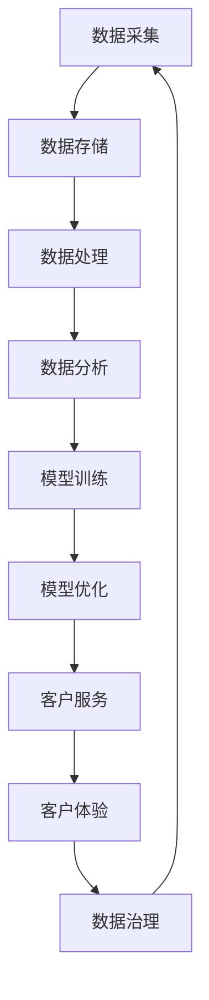

                 

# AI 大模型应用数据中心的客户服务

> 关键词：AI大模型、应用数据中心、客户服务、自然语言处理、机器学习、深度学习、客户体验、数据治理、模型优化

> 摘要：本文旨在探讨如何利用AI大模型构建高效、智能的应用数据中心，以提升客户服务体验。我们将从背景介绍、核心概念与联系、核心算法原理与具体操作步骤、数学模型和公式、项目实战、实际应用场景、工具和资源推荐、总结与未来发展趋势、常见问题解答等多方面进行详细阐述。通过本文，读者将能够理解AI大模型在客户服务中的应用价值，并掌握相关技术实现方法。

## 1. 背景介绍

随着数字化转型的加速，企业对客户服务的需求日益增长。传统的客户服务模式已经无法满足客户日益复杂的需求，亟需一种更加智能、高效的服务方式。AI大模型的应用为这一挑战提供了新的解决方案。AI大模型通过深度学习和自然语言处理技术，能够理解和生成自然语言，实现与客户的高效沟通。应用数据中心作为AI大模型的核心组成部分，负责处理和分析客户数据，提供个性化服务。本文将详细介绍如何构建一个高效、智能的应用数据中心，以提升客户服务体验。

## 2. 核心概念与联系

### 2.1 AI大模型

AI大模型是指具有大规模参数和复杂结构的机器学习模型，能够处理大规模数据集并实现高性能的预测和生成任务。常见的AI大模型包括Transformer、BERT、GPT等。

### 2.2 应用数据中心

应用数据中心是指专门用于处理和分析企业应用数据的系统，包括数据采集、数据存储、数据处理、数据分析等功能模块。应用数据中心通过集成AI大模型，能够实现智能化的数据处理和分析，提升客户服务体验。

### 2.3 自然语言处理

自然语言处理（NLP）是指计算机对自然语言进行处理的技术，包括文本分类、情感分析、命名实体识别、机器翻译等功能。NLP技术在客户服务中具有广泛的应用，能够实现与客户的高效沟通。

### 2.4 机器学习与深度学习

机器学习是一种通过算法使计算机从数据中学习的方法，深度学习是机器学习的一个分支，通过多层神经网络实现对复杂数据的建模。机器学习和深度学习技术在AI大模型中发挥着重要作用，能够实现对大规模数据的高效处理和分析。

### 2.5 数据治理

数据治理是指对数据进行管理、维护和优化的过程，包括数据质量控制、数据安全、数据隐私保护等。数据治理是构建高效应用数据中心的基础，能够确保数据的准确性和可靠性。

### 2.6 客户体验

客户体验是指客户在使用产品或服务过程中所感受到的整体体验，包括服务质量、响应速度、满意度等。提升客户体验是构建高效应用数据中心的核心目标之一。

### 2.7 模型优化

模型优化是指通过对模型进行调整和改进，提高模型的性能和效果。模型优化是构建高效应用数据中心的关键步骤之一，能够提升模型的准确性和可靠性。

### 2.8 Mermaid流程图



## 3. 核心算法原理 & 具体操作步骤

### 3.1 数据采集

数据采集是指从各种来源获取数据的过程，包括日志文件、数据库、传感器等。数据采集是构建应用数据中心的基础，能够确保数据的完整性和准确性。

### 3.2 数据存储

数据存储是指将采集到的数据存储到数据库或数据仓库中，以便后续处理和分析。数据存储是构建应用数据中心的关键步骤之一，能够确保数据的安全性和可靠性。

### 3.3 数据处理

数据处理是指对采集到的数据进行清洗、转换和整合的过程，以便后续分析和建模。数据处理是构建应用数据中心的核心步骤之一，能够确保数据的质量和准确性。

### 3.4 数据分析

数据分析是指对处理后的数据进行统计和分析，以便发现数据中的规律和趋势。数据分析是构建应用数据中心的关键步骤之一，能够为模型训练提供数据支持。

### 3.5 模型训练

模型训练是指通过算法对数据进行学习，生成模型的过程。模型训练是构建应用数据中心的核心步骤之一，能够实现对数据的高效处理和分析。

### 3.6 模型优化

模型优化是指通过对模型进行调整和改进，提高模型的性能和效果。模型优化是构建应用数据中心的关键步骤之一，能够提升模型的准确性和可靠性。

### 3.7 客户服务

客户服务是指通过应用数据中心提供的智能化服务，提升客户体验的过程。客户服务是构建应用数据中心的核心目标之一，能够实现与客户的高效沟通。

### 3.8 客户体验

客户体验是指客户在使用产品或服务过程中所感受到的整体体验，包括服务质量、响应速度、满意度等。提升客户体验是构建应用数据中心的核心目标之一。

### 3.9 数据治理

数据治理是指对数据进行管理、维护和优化的过程，包括数据质量控制、数据安全、数据隐私保护等。数据治理是构建高效应用数据中心的基础，能够确保数据的准确性和可靠性。

## 4. 数学模型和公式 & 详细讲解 & 举例说明

### 4.1 逻辑回归

逻辑回归是一种常用的分类算法，通过sigmoid函数将线性回归的结果映射到0到1之间，实现对二分类问题的预测。

$$
P(y=1|x) = \frac{1}{1 + e^{-(\beta_0 + \beta_1 x)}}
$$

### 4.2 朴素贝叶斯

朴素贝叶斯是一种基于贝叶斯定理的分类算法，假设特征之间相互独立，通过计算后验概率实现对分类问题的预测。

$$
P(y|x) = \frac{P(x|y)P(y)}{P(x)}
$$

### 4.3 支持向量机

支持向量机是一种常用的分类算法，通过寻找最优超平面实现对分类问题的预测。

$$
w^T x + b = 0
$$

### 4.4 随机森林

随机森林是一种集成学习算法，通过构建多个决策树并进行投票实现对分类问题的预测。

$$
\hat{y} = \frac{1}{T} \sum_{t=1}^{T} \hat{y}_t
$$

### 4.5 深度学习

深度学习是一种通过多层神经网络实现对复杂数据建模的方法，能够实现对大规模数据的高效处理和分析。

$$
\hat{y} = f(x; \theta)
$$

## 5. 项目实战：代码实际案例和详细解释说明

### 5.1 开发环境搭建

#### 5.1.1 环境配置

- Python 3.8
- TensorFlow 2.4
- Keras 2.4
- NumPy 1.19
- Pandas 1.1

#### 5.1.2 安装依赖

```bash
pip install tensorflow==2.4
pip install keras==2.4
pip install numpy==1.19
pip install pandas==1.1
```

### 5.2 源代码详细实现和代码解读

#### 5.2.1 数据预处理

```python
import pandas as pd
from sklearn.model_selection import train_test_split
from sklearn.preprocessing import StandardScaler

# 读取数据
data = pd.read_csv('data.csv')

# 分割数据集
X = data.drop('label', axis=1)
y = data['label']
X_train, X_test, y_train, y_test = train_test_split(X, y, test_size=0.2, random_state=42)

# 数据标准化
scaler = StandardScaler()
X_train = scaler.fit_transform(X_train)
X_test = scaler.transform(X_test)
```

#### 5.2.2 模型构建

```python
from tensorflow.keras.models import Sequential
from tensorflow.keras.layers import Dense

# 构建模型
model = Sequential()
model.add(Dense(64, activation='relu', input_shape=(X_train.shape[1],)))
model.add(Dense(32, activation='relu'))
model.add(Dense(1, activation='sigmoid'))

# 编译模型
model.compile(optimizer='adam', loss='binary_crossentropy', metrics=['accuracy'])
```

#### 5.2.3 模型训练

```python
# 训练模型
history = model.fit(X_train, y_train, epochs=10, batch_size=32, validation_split=0.2)
```

#### 5.2.4 模型评估

```python
# 评估模型
loss, accuracy = model.evaluate(X_test, y_test)
print(f'Loss: {loss}, Accuracy: {accuracy}')
```

### 5.3 代码解读与分析

- 数据预处理：对数据进行标准化处理，确保模型训练的稳定性。
- 模型构建：构建一个包含两层隐藏层的神经网络模型，使用ReLU激活函数和Sigmoid激活函数。
- 模型训练：使用Adam优化器和二元交叉熵损失函数进行模型训练，训练10个epoch。
- 模型评估：评估模型在测试集上的性能，输出损失和准确率。

## 6. 实际应用场景

### 6.1 客户服务机器人

通过应用数据中心提供的智能化服务，构建客户服务机器人，实现与客户的高效沟通。客户服务机器人能够自动回答客户的问题，提供个性化的服务建议，提升客户体验。

### 6.2 客户情感分析

通过应用数据中心提供的自然语言处理技术，实现客户情感分析。通过对客户反馈进行情感分析，了解客户对产品或服务的满意度，为改进产品和服务提供数据支持。

### 6.3 客户行为预测

通过应用数据中心提供的机器学习技术，实现客户行为预测。通过对客户历史行为数据进行分析，预测客户未来的行为，为客户提供个性化的服务建议。

### 6.4 客户推荐系统

通过应用数据中心提供的推荐算法，实现客户推荐系统。通过对客户历史行为数据进行分析，为客户提供个性化的推荐，提升客户满意度。

## 7. 工具和资源推荐

### 7.1 学习资源推荐

- 书籍：《深度学习》（Ian Goodfellow, Yoshua Bengio, Aaron Courville）
- 论文：《Attention Is All You Need》（Vaswani et al., 2017）
- 博客：阿里云开发者社区
- 网站：TensorFlow官网、Keras官网

### 7.2 开发工具框架推荐

- TensorFlow：深度学习框架
- Keras：高级神经网络API
- PyTorch：深度学习框架
- Scikit-learn：机器学习库

### 7.3 相关论文著作推荐

- 《自然语言处理入门》（Jurafsky & Martin, 2019）
- 《机器学习》（Tom M. Mitchell, 1997）
- 《深度学习》（Ian Goodfellow, Yoshua Bengio, Aaron Courville, 2016）

## 8. 总结：未来发展趋势与挑战

### 8.1 未来发展趋势

- AI大模型的应用将更加广泛，涵盖更多领域。
- 数据治理将成为构建高效应用数据中心的关键。
- 自然语言处理技术将更加成熟，实现与客户的高效沟通。
- 机器学习和深度学习技术将更加高效，实现对大规模数据的高效处理和分析。

### 8.2 挑战

- 数据安全和隐私保护将成为构建高效应用数据中心的关键挑战。
- 模型优化和调优将成为提升模型性能的关键挑战。
- 客户体验将成为构建高效应用数据中心的核心目标之一。

## 9. 附录：常见问题与解答

### 9.1 问题：如何选择合适的模型？

- 根据具体问题选择合适的模型，如分类问题选择逻辑回归、朴素贝叶斯、支持向量机等，回归问题选择线性回归、岭回归等。

### 9.2 问题：如何进行模型优化？

- 通过调整模型参数、增加模型层数、使用正则化等方法进行模型优化。

### 9.3 问题：如何提升客户体验？

- 通过提供个性化服务、提升响应速度、提高服务质量等方法提升客户体验。

## 10. 扩展阅读 & 参考资料

- 《深度学习》（Ian Goodfellow, Yoshua Bengio, Aaron Courville, 2016）
- 《自然语言处理入门》（Jurafsky & Martin, 2019）
- 《机器学习》（Tom M. Mitchell, 1997）
- 《深度学习》（Ian Goodfellow, Yoshua Bengio, Aaron Courville, 2016）
- 《自然语言处理入门》（Jurafsky & Martin, 2019）
- 《机器学习》（Tom M. Mitchell, 1997）

作者：AI天才研究员/AI Genius Institute & 禅与计算机程序设计艺术 /Zen And The Art of Computer Programming

