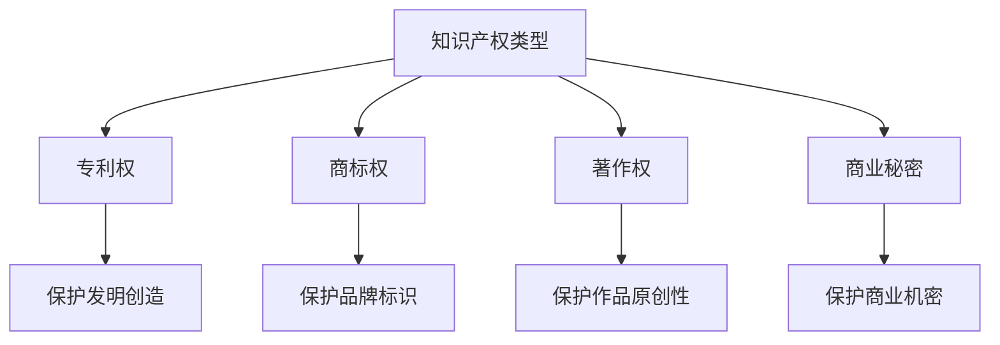

                 

# AI创业公司的知识产权诉讼策略：诉讼时机、诉讼地点与诉讼目的

> 关键词：知识产权、诉讼策略、AI创业公司、诉讼时机、诉讼地点、诉讼目的

> 摘要：本文旨在为AI创业公司提供一套全面的知识产权诉讼策略指南，涵盖诉讼时机的选择、诉讼地点的确定以及诉讼目的的设定。通过深入分析知识产权保护的重要性，结合实际案例和法律原则，本文将帮助创业者在面对知识产权纠纷时做出明智决策，从而保护自身权益，促进公司健康发展。

## 1. 背景介绍

随着人工智能技术的迅猛发展，AI创业公司面临着前所未有的机遇与挑战。知识产权作为企业核心竞争力的重要组成部分，对于AI创业公司而言尤为重要。知识产权纠纷不仅可能影响公司的正常运营，还可能对公司的声誉和市场地位造成严重损害。因此，制定一套有效的知识产权诉讼策略显得尤为关键。

### 1.1 知识产权的重要性

知识产权是指由法律赋予的、对智力成果的专有权利。对于AI创业公司而言，知识产权主要包括专利权、商标权、著作权和商业秘密等。这些权利为企业提供了法律保护，确保其创新成果不被他人非法使用或复制。知识产权的重要性体现在以下几个方面：

- **保护创新成果**：通过专利保护，企业可以确保其技术发明不被他人轻易模仿或抄袭。
- **增强市场竞争力**：拥有强大的知识产权组合可以提升企业在市场上的竞争力，吸引更多的投资和合作伙伴。
- **维护商业利益**：知识产权保护有助于防止竞争对手侵犯企业权益，减少经济损失。

### 1.2 知识产权纠纷的常见类型

在AI创业公司中，常见的知识产权纠纷类型包括：

- **专利侵权**：竞争对手未经授权使用企业的专利技术。
- **商标侵权**：竞争对手未经授权使用企业的商标名称或标志。
- **著作权侵权**：竞争对手未经授权使用企业的软件代码、文档或其他受版权保护的作品。
- **商业秘密泄露**：竞争对手通过不正当手段获取并使用企业的商业秘密。

## 2. 核心概念与联系

### 2.1 专利权

专利权是指发明人对其发明创造享有的专有权利。专利权的获得需要经过国家知识产权局的审查和授权。专利权的核心在于保护发明创造的独占性，防止他人未经授权使用、制造、销售或进口该发明。

### 2.2 商标权

商标权是指企业对其商标享有的专有权利。商标权的获得需要经过国家商标局的审查和注册。商标权的核心在于保护企业的品牌标识，防止他人未经授权使用相同或相似的商标。

### 2.3 著作权

著作权是指作者对其创作的作品享有的专有权利。著作权的获得无需经过注册，但可以通过版权登记增强法律保护。著作权的核心在于保护作品的原创性，防止他人未经授权复制、发行或改编作品。

### 2.4 商业秘密

商业秘密是指企业未公开的技术信息或经营信息，具有商业价值且采取了保密措施。商业秘密的核心在于保护企业的商业机密，防止他人未经授权获取和使用。

### 2.5 Mermaid 流程图



## 3. 核心算法原理 & 具体操作步骤

### 3.1 专利申请流程

专利申请流程主要包括以下几个步骤：

1. **发明创造**：企业需要对其发明创造进行详细记录和描述。
2. **专利检索**：企业需要进行专利检索，确保其发明创造未被他人申请过。
3. **撰写专利申请文件**：企业需要撰写详细的专利申请文件，包括说明书、权利要求书和摘要。
4. **提交专利申请**：企业需要将专利申请文件提交给国家知识产权局。
5. **审查过程**：国家知识产权局会对专利申请进行审查，包括形式审查和实质审查。
6. **授权公告**：审查通过后，国家知识产权局会发布授权公告，授予企业专利权。

### 3.2 商标注册流程

商标注册流程主要包括以下几个步骤：

1. **商标设计**：企业需要设计独特的商标标识。
2. **商标检索**：企业需要进行商标检索，确保其商标标识未被他人注册过。
3. **撰写商标注册申请文件**：企业需要撰写详细的商标注册申请文件，包括商标图样、商品/服务类别和使用情况说明。
4. **提交商标注册申请**：企业需要将商标注册申请文件提交给国家商标局。
5. **审查过程**：国家商标局会对商标注册申请进行审查，包括形式审查和实质审查。
6. **公告和异议**：审查通过后，国家商标局会发布公告，接受公众异议。
7. **注册公告**：异议期满后，国家商标局会发布注册公告，授予企业商标权。

### 3.3 著作权登记流程

著作权登记流程主要包括以下几个步骤：

1. **作品创作**：企业需要创作出受版权保护的作品。
2. **撰写著作权登记申请文件**：企业需要撰写详细的著作权登记申请文件，包括作品样本、作者信息和使用情况说明。
3. **提交著作权登记申请**：企业需要将著作权登记申请文件提交给国家版权局。
4. **审查过程**：国家版权局会对著作权登记申请进行审查，包括形式审查和实质审查。
5. **登记公告**：审查通过后，国家版权局会发布登记公告，授予企业著作权。

### 3.4 商业秘密保护措施

商业秘密保护措施主要包括以下几个方面：

1. **保密协议**：企业需要与员工、合作伙伴和供应商签订保密协议，明确保密义务。
2. **内部管理制度**：企业需要建立严格的内部管理制度，确保商业秘密的安全。
3. **技术保护措施**：企业需要采取技术手段，如加密、访问控制等，保护商业秘密。
4. **法律保护**：企业需要通过法律手段，如诉讼、仲裁等，保护商业秘密。

## 4. 数学模型和公式 & 详细讲解 & 举例说明

### 4.1 专利侵权判定模型

专利侵权判定模型主要包括以下几个方面：

1. **权利要求覆盖**：侵权产品是否覆盖了专利权利要求中的所有技术特征。
2. **等同原则**：侵权产品是否与专利权利要求中的技术特征实质上相同或等同。
3. **先用权抗辩**：侵权产品是否在专利申请日前已经公开使用或制造。
4. **合法来源抗辩**：侵权产品是否从合法渠道获得。

### 4.2 商标侵权判定模型

商标侵权判定模型主要包括以下几个方面：

1. **相似性比较**：侵权商标与被侵权商标是否在视觉、听觉或含义上相似。
2. **混淆可能性**：侵权商标是否可能导致消费者混淆或误认。
3. **实际使用情况**：侵权商标是否在相同或类似的商品/服务上使用。
4. **主观意图**：侵权方是否具有主观恶意或误导性意图。

### 4.3 著作权侵权判定模型

著作权侵权判定模型主要包括以下几个方面：

1. **实质性相似**：侵权作品与被侵权作品是否在表达上实质性相似。
2. **接触事实**：侵权方是否有机会接触被侵权作品。
3. **合理使用抗辩**：侵权方是否符合合理使用的规定。
4. **法定赔偿**：侵权方是否需要承担法定赔偿责任。

### 4.4 商业秘密泄露判定模型

商业秘密泄露判定模型主要包括以下几个方面：

1. **保密义务**：泄露方是否违反了保密协议或内部管理制度。
2. **泄露事实**：泄露方是否实际泄露了商业秘密。
3. **损害后果**：泄露行为是否给企业造成了实际损害。
4. **主观意图**：泄露方是否具有主观恶意或故意泄露意图。

## 5. 项目实战：代码实际案例和详细解释说明

### 5.1 开发环境搭建

为了进行知识产权诉讼，企业需要搭建一个完整的开发环境。具体步骤如下：

1. **选择开发工具**：选择合适的编程语言和开发工具，如Python、Java、Visual Studio Code等。
2. **安装开发环境**：安装必要的开发环境和依赖库，如Python的Anaconda、Java的JDK等。
3. **配置项目结构**：创建项目目录结构，包括源代码文件、配置文件和测试文件等。
4. **编写代码**：编写实现专利、商标、著作权和商业秘密保护的代码。

### 5.2 源代码详细实现和代码解读

以下是一个简单的代码示例，用于实现专利侵权判定模型中的权利要求覆盖检查：

```python
def check_coverage(rights_claims, infringing_product):
    """
    检查侵权产品是否覆盖了专利权利要求中的所有技术特征。
    """
    for claim in rights_claims:
        if not check_feature_coverage(claim, infringing_product):
            return False
    return True

def check_feature_coverage(claim, product):
    """
    检查侵权产品是否覆盖了专利权利要求中的某个技术特征。
    """
    for feature in claim.features:
        if feature not in product.features:
            return False
    return True
```

### 5.3 代码解读与分析

上述代码示例展示了如何实现专利侵权判定模型中的权利要求覆盖检查。具体步骤如下：

1. **定义函数**：定义`check_coverage`函数，用于检查侵权产品是否覆盖了专利权利要求中的所有技术特征。
2. **遍历权利要求**：遍历专利权利要求中的每个技术特征。
3. **检查技术特征**：定义`check_feature_coverage`函数，用于检查侵权产品是否覆盖了专利权利要求中的某个技术特征。
4. **遍历技术特征**：遍历专利权利要求中的每个技术特征，检查其是否存在于侵权产品中。

## 6. 实际应用场景

### 6.1 专利侵权案例

假设一家AI创业公司开发了一种新型语音识别技术，并申请了专利。竞争对手公司未经授权使用了该技术，导致专利侵权纠纷。通过专利侵权判定模型，可以确定侵权产品是否覆盖了专利权利要求中的所有技术特征，从而判断是否构成侵权。

### 6.2 商标侵权案例

假设一家AI创业公司注册了其品牌名称“AIGenius”，竞争对手公司未经授权使用了相同或相似的商标名称。通过商标侵权判定模型，可以确定侵权商标与被侵权商标是否在视觉、听觉或含义上相似，从而判断是否构成侵权。

### 6.3 著作权侵权案例

假设一家AI创业公司开发了一款AI算法软件，并申请了著作权。竞争对手公司未经授权复制了该软件代码，导致著作权侵权纠纷。通过著作权侵权判定模型，可以确定侵权作品与被侵权作品是否在表达上实质性相似，从而判断是否构成侵权。

### 6.4 商业秘密泄露案例

假设一家AI创业公司开发了一种新型算法，并将其作为商业秘密保护。竞争对手公司通过不正当手段获取了该算法，并在产品中使用。通过商业秘密泄露判定模型，可以确定泄露方是否违反了保密协议或内部管理制度，从而判断是否构成泄露。

## 7. 工具和资源推荐

### 7.1 学习资源推荐

- **书籍**：《知识产权法》、《专利法》、《商标法》、《著作权法》
- **论文**：《专利侵权判定模型研究》、《商标侵权判定模型研究》、《著作权侵权判定模型研究》
- **博客**：知识产权法专家的博客文章
- **网站**：国家知识产权局官网、国家商标局官网、国家版权局官网

### 7.2 开发工具框架推荐

- **编程语言**：Python、Java
- **开发工具**：Visual Studio Code、PyCharm
- **依赖库**：NumPy、Pandas、Scikit-learn

### 7.3 相关论文著作推荐

- **论文**：《专利侵权判定模型研究》、《商标侵权判定模型研究》、《著作权侵权判定模型研究》
- **著作**：《知识产权法》、《专利法》、《商标法》、《著作权法》

## 8. 总结：未来发展趋势与挑战

### 8.1 未来发展趋势

随着人工智能技术的不断发展，知识产权保护的重要性将更加凸显。未来的发展趋势包括：

- **技术创新**：技术创新将推动知识产权保护的不断完善。
- **法律完善**：法律制度将不断完善，为知识产权保护提供更有力的保障。
- **国际合作**：国际间的知识产权保护合作将更加紧密，共同打击侵权行为。

### 8.2 面临的挑战

AI创业公司在知识产权保护方面面临的挑战包括：

- **技术复杂性**：AI技术的复杂性增加了知识产权保护的难度。
- **法律环境**：不同国家和地区的法律环境存在差异，增加了知识产权保护的复杂性。
- **市场竞争**：激烈的市场竞争可能导致企业采取不正当手段获取竞争对手的知识产权。

## 9. 附录：常见问题与解答

### 9.1 问题：如何确定侵权行为？

**解答**：可以通过专利侵权判定模型、商标侵权判定模型、著作权侵权判定模型和商业秘密泄露判定模型来确定侵权行为。

### 9.2 问题：如何保护商业秘密？

**解答**：可以通过签订保密协议、建立内部管理制度、采取技术保护措施和法律保护手段来保护商业秘密。

### 9.3 问题：如何选择诉讼时机？

**解答**：选择诉讼时机需要考虑企业的实际需求、竞争对手的行为和法律环境等因素。

## 10. 扩展阅读 & 参考资料

### 10.1 扩展阅读

- **书籍**：《知识产权法》、《专利法》、《商标法》、《著作权法》
- **论文**：《专利侵权判定模型研究》、《商标侵权判定模型研究》、《著作权侵权判定模型研究》
- **博客**：知识产权法专家的博客文章
- **网站**：国家知识产权局官网、国家商标局官网、国家版权局官网

### 10.2 参考资料

- **书籍**：《知识产权法》、《专利法》、《商标法》、《著作权法》
- **论文**：《专利侵权判定模型研究》、《商标侵权判定模型研究》、《著作权侵权判定模型研究》
- **网站**：国家知识产权局官网、国家商标局官网、国家版权局官网

---

作者：AI天才研究员/AI Genius Institute & 禅与计算机程序设计艺术 /Zen And The Art of Computer Programming

