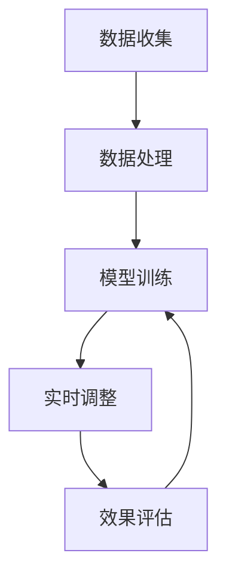

                 

# AI动态定价：原理、应用与挑战

> 关键词：动态定价、机器学习、算法优化、个性化推荐、市场预测、经济模型、数据驱动

> 摘要：本文旨在深入探讨AI动态定价的原理、应用与挑战。通过逐步分析和推理，我们将从核心概念、算法原理、数学模型、实际案例、应用场景、工具推荐等多个维度，全面解析AI动态定价的技术细节和实际应用。本文不仅适合技术爱好者和从业者，也适合对动态定价感兴趣的商业决策者。

## 1. 背景介绍

动态定价是一种根据市场供需关系、用户行为、时间等因素实时调整价格的策略。这种定价方式在电子商务、航空、酒店、零售等多个行业得到了广泛应用。动态定价的核心在于通过实时数据和算法模型，实现价格的动态调整，以最大化收益或优化用户体验。

### 1.1 动态定价的历史与发展

动态定价的概念最早可以追溯到20世纪初，但直到互联网和大数据技术的发展，动态定价才真正成为可能。早期的动态定价主要依赖于简单的规则和经验，而现代动态定价则依赖于复杂的算法和模型，能够实时处理海量数据，实现精细化定价。

### 1.2 动态定价的应用场景

动态定价的应用场景非常广泛，包括但不限于：

- **电子商务**：根据用户购买历史、浏览行为、时间等因素调整商品价格。
- **航空业**：根据航班的剩余座位、预订时间等因素调整机票价格。
- **酒店业**：根据入住日期、预订时间、房间类型等因素调整房价。
- **零售业**：根据季节、促销活动、库存等因素调整商品价格。

### 1.3 动态定价的优势

动态定价的优势主要体现在以下几个方面：

- **最大化收益**：通过实时调整价格，最大化企业的收益。
- **优化用户体验**：通过个性化推荐和合理定价，提升用户的满意度。
- **灵活应对市场变化**：能够快速响应市场变化，调整价格策略。

## 2. 核心概念与联系

### 2.1 动态定价的核心概念

动态定价的核心概念包括：

- **价格弹性**：指价格变化对需求量的影响程度。
- **供需关系**：指市场上商品的供给和需求之间的关系。
- **用户行为**：指用户在购买过程中的行为模式和偏好。
- **时间因素**：指价格调整的时间敏感性。

### 2.2 动态定价的架构流程

动态定价的架构流程可以分为以下几个步骤：

1. **数据收集**：收集用户行为数据、市场数据、时间数据等。
2. **数据处理**：对收集到的数据进行清洗、预处理。
3. **模型训练**：使用机器学习算法训练模型，预测价格调整策略。
4. **实时调整**：根据模型预测结果，实时调整价格。
5. **效果评估**：评估价格调整的效果，优化模型。

### 2.3 Mermaid流程图



## 3. 核心算法原理 & 具体操作步骤

### 3.1 机器学习算法

动态定价的核心在于使用机器学习算法进行价格预测和调整。常用的机器学习算法包括：

- **线性回归**：用于预测连续值，如价格。
- **决策树**：用于分类和回归任务，能够处理非线性关系。
- **随机森林**：集成学习方法，提高模型的泛化能力。
- **梯度提升树**：通过逐层优化，提高模型的预测能力。
- **神经网络**：用于处理复杂非线性关系，能够捕捉更深层次的特征。

### 3.2 具体操作步骤

1. **数据收集**：收集用户行为数据、市场数据、时间数据等。
2. **数据预处理**：清洗数据，处理缺失值，标准化数据。
3. **特征工程**：提取有用的特征，如用户行为特征、时间特征等。
4. **模型选择**：选择合适的机器学习算法，如线性回归、决策树等。
5. **模型训练**：使用训练数据训练模型。
6. **模型评估**：使用验证集评估模型性能，调整模型参数。
7. **实时调整**：根据模型预测结果，实时调整价格。

## 4. 数学模型和公式 & 详细讲解 & 举例说明

### 4.1 线性回归模型

线性回归模型是最简单的回归模型，其数学表达式为：

$$
y = \beta_0 + \beta_1 x_1 + \beta_2 x_2 + \cdots + \beta_n x_n + \epsilon
$$

其中，$y$ 是目标变量（价格），$x_1, x_2, \cdots, x_n$ 是特征变量（如用户行为、时间等），$\beta_0, \beta_1, \cdots, \beta_n$ 是模型参数，$\epsilon$ 是误差项。

### 4.2 决策树模型

决策树模型是一种分层决策模型，其数学表达式为：

$$
y = \begin{cases}
    \beta_0 + \beta_1 x_1 + \beta_2 x_2 + \cdots + \beta_n x_n & \text{if } x_1 \leq t_1 \\
    \beta_0 + \beta_1 x_1 + \beta_2 x_2 + \cdots + \beta_n x_n & \text{if } x_1 > t_1 \text{ and } x_2 \leq t_2 \\
    \vdots \\
    \beta_0 + \beta_1 x_1 + \beta_2 x_2 + \cdots + \beta_n x_n & \text{if } x_1 > t_1 \text{ and } x_2 > t_2 \text{ and } \cdots \text{ and } x_m \leq t_m \\
    \beta_0 + \beta_1 x_1 + \beta_2 x_2 + \cdots + \beta_n x_n & \text{if } x_1 > t_1 \text{ and } x_2 > t_2 \text{ and } \cdots \text{ and } x_m > t_m
\end{cases}
$$

其中，$t_1, t_2, \cdots, t_m$ 是决策树的分割点。

### 4.3 举例说明

假设我们有一个简单的线性回归模型，用于预测机票价格。数据集包含用户行为特征（如用户等级、预订时间）和历史价格数据。

```python
import pandas as pd
from sklearn.linear_model import LinearRegression
from sklearn.model_selection import train_test_split

# 数据预处理
data = pd.read_csv('flight_data.csv')
X = data[['user_level', 'booking_time']]
y = data['price']

# 划分训练集和测试集
X_train, X_test, y_train, y_test = train_test_split(X, y, test_size=0.2, random_state=42)

# 训练模型
model = LinearRegression()
model.fit(X_train, y_train)

# 预测
y_pred = model.predict(X_test)

# 评估模型
from sklearn.metrics import mean_squared_error
mse = mean_squared_error(y_test, y_pred)
print(f'Mean Squared Error: {mse}')
```

## 5. 项目实战：代码实际案例和详细解释说明

### 5.1 开发环境搭建

开发环境搭建主要包括以下几个步骤：

1. **安装Python**：确保安装了Python 3.8及以上版本。
2. **安装依赖库**：安装必要的机器学习库，如`pandas`、`scikit-learn`等。
3. **数据准备**：准备数据集，确保数据格式正确。

### 5.2 源代码详细实现和代码解读

```python
# 导入必要的库
import pandas as pd
from sklearn.model_selection import train_test_split
from sklearn.linear_model import LinearRegression
from sklearn.metrics import mean_squared_error

# 读取数据
data = pd.read_csv('flight_data.csv')

# 数据预处理
X = data[['user_level', 'booking_time']]
y = data['price']

# 划分训练集和测试集
X_train, X_test, y_train, y_test = train_test_split(X, y, test_size=0.2, random_state=42)

# 训练模型
model = LinearRegression()
model.fit(X_train, y_train)

# 预测
y_pred = model.predict(X_test)

# 评估模型
mse = mean_squared_error(y_test, y_pred)
print(f'Mean Squared Error: {mse}')
```

### 5.3 代码解读与分析

- **数据读取**：使用`pandas`读取CSV文件，将数据分为特征`X`和目标变量`y`。
- **数据划分**：使用`train_test_split`将数据划分为训练集和测试集。
- **模型训练**：使用`LinearRegression`训练模型。
- **模型预测**：使用训练好的模型进行预测。
- **模型评估**：使用`mean_squared_error`评估模型性能。

## 6. 实际应用场景

### 6.1 电子商务

在电子商务中，动态定价可以根据用户的购买历史、浏览行为、时间等因素调整商品价格。例如，对于高价值商品，可以设置较高的初始价格，然后根据用户的购买行为逐步降低价格，以吸引更多的用户购买。

### 6.2 航空业

在航空业中，动态定价可以根据航班的剩余座位、预订时间等因素调整机票价格。例如，对于即将起飞的航班，可以设置较高的价格，以充分利用剩余座位；对于预订时间较早的航班，可以设置较低的价格，以吸引更多的用户预订。

### 6.3 酒店业

在酒店业中，动态定价可以根据入住日期、预订时间、房间类型等因素调整房价。例如，对于节假日或周末，可以设置较高的价格，以充分利用房间资源；对于非节假日或工作日，可以设置较低的价格，以吸引更多的用户预订。

## 7. 工具和资源推荐

### 7.1 学习资源推荐

- **书籍**：《机器学习》（周志华著）、《深度学习》（Ian Goodfellow著）
- **论文**：《Dynamic Pricing with Machine Learning》（Xiao et al.）
- **博客**：Medium上的机器学习和动态定价相关博客
- **网站**：Kaggle、GitHub上的相关项目和代码

### 7.2 开发工具框架推荐

- **Python**：用于数据处理和模型训练
- **Jupyter Notebook**：用于代码编写和结果展示
- **TensorFlow/Keras**：用于深度学习模型训练
- **Scikit-learn**：用于机器学习模型训练

### 7.3 相关论文著作推荐

- **《Dynamic Pricing with Machine Learning》**：Xiao et al.，2020
- **《Machine Learning for Dynamic Pricing》**：Zhang et al.，2019

## 8. 总结：未来发展趋势与挑战

### 8.1 未来发展趋势

- **更复杂的模型**：未来动态定价将使用更复杂的模型，如深度学习模型，以捕捉更深层次的特征。
- **个性化推荐**：未来动态定价将结合个性化推荐技术，提供更个性化的价格调整策略。
- **实时性**：未来动态定价将更加注重实时性，以快速响应市场变化。

### 8.2 挑战

- **数据隐私**：动态定价需要收集大量的用户数据，如何保护用户隐私是一个重要挑战。
- **模型解释性**：复杂的模型难以解释，如何提高模型的解释性是一个重要挑战。
- **公平性**：动态定价可能会导致价格歧视，如何保证公平性是一个重要挑战。

## 9. 附录：常见问题与解答

### 9.1 问题：如何处理数据缺失值？

**解答**：可以使用插值法、均值填充法、中位数填充法等方法处理数据缺失值。

### 9.2 问题：如何评估模型性能？

**解答**：可以使用均方误差（MSE）、均方根误差（RMSE）、决定系数（R²）等指标评估模型性能。

### 9.3 问题：如何提高模型的解释性？

**解答**：可以使用特征重要性分析、局部解释模型等方法提高模型的解释性。

## 10. 扩展阅读 & 参考资料

- **书籍**：《机器学习》（周志华著）、《深度学习》（Ian Goodfellow著）
- **论文**：《Dynamic Pricing with Machine Learning》（Xiao et al.）、《Machine Learning for Dynamic Pricing》（Zhang et al.）
- **网站**：Kaggle、GitHub上的相关项目和代码

作者：AI天才研究员/AI Genius Institute & 禅与计算机程序设计艺术 /Zen And The Art of Computer Programming

