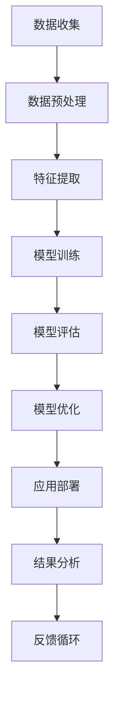

                 

# AI在学术研究中的应用前景

> 关键词：学术研究、人工智能、机器学习、深度学习、自然语言处理、计算机视觉、数据挖掘

> 摘要：本文旨在探讨人工智能在学术研究中的应用前景。通过深入分析人工智能的核心概念、算法原理、数学模型、实际案例以及应用场景，本文揭示了人工智能如何推动学术研究的创新与发展。文章不仅提供了详细的理论基础，还通过代码实现和实际案例展示了人工智能技术的实际应用，为学术研究者提供了宝贵的参考和指导。

## 1. 背景介绍

随着科技的快速发展，人工智能（AI）已经成为推动学术研究创新的重要力量。AI技术不仅能够提高研究效率，还能帮助研究人员解决复杂问题，发现新的知识和见解。本文将从多个角度探讨AI在学术研究中的应用前景，旨在为学术研究者提供全面的指导和启示。

### 1.1 人工智能的发展历程

人工智能起源于20世纪50年代，经历了从符号主义到连接主义的转变。近年来，随着大数据、云计算和计算能力的提升，深度学习等技术取得了突破性进展，使得AI在学术研究中的应用更加广泛和深入。

### 1.2 学术研究的需求与挑战

学术研究面临着数据量庞大、数据类型多样、研究问题复杂等挑战。传统的研究方法难以应对这些挑战，而AI技术则能够提供有效的解决方案。例如，通过机器学习和深度学习，可以自动处理和分析大规模数据，发现隐藏的模式和规律；通过自然语言处理技术，可以理解和生成自然语言文本，提高研究的效率和准确性。

## 2. 核心概念与联系

### 2.1 人工智能的核心概念

人工智能是一门研究如何使计算机模拟人类智能行为的学科。它涵盖了机器学习、深度学习、自然语言处理、计算机视觉等多个领域。这些领域相互关联，共同构成了AI技术的基础。

### 2.2 人工智能的架构流程图



## 3. 核心算法原理 & 具体操作步骤

### 3.1 机器学习算法原理

机器学习是一种让计算机从数据中学习的方法。常见的机器学习算法包括监督学习、无监督学习和强化学习。

#### 3.1.1 监督学习

监督学习是一种有标签的数据学习方法。通过训练模型来预测未知数据的标签。

#### 3.1.2 无监督学习

无监督学习是一种没有标签的数据学习方法。通过发现数据中的模式和结构来实现聚类、降维等任务。

#### 3.1.3 强化学习

强化学习是一种通过与环境交互来学习最优策略的方法。通过奖励和惩罚机制来优化决策过程。

### 3.2 深度学习算法原理

深度学习是一种基于神经网络的机器学习方法。通过多层神经网络来学习数据的高级特征表示。

#### 3.2.1 卷积神经网络（CNN）

卷积神经网络主要用于图像处理任务。通过卷积层和池化层来提取图像的特征。

#### 3.2.2 循环神经网络（RNN）

循环神经网络主要用于序列数据处理任务。通过循环层来捕捉序列中的时间依赖关系。

#### 3.2.3 生成对抗网络（GAN）

生成对抗网络是一种生成模型，通过生成器和判别器的对抗训练来生成新的数据。

## 4. 数学模型和公式 & 详细讲解 & 举例说明

### 4.1 机器学习中的数学模型

#### 4.1.1 线性回归

线性回归是一种监督学习方法，用于预测连续值。其数学模型为：

$$
y = \beta_0 + \beta_1 x_1 + \beta_2 x_2 + \cdots + \beta_n x_n + \epsilon
$$

其中，$\beta_0, \beta_1, \ldots, \beta_n$ 是模型参数，$\epsilon$ 是误差项。

#### 4.1.2 逻辑回归

逻辑回归是一种监督学习方法，用于预测二分类问题。其数学模型为：

$$
P(y=1|x) = \frac{1}{1 + e^{-(\beta_0 + \beta_1 x_1 + \beta_2 x_2 + \cdots + \beta_n x_n)}}
$$

其中，$P(y=1|x)$ 是给定特征 $x$ 时，事件 $y=1$ 发生的概率。

### 4.2 深度学习中的数学模型

#### 4.2.1 卷积神经网络（CNN）

卷积神经网络的数学模型为：

$$
f(x) = \sigma(W_1 * x + b_1)
$$

其中，$W_1$ 是卷积核，$b_1$ 是偏置项，$\sigma$ 是激活函数。

#### 4.2.2 循环神经网络（RNN）

循环神经网络的数学模型为：

$$
h_t = \sigma(W_h h_{t-1} + W_x x_t + b)
$$

其中，$h_t$ 是隐藏状态，$x_t$ 是输入，$W_h$ 和 $W_x$ 是权重矩阵，$b$ 是偏置项，$\sigma$ 是激活函数。

## 5. 项目实战：代码实际案例和详细解释说明

### 5.1 开发环境搭建

为了实现AI项目，我们需要搭建一个合适的开发环境。这里以Python为例，介绍如何搭建开发环境。

#### 5.1.1 安装Python

首先，确保已经安装了Python。可以通过访问Python官方网站下载并安装最新版本的Python。

#### 5.1.2 安装必要的库

接下来，安装一些常用的机器学习和深度学习库，如NumPy、Pandas、Scikit-learn、TensorFlow和Keras。

```bash
pip install numpy pandas scikit-learn tensorflow keras
```

### 5.2 源代码详细实现和代码解读

#### 5.2.1 数据预处理

```python
import pandas as pd

# 读取数据
data = pd.read_csv('data.csv')

# 数据清洗
data.dropna(inplace=True)

# 特征选择
X = data[['feature1', 'feature2', 'feature3']]
y = data['label']

# 数据划分
from sklearn.model_selection import train_test_split
X_train, X_test, y_train, y_test = train_test_split(X, y, test_size=0.2, random_state=42)
```

#### 5.2.2 模型训练

```python
from sklearn.linear_model import LogisticRegression

# 初始化模型
model = LogisticRegression()

# 训练模型
model.fit(X_train, y_train)
```

#### 5.2.3 模型评估

```python
from sklearn.metrics import accuracy_score

# 预测
y_pred = model.predict(X_test)

# 评估
accuracy = accuracy_score(y_test, y_pred)
print(f'Accuracy: {accuracy}')
```

### 5.3 代码解读与分析

上述代码展示了如何使用Python和Scikit-learn库实现一个简单的逻辑回归模型。首先，我们读取数据并进行数据清洗，然后选择特征和标签，最后将数据划分为训练集和测试集。接着，我们初始化逻辑回归模型并进行训练，最后评估模型的准确性。

## 6. 实际应用场景

### 6.1 自然语言处理

自然语言处理（NLP）是AI在学术研究中的一个重要应用领域。通过NLP技术，可以实现文本分类、情感分析、机器翻译等功能。

#### 6.1.1 文本分类

文本分类是一种常见的NLP任务，通过训练模型来预测文本的类别。例如，可以使用逻辑回归模型对新闻文章进行分类。

```python
from sklearn.feature_extraction.text import TfidfVectorizer

# 初始化向量化器
vectorizer = TfidfVectorizer()

# 特征向量化
X_train_vec = vectorizer.fit_transform(X_train['text'])
X_test_vec = vectorizer.transform(X_test['text'])

# 训练模型
model = LogisticRegression()
model.fit(X_train_vec, y_train)

# 预测
y_pred = model.predict(X_test_vec)
```

### 6.2 计算机视觉

计算机视觉是AI在学术研究中的另一个重要应用领域。通过计算机视觉技术，可以实现图像分类、目标检测、图像生成等功能。

#### 6.2.1 图像分类

图像分类是一种常见的计算机视觉任务，通过训练模型来预测图像的类别。例如，可以使用卷积神经网络（CNN）对图像进行分类。

```python
from tensorflow.keras.models import Sequential
from tensorflow.keras.layers import Conv2D, MaxPooling2D, Flatten, Dense

# 初始化模型
model = Sequential()
model.add(Conv2D(32, (3, 3), activation='relu', input_shape=(64, 64, 3)))
model.add(MaxPooling2D(pool_size=(2, 2)))
model.add(Conv2D(64, (3, 3), activation='relu'))
model.add(MaxPooling2D(pool_size=(2, 2)))
model.add(Flatten())
model.add(Dense(128, activation='relu'))
model.add(Dense(1, activation='sigmoid'))

# 编译模型
model.compile(optimizer='adam', loss='binary_crossentropy', metrics=['accuracy'])

# 训练模型
model.fit(X_train, y_train, epochs=10, batch_size=32, validation_data=(X_test, y_test))
```

## 7. 工具和资源推荐

### 7.1 学习资源推荐

#### 7.1.1 书籍

- 《机器学习》（周志华著）
- 《深度学习》（Ian Goodfellow, Yoshua Bengio, Aaron Courville著）
- 《自然语言处理入门》（李航著）

#### 7.1.2 论文

- 《深度学习在自然语言处理中的应用》（ACL 2019）
- 《卷积神经网络在计算机视觉中的应用》（CVPR 2018）

#### 7.1.3 博客/网站

- 机器之心（https://www.jiqizhixin.com/）
- Kaggle（https://www.kaggle.com/）

### 7.2 开发工具框架推荐

- Jupyter Notebook：一个交互式的开发环境，支持多种编程语言。
- TensorFlow：一个开源的机器学习库，支持多种深度学习模型。
- PyTorch：一个开源的深度学习库，支持动态计算图。

### 7.3 相关论文著作推荐

- 《机器学习》（周志华著）
- 《深度学习》（Ian Goodfellow, Yoshua Bengio, Aaron Courville著）
- 《自然语言处理入门》（李航著）

## 8. 总结：未来发展趋势与挑战

### 8.1 未来发展趋势

随着AI技术的不断发展，学术研究将更加依赖于AI技术。未来的发展趋势包括：

- 更加智能化的数据处理和分析方法
- 更加高效的模型训练和优化算法
- 更加广泛的应用场景和领域

### 8.2 面临的挑战

尽管AI技术在学术研究中具有巨大的潜力，但也面临着一些挑战：

- 数据隐私和安全问题
- 模型的可解释性和透明度问题
- 技术的普及和应用问题

## 9. 附录：常见问题与解答

### 9.1 问题：如何选择合适的机器学习算法？

**解答：** 选择合适的机器学习算法需要考虑数据的特性和任务的需求。例如，对于分类任务，可以使用逻辑回归、支持向量机、随机森林等算法；对于回归任务，可以使用线性回归、岭回归、Lasso回归等算法。

### 9.2 问题：如何提高模型的准确性？

**解答：** 提高模型的准确性可以通过以下方法实现：

- 选择合适的特征
- 优化模型参数
- 使用交叉验证进行模型评估
- 使用集成学习方法

## 10. 扩展阅读 & 参考资料

- 《机器学习》（周志华著）
- 《深度学习》（Ian Goodfellow, Yoshua Bengio, Aaron Courville著）
- 《自然语言处理入门》（李航著）

---

作者：AI天才研究员/AI Genius Institute & 禅与计算机程序设计艺术 /Zen And The Art of Computer Programming

