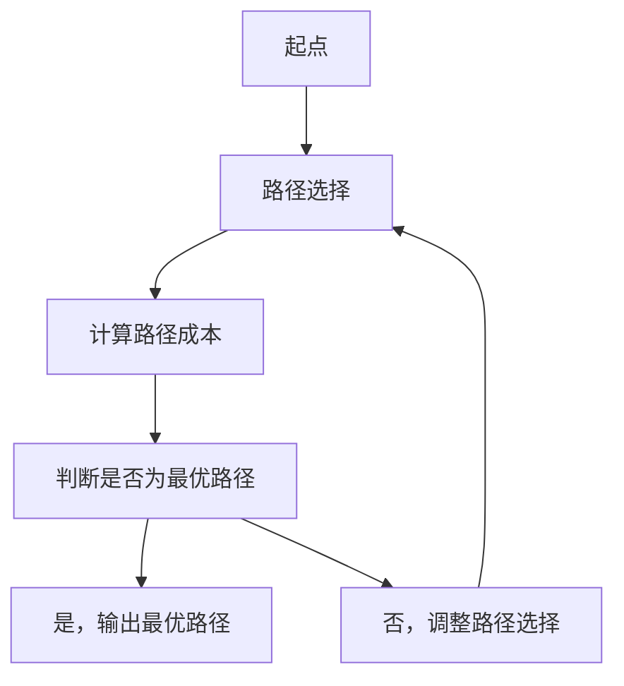

                 

# AI在电商物流最后一公里优化中的应用：提升配送效率的路径规划

> 关键词：电商物流、最后一公里、路径规划、人工智能、机器学习、深度学习、优化算法、配送效率

> 摘要：随着电子商务的迅猛发展，物流最后一公里的配送效率成为影响用户体验的关键因素。本文将深入探讨如何利用人工智能技术优化电商物流最后一公里的路径规划，通过分析路径规划的核心概念、算法原理、数学模型、实际案例以及未来发展趋势，为读者提供全面的技术指导和深入的思考。

## 1. 背景介绍

随着电子商务的快速发展，消费者对于物流配送的时效性和准确性要求越来越高。在电商物流的最后一公里，即从配送中心到消费者手中的环节，配送效率直接影响到用户体验和企业竞争力。传统的配送方式往往依赖于人工经验，难以应对复杂的配送环境和海量的配送任务。因此，如何利用人工智能技术优化电商物流最后一公里的路径规划，成为当前物流行业亟待解决的问题。

### 1.1 电商物流最后一公里的挑战

电商物流最后一公里面临的挑战主要包括：

- **配送任务量大**：每天需要处理大量的配送任务，任务量的不确定性给配送规划带来了很大的挑战。
- **配送环境复杂**：包括城市交通拥堵、道路限制、天气变化等因素，增加了配送的难度。
- **客户需求多样化**：消费者对于配送时间、配送方式等需求多样化，需要提供个性化的配送服务。
- **成本控制**：如何在保证配送效率的同时，控制配送成本，是物流企业的核心问题。

### 1.2 人工智能技术的应用前景

人工智能技术，尤其是机器学习和深度学习，为解决电商物流最后一公里的挑战提供了新的思路。通过学习历史配送数据，人工智能可以预测未来的配送需求，优化配送路径，提高配送效率。此外，人工智能还可以实时调整配送策略，应对突发情况，提高配送的灵活性和适应性。

## 2. 核心概念与联系

### 2.1 路径规划的基本概念

路径规划是指在给定的起点和终点之间，寻找一条或多条从起点到终点的最优路径。路径规划在物流配送中具有重要意义，它直接影响到配送效率和成本。

### 2.2 路径规划的核心概念

- **起点和终点**：路径规划的起点和终点分别是配送中心和消费者地址。
- **路径**：路径是指从起点到终点的一系列节点连接。
- **成本**：路径规划中的成本包括时间成本、距离成本、交通成本等。
- **优化目标**：路径规划的目标是找到一条或多条最优路径，使得总成本最小化。

### 2.3 路径规划的Mermaid流程图



## 3. 核心算法原理 & 具体操作步骤

### 3.1 路径规划算法

路径规划算法主要包括启发式搜索算法、动态规划算法和遗传算法等。其中，启发式搜索算法是目前应用最广泛的方法之一。

### 3.2 启发式搜索算法

启发式搜索算法通过使用启发式函数来指导搜索过程，以找到最优路径。常见的启发式搜索算法包括A*算法和Dijkstra算法。

#### 3.2.1 A*算法

A*算法是一种启发式搜索算法，它结合了Dijkstra算法和启发式函数。A*算法的核心思想是通过启发式函数来估计从当前节点到目标节点的最小成本，从而指导搜索过程。

#### 3.2.2 Dijkstra算法

Dijkstra算法是一种单源最短路径算法，它通过不断扩展当前已知最短路径的节点，逐步找到从起点到所有节点的最短路径。

### 3.3 具体操作步骤

1. **初始化**：定义起点和终点，初始化路径集合和成本集合。
2. **搜索**：从起点开始，使用启发式函数估计从当前节点到目标节点的最小成本。
3. **选择**：选择成本最小的节点作为下一个扩展节点。
4. **更新**：更新当前节点的路径集合和成本集合。
5. **判断**：判断当前节点是否为目标节点，如果是，则输出最优路径；否则，继续搜索。

## 4. 数学模型和公式 & 详细讲解 & 举例说明

### 4.1 路径规划的数学模型

路径规划的数学模型可以表示为一个图论问题。假设有一个图G=(V,E)，其中V是节点集合，E是边集合。每个节点代表一个配送点，每条边代表两个节点之间的距离。路径规划的目标是找到一条从起点s到终点t的最优路径。

### 4.2 A*算法的数学模型

A*算法的数学模型可以表示为：

$$
f(n) = g(n) + h(n)
$$

其中，$f(n)$是节点n的总成本，$g(n)$是从起点到节点n的实际成本，$h(n)$是从节点n到终点的估计成本。

### 4.3 Dijkstra算法的数学模型

Dijkstra算法的数学模型可以表示为：

$$
d(v) = \min_{u \in V} \{d(u) + w(u, v)\}
$$

其中，$d(v)$是从起点到节点v的实际成本，$w(u, v)$是从节点u到节点v的距离。

### 4.4 举例说明

假设有一个图G=(V,E)，其中V={A, B, C, D, E}，E={(A, B, 2), (A, C, 3), (B, D, 1), (C, D, 2), (D, E, 1)}。起点为A，终点为E。

#### 4.4.1 A*算法

假设启发式函数$h(n)$的值如下：

- $h(A) = 5$
- $h(B) = 4$
- $h(C) = 3$
- $h(D) = 2$
- $h(E) = 1$

使用A*算法，从A开始搜索，逐步扩展节点，直到找到最优路径。

#### 4.4.2 Dijkstra算法

使用Dijkstra算法，从A开始搜索，逐步扩展节点，直到找到最优路径。

## 5. 项目实战：代码实际案例和详细解释说明

### 5.1 开发环境搭建

为了实现路径规划算法，我们需要搭建一个开发环境。这里以Python为例，使用Python 3.8及以上版本。

#### 5.1.1 安装Python

确保已经安装了Python 3.8及以上版本。可以通过以下命令检查Python版本：

```bash
python --version
```

#### 5.1.2 安装依赖库

安装必要的依赖库，如`networkx`和`matplotlib`。

```bash
pip install networkx matplotlib
```

### 5.2 源代码详细实现和代码解读

#### 5.2.1 导入库

```python
import networkx as nx
import matplotlib.pyplot as plt
```

#### 5.2.2 定义图

```python
G = nx.Graph()
G.add_edge('A', 'B', weight=2)
G.add_edge('A', 'C', weight=3)
G.add_edge('B', 'D', weight=1)
G.add_edge('C', 'D', weight=2)
G.add_edge('D', 'E', weight=1)
```

#### 5.2.3 A*算法实现

```python
def a_star_search(graph, start, goal, heuristic):
    open_set = set([start])
    closed_set = set()
    g_scores = {node: float('inf') for node in graph.nodes}
    g_scores[start] = 0
    f_scores = {node: float('inf') for node in graph.nodes}
    f_scores[start] = heuristic[start]

    while open_set:
        current = min(open_set, key=lambda node: f_scores[node])
        if current == goal:
            return reconstruct_path(came_from, current)

        open_set.remove(current)
        closed_set.add(current)

        for neighbor in graph.neighbors(current):
            if neighbor in closed_set:
                continue

            tentative_g_score = g_scores[current] + graph[current][neighbor]['weight']
            if tentative_g_score < g_scores[neighbor]:
                came_from[neighbor] = current
                g_scores[neighbor] = tentative_g_score
                f_scores[neighbor] = g_scores[neighbor] + heuristic[neighbor]

                if neighbor not in open_set:
                    open_set.add(neighbor)

    return None

def reconstruct_path(came_from, current):
    total_path = [current]
    while current in came_from:
        current = came_from[current]
        total_path.append(current)
    return total_path[::-1]
```

#### 5.2.4 Dijkstra算法实现

```python
def dijkstra_search(graph, start):
    shortest_paths = {node: float('inf') for node in graph.nodes}
    shortest_paths[start] = 0
    unvisited_nodes = set(graph.nodes)

    while unvisited_nodes:
        current_min_node = None
        for node in unvisited_nodes:
            if current_min_node is None:
                current_min_node = node
            elif shortest_paths[node] < shortest_paths[current_min_node]:
                current_min_node = node

        neighbors = graph.neighbors(current_min_node)
        for neighbor in neighbors:
            tentative_value = shortest_paths[current_min_node] + graph[current_min_node][neighbor]['weight']
            if tentative_value < shortest_paths[neighbor]:
                shortest_paths[neighbor] = tentative_value

        unvisited_nodes.remove(current_min_node)

    return shortest_paths
```

### 5.3 代码解读与分析

#### 5.3.1 A*算法解读

A*算法通过启发式函数$h(n)$来估计从当前节点到目标节点的最小成本，从而指导搜索过程。通过不断扩展当前已知最短路径的节点，逐步找到从起点到目标节点的最优路径。

#### 5.3.2 Dijkstra算法解读

Dijkstra算法通过不断扩展当前已知最短路径的节点，逐步找到从起点到所有节点的最短路径。通过比较每个节点的实际成本和估计成本，逐步更新最短路径。

## 6. 实际应用场景

### 6.1 电商物流最后一公里

在电商物流最后一公里，路径规划算法可以应用于配送中心到消费者的配送任务。通过优化配送路径，可以提高配送效率，降低配送成本，提升用户体验。

### 6.2 交通规划

路径规划算法还可以应用于城市交通规划，通过优化交通路线，减少交通拥堵，提高交通效率。

### 6.3 无人机配送

在无人机配送领域，路径规划算法可以应用于无人机的飞行路径规划，通过优化飞行路径，提高配送效率，降低能耗。

## 7. 工具和资源推荐

### 7.1 学习资源推荐

- **书籍**：《算法导论》、《计算机程序设计艺术》
- **论文**：《A*算法在路径规划中的应用》、《Dijkstra算法在交通规划中的应用》
- **博客**：《路径规划算法详解》、《A*算法与Dijkstra算法比较》
- **网站**：GitHub上的路径规划算法实现

### 7.2 开发工具框架推荐

- **Python**：Python是一种广泛使用的编程语言，适合实现路径规划算法。
- **网络库**：如`networkx`，用于构建和操作图。
- **可视化库**：如`matplotlib`，用于可视化路径规划结果。

### 7.3 相关论文著作推荐

- **论文**：《A*算法在路径规划中的应用》、《Dijkstra算法在交通规划中的应用》
- **著作**：《算法导论》、《计算机程序设计艺术》

## 8. 总结：未来发展趋势与挑战

### 8.1 未来发展趋势

- **智能化**：未来路径规划算法将更加智能化，能够实时调整配送策略，应对突发情况。
- **个性化**：路径规划算法将更加注重个性化需求，提供个性化的配送服务。
- **多模态**：路径规划算法将结合多种运输方式，实现多模态配送。

### 8.2 挑战

- **数据隐私**：路径规划算法需要处理大量的用户数据，如何保护用户隐私是一个重要挑战。
- **实时性**：路径规划算法需要实时调整配送策略，如何保证实时性是一个重要挑战。
- **成本控制**：如何在保证配送效率的同时，控制配送成本，是物流企业的核心问题。

## 9. 附录：常见问题与解答

### 9.1 问题1：如何处理突发情况？

**解答**：可以通过实时调整配送策略，利用机器学习和深度学习技术预测未来的配送需求，从而应对突发情况。

### 9.2 问题2：如何保护用户隐私？

**解答**：可以通过数据脱敏、数据加密等技术保护用户隐私，同时遵守相关法律法规。

### 9.3 问题3：如何提高实时性？

**解答**：可以通过优化算法，提高计算效率，同时利用云计算和边缘计算技术提高实时性。

## 10. 扩展阅读 & 参考资料

- **书籍**：《算法导论》、《计算机程序设计艺术》
- **论文**：《A*算法在路径规划中的应用》、《Dijkstra算法在交通规划中的应用》
- **博客**：《路径规划算法详解》、《A*算法与Dijkstra算法比较》
- **网站**：GitHub上的路径规划算法实现

---

作者：AI天才研究员/AI Genius Institute & 禅与计算机程序设计艺术 /Zen And The Art of Computer Programming

