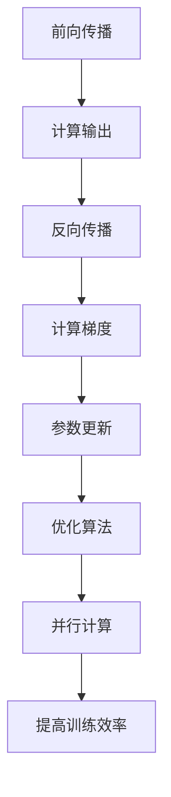

                 

# AI大模型创业：如何应对未来技术挑战？

> 关键词：AI大模型、创业挑战、技术趋势、模型优化、算力需求、数据安全

> 摘要：本文旨在为AI大模型创业提供全面的技术指导，从背景介绍到核心概念，再到具体操作步骤，通过详细的数学模型和实际案例，帮助创业者理解并应对未来技术挑战。我们将探讨AI大模型的架构设计、优化策略、算力需求、数据安全等问题，并提供实用的学习资源和开发工具推荐。

## 1. 背景介绍

随着人工智能技术的飞速发展，大模型已经成为推动行业变革的关键力量。大模型不仅在自然语言处理、计算机视觉等领域取得了突破性进展，还在推荐系统、智能客服等多个应用场景中展现出巨大潜力。然而，创业过程中面临的挑战也不容忽视，包括技术难题、市场风险、资源限制等。本文将从技术角度出发，探讨如何应对这些挑战，为创业者提供实用的指导。

## 2. 核心概念与联系

### 2.1 大模型概述

大模型是指参数量巨大、训练数据量庞大、计算复杂度高的机器学习模型。这类模型通常包含数百万甚至数十亿个参数，能够捕捉到数据中的复杂模式和细微特征。大模型的训练和推理过程需要强大的计算资源和高效的算法支持。

### 2.2 核心概念原理

- **参数量**：模型中的参数数量直接影响模型的复杂度和表达能力。
- **训练数据量**：充足的训练数据是大模型取得良好性能的关键。
- **计算复杂度**：模型的计算复杂度决定了训练和推理的效率。
- **算力需求**：大模型的训练和推理需要高性能的计算资源，包括GPU、TPU等。

### 2.3 架构设计

大模型的架构设计通常包括以下几个方面：

- **前向传播**：模型的输入经过一系列层的处理，最终生成输出。
- **反向传播**：通过计算损失函数对模型参数的梯度，进行参数更新。
- **优化算法**：常用的优化算法包括SGD、Adam、Adagrad等。
- **并行计算**：利用多GPU、分布式计算等技术提高训练效率。



## 3. 核心算法原理 & 具体操作步骤

### 3.1 模型训练流程

模型训练流程主要包括数据预处理、模型构建、损失函数定义、优化算法选择、训练过程监控等步骤。

1. **数据预处理**：清洗数据、特征工程、数据增强等。
2. **模型构建**：选择合适的网络结构，如Transformer、BERT等。
3. **损失函数定义**：定义合适的损失函数，如交叉熵损失、均方误差等。
4. **优化算法选择**：选择合适的优化算法，如Adam、SGD等。
5. **训练过程监控**：监控训练过程中的损失值、准确率等指标。

### 3.2 具体操作步骤

1. **数据预处理**
   - 清洗数据：去除噪声、处理缺失值。
   - 特征工程：提取有用的特征，如文本的词嵌入。
   - 数据增强：增加数据多样性，提高模型泛化能力。

2. **模型构建**
   - 选择网络结构：如Transformer、BERT等。
   - 设定超参数：如学习率、批次大小等。

3. **损失函数定义**
   - 选择合适的损失函数：如交叉熵损失、均方误差等。

4. **优化算法选择**
   - 选择合适的优化算法：如Adam、SGD等。

5. **训练过程监控**
   - 监控训练过程中的损失值、准确率等指标。
   - 使用学习率调度器调整学习率。

## 4. 数学模型和公式 & 详细讲解 & 举例说明

### 4.1 交叉熵损失函数

交叉熵损失函数常用于分类任务，其公式如下：

$$
L = -\frac{1}{N} \sum_{i=1}^{N} \sum_{j=1}^{C} y_{ij} \log(p_{ij})
$$

其中，$N$ 是样本数量，$C$ 是类别数量，$y_{ij}$ 是真实标签，$p_{ij}$ 是模型预测的概率。

### 4.2 Adam优化算法

Adam优化算法是一种自适应学习率的优化算法，其公式如下：

$$
m_t = \beta_1 m_{t-1} + (1 - \beta_1) g_t
$$

$$
v_t = \beta_2 v_{t-1} + (1 - \beta_2) g_t^2
$$

$$
\hat{m}_t = \frac{m_t}{1 - \beta_1^t}
$$

$$
\hat{v}_t = \frac{v_t}{1 - \beta_2^t}
$$

$$
\theta_{t+1} = \theta_t - \frac{\alpha}{\sqrt{\hat{v}_t} + \epsilon} \hat{m}_t
$$

其中，$m_t$ 和 $v_t$ 分别是梯度的一阶矩和二阶矩的估计值，$\beta_1$ 和 $\beta_2$ 是超参数，$g_t$ 是当前梯度，$\alpha$ 是学习率，$\epsilon$ 是一个很小的常数。

### 4.3 举例说明

假设我们有一个简单的二分类问题，使用交叉熵损失函数和Adam优化算法进行训练。具体步骤如下：

1. **数据预处理**
   - 清洗数据：去除噪声、处理缺失值。
   - 特征工程：提取有用的特征，如文本的词嵌入。
   - 数据增强：增加数据多样性，提高模型泛化能力。

2. **模型构建**
   - 选择网络结构：如Transformer、BERT等。
   - 设定超参数：如学习率、批次大小等。

3. **损失函数定义**
   - 选择合适的损失函数：如交叉熵损失、均方误差等。

4. **优化算法选择**
   - 选择合适的优化算法：如Adam、SGD等。

5. **训练过程监控**
   - 监控训练过程中的损失值、准确率等指标。
   - 使用学习率调度器调整学习率。

## 5. 项目实战：代码实际案例和详细解释说明

### 5.1 开发环境搭建

1. **安装Python环境**
   - 安装Python 3.8及以上版本。
   - 安装虚拟环境工具，如virtualenv或conda。

2. **安装依赖库**
   - 安装TensorFlow或PyTorch等深度学习框架。
   - 安装数据处理库，如Pandas、NumPy等。
   - 安装可视化库，如Matplotlib、Seaborn等。

### 5.2 源代码详细实现和代码解读

```python
import tensorflow as tf
from tensorflow.keras import layers, models

# 数据预处理
def preprocess_data(data):
    # 清洗数据
    # 特征工程
    # 数据增强
    return preprocessed_data

# 模型构建
def build_model(input_shape, num_classes):
    model = models.Sequential()
    model.add(layers.Dense(128, activation='relu', input_shape=input_shape))
    model.add(layers.Dense(64, activation='relu'))
    model.add(layers.Dense(num_classes, activation='softmax'))
    return model

# 损失函数定义
def loss_function(y_true, y_pred):
    return tf.keras.losses.categorical_crossentropy(y_true, y_pred)

# 优化算法选择
def optimizer():
    return tf.keras.optimizers.Adam(learning_rate=0.001)

# 训练过程监控
def train_model(model, x_train, y_train, x_val, y_val, epochs=10):
    model.compile(optimizer=optimizer(), loss=loss_function, metrics=['accuracy'])
    history = model.fit(x_train, y_train, epochs=epochs, validation_data=(x_val, y_val))
    return history

# 主函数
def main():
    # 加载数据
    data = load_data()
    x_train, y_train, x_val, y_val = preprocess_data(data)
    
    # 构建模型
    model = build_model(input_shape=x_train.shape[1:], num_classes=10)
    
    # 训练模型
    history = train_model(model, x_train, y_train, x_val, y_val)
    
    # 评估模型
    test_loss, test_acc = model.evaluate(x_val, y_val)
    print(f'Test accuracy: {test_acc}')

if __name__ == '__main__':
    main()
```

### 5.3 代码解读与分析

1. **数据预处理**
   - `preprocess_data` 函数负责数据清洗、特征工程和数据增强。
   - 数据预处理是模型训练的关键步骤，直接影响模型的性能。

2. **模型构建**
   - `build_model` 函数构建了一个简单的全连接神经网络。
   - 模型结构可以根据具体任务进行调整，如使用卷积神经网络（CNN）或Transformer等。

3. **损失函数定义**
   - `loss_function` 函数定义了交叉熵损失函数。
   - 选择合适的损失函数对于模型训练至关重要。

4. **优化算法选择**
   - `optimizer` 函数返回Adam优化算法。
   - 选择合适的优化算法可以提高模型训练效率。

5. **训练过程监控**
   - `train_model` 函数负责模型的训练过程。
   - 通过监控训练过程中的损失值和准确率，可以及时调整模型参数。

## 6. 实际应用场景

### 6.1 自然语言处理

大模型在自然语言处理领域有着广泛的应用，如文本分类、情感分析、机器翻译等。通过训练大规模的语言模型，可以实现更准确、更自然的文本生成和理解。

### 6.2 计算机视觉

大模型在计算机视觉领域也有着重要的应用，如图像分类、目标检测、语义分割等。通过训练大规模的视觉模型，可以实现更准确、更鲁棒的图像处理和分析。

### 6.3 推荐系统

大模型在推荐系统中可以实现更精准的用户画像和个性化推荐。通过训练大规模的推荐模型，可以提高推荐系统的准确性和用户满意度。

## 7. 工具和资源推荐

### 7.1 学习资源推荐

- **书籍**：《深度学习》（Goodfellow et al.）、《神经网络与深度学习》（Michael Nielsen）
- **论文**：《Attention Is All You Need》（Vaswani et al.）、《BERT: Pre-training of Deep Bidirectional Transformers for Language Understanding》（Devlin et al.）
- **博客**：阿里云开发者社区、GitHub开源项目
- **网站**：TensorFlow官网、PyTorch官网

### 7.2 开发工具框架推荐

- **深度学习框架**：TensorFlow、PyTorch
- **数据处理库**：Pandas、NumPy
- **可视化库**：Matplotlib、Seaborn

### 7.3 相关论文著作推荐

- **《深度学习》**（Goodfellow et al.）
- **《神经网络与深度学习》**（Michael Nielsen）
- **《Attention Is All You Need》**（Vaswani et al.）
- **《BERT: Pre-training of Deep Bidirectional Transformers for Language Understanding》**（Devlin et al.）

## 8. 总结：未来发展趋势与挑战

### 8.1 未来发展趋势

- **模型规模扩大**：大模型的参数量和训练数据量将进一步增加。
- **计算资源优化**：通过硬件加速和分布式计算提高训练效率。
- **算法创新**：新的优化算法和训练策略将不断涌现。
- **应用场景拓展**：大模型将在更多领域得到应用，如医疗、金融等。

### 8.2 面临的挑战

- **算力需求**：大模型的训练和推理需要大量的计算资源。
- **数据安全**：大规模数据的处理和存储面临数据安全和隐私保护问题。
- **模型解释性**：大模型的复杂性导致模型解释性较差，难以理解模型的决策过程。
- **资源限制**：创业过程中可能面临资金、人才等资源限制。

## 9. 附录：常见问题与解答

### 9.1 问题1：如何选择合适的优化算法？

- **解答**：选择优化算法时，需要考虑模型的复杂度和训练数据量。对于大规模模型，Adam等自适应学习率的优化算法通常表现较好。

### 9.2 问题2：如何提高模型的训练效率？

- **解答**：可以通过硬件加速（如GPU、TPU）、分布式计算、模型剪枝等方法提高训练效率。

### 9.3 问题3：如何处理大规模数据？

- **解答**：可以采用数据分批处理、数据并行等方法处理大规模数据。

## 10. 扩展阅读 & 参考资料

- **书籍**：《深度学习》（Goodfellow et al.）、《神经网络与深度学习》（Michael Nielsen）
- **论文**：《Attention Is All You Need》（Vaswani et al.）、《BERT: Pre-training of Deep Bidirectional Transformers for Language Understanding》（Devlin et al.）
- **博客**：阿里云开发者社区、GitHub开源项目
- **网站**：TensorFlow官网、PyTorch官网

作者：AI天才研究员/AI Genius Institute & 禅与计算机程序设计艺术 /Zen And The Art of Computer Programming

