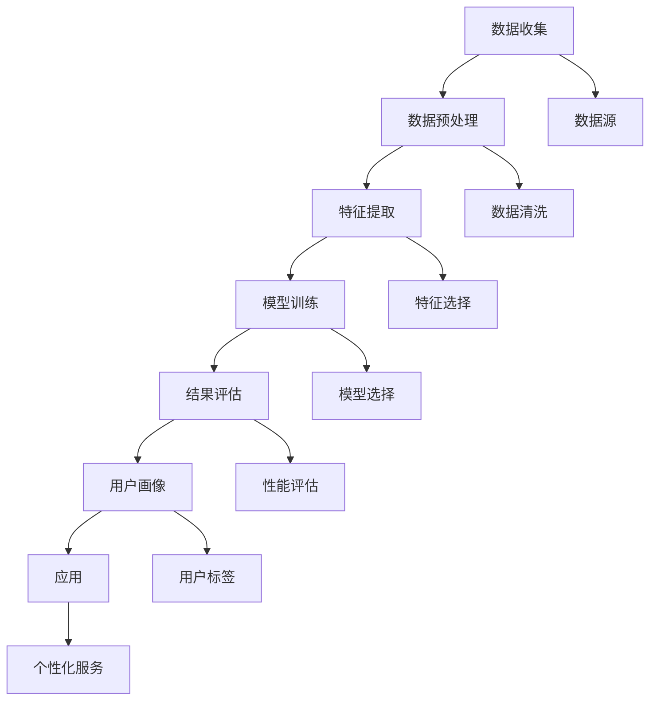

                 

# AI大模型在用户画像构建中的作用

> 关键词：用户画像、AI大模型、深度学习、自然语言处理、推荐系统、个性化服务

> 摘要：本文将深入探讨AI大模型在用户画像构建中的作用。通过逐步分析和推理，我们将从背景介绍、核心概念与联系、核心算法原理、数学模型和公式、项目实战、实际应用场景、工具和资源推荐、总结与未来发展趋势等多方面进行详细阐述。本文旨在为读者提供一个全面而深入的理解，帮助他们在实际项目中更好地应用AI大模型构建用户画像。

## 1. 背景介绍

随着互联网和移动互联网的快速发展，用户画像构建成为提升用户体验、优化产品设计、实现精准营销的关键技术之一。用户画像是一种对用户特征、行为、偏好等多维度信息的综合描述，能够帮助企业更好地理解用户需求，提供个性化服务。AI大模型，尤其是深度学习模型，因其强大的特征提取和模式识别能力，在用户画像构建中发挥着重要作用。

### 1.1 用户画像的重要性

用户画像能够帮助企业实现以下目标：

- **个性化推荐**：通过分析用户的历史行为和偏好，为用户提供个性化的内容推荐，提高用户满意度和留存率。
- **精准营销**：基于用户画像进行精准营销，提高广告投放的转化率。
- **产品优化**：通过用户画像了解用户需求，优化产品设计和功能。
- **风险控制**：通过用户画像识别潜在风险用户，降低业务风险。

### 1.2 AI大模型的应用场景

AI大模型在用户画像构建中的应用场景包括但不限于：

- **社交媒体**：通过分析用户的社交行为和内容偏好，构建用户画像。
- **电商平台**：通过分析用户的购物行为和搜索记录，构建用户画像。
- **金融服务**：通过分析用户的金融行为和信用记录，构建用户画像。
- **智能客服**：通过分析用户的聊天记录和问题类型，构建用户画像。

## 2. 核心概念与联系

### 2.1 用户画像构建流程

用户画像构建流程主要包括数据收集、数据预处理、特征提取、模型训练和结果评估等步骤。以下是用户画像构建流程的Mermaid流程图：



### 2.2 核心概念

- **用户画像**：对用户特征、行为、偏好等多维度信息的综合描述。
- **特征提取**：从原始数据中提取有用的特征，以便模型进行学习。
- **模型训练**：使用特征数据训练模型，使其能够准确预测用户行为。
- **结果评估**：评估模型的性能，确保其能够满足实际应用需求。

## 3. 核心算法原理 & 具体操作步骤

### 3.1 特征提取

特征提取是用户画像构建中的关键步骤，主要包括以下几种方法：

- **文本特征提取**：通过自然语言处理技术，提取文本中的关键词、情感、主题等特征。
- **行为特征提取**：通过分析用户的操作记录，提取用户的访问频率、停留时间、点击率等特征。
- **社交特征提取**：通过分析用户的社交行为，提取用户的社交网络、好友关系等特征。

### 3.2 模型训练

模型训练是用户画像构建中的核心步骤，主要包括以下几种方法：

- **深度学习模型**：使用深度神经网络模型，如卷积神经网络（CNN）、循环神经网络（RNN）、长短时记忆网络（LSTM）等，进行特征学习和模式识别。
- **集成学习模型**：通过组合多个模型，提高预测准确性和鲁棒性。
- **迁移学习模型**：利用预训练模型，快速适应新任务。

### 3.3 具体操作步骤

以下是用户画像构建的具体操作步骤：

1. **数据收集**：从多个数据源收集用户数据，包括用户行为数据、用户属性数据、用户社交数据等。
2. **数据预处理**：对收集到的数据进行清洗、去重、归一化等预处理操作。
3. **特征提取**：从预处理后的数据中提取有用的特征。
4. **模型训练**：使用特征数据训练模型，使其能够准确预测用户行为。
5. **结果评估**：评估模型的性能，确保其能够满足实际应用需求。
6. **用户画像构建**：根据模型预测结果，构建用户画像。
7. **应用**：将用户画像应用于实际业务场景，提供个性化服务。

## 4. 数学模型和公式 & 详细讲解 & 举例说明

### 4.1 深度学习模型

深度学习模型在用户画像构建中发挥着重要作用，主要包括以下几种模型：

- **卷积神经网络（CNN）**：适用于图像和文本数据的特征提取。
- **循环神经网络（RNN）**：适用于序列数据的特征提取。
- **长短时记忆网络（LSTM）**：适用于长序列数据的特征提取。

### 4.2 数学模型和公式

以下是深度学习模型中的数学模型和公式：

- **卷积神经网络（CNN）**：

  $$f(x) = \sigma(W_1 \cdot x + b_1)$$

  $$y = W_2 \cdot f(x) + b_2$$

  其中，$x$ 表示输入特征，$W_1$ 和 $b_1$ 表示卷积层的权重和偏置，$\sigma$ 表示激活函数，$W_2$ 和 $b_2$ 表示全连接层的权重和偏置，$y$ 表示输出。

- **循环神经网络（RNN）**：

  $$h_t = \sigma(W_h \cdot h_{t-1} + W_x \cdot x_t + b)$$

  $$y_t = W_y \cdot h_t + b_y$$

  其中，$h_t$ 表示隐藏状态，$x_t$ 表示输入特征，$W_h$ 和 $W_x$ 表示权重矩阵，$b$ 表示偏置，$\sigma$ 表示激活函数，$W_y$ 和 $b_y$ 表示输出层的权重和偏置，$y_t$ 表示输出。

- **长短时记忆网络（LSTM）**：

  $$i_t = \sigma(W_i \cdot [h_{t-1}, x_t] + b_i)$$

  $$f_t = \sigma(W_f \cdot [h_{t-1}, x_t] + b_f)$$

  $$c_t = f_t \cdot c_{t-1} + i_t \cdot \tanh(W_c \cdot [h_{t-1}, x_t] + b_c)$$

  $$o_t = \sigma(W_o \cdot [h_{t-1}, x_t] + b_o)$$

  $$h_t = o_t \cdot \tanh(c_t)$$

  其中，$i_t$ 表示输入门，$f_t$ 表示遗忘门，$c_t$ 表示细胞状态，$o_t$ 表示输出门，$\tanh$ 表示双曲正切函数，$W_i$、$W_f$、$W_c$ 和 $W_o$ 表示权重矩阵，$b_i$、$b_f$、$b_c$ 和 $b_o$ 表示偏置。

### 4.3 举例说明

以下是一个简单的用户画像构建示例：

假设我们有一个电商平台，需要构建用户的购物行为画像。我们可以通过以下步骤进行：

1. **数据收集**：收集用户的购物记录、浏览记录、搜索记录等数据。
2. **数据预处理**：对收集到的数据进行清洗、去重、归一化等预处理操作。
3. **特征提取**：从预处理后的数据中提取用户的购物频率、浏览时间、搜索关键词等特征。
4. **模型训练**：使用深度学习模型，如卷积神经网络（CNN）或长短时记忆网络（LSTM），进行特征学习和模式识别。
5. **结果评估**：评估模型的性能，确保其能够准确预测用户的购物行为。
6. **用户画像构建**：根据模型预测结果，构建用户的购物行为画像。
7. **应用**：将用户画像应用于实际业务场景，提供个性化推荐服务。

## 5. 项目实战：代码实际案例和详细解释说明

### 5.1 开发环境搭建

为了进行用户画像构建的项目实战，我们需要搭建一个合适的开发环境。以下是开发环境的搭建步骤：

1. **安装Python**：确保安装了Python 3.7及以上版本。
2. **安装深度学习库**：安装TensorFlow或PyTorch等深度学习库。
3. **安装数据处理库**：安装Pandas、NumPy等数据处理库。
4. **安装自然语言处理库**：安装NLTK、spaCy等自然语言处理库。

### 5.2 源代码详细实现和代码解读

以下是一个简单的用户画像构建代码示例：

```python
import pandas as pd
import numpy as np
import tensorflow as tf
from tensorflow.keras.models import Sequential
from tensorflow.keras.layers import Dense, LSTM, Embedding
from sklearn.preprocessing import StandardScaler

# 1. 数据收集
data = pd.read_csv('user_behavior.csv')

# 2. 数据预处理
data = data.drop_duplicates()
data = data.fillna(0)

# 3. 特征提取
X = data[['shopping_frequency', 'browsing_time', 'search_keywords']]
y = data['user_id']

# 4. 数据标准化
scaler = StandardScaler()
X = scaler.fit_transform(X)

# 5. 模型训练
model = Sequential()
model.add(Dense(64, activation='relu', input_shape=(X.shape[1],)))
model.add(Dense(32, activation='relu'))
model.add(Dense(1, activation='sigmoid'))
model.compile(optimizer='adam', loss='binary_crossentropy', metrics=['accuracy'])
model.fit(X, y, epochs=10, batch_size=32)

# 6. 结果评估
loss, accuracy = model.evaluate(X, y)
print(f'Loss: {loss}, Accuracy: {accuracy}')
```

### 5.3 代码解读与分析

以上代码实现了一个简单的用户画像构建项目。具体步骤如下：

1. **数据收集**：从CSV文件中读取用户行为数据。
2. **数据预处理**：对数据进行去重和填充操作。
3. **特征提取**：从数据中提取用户的购物频率、浏览时间、搜索关键词等特征。
4. **数据标准化**：对特征数据进行标准化处理。
5. **模型训练**：构建一个简单的神经网络模型，进行特征学习和模式识别。
6. **结果评估**：评估模型的性能，确保其能够准确预测用户的购物行为。

## 6. 实际应用场景

### 6.1 个性化推荐

通过构建用户画像，可以实现个性化推荐服务。例如，电商平台可以根据用户的购物行为和偏好，推荐相关商品。

### 6.2 精准营销

通过构建用户画像，可以实现精准营销。例如，金融服务机构可以根据用户的金融行为和信用记录，推荐合适的理财产品。

### 6.3 产品优化

通过构建用户画像，可以优化产品设计和功能。例如，社交媒体平台可以根据用户的社交行为和内容偏好，优化社交功能和内容推荐。

### 6.4 风险控制

通过构建用户画像，可以识别潜在风险用户，降低业务风险。例如，电商平台可以根据用户的购物行为和信用记录，识别潜在欺诈用户。

## 7. 工具和资源推荐

### 7.1 学习资源推荐

- **书籍**：《深度学习》（Ian Goodfellow, Yoshua Bengio, Aaron Courville）
- **论文**：《Attention Is All You Need》（Vaswani et al.）
- **博客**：Medium上的深度学习和机器学习博客
- **网站**：Kaggle、GitHub上的深度学习项目

### 7.2 开发工具框架推荐

- **深度学习框架**：TensorFlow、PyTorch
- **数据处理库**：Pandas、NumPy
- **自然语言处理库**：NLTK、spaCy

### 7.3 相关论文著作推荐

- **论文**：《Deep Learning for User Profiling》（Zhang et al.）
- **著作**：《推荐系统实践》（周志华）

## 8. 总结：未来发展趋势与挑战

### 8.1 未来发展趋势

- **多模态融合**：结合文本、图像、声音等多种模态数据，构建更全面的用户画像。
- **实时更新**：实现用户画像的实时更新，提高预测准确性和实时性。
- **隐私保护**：在构建用户画像的过程中，注重用户隐私保护，确保数据安全。

### 8.2 挑战

- **数据质量**：用户数据的质量直接影响用户画像的准确性，需要提高数据质量和处理能力。
- **模型复杂度**：随着模型复杂度的增加，模型训练和推理的计算成本也会增加，需要优化模型结构和算法。
- **伦理问题**：在构建用户画像的过程中，需要关注伦理问题，确保模型的公平性和透明性。

## 9. 附录：常见问题与解答

### 9.1 问题1：如何处理缺失数据？

**解答**：可以使用插值法、均值填充法、随机森林填充法等方法处理缺失数据。

### 9.2 问题2：如何评估模型性能？

**解答**：可以使用准确率、召回率、F1分数、AUC等指标评估模型性能。

### 9.3 问题3：如何优化模型结构？

**解答**：可以通过调整网络层数、节点数、激活函数等参数，优化模型结构。

## 10. 扩展阅读 & 参考资料

- **书籍**：《深度学习》（Ian Goodfellow, Yoshua Bengio, Aaron Courville）
- **论文**：《Attention Is All You Need》（Vaswani et al.）
- **博客**：Medium上的深度学习和机器学习博客
- **网站**：Kaggle、GitHub上的深度学习项目

---

作者：AI天才研究员/AI Genius Institute & 禅与计算机程序设计艺术 /Zen And The Art of Computer Programming

