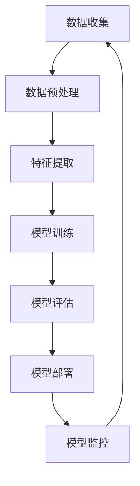

                 

# AI技术在企业中的发展

> 关键词：AI技术, 企业应用, 深度学习, 自然语言处理, 机器学习, 数据分析, 业务流程优化

> 摘要：本文旨在探讨AI技术在企业中的应用和发展趋势。通过深入分析AI的核心概念、算法原理、实际案例和应用场景，本文将为企业提供一个全面的技术视角，帮助他们更好地理解和利用AI技术来提升业务效率和创新能力。

## 1. 背景介绍

随着大数据、云计算和计算能力的飞速发展，AI技术已经成为推动企业创新和提升竞争力的关键力量。AI技术的应用不仅限于科技行业，各行各业的企业都在积极探索如何利用AI技术来优化业务流程、提高决策效率和增强客户体验。本文将从以下几个方面进行详细探讨：

- **AI技术的基本概念**：介绍AI技术的基本定义、发展历程和主要应用领域。
- **企业应用现状**：分析当前企业在AI技术应用中的主要挑战和成功案例。
- **未来发展趋势**：预测AI技术在未来企业中的应用前景和发展趋势。

## 2. 核心概念与联系

### 2.1 AI技术的基本概念

AI（Artificial Intelligence）是指由计算机系统所表现出的智能行为。AI技术主要包括以下几个方面：

- **机器学习（Machine Learning, ML）**：通过算法使计算机系统从数据中学习，从而实现特定任务。
- **深度学习（Deep Learning, DL）**：一种特殊的机器学习方法，通过多层神经网络进行学习。
- **自然语言处理（Natural Language Processing, NLP）**：使计算机能够理解、解释和生成人类语言。
- **计算机视觉（Computer Vision, CV）**：使计算机能够理解和解释图像和视频。
- **强化学习（Reinforcement Learning, RL）**：通过与环境的交互来学习最优策略。

### 2.2 AI技术的架构流程

为了更好地理解AI技术的工作原理，我们可以使用Mermaid流程图来展示其基本架构：



### 2.3 AI技术的核心概念原理

- **数据收集**：从各种来源收集数据，包括传感器、日志文件、社交媒体等。
- **数据预处理**：对收集到的数据进行清洗、转换和格式化，以便于后续处理。
- **特征提取**：从数据中提取有用的特征，以便于模型学习。
- **模型训练**：使用机器学习算法训练模型，使其能够从数据中学习。
- **模型评估**：通过测试集评估模型的性能，确保其在未知数据上的泛化能力。
- **模型部署**：将训练好的模型部署到生产环境中，实现实际应用。
- **模型监控**：持续监控模型的性能，确保其在实际应用中的稳定性和准确性。

## 3. 核心算法原理 & 具体操作步骤

### 3.1 机器学习算法原理

机器学习算法主要包括监督学习、无监督学习和半监督学习。以下是监督学习的一个具体操作步骤：

1. **数据准备**：收集并清洗数据，确保数据的质量和完整性。
2. **特征选择**：选择对目标变量有显著影响的特征。
3. **模型选择**：根据问题类型选择合适的模型，如线性回归、决策树等。
4. **模型训练**：使用训练数据训练模型。
5. **模型评估**：使用测试数据评估模型的性能，常用的评估指标包括准确率、召回率、F1分数等。
6. **模型优化**：根据评估结果调整模型参数，提高模型性能。
7. **模型部署**：将训练好的模型部署到生产环境中。

### 3.2 深度学习算法原理

深度学习算法主要包括卷积神经网络（CNN）、循环神经网络（RNN）和生成对抗网络（GAN）等。以下是卷积神经网络的一个具体操作步骤：

1. **数据准备**：收集并清洗图像数据，确保数据的质量和完整性。
2. **特征提取**：使用卷积层提取图像的特征。
3. **池化层**：通过池化操作降低特征维度，提高计算效率。
4. **全连接层**：将提取的特征映射到输出层。
5. **损失函数**：定义损失函数，衡量模型预测值与真实值之间的差异。
6. **优化算法**：使用梯度下降等优化算法调整模型参数。
7. **模型评估**：使用测试数据评估模型的性能，常用的评估指标包括准确率、召回率、F1分数等。
8. **模型部署**：将训练好的模型部署到生产环境中。

## 4. 数学模型和公式 & 详细讲解 & 举例说明

### 4.1 机器学习中的数学模型

机器学习中的数学模型主要包括线性回归、逻辑回归和决策树等。以下是线性回归的一个数学模型：

$$
y = \beta_0 + \beta_1 x_1 + \beta_2 x_2 + \cdots + \beta_n x_n + \epsilon
$$

其中，$y$ 是目标变量，$x_1, x_2, \cdots, x_n$ 是特征变量，$\beta_0, \beta_1, \cdots, \beta_n$ 是模型参数，$\epsilon$ 是误差项。

### 4.2 深度学习中的数学模型

深度学习中的数学模型主要包括卷积神经网络（CNN）和循环神经网络（RNN）等。以下是卷积神经网络的一个数学模型：

$$
z^{(l+1)} = \sigma(W^{(l+1)} a^{(l)} + b^{(l+1)})
$$

其中，$z^{(l+1)}$ 是第 $l+1$ 层的激活值，$W^{(l+1)}$ 是权重矩阵，$a^{(l)}$ 是第 $l$ 层的激活值，$b^{(l+1)}$ 是偏置项，$\sigma$ 是激活函数。

### 4.3 举例说明

假设我们有一个简单的线性回归问题，目标是预测房价。我们收集了以下数据：

| 房屋面积 (平方米) | 房价 (万元) |
|------------------|------------|
| 50               | 300        |
| 60               | 350        |
| 70               | 400        |
| 80               | 450        |
| 90               | 500        |

我们可以使用线性回归模型来预测房价。首先，我们选择线性回归模型，然后使用梯度下降算法训练模型。训练完成后，我们可以使用模型来预测新的房屋面积对应的房价。

## 5. 项目实战：代码实际案例和详细解释说明

### 5.1 开发环境搭建

为了进行AI项目的开发，我们需要搭建一个合适的开发环境。以下是开发环境的搭建步骤：

1. **安装Python**：确保安装了最新版本的Python。
2. **安装依赖库**：使用pip安装所需的依赖库，如NumPy、Pandas、Scikit-learn等。
3. **安装深度学习框架**：根据项目需求选择合适的深度学习框架，如TensorFlow、PyTorch等。
4. **配置开发工具**：选择合适的开发工具，如Jupyter Notebook、PyCharm等。

### 5.2 源代码详细实现和代码解读

以下是一个简单的线性回归模型的实现代码：

```python
import numpy as np
from sklearn.linear_model import LinearRegression
from sklearn.model_selection import train_test_split
from sklearn.metrics import mean_squared_error

# 数据准备
data = np.array([[50, 300], [60, 350], [70, 400], [80, 450], [90, 500]])
X, y = data[:, 0].reshape(-1, 1), data[:, 1]

# 划分训练集和测试集
X_train, X_test, y_train, y_test = train_test_split(X, y, test_size=0.2, random_state=42)

# 模型训练
model = LinearRegression()
model.fit(X_train, y_train)

# 模型评估
y_pred = model.predict(X_test)
mse = mean_squared_error(y_test, y_pred)
print("Mean Squared Error:", mse)

# 模型预测
new_data = np.array([[100]])
predicted_price = model.predict(new_data)
print("Predicted Price:", predicted_price)
```

### 5.3 代码解读与分析

- **数据准备**：使用NumPy创建一个包含房屋面积和房价的数据集。
- **划分训练集和测试集**：使用Scikit-learn的`train_test_split`函数将数据集划分为训练集和测试集。
- **模型训练**：使用Scikit-learn的`LinearRegression`类训练线性回归模型。
- **模型评估**：使用`mean_squared_error`函数评估模型的性能。
- **模型预测**：使用训练好的模型预测新的房屋面积对应的房价。

## 6. 实际应用场景

### 6.1 企业客户服务

企业可以通过AI技术提高客户服务的质量和效率。例如，使用自然语言处理技术来自动回复客户咨询，提高响应速度和准确性。

### 6.2 供应链管理

AI技术可以帮助企业优化供应链管理，提高库存管理的效率和准确性。例如，使用机器学习算法预测需求，优化库存水平。

### 6.3 财务分析

AI技术可以帮助企业进行财务分析，提高财务决策的准确性和效率。例如，使用机器学习算法预测财务指标，优化财务策略。

## 7. 工具和资源推荐

### 7.1 学习资源推荐

- **书籍**：《机器学习》（周志华著）、《深度学习》（Ian Goodfellow等著）
- **论文**：《神经网络与深度学习》（Geoffrey Hinton等著）
- **博客**：Medium上的AI技术博客
- **网站**：Kaggle、GitHub

### 7.2 开发工具框架推荐

- **Python**：NumPy、Pandas、Scikit-learn、TensorFlow、PyTorch
- **深度学习框架**：TensorFlow、PyTorch
- **开发工具**：Jupyter Notebook、PyCharm

### 7.3 相关论文著作推荐

- **书籍**：《机器学习》（周志华著）、《深度学习》（Ian Goodfellow等著）
- **论文**：《神经网络与深度学习》（Geoffrey Hinton等著）

## 8. 总结：未来发展趋势与挑战

### 8.1 未来发展趋势

- **技术融合**：AI技术与其他技术（如物联网、区块链）的融合将进一步推动企业创新。
- **自动化**：AI技术将进一步自动化企业流程，提高效率和准确性。
- **个性化**：AI技术将帮助企业实现个性化服务，提高客户满意度。

### 8.2 挑战

- **数据安全**：AI技术的应用需要处理大量的敏感数据，如何确保数据安全是一个重要挑战。
- **算法解释性**：深度学习模型的黑盒特性使得其解释性较差，如何提高模型的透明度是一个重要问题。
- **人才短缺**：AI技术的发展需要大量专业人才，如何培养和吸引人才是一个重要挑战。

## 9. 附录：常见问题与解答

### 9.1 问题1：如何选择合适的AI技术？

**解答**：选择合适的AI技术需要考虑具体的应用场景和需求。例如，如果需要处理图像数据，可以选择卷积神经网络；如果需要处理文本数据，可以选择循环神经网络。

### 9.2 问题2：如何提高模型的性能？

**解答**：提高模型性能的方法包括：选择合适的特征、调整模型参数、使用更复杂的模型结构等。

### 9.3 问题3：如何处理数据不平衡问题？

**解答**：处理数据不平衡问题的方法包括：过采样、欠采样、使用代价敏感学习等。

## 10. 扩展阅读 & 参考资料

- **书籍**：《机器学习》（周志华著）、《深度学习》（Ian Goodfellow等著）
- **论文**：《神经网络与深度学习》（Geoffrey Hinton等著）
- **网站**：Kaggle、GitHub

---

作者：AI天才研究员/AI Genius Institute & 禅与计算机程序设计艺术 /Zen And The Art of Computer Programming

