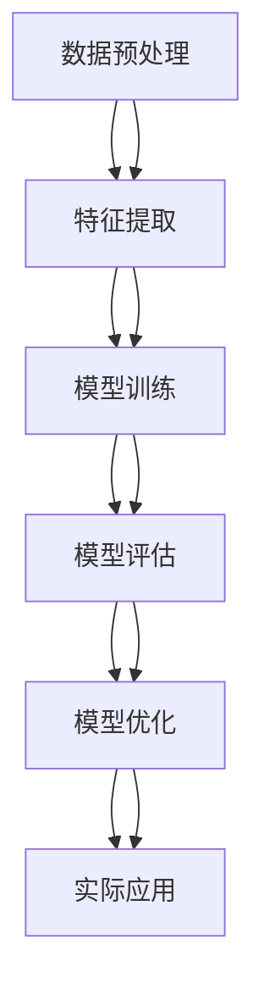

                 

# AI技术在实际应用中的前景

> 关键词：AI技术, 实际应用, 未来趋势, 挑战, 代码实现, 应用场景, 工具推荐

> 摘要：本文旨在探讨AI技术在实际应用中的前景，通过深入分析AI的核心概念、算法原理、数学模型、代码实现、应用场景以及未来发展趋势，为读者提供一个全面而深入的理解。我们将通过具体的代码案例和实际应用场景，展示AI技术如何在现实世界中发挥巨大作用，并探讨在这一过程中面临的挑战和机遇。

## 1. 背景介绍

随着计算能力的飞速提升和大数据技术的广泛应用，人工智能（AI）技术在过去几十年中取得了显著的进步。从最初的理论研究到如今广泛的实际应用，AI技术已经渗透到我们生活的方方面面。本文将从以下几个方面进行探讨：

- **AI技术的发展历程**：从早期的符号主义到现代的深度学习，AI技术经历了多次变革。
- **当前AI技术的应用领域**：包括但不限于医疗、金融、教育、交通、制造业等。
- **AI技术面临的挑战**：数据隐私、算法偏见、伦理道德等问题。

## 2. 核心概念与联系

### 2.1 符号主义与连接主义

- **符号主义**：基于逻辑推理和知识表示，通过符号操作实现智能。
- **连接主义**：基于神经网络模型，通过大量节点之间的连接实现智能。

### 2.2 机器学习与深度学习

- **机器学习**：通过算法使计算机从数据中学习规律，从而进行预测或决策。
- **深度学习**：一种特殊的机器学习方法，通过多层神经网络实现复杂的非线性映射。

### 2.3 AI技术的架构



## 3. 核心算法原理 & 具体操作步骤

### 3.1 逻辑回归

逻辑回归是一种常用的分类算法，适用于二分类问题。

#### 3.1.1 算法原理

逻辑回归通过sigmoid函数将线性回归的结果映射到0到1之间，表示概率。

$$
P(y=1|x) = \frac{1}{1 + e^{-(\beta_0 + \beta_1 x)}}
$$

#### 3.1.2 具体操作步骤

1. **数据预处理**：标准化或归一化特征。
2. **特征选择**：选择对目标变量影响较大的特征。
3. **模型训练**：使用梯度下降法优化参数。
4. **模型评估**：计算准确率、精确率、召回率等指标。
5. **模型优化**：调整参数或使用交叉验证。

### 3.2 卷积神经网络（CNN）

CNN是一种专门用于处理图像数据的深度学习模型。

#### 3.2.1 算法原理

CNN通过卷积层、池化层和全连接层实现特征提取和分类。

#### 3.2.2 具体操作步骤

1. **数据预处理**：对图像进行归一化和增强。
2. **模型构建**：定义卷积层、池化层和全连接层。
3. **模型训练**：使用反向传播算法优化参数。
4. **模型评估**：计算准确率、损失等指标。
5. **模型优化**：调整超参数或使用数据增强。

## 4. 数学模型和公式 & 详细讲解 & 举例说明

### 4.1 逻辑回归

逻辑回归的损失函数为交叉熵损失。

$$
L = -\frac{1}{N} \sum_{i=1}^{N} [y_i \log(p_i) + (1 - y_i) \log(1 - p_i)]
$$

### 4.2 卷积神经网络

卷积层的计算公式为：

$$
z_{ij} = \sum_{m=0}^{M-1} \sum_{n=0}^{N-1} w_{m,n} \cdot x_{i+m,j+n} + b
$$

其中，$w_{m,n}$为卷积核，$x_{i+m,j+n}$为输入特征图，$b$为偏置项。

## 5. 项目实战：代码实际案例和详细解释说明

### 5.1 开发环境搭建

#### 5.1.1 环境准备

- **Python版本**：3.7+
- **库依赖**：numpy, pandas, tensorflow, keras

```bash
pip install numpy pandas tensorflow keras
```

### 5.2 源代码详细实现和代码解读

#### 5.2.1 逻辑回归实现

```python
import numpy as np
from sklearn.linear_model import LogisticRegression
from sklearn.datasets import load_iris
from sklearn.model_selection import train_test_split

# 加载数据
data = load_iris()
X = data.data
y = data.target

# 划分训练集和测试集
X_train, X_test, y_train, y_test = train_test_split(X, y, test_size=0.2, random_state=42)

# 训练逻辑回归模型
model = LogisticRegression()
model.fit(X_train, y_train)

# 预测
y_pred = model.predict(X_test)

# 评估
from sklearn.metrics import accuracy_score
print("Accuracy:", accuracy_score(y_test, y_pred))
```

#### 5.2.2 卷积神经网络实现

```python
import tensorflow as tf
from tensorflow.keras.models import Sequential
from tensorflow.keras.layers import Conv2D, MaxPooling2D, Flatten, Dense

# 加载数据
(X_train, y_train), (X_test, y_test) = tf.keras.datasets.mnist.load_data()

# 数据预处理
X_train = X_train.reshape(-1, 28, 28, 1).astype('float32') / 255.0
X_test = X_test.reshape(-1, 28, 28, 1).astype('float32') / 255.0
y_train = tf.keras.utils.to_categorical(y_train, 10)
y_test = tf.keras.utils.to_categorical(y_test, 10)

# 构建模型
model = Sequential([
    Conv2D(32, kernel_size=(3, 3), activation='relu', input_shape=(28, 28, 1)),
    MaxPooling2D(pool_size=(2, 2)),
    Conv2D(64, kernel_size=(3, 3), activation='relu'),
    MaxPooling2D(pool_size=(2, 2)),
    Flatten(),
    Dense(128, activation='relu'),
    Dense(10, activation='softmax')
])

# 编译模型
model.compile(optimizer='adam', loss='categorical_crossentropy', metrics=['accuracy'])

# 训练模型
model.fit(X_train, y_train, epochs=10, batch_size=128, validation_data=(X_test, y_test))

# 评估模型
loss, accuracy = model.evaluate(X_test, y_test)
print("Test accuracy:", accuracy)
```

### 5.3 代码解读与分析

- **逻辑回归**：通过简单的线性模型实现分类任务，适用于小规模数据集。
- **卷积神经网络**：通过多层卷积和池化实现特征提取，适用于大规模图像数据集。

## 6. 实际应用场景

### 6.1 医疗健康

- **疾病诊断**：通过图像识别技术辅助医生进行疾病诊断。
- **基因测序**：通过深度学习技术分析基因数据，预测疾病风险。

### 6.2 金融行业

- **风险评估**：通过机器学习模型预测贷款违约风险。
- **欺诈检测**：通过异常检测技术识别欺诈行为。

### 6.3 教育领域

- **个性化推荐**：通过分析学生的学习行为，提供个性化学习资源。
- **智能辅导**：通过自然语言处理技术实现智能答疑。

## 7. 工具和资源推荐

### 7.1 学习资源推荐

- **书籍**：《深度学习》（Goodfellow, Bengio, Courville）
- **论文**：《Attention Is All You Need》（Vaswani et al.）
- **博客**：Medium上的AI技术博客
- **网站**：Kaggle, TensorFlow, PyTorch

### 7.2 开发工具框架推荐

- **Python库**：TensorFlow, PyTorch, Keras
- **IDE**：PyCharm, VSCode

### 7.3 相关论文著作推荐

- **论文**：《ImageNet Classification with Deep Convolutional Neural Networks》（Krizhevsky et al.）
- **著作**：《Pattern Recognition and Machine Learning》（Bishop）

## 8. 总结：未来发展趋势与挑战

### 8.1 未来发展趋势

- **技术融合**：AI技术与其他技术（如物联网、区块链）的融合。
- **自动化**：AI技术在自动化领域的应用将更加广泛。
- **伦理道德**：AI技术的发展将更加注重伦理道德问题。

### 8.2 面临的挑战

- **数据隐私**：如何保护用户数据隐私。
- **算法偏见**：如何避免算法带来的偏见。
- **技术普及**：如何让更多人掌握AI技术。

## 9. 附录：常见问题与解答

### 9.1 问题1：如何选择合适的AI模型？

- **答案**：根据具体问题和数据集选择合适的模型。例如，图像识别任务可以选择CNN，文本分类任务可以选择RNN或Transformer。

### 9.2 问题2：如何处理数据不平衡问题？

- **答案**：可以使用过采样、欠采样或生成合成数据等方法。

## 10. 扩展阅读 & 参考资料

- **书籍**：《机器学习》（周志华）
- **论文**：《Deep Residual Learning for Image Recognition》（He et al.）
- **网站**：arXiv, Google Scholar

---

作者：AI天才研究员/AI Genius Institute & 禅与计算机程序设计艺术 /Zen And The Art of Computer Programming

