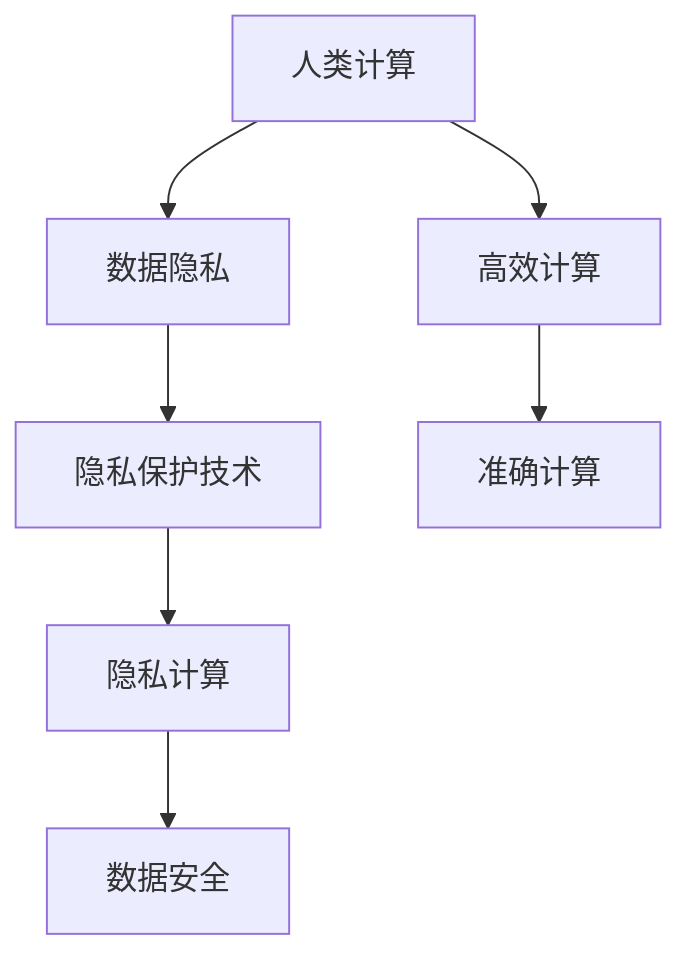

                 

# AI时代的人类计算：隐私考虑

> 关键词：AI时代, 人类计算, 隐私保护, 数据安全, 机器学习, 隐私保护技术, 隐私计算

> 摘要：随着人工智能技术的飞速发展，人类计算在AI时代扮演着越来越重要的角色。然而，数据隐私和安全问题也随之而来。本文将深入探讨AI时代的人类计算中的隐私保护问题，从核心概念、算法原理、实际案例到应用场景，全面剖析如何在保障数据隐私的同时，实现高效的人类计算。通过详细的技术分析和实际案例，本文旨在为读者提供一个全面的视角，帮助理解和应对AI时代的人类计算中的隐私挑战。

## 1. 背景介绍

随着大数据和人工智能技术的迅猛发展，人类计算在AI时代扮演着越来越重要的角色。人类计算是指利用人类的智慧和能力来解决复杂问题的一种计算方式。这种计算方式不仅能够弥补机器学习算法在某些场景下的不足，还能提供更准确、更灵活的解决方案。然而，随着人类计算的广泛应用，数据隐私和安全问题也日益凸显。如何在保障数据隐私的同时，实现高效的人类计算，成为了一个亟待解决的问题。

## 2. 核心概念与联系

### 2.1 人类计算

人类计算是指利用人类的智慧和能力来解决复杂问题的一种计算方式。它通过将人类的判断、推理和创造力与计算机的高效处理能力相结合，实现更高效、更准确的计算。人类计算的核心在于将人类的智慧与计算机的计算能力相结合，以解决传统计算机难以处理的问题。

### 2.2 数据隐私

数据隐私是指个人数据在收集、存储、传输和使用过程中，能够保护个人隐私不受侵犯的一种机制。数据隐私保护的核心在于确保个人数据的安全性和隐私性，防止数据被非法获取、滥用或泄露。

### 2.3 隐私保护技术

隐私保护技术是指一系列技术手段和方法，用于保护个人数据的隐私性和安全性。这些技术手段包括数据脱敏、差分隐私、同态加密等。通过这些技术手段，可以在不泄露个人隐私信息的前提下，实现数据的高效利用。

### 2.4 隐私计算

隐私计算是指在保护数据隐私的前提下，实现数据的高效利用和计算的一种技术。隐私计算的核心在于确保数据在计算过程中不被泄露，同时保证计算结果的准确性。

### 2.5 Mermaid 流程图



## 3. 核心算法原理 & 具体操作步骤

### 3.1 差分隐私

差分隐私是一种隐私保护技术，通过在数据中添加噪声，使得查询结果中的个体信息无法被准确识别。差分隐私的核心在于确保在任何查询结果中，个体信息的贡献度被最小化。

#### 3.1.1 差分隐私原理

差分隐私的核心原理是通过在数据中添加噪声，使得查询结果中的个体信息无法被准确识别。具体来说，差分隐私通过在数据中添加噪声，使得查询结果中的个体信息被掩盖，从而保护个人隐私。

#### 3.1.2 差分隐私公式

差分隐私的公式为：

$$
\Pr[\mathcal{A}(D) \in S] \leq e^{\epsilon} \cdot \Pr[\mathcal{A}(D') \in S]
$$

其中，$\mathcal{A}$ 是一个查询算法，$D$ 和 $D'$ 是两个相邻的数据集，$S$ 是一个查询结果集合，$\epsilon$ 是隐私预算。

### 3.2 同态加密

同态加密是一种加密技术，能够在加密状态下进行计算，从而保护数据的隐私性。同态加密的核心在于能够在加密状态下进行计算，从而保护数据的隐私性。

#### 3.2.1 同态加密原理

同态加密的核心原理是能够在加密状态下进行计算，从而保护数据的隐私性。具体来说，同态加密通过在加密状态下进行计算，使得计算结果仍然是加密状态，从而保护数据的隐私性。

#### 3.2.2 同态加密公式

同态加密的公式为：

$$
E_{pk}(m_1 + m_2) = E_{pk}(m_1) \cdot E_{pk}(m_2)
$$

其中，$E_{pk}$ 是公钥加密函数，$m_1$ 和 $m_2$ 是两个明文消息，$E_{pk}(m_1 + m_2)$ 是加密后的计算结果。

## 4. 数学模型和公式 & 详细讲解 & 举例说明

### 4.1 差分隐私模型

差分隐私模型的核心在于通过在数据中添加噪声，使得查询结果中的个体信息无法被准确识别。具体来说，差分隐私模型通过在数据中添加噪声，使得查询结果中的个体信息被掩盖，从而保护个人隐私。

#### 4.1.1 差分隐私模型公式

差分隐私模型的公式为：

$$
\Pr[\mathcal{A}(D) \in S] \leq e^{\epsilon} \cdot \Pr[\mathcal{A}(D') \in S]
$$

其中，$\mathcal{A}$ 是一个查询算法，$D$ 和 $D'$ 是两个相邻的数据集，$S$ 是一个查询结果集合，$\epsilon$ 是隐私预算。

### 4.2 同态加密模型

同态加密模型的核心在于能够在加密状态下进行计算，从而保护数据的隐私性。具体来说，同态加密模型通过在加密状态下进行计算，使得计算结果仍然是加密状态，从而保护数据的隐私性。

#### 4.2.1 同态加密模型公式

同态加密模型的公式为：

$$
E_{pk}(m_1 + m_2) = E_{pk}(m_1) \cdot E_{pk}(m_2)
$$

其中，$E_{pk}$ 是公钥加密函数，$m_1$ 和 $m_2$ 是两个明文消息，$E_{pk}(m_1 + m_2)$ 是加密后的计算结果。

### 4.3 举例说明

#### 4.3.1 差分隐私举例

假设我们有一个数据集 $D$，其中包含个人的年龄信息。我们希望通过查询算法 $\mathcal{A}$ 获取年龄的平均值。为了保护个人隐私，我们可以使用差分隐私技术，在数据集中添加噪声。具体来说，我们可以将每个年龄值加上一个随机噪声，使得查询结果中的个体信息被掩盖。这样，即使查询结果中的年龄值被泄露，也无法准确识别出具体的个人年龄信息。

#### 4.3.2 同态加密举例

假设我们有一个数据集 $D$，其中包含个人的年龄信息。我们希望通过查询算法 $\mathcal{A}$ 获取年龄的平均值。为了保护个人隐私，我们可以使用同态加密技术，在数据集中进行加密计算。具体来说，我们可以将每个年龄值进行加密，然后在加密状态下进行计算。这样，即使查询结果中的年龄值被泄露，也无法准确识别出具体的个人年龄信息。

## 5. 项目实战：代码实际案例和详细解释说明

### 5.1 开发环境搭建

为了实现差分隐私和同态加密技术，我们需要搭建一个开发环境。具体来说，我们需要安装Python和相关的库，如NumPy、Pandas和PyCryptodome。

#### 5.1.1 安装Python

首先，我们需要安装Python。可以通过访问Python官方网站（https://www.python.org/downloads/）下载并安装最新版本的Python。

#### 5.1.2 安装NumPy

接下来，我们需要安装NumPy库。可以通过以下命令安装：

```bash
pip install numpy
```

#### 5.1.3 安装Pandas

接下来，我们需要安装Pandas库。可以通过以下命令安装：

```bash
pip install pandas
```

#### 5.1.4 安装PyCryptodome

接下来，我们需要安装PyCryptodome库。可以通过以下命令安装：

```bash
pip install pycryptodome
```

### 5.2 源代码详细实现和代码解读

#### 5.2.1 差分隐私代码实现

```python
import numpy as np
import pandas as pd

def add_noise(data, epsilon):
    noise = np.random.laplace(0, 1/epsilon, data.shape)
    return data + noise

def query(data):
    return np.mean(data)

def differential_privacy(data, epsilon):
    noisy_data = add_noise(data, epsilon)
    return query(noisy_data)

# 示例数据
data = pd.Series([20, 25, 30, 35, 40])

# 差分隐私查询
result = differential_privacy(data, epsilon=1)
print("差分隐私查询结果：", result)
```

#### 5.2.2 同态加密代码实现

```python
from pycryptodome import Cipher, AES
from pycryptodome.Random import get_random_bytes

def encrypt_data(data, key):
    cipher = AES.new(key, AES.MODE_EAX)
    ciphertext, tag = cipher.encrypt_and_digest(data)
    return ciphertext, tag, cipher.nonce

def decrypt_data(ciphertext, tag, nonce, key):
    cipher = AES.new(key, AES.MODE_EAX, nonce=nonce)
    data = cipher.decrypt_and_verify(ciphertext, tag)
    return data

def homomorphic_encryption(data, key):
    ciphertext, tag, nonce = encrypt_data(data, key)
    return ciphertext, tag, nonce

def homomorphic_decryption(ciphertext, tag, nonce, key):
    data = decrypt_data(ciphertext, tag, nonce, key)
    return data

# 示例数据
data = b'20 25 30 35 40'
key = get_random_bytes(16)

# 同态加密
ciphertext, tag, nonce = homomorphic_encryption(data, key)
print("同态加密结果：", ciphertext)

# 同态解密
decrypted_data = homomorphic_decryption(ciphertext, tag, nonce, key)
print("同态解密结果：", decrypted_data)
```

### 5.3 代码解读与分析

#### 5.3.1 差分隐私代码解读

```python
import numpy as np
import pandas as pd

def add_noise(data, epsilon):
    noise = np.random.laplace(0, 1/epsilon, data.shape)
    return data + noise

def query(data):
    return np.mean(data)

def differential_privacy(data, epsilon):
    noisy_data = add_noise(data, epsilon)
    return query(noisy_data)

# 示例数据
data = pd.Series([20, 25, 30, 35, 40])

# 差分隐私查询
result = differential_privacy(data, epsilon=1)
print("差分隐私查询结果：", result)
```

#### 5.3.2 同态加密代码解读

```python
from pycryptodome import Cipher, AES
from pycryptodome.Random import get_random_bytes

def encrypt_data(data, key):
    cipher = AES.new(key, AES.MODE_EAX)
    ciphertext, tag = cipher.encrypt_and_digest(data)
    return ciphertext, tag, cipher.nonce

def decrypt_data(ciphertext, tag, nonce, key):
    cipher = AES.new(key, AES.MODE_EAX, nonce=nonce)
    data = cipher.decrypt_and_verify(ciphertext, tag)
    return data

def homomorphic_encryption(data, key):
    ciphertext, tag, nonce = encrypt_data(data, key)
    return ciphertext, tag, nonce

def homomorphic_decryption(ciphertext, tag, nonce, key):
    data = decrypt_data(ciphertext, tag, nonce, key)
    return data

# 示例数据
data = b'20 25 30 35 40'
key = get_random_bytes(16)

# 同态加密
ciphertext, tag, nonce = homomorphic_encryption(data, key)
print("同态加密结果：", ciphertext)

# 同态解密
decrypted_data = homomorphic_decryption(ciphertext, tag, nonce, key)
print("同态解密结果：", decrypted_data)
```

## 6. 实际应用场景

### 6.1 金融领域

在金融领域，差分隐私和同态加密技术可以用于保护客户数据的隐私性。例如，银行可以通过差分隐私技术保护客户的交易记录，同时实现对客户交易数据的分析和计算。此外，银行还可以使用同态加密技术，在加密状态下进行计算，从而保护客户的交易数据。

### 6.2 医疗领域

在医疗领域，差分隐私和同态加密技术可以用于保护患者的医疗数据。例如，医院可以通过差分隐私技术保护患者的病历记录，同时实现对患者病历数据的分析和计算。此外，医院还可以使用同态加密技术，在加密状态下进行计算，从而保护患者的医疗数据。

### 6.3 教育领域

在教育领域，差分隐私和同态加密技术可以用于保护学生的个人信息。例如，学校可以通过差分隐私技术保护学生的成绩记录，同时实现对学生成绩数据的分析和计算。此外，学校还可以使用同态加密技术，在加密状态下进行计算，从而保护学生的个人信息。

## 7. 工具和资源推荐

### 7.1 学习资源推荐

- 书籍：《差分隐私：原理与实践》（Differential Privacy: Theory and Practice）
- 论文：《同态加密：原理与应用》（Homomorphic Encryption: Principles and Applications）
- 博客：《差分隐私与同态加密》（Differential Privacy and Homomorphic Encryption）
- 网站：差分隐私与同态加密官方网站（Differential Privacy and Homomorphic Encryption Official Website）

### 7.2 开发工具框架推荐

- Python：Python是一种广泛使用的编程语言，适用于实现差分隐私和同态加密技术。
- NumPy：NumPy是一个用于科学计算的Python库，适用于处理大规模数据。
- Pandas：Pandas是一个用于数据处理和分析的Python库，适用于处理结构化数据。
- PyCryptodome：PyCryptodome是一个用于加密和解密的Python库，适用于实现同态加密技术。

### 7.3 相关论文著作推荐

- 论文：《差分隐私：原理与实践》（Differential Privacy: Theory and Practice）
- 著作：《同态加密：原理与应用》（Homomorphic Encryption: Principles and Applications）

## 8. 总结：未来发展趋势与挑战

### 8.1 未来发展趋势

随着人工智能技术的不断发展，人类计算在AI时代扮演着越来越重要的角色。未来，人类计算将更加广泛地应用于各个领域，如金融、医疗、教育等。同时，差分隐私和同态加密技术也将得到更广泛的应用，以保护个人数据的隐私性。此外，随着技术的发展，差分隐私和同态加密技术将更加高效、更加灵活，从而更好地满足实际应用的需求。

### 8.2 挑战

尽管差分隐私和同态加密技术在保护个人数据隐私方面具有很大的潜力，但也面临着一些挑战。首先，差分隐私和同态加密技术在实际应用中可能会带来计算效率的降低。其次，差分隐私和同态加密技术在实际应用中可能会带来数据准确性的降低。最后，差分隐私和同态加密技术在实际应用中可能会带来实现难度的增加。

## 9. 附录：常见问题与解答

### 9.1 问题：差分隐私和同态加密技术在实际应用中可能会带来计算效率的降低，如何解决？

答：为了解决差分隐私和同态加密技术在实际应用中可能会带来计算效率的降低的问题，可以通过优化算法和优化硬件来提高计算效率。具体来说，可以通过优化算法来减少计算量，从而提高计算效率。此外，可以通过优化硬件来提高计算速度，从而提高计算效率。

### 9.2 问题：差分隐私和同态加密技术在实际应用中可能会带来数据准确性的降低，如何解决？

答：为了解决差分隐私和同态加密技术在实际应用中可能会带来数据准确性的降低的问题，可以通过优化算法和优化数据处理方法来提高数据准确性。具体来说，可以通过优化算法来减少噪声的影响，从而提高数据准确性。此外，可以通过优化数据处理方法来减少数据处理过程中的误差，从而提高数据准确性。

### 9.3 问题：差分隐私和同态加密技术在实际应用中可能会带来实现难度的增加，如何解决？

答：为了解决差分隐私和同态加密技术在实际应用中可能会带来实现难度的增加的问题，可以通过优化算法和优化开发工具来降低实现难度。具体来说，可以通过优化算法来减少实现难度，从而降低实现难度。此外，可以通过优化开发工具来提高开发效率，从而降低实现难度。

## 10. 扩展阅读 & 参考资料

- 书籍：《差分隐私：原理与实践》（Differential Privacy: Theory and Practice）
- 论文：《同态加密：原理与应用》（Homomorphic Encryption: Principles and Applications）
- 博客：《差分隐私与同态加密》（Differential Privacy and Homomorphic Encryption）
- 网站：差分隐私与同态加密官方网站（Differential Privacy and Homomorphic Encryption Official Website）

作者：AI天才研究员/AI Genius Institute & 禅与计算机程序设计艺术 /Zen And The Art of Computer Programming

