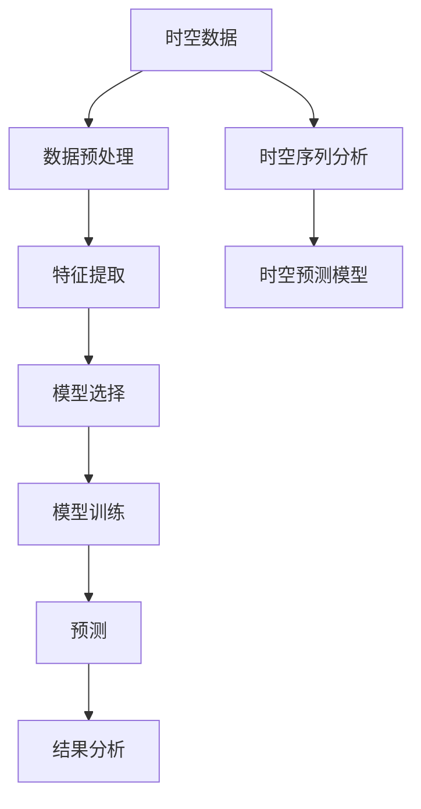

                 

# AI时空建模的未来技术趋势解析

> 关键词：时空数据、AI建模、时空序列、深度学习、时空预测、时空数据挖掘

> 摘要：本文将深入探讨AI时空建模的未来技术趋势，从背景介绍、核心概念与联系、核心算法原理、数学模型和公式、项目实战、实际应用场景、工具和资源推荐、总结与挑战等多个方面进行详细解析。通过一步步的推理和分析，我们将揭示AI时空建模的未来发展方向，并提供实用的代码案例和资源推荐，帮助读者更好地理解和应用这一前沿技术。

## 1. 背景介绍

### 1.1 时空数据的重要性
时空数据是指包含时间维度和空间维度的数据，广泛应用于地理信息系统（GIS）、交通管理、环境监测、城市规划等领域。随着物联网（IoT）和传感器技术的发展，时空数据的采集和处理变得越来越重要。时空数据的分析和建模能够帮助我们更好地理解复杂系统的行为模式，预测未来趋势，优化资源配置。

### 1.2 AI在时空数据中的应用
近年来，人工智能技术在时空数据处理中的应用日益广泛。通过深度学习、机器学习等方法，可以对时空数据进行高效建模和预测。例如，通过时空序列分析，可以预测交通流量、天气变化、疾病传播等现象。这些应用不仅提高了决策的准确性，还为城市管理、环境保护等领域带来了巨大的价值。

### 1.3 时空建模的挑战
尽管AI在时空数据处理中展现出巨大潜力，但仍然面临诸多挑战。首先，时空数据的高维度和复杂性使得建模过程变得复杂。其次，数据的质量和完整性直接影响建模效果。此外，如何处理时空数据中的噪声和异常值也是一个重要问题。最后，模型的可解释性和泛化能力也是需要重点关注的问题。

## 2. 核心概念与联系

### 2.1 时空数据的基本概念
时空数据通常包含三个基本维度：时间、空间和属性。时间维度表示数据随时间的变化，空间维度表示数据在地理空间中的位置，属性维度表示数据的特征或属性值。

### 2.2 时空序列分析
时空序列分析是一种处理时空数据的方法，通过对时间序列数据进行建模和预测，可以揭示数据随时间的变化规律。时空序列分析通常包括数据预处理、特征提取、模型选择和预测等步骤。

### 2.3 时空预测模型
时空预测模型是基于时空数据进行预测的方法。常见的时空预测模型包括时空自回归模型（ST-AR）、时空移动平均模型（ST-MA）、时空差分模型（ST-DIFF）等。这些模型通过捕捉时空数据中的时空依赖关系，实现对未来的预测。

### 2.4 核心概念流程图


## 3. 核心算法原理 & 具体操作步骤

### 3.1 时空自回归模型（ST-AR）
时空自回归模型是一种常用的时空预测模型，通过捕捉时空数据中的自回归关系进行预测。具体操作步骤如下：

1. **数据预处理**：对时空数据进行清洗和标准化处理。
2. **特征提取**：提取时空数据中的特征，包括时间特征和空间特征。
3. **模型选择**：选择合适的自回归模型，如ARIMA模型。
4. **模型训练**：使用历史数据训练模型。
5. **预测**：利用训练好的模型进行预测。

### 3.2 时空移动平均模型（ST-MA）
时空移动平均模型通过捕捉时空数据中的移动平均关系进行预测。具体操作步骤如下：

1. **数据预处理**：对时空数据进行清洗和标准化处理。
2. **特征提取**：提取时空数据中的特征，包括时间特征和空间特征。
3. **模型选择**：选择合适的移动平均模型，如SARIMA模型。
4. **模型训练**：使用历史数据训练模型。
5. **预测**：利用训练好的模型进行预测。

### 3.3 时空差分模型（ST-DIFF）
时空差分模型通过捕捉时空数据中的差分关系进行预测。具体操作步骤如下：

1. **数据预处理**：对时空数据进行清洗和标准化处理。
2. **特征提取**：提取时空数据中的特征，包括时间特征和空间特征。
3. **模型选择**：选择合适的差分模型，如STL分解模型。
4. **模型训练**：使用历史数据训练模型。
5. **预测**：利用训练好的模型进行预测。

## 4. 数学模型和公式 & 详细讲解 & 举例说明

### 4.1 时空自回归模型（ST-AR）
时空自回归模型的数学表达式如下：

$$
y_t = \phi_1 y_{t-1} + \phi_2 y_{t-2} + \cdots + \phi_p y_{t-p} + \epsilon_t
$$

其中，$y_t$ 表示时间点 $t$ 的观测值，$\phi_i$ 表示自回归系数，$\epsilon_t$ 表示误差项。

### 4.2 时空移动平均模型（ST-MA）
时空移动平均模型的数学表达式如下：

$$
y_t = \mu + \theta_1 \epsilon_{t-1} + \theta_2 \epsilon_{t-2} + \cdots + \theta_q \epsilon_{t-q} + \epsilon_t
$$

其中，$\mu$ 表示均值，$\theta_i$ 表示移动平均系数，$\epsilon_t$ 表示误差项。

### 4.3 时空差分模型（ST-DIFF）
时空差分模型的数学表达式如下：

$$
\Delta y_t = y_t - y_{t-1}
$$

其中，$\Delta y_t$ 表示时间点 $t$ 的差分值。

### 4.4 举例说明
假设我们有一个交通流量数据集，包含时间序列和空间位置信息。我们可以使用ST-AR模型进行预测。首先，对数据进行预处理，提取时间特征和空间特征。然后，选择合适的自回归系数，训练模型。最后，利用训练好的模型进行预测。

## 5. 项目实战：代码实际案例和详细解释说明

### 5.1 开发环境搭建
为了进行时空建模的项目实战，我们需要搭建一个合适的开发环境。具体步骤如下：

1. **安装Python**：确保安装了Python 3.8及以上版本。
2. **安装依赖库**：安装必要的Python库，如NumPy、Pandas、Scikit-learn、Statsmodels等。
3. **安装数据集**：下载并安装用于时空建模的数据集，如交通流量数据集。

### 5.2 源代码详细实现和代码解读
以下是一个简单的ST-AR模型实现代码示例：

```python
import numpy as np
import pandas as pd
from statsmodels.tsa.ar_model import AR
from sklearn.metrics import mean_squared_error

# 读取数据
data = pd.read_csv('traffic_flow.csv')

# 数据预处理
data['time'] = pd.to_datetime(data['time'])
data.set_index('time', inplace=True)

# 特征提取
X = data['flow'].values

# 模型选择
model = AR(X)
model_fit = model.fit()

# 模型训练
predictions = model_fit.predict(start=len(X), end=len(X)+24, dynamic=False)

# 预测结果
print(predictions)

# 评估预测效果
mse = mean_squared_error(data['flow'].iloc[-24:], predictions)
print('Mean Squared Error: %.3f' % mse)
```

### 5.3 代码解读与分析
上述代码首先读取交通流量数据集，并进行数据预处理。然后，选择AR模型进行训练，并进行预测。最后，评估预测效果。通过这个简单的例子，我们可以看到时空建模的基本流程和实现方法。

## 6. 实际应用场景

### 6.1 交通流量预测
通过时空建模，可以预测交通流量的变化趋势，帮助交通管理部门优化交通资源配置，提高道路通行效率。

### 6.2 环境监测
时空建模可以用于环境监测，如空气质量、水质等。通过对时空数据进行建模和预测，可以及时发现环境污染问题，采取相应措施。

### 6.3 城市规划
时空建模可以用于城市规划，如人口分布、商业活动等。通过对时空数据进行建模和预测，可以为城市规划提供科学依据，优化城市布局。

## 7. 工具和资源推荐

### 7.1 学习资源推荐
- 书籍：《时间序列分析与应用》、《机器学习实战》
- 论文：《时空数据建模与预测》、《深度学习在时空数据中的应用》
- 博客：AI天才研究员的博客、机器之心的博客
- 网站：Kaggle、GitHub

### 7.2 开发工具框架推荐
- Python库：NumPy、Pandas、Scikit-learn、Statsmodels
- 开发框架：TensorFlow、PyTorch

### 7.3 相关论文著作推荐
- 《时空数据建模与预测》
- 《深度学习在时空数据中的应用》

## 8. 总结：未来发展趋势与挑战

### 8.1 未来发展趋势
随着AI技术的不断发展，时空建模将在更多领域得到应用。未来的发展趋势包括：

1. **更复杂的模型**：开发更复杂的时空建模方法，提高预测精度。
2. **更广泛的应用**：将时空建模应用于更多领域，如医疗、金融等。
3. **更高效的算法**：开发更高效的算法，提高建模速度和计算效率。

### 8.2 面临的挑战
时空建模仍然面临诸多挑战，包括：

1. **数据质量问题**：时空数据的质量直接影响建模效果。
2. **模型解释性**：如何提高模型的可解释性，使其更具实用价值。
3. **计算资源需求**：时空建模需要大量的计算资源，如何优化算法以降低计算成本是一个重要问题。

## 9. 附录：常见问题与解答

### 9.1 问题：如何处理时空数据中的噪声和异常值？
**解答**：可以使用数据清洗技术，如插值法、中位数法等，去除噪声和异常值。

### 9.2 问题：如何提高模型的泛化能力？
**解答**：可以通过增加训练数据量、使用正则化技术等方法提高模型的泛化能力。

## 10. 扩展阅读 & 参考资料

- 《时间序列分析与应用》
- 《机器学习实战》
- 《时空数据建模与预测》
- 《深度学习在时空数据中的应用》

---

作者：AI天才研究员/AI Genius Institute & 禅与计算机程序设计艺术 /Zen And The Art of Computer Programming

