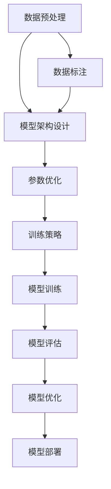

                 

# AI系统底层设计：LLM内核的关键考量

> 关键词：LLM, 内核设计, 人工智能, 深度学习, 自然语言处理, 模型架构, 参数优化, 训练策略

> 摘要：本文旨在深入探讨大型语言模型（LLM）内核的设计与实现，从核心概念出发，详细解析其架构设计、关键算法原理、数学模型及实际应用案例。通过逐步推理和详细解释，帮助读者全面理解LLM内核的关键考量因素，为实际开发提供指导。

## 1. 背景介绍

随着人工智能技术的飞速发展，大型语言模型（LLM）已成为自然语言处理（NLP）领域的重要组成部分。LLM通过深度学习技术，能够理解和生成人类语言，广泛应用于文本生成、对话系统、机器翻译等多个场景。本文将从LLM内核的设计出发，探讨其关键考量因素，帮助读者深入了解这一领域的技术细节。

## 2. 核心概念与联系

### 2.1 大型语言模型（LLM）

大型语言模型是一种基于深度学习的模型，能够处理和生成大量的自然语言文本。其核心在于通过大规模训练数据，学习语言的统计规律，从而实现对文本的理解和生成。

### 2.2 深度学习与神经网络

深度学习是实现LLM的关键技术之一。神经网络作为深度学习的核心，通过多层非线性变换，能够捕捉复杂的数据特征。常见的神经网络架构包括循环神经网络（RNN）、长短期记忆网络（LSTM）、Transformer等。

### 2.3 自然语言处理（NLP）

自然语言处理是LLM应用的主要领域之一。NLP技术通过处理和理解自然语言文本，实现文本分类、情感分析、机器翻译等功能。LLM在NLP中的应用，能够显著提升模型的性能和泛化能力。

### 2.4 模型架构设计

模型架构设计是LLM内核设计的核心。常见的模型架构包括Transformer、BERT、GPT等。这些架构通过不同的设计思路，优化了模型的性能和效率。

### 2.5 参数优化与训练策略

参数优化和训练策略是确保LLM性能的关键。通过优化模型参数和调整训练策略，可以提高模型的准确性和泛化能力。

### 2.6 Mermaid流程图



## 3. 核心算法原理 & 具体操作步骤

### 3.1 Transformer架构

Transformer架构是当前最流行的LLM模型之一。其核心在于自注意力机制（Self-Attention），能够捕捉文本中的长距离依赖关系。

#### 3.1.1 自注意力机制

自注意力机制通过计算查询（Query）、键（Key）、值（Value）之间的相似度，生成加权和。具体操作步骤如下：

1. **线性变换**：将输入序列通过线性变换，生成查询、键、值。
2. **计算相似度**：通过点积计算查询与键之间的相似度。
3. **加权和**：通过softmax函数生成权重，计算加权和。

$$
\text{Attention}(Q, K, V) = \text{softmax}\left(\frac{QK^T}{\sqrt{d_k}}\right)V
$$

### 3.2 BERT模型

BERT模型通过双向Transformer架构，实现了对上下文信息的全面捕捉。其核心在于掩码语言模型（Masked Language Model）和下一句预测（Next Sentence Prediction）任务。

#### 3.2.1 双向Transformer

双向Transformer通过前向和后向的注意力机制，捕捉文本中的上下文信息。具体操作步骤如下：

1. **前向注意力**：计算前向注意力权重，生成前向加权和。
2. **后向注意力**：计算后向注意力权重，生成后向加权和。
3. **融合**：将前向和后向加权和进行融合，生成最终的表示。

### 3.3 GPT模型

GPT模型通过自回归机制，逐词生成文本。其核心在于自回归预测任务，通过逐词预测下一个词，实现文本生成。

#### 3.3.1 自回归预测

自回归预测通过逐词生成文本，实现对文本的生成。具体操作步骤如下：

1. **初始化**：将起始词作为输入。
2. **预测**：通过Transformer模型预测下一个词。
3. **生成**：将预测的词加入输入序列，继续预测下一个词。

## 4. 数学模型和公式 & 详细讲解 & 举例说明

### 4.1 自注意力机制

自注意力机制的核心在于计算查询、键、值之间的相似度。具体公式如下：

$$
\text{Attention}(Q, K, V) = \text{softmax}\left(\frac{QK^T}{\sqrt{d_k}}\right)V
$$

其中，$Q$、$K$、$V$分别为查询、键、值，$d_k$为键的维度。

### 4.2 双向Transformer

双向Transformer通过前向和后向的注意力机制，捕捉文本中的上下文信息。具体公式如下：

1. **前向注意力**：

$$
\text{Attention}_{\text{forward}}(Q, K, V) = \text{softmax}\left(\frac{QK^T}{\sqrt{d_k}}\right)V
$$

2. **后向注意力**：

$$
\text{Attention}_{\text{backward}}(Q, K, V) = \text{softmax}\left(\frac{QK^T}{\sqrt{d_k}}\right)V
$$

3. **融合**：

$$
\text{Attention}_{\text{combined}}(Q, K, V) = \text{Attention}_{\text{forward}}(Q, K, V) + \text{Attention}_{\text{backward}}(Q, K, V)
$$

### 4.3 GPT模型

GPT模型通过自回归机制，逐词生成文本。具体公式如下：

1. **初始化**：

$$
\text{input} = \text{start\_token}
$$

2. **预测**：

$$
\text{output} = \text{Transformer}(\text{input})
$$

3. **生成**：

$$
\text{input} = \text{input} + \text{output}
$$

## 5. 项目实战：代码实际案例和详细解释说明

### 5.1 开发环境搭建

#### 5.1.1 环境准备

1. **安装Python**：确保安装了最新版本的Python。
2. **安装依赖库**：安装TensorFlow、PyTorch等深度学习库。

```bash
pip install tensorflow
pip install torch
```

### 5.2 源代码详细实现和代码解读

#### 5.2.1 自注意力机制实现

```python
import torch
import torch.nn as nn

class SelfAttention(nn.Module):
    def __init__(self, embed_dim, heads):
        super(SelfAttention, self).__init__()
        self.embed_dim = embed_dim
        self.heads = heads
        self.head_dim = embed_dim // heads

        self.values = nn.Linear(self.head_dim, self.head_dim, bias=False)
        self.keys = nn.Linear(self.head_dim, self.head_dim, bias=False)
        self.queries = nn.Linear(self.head_dim, self.head_dim, bias=False)
        self.fc_out = nn.Linear(heads * self.head_dim, embed_dim)

    def forward(self, values, keys, query, mask):
        N = query.shape[0]
        value_len, key_len, query_len = values.shape[1], keys.shape[1], query.shape[1]

        # Split the embedding into self.heads different pieces
        values = values.reshape(N, value_len, self.heads, self.head_dim)
        keys = keys.reshape(N, key_len, self.heads, self.head_dim)
        queries = query.reshape(N, query_len, self.heads, self.head_dim)

        values = self.values(values)
        keys = self.keys(keys)
        queries = self.queries(queries)

        energy = torch.einsum("nqhd,nkhd->nhqk", [queries, keys])
        if mask is not None:
            energy = energy.masked_fill(mask == 0, float("-1e20"))

        attention = torch.softmax(energy / (self.embed_dim ** (1 / 2)), dim=3)

        out = torch.einsum("nhql,nlhd->nqhd", [attention, values]).reshape(
            N, query_len, self.heads * self.head_dim
        )

        out = self.fc_out(out)
        return out
```

### 5.3 代码解读与分析

#### 5.3.1 SelfAttention类

1. **初始化**：定义了嵌入维度（embed_dim）、头数（heads）等参数。
2. **线性变换**：通过线性变换生成查询、键、值。
3. **计算相似度**：通过点积计算查询与键之间的相似度。
4. **加权和**：通过softmax函数生成权重，计算加权和。

## 6. 实际应用场景

### 6.1 文本生成

通过LLM模型，可以实现文本生成任务。例如，生成诗歌、故事等文本内容。

### 6.2 对话系统

LLM模型可以应用于对话系统，实现自然语言对话。通过理解用户输入，生成相应的回复。

### 6.3 机器翻译

通过LLM模型，可以实现机器翻译任务。将源语言文本翻译为目标语言文本。

## 7. 工具和资源推荐

### 7.1 学习资源推荐

1. **书籍**：《深度学习》（Goodfellow, Bengio, Courville）
2. **论文**：《Attention Is All You Need》（Vaswani et al.）
3. **博客**：阿里云开发者社区
4. **网站**：TensorFlow官网、PyTorch官网

### 7.2 开发工具框架推荐

1. **TensorFlow**：深度学习框架
2. **PyTorch**：深度学习框架
3. **Hugging Face Transformers**：预训练模型库

### 7.3 相关论文著作推荐

1. **《Attention Is All You Need》**：Vaswani, Ashish, et al. "Attention is all you need." Advances in neural information processing systems 30 (2017).
2. **《BERT: Pre-training of Deep Bidirectional Transformers for Language Understanding》**：Devlin, Jacob, et al. "BERT: Pre-training of deep bidirectional transformers for language understanding." arXiv preprint arXiv:1810.04805 (2018).

## 8. 总结：未来发展趋势与挑战

### 8.1 未来发展趋势

1. **模型规模扩大**：未来LLM模型将更加庞大，以捕捉更复杂的语言规律。
2. **多模态融合**：结合图像、语音等多模态数据，实现更全面的自然语言处理。
3. **实时性提升**：通过优化模型结构和训练策略，提高模型的实时处理能力。

### 8.2 面临的挑战

1. **计算资源需求**：大规模模型训练需要大量的计算资源。
2. **数据隐私保护**：大规模训练数据可能涉及用户隐私问题。
3. **模型解释性**：如何提高模型的可解释性，使其更具透明度。

## 9. 附录：常见问题与解答

### 9.1 问题1：如何选择合适的模型架构？

**解答**：根据具体任务需求选择合适的模型架构。例如，对于文本生成任务，可以选择GPT模型；对于机器翻译任务，可以选择Transformer模型。

### 9.2 问题2：如何优化模型参数？

**解答**：通过调整学习率、优化器等参数，优化模型性能。可以使用Adam、SGD等优化器，调整学习率等参数。

## 10. 扩展阅读 & 参考资料

1. **《深度学习》**：Ian Goodfellow, Yoshua Bengio, Aaron Courville
2. **《Attention Is All You Need》**：Vaswani, Ashish, et al.
3. **《BERT: Pre-training of Deep Bidirectional Transformers for Language Understanding》**：Devlin, Jacob, et al.
4. **阿里云开发者社区**：https://developer.aliyun.com/
5. **TensorFlow官网**：https://www.tensorflow.org/
6. **PyTorch官网**：https://pytorch.org/

---

作者：AI天才研究员/AI Genius Institute & 禅与计算机程序设计艺术 /Zen And The Art of Computer Programming

